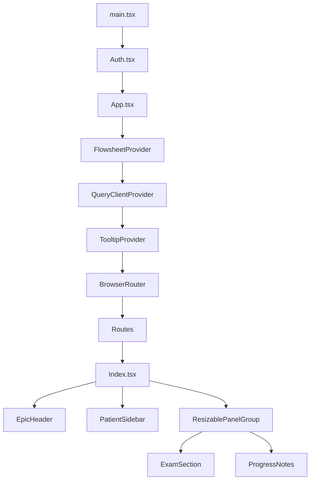
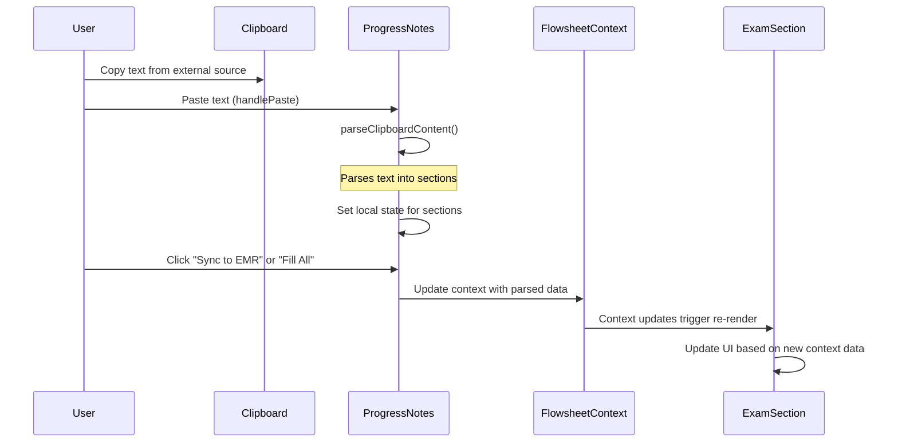
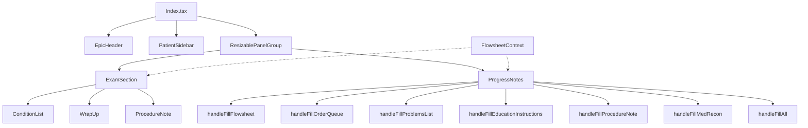
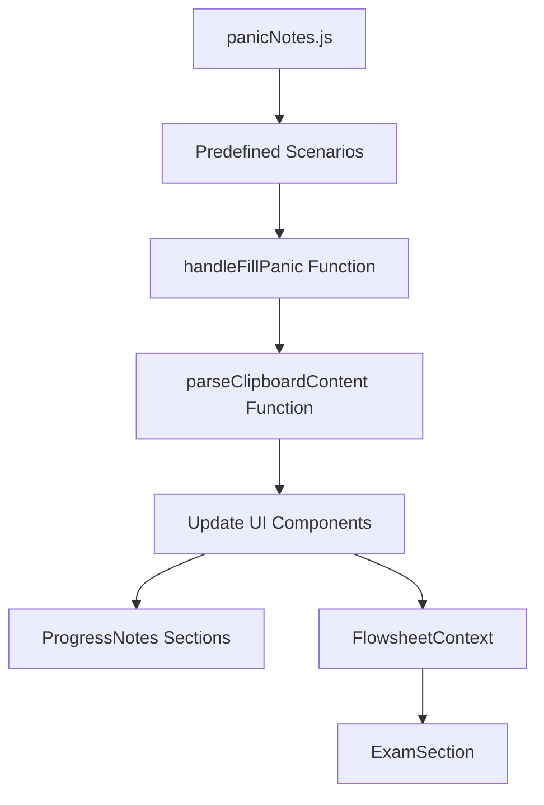
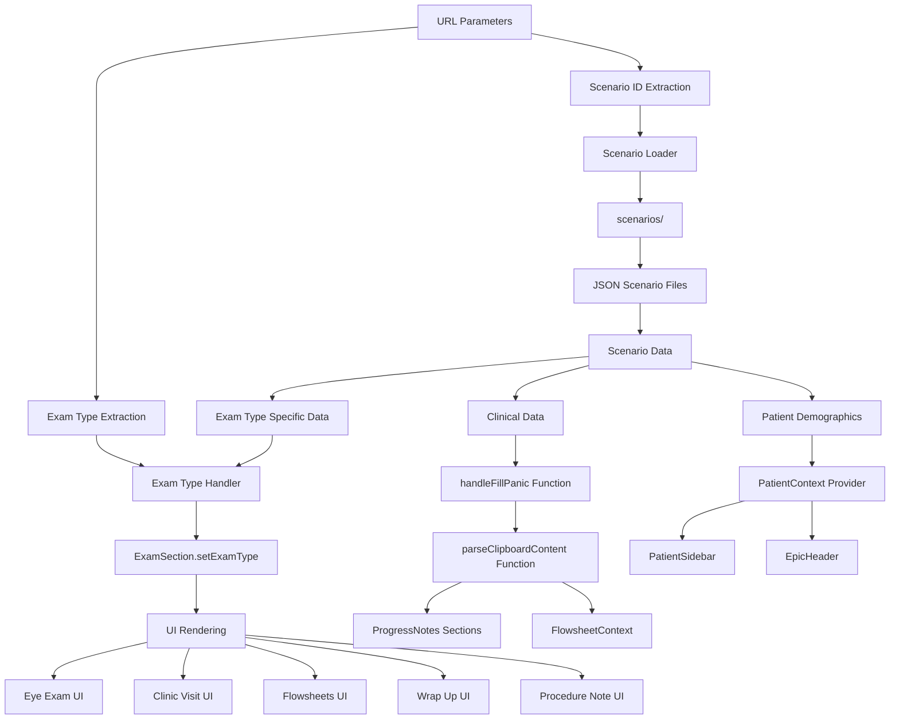

This file is a merged representation of the entire codebase, combined into a single document by Repomix.
The content has been processed where security check has been disabled.

# File Summary

## Purpose
This file contains a packed representation of the entire repository's contents.
It is designed to be easily consumable by AI systems for analysis, code review,
or other automated processes.

## File Format
The content is organized as follows:
1. This summary section
2. Repository information
3. Directory structure
4. Multiple file entries, each consisting of:
  a. A header with the file path (## File: path/to/file)
  b. The full contents of the file in a code block

## Usage Guidelines
- This file should be treated as read-only. Any changes should be made to the
  original repository files, not this packed version.
- When processing this file, use the file path to distinguish
  between different files in the repository.
- Be aware that this file may contain sensitive information. Handle it with
  the same level of security as you would the original repository.

## Notes
- Some files may have been excluded based on .gitignore rules and Repomix's configuration
- Binary files are not included in this packed representation. Please refer to the Repository Structure section for a complete list of file paths, including binary files
- Files matching patterns in .gitignore are excluded
- Files matching default ignore patterns are excluded
- Security check has been disabled - content may contain sensitive information
- Files are sorted by Git change count (files with more changes are at the bottom)

## Additional Info

# Directory Structure
```
netlify/
  functions/
    scenarios.js
public/
  _redirects
  placeholder.svg
  scenarios.json
src/
  components/
    epic/
      ConditionList.tsx
      EpicHeader.tsx
      ExamSection.tsx
      flowsheet.json
      PatientSidebar.tsx
      ProgressNotes.tsx
      test.json
      test2.json
    epoch/
      ConditionList.tsx
      EpochHeader.tsx
      ExamSection.tsx
      PatientSidebar.tsx
      ProgressNotes.tsx
    ui/
      accordion.tsx
      alert-dialog.tsx
      alert.tsx
      aspect-ratio.tsx
      avatar.tsx
      badge.tsx
      badge.variants.ts
      breadcrumb.tsx
      button.tsx
      button.variants.ts
      calendar.tsx
      card.tsx
      carousel.tsx
      chart.tsx
      checkbox.tsx
      collapsible.tsx
      command.tsx
      context-menu.tsx
      dialog.tsx
      drawer.tsx
      dropdown-menu.tsx
      form.tsx
      form.utils.ts
      hover-card.tsx
      input-otp.tsx
      input.tsx
      label.tsx
      menubar.tsx
      navigation-menu.tsx
      navigation-menu.variants.ts
      pagination.tsx
      popover.tsx
      procedurenote.tsx
      progress.tsx
      radio-group.tsx
      resizable.tsx
      scroll-area.tsx
      select.tsx
      separator.tsx
      sheet.tsx
      sidebar.tsx
      skeleton.tsx
      slider.tsx
      sonner.tsx
      switch.tsx
      table.tsx
      tabs.tsx
      textarea.tsx
      toast.tsx
      toaster.tsx
      toggle-group.tsx
      toggle.tsx
      tooltip.tsx
      use-toast.ts
      wrapup.tsx
  hooks/
    use-mobile.tsx
    use-toast.ts
  lib/
    utils.ts
  pages/
    Admin.tsx
    Index.tsx
    NotFound.tsx
  utils/
    panicNotes.js
  App.css
  App.tsx
  Auth.tsx
  AutoFillContexts.tsx
  index.css
  main.tsx
  ScenarioContext.tsx
  vite-env.d.ts
.gitignore
components.json
emr-architecture-analysis.md
eslint.config.js
index.html
netlify.toml
package.json
postcss.config.js
Procfile
README.md
SCENARIO-USAGE.md
tailwind.config.ts
tsconfig.app.json
tsconfig.json
tsconfig.node.json
vite.config.ts
```

# Files

## File: netlify/functions/scenarios.js
````javascript
const { createClient } = require('@netlify/functions');
const fetch = require('node-fetch');

// In-memory storage for custom scenarios (will be lost on function cold start)
let customScenarios = null;

// Function to get the default scenarios from the public file
async function getDefaultScenarios() {
  try {
    // Get the site URL from environment
    const siteUrl = process.env.URL || 'https://epochv2.netlify.app';
    const response = await fetch(`${siteUrl}/scenarios.json`);
    
    if (!response.ok) {
      throw new Error(`Failed to fetch default scenarios: ${response.status}`);
    }
    
    return await response.json();
  } catch (error) {
    console.error('Error fetching default scenarios:', error);
    // Return a minimal valid structure if we can't fetch the defaults
    return {
      scenarios: [
        {
          id: "default-fallback",
          name: "Default Fallback",
          examType: "Clinic Visit",
          patientData: {
            patientName: "Default Patient",
            patientDOB: "01/01/2000",
            visitDate: "01/01/2025",
            providerName: "Dr. Default",
            interpreterNeeded: "No",
            insurance: "Default Insurance",
            preferredLab: "Default Lab",
            previousExam: "None",
            nextVisit: "01/01/2026"
          },
          clinicalData: {
            historyOfPresentIllness: "Default history",
            physicalExamination: "Default examination",
            results: "Default results",
            assessmentPlan: "Default plan",
            attestation: "Default attestation"
          }
        }
      ]
    };
  }
}

const handler = async (event) => {
  // Set CORS headers
  const headers = {
    'Access-Control-Allow-Origin': '*',
    'Access-Control-Allow-Headers': 'Content-Type',
    'Access-Control-Allow-Methods': 'GET, POST, DELETE, OPTIONS',
    'Content-Type': 'application/json'
  };

  // Handle preflight OPTIONS request
  if (event.httpMethod === 'OPTIONS') {
    return {
      statusCode: 204,
      headers,
      body: ''
    };
  }

  try {
    // GET request - Read scenarios
    if (event.httpMethod === 'GET') {
      // If we have custom scenarios, return those
      if (customScenarios) {
        return {
          statusCode: 200,
          headers,
          body: JSON.stringify(customScenarios)
        };
      }

      // Otherwise get the default scenarios
      const defaultScenarios = await getDefaultScenarios();
      return {
        statusCode: 200,
        headers,
        body: JSON.stringify(defaultScenarios)
      };
    }

    // POST request - Save scenarios
    if (event.httpMethod === 'POST') {
      const { content } = JSON.parse(event.body);
      
      // Parse and validate the JSON
      const parsedContent = JSON.parse(content);
      
      // Store the custom scenarios in memory
      customScenarios = parsedContent;
      
      return {
        statusCode: 200,
        headers,
        body: JSON.stringify({ message: 'Scenarios saved successfully' })
      };
    }

    // DELETE request - Reset scenarios
    if (event.httpMethod === 'DELETE') {
      // Clear the custom scenarios
      customScenarios = null;
      
      return {
        statusCode: 200,
        headers,
        body: JSON.stringify({ message: 'Scenarios reset successfully' })
      };
    }

    // Unsupported method
    return {
      statusCode: 405,
      headers,
      body: JSON.stringify({ message: 'Method not allowed' })
    };
  } catch (error) {
    console.error('Error in scenarios function:', error);
    
    return {
      statusCode: 500,
      headers,
      body: JSON.stringify({ message: `Error: ${error.message}` })
    };
  }
};

exports.handler = handler;
````

## File: public/_redirects
````
/* /index.html 200
````

## File: public/placeholder.svg
````
<svg xmlns="http://www.w3.org/2000/svg" width="1200" height="1200" fill="none"><rect width="1200" height="1200" fill="#EAEAEA" rx="3"/><g opacity=".5"><g opacity=".5"><path fill="#FAFAFA" d="M600.709 736.5c-75.454 0-136.621-61.167-136.621-136.62 0-75.454 61.167-136.621 136.621-136.621 75.453 0 136.62 61.167 136.62 136.621 0 75.453-61.167 136.62-136.62 136.62Z"/><path stroke="#C9C9C9" stroke-width="2.418" d="M600.709 736.5c-75.454 0-136.621-61.167-136.621-136.62 0-75.454 61.167-136.621 136.621-136.621 75.453 0 136.62 61.167 136.62 136.621 0 75.453-61.167 136.62-136.62 136.62Z"/></g><path stroke="url(#a)" stroke-width="2.418" d="M0-1.209h553.581" transform="scale(1 -1) rotate(45 1163.11 91.165)"/><path stroke="url(#b)" stroke-width="2.418" d="M404.846 598.671h391.726"/><path stroke="url(#c)" stroke-width="2.418" d="M599.5 795.742V404.017"/><path stroke="url(#d)" stroke-width="2.418" d="m795.717 796.597-391.441-391.44"/><path fill="#fff" d="M600.709 656.704c-31.384 0-56.825-25.441-56.825-56.824 0-31.384 25.441-56.825 56.825-56.825 31.383 0 56.824 25.441 56.824 56.825 0 31.383-25.441 56.824-56.824 56.824Z"/><g clip-path="url(#e)"><path fill="#666" fill-rule="evenodd" d="M616.426 586.58h-31.434v16.176l3.553-3.554.531-.531h9.068l.074-.074 8.463-8.463h2.565l7.18 7.181V586.58Zm-15.715 14.654 3.698 3.699 1.283 1.282-2.565 2.565-1.282-1.283-5.2-5.199h-6.066l-5.514 5.514-.073.073v2.876a2.418 2.418 0 0 0 2.418 2.418h26.598a2.418 2.418 0 0 0 2.418-2.418v-8.317l-8.463-8.463-7.181 7.181-.071.072Zm-19.347 5.442v4.085a6.045 6.045 0 0 0 6.046 6.045h26.598a6.044 6.044 0 0 0 6.045-6.045v-7.108l1.356-1.355-1.282-1.283-.074-.073v-17.989h-38.689v23.43l-.146.146.146.147Z" clip-rule="evenodd"/></g><path stroke="#C9C9C9" stroke-width="2.418" d="M600.709 656.704c-31.384 0-56.825-25.441-56.825-56.824 0-31.384 25.441-56.825 56.825-56.825 31.383 0 56.824 25.441 56.824 56.825 0 31.383-25.441 56.824-56.824 56.824Z"/></g><defs><linearGradient id="a" x1="554.061" x2="-.48" y1=".083" y2=".087" gradientUnits="userSpaceOnUse"><stop stop-color="#C9C9C9" stop-opacity="0"/><stop offset=".208" stop-color="#C9C9C9"/><stop offset=".792" stop-color="#C9C9C9"/><stop offset="1" stop-color="#C9C9C9" stop-opacity="0"/></linearGradient><linearGradient id="b" x1="796.912" x2="404.507" y1="599.963" y2="599.965" gradientUnits="userSpaceOnUse"><stop stop-color="#C9C9C9" stop-opacity="0"/><stop offset=".208" stop-color="#C9C9C9"/><stop offset=".792" stop-color="#C9C9C9"/><stop offset="1" stop-color="#C9C9C9" stop-opacity="0"/></linearGradient><linearGradient id="c" x1="600.792" x2="600.794" y1="403.677" y2="796.082" gradientUnits="userSpaceOnUse"><stop stop-color="#C9C9C9" stop-opacity="0"/><stop offset=".208" stop-color="#C9C9C9"/><stop offset=".792" stop-color="#C9C9C9"/><stop offset="1" stop-color="#C9C9C9" stop-opacity="0"/></linearGradient><linearGradient id="d" x1="404.85" x2="796.972" y1="403.903" y2="796.02" gradientUnits="userSpaceOnUse"><stop stop-color="#C9C9C9" stop-opacity="0"/><stop offset=".208" stop-color="#C9C9C9"/><stop offset=".792" stop-color="#C9C9C9"/><stop offset="1" stop-color="#C9C9C9" stop-opacity="0"/></linearGradient><clipPath id="e"><path fill="#fff" d="M581.364 580.535h38.689v38.689h-38.689z"/></clipPath></defs></svg>
````

## File: public/scenarios.json
````json
{
  "scenarios": [
    {
      "id": "adult-primary-care-visit",
      "name": "Adult Primary Care Visit",
      "examType": "Clinic Visit",
      "patientData": {
        "patientName": "Blackwell, Mr.",
        "patientDOB": "Not specified",
        "visitDate": "04.23.2025",
        "providerName": "Not specified",
        "interpreterNeeded": "No",
        "insurance": "Not specified",
        "preferredLab": "Not specified",
        "previousExam": "Not specified",
        "nextVisit": "In 2 weeks"
      },
      "clinicalData": {
        "historyOfPresentIllness": "Mr. Blackwell presents with worsening shortness of breath over the past couple of weeks, experiencing dyspnea with minimal exertion such as walking across a room or climbing stairs. He reports a dry cough that started a few days ago. His rescue inhaler has become less effective in managing his symptoms. Additionally, he notes elevated blood sugar levels, particularly in the mornings, ranging from 180s to over 200. Mr. Blackwell also mentions a non-healing sore on his right heel that appeared about three weeks ago. He confirms some chest tightness and wheezing associated with his breathing difficulties, but denies fever. The heel sore is described as minimally painful with occasional clear drainage. Mr. Blackwell has a 15-year history of Type 2 Diabetes with associated neuropathy in his feet. He is a former smoker, having quit over 10 years ago after smoking for approximately 30 years. He reports an allergy to Penicillin, which causes a rash.",
        "physicalExamination": "Vital Signs: BP 146/86, HR 80, O2 sat 94% on room air, Temperature 98.4°F\nGeneral: Increased respiratory effort noted with movement\nRespiratory: Fair air movement, wheezing throughout, especially on expiration\nCardiovascular: Regular heart sounds\nSkin: Right heel with 1.5 cm shallow ulcer, pink base, clean edges, minimal drainage\nNeurological: Reduced sensation to light touch on feet, consistent with neuropathy",
        "results": "Blood Glucose: 188 mg/dL\nHbA1c: 8.4%\nCreatinine: 1.3 mg/dL\neGFR: 58 mL/min/1.73m²\nSpirometry: Moderate obstruction",
        "assessmentPlan": "1. COPD Exacerbation\n- Prescribe Prednisone 40mg daily for 5 days\n- Increase Albuterol inhaler use: 2 puffs every 4-6 hours as needed\n- Ensure patient has Tiotropium maintenance inhaler: 1 puff daily\n- Follow up in 2 weeks to reassess breathing\n\n2. Poorly Controlled Type 2 Diabetes\n- Add Empagliflozin 10mg daily to current Metformin regimen\n- Continue Metformin 1000mg twice daily\n- Instruct patient to monitor fasting blood glucose daily\n- Follow up in 2 weeks to reassess blood sugar control\n\n3. Diabetic Foot Ulcer (Right Heel)\n- Daily wound care: Clean with saline, apply hydrocolloid dressing\n- Educate on pressure relief and proper footwear\n- Refer to Podiatry for wound management and footwear assessment\n- Follow up in 2 weeks to assess healing progress\n\n4. Stage 3a Chronic Kidney Disease\n- Continue Lisinopril 10mg daily\n- Order Urine Albumin/Creatinine Ratio test\n- Monitor renal function at follow-up visits\n\n5. Preventive Care\n- Administer Pneumococcal vaccine (PCV20) today\n- Order COVID-19 booster vaccination\n- Refer to Ophthalmology for annual diabetic eye exam\n- Refer to Gastroenterology for colonoscopy screening\n- Recommend flu shot in the fall\n\n6. Hypertension\n- Monitor blood pressure at follow-up visit in 2 weeks\n- Continue current antihypertensive medication (Lisinopril 10mg daily)\n\nFollow-up: Schedule appointment in 2 weeks to reassess COPD symptoms, diabetes control, foot ulcer, and blood pressure. Instruct patient to seek immediate care if breathing worsens, fever develops, or foot infection signs appear (increased redness, swelling, or pus).",
        "attestation": "I have reviewed the documentation and agree with the content as written.",
        "problems_list": {
          "problems": [
            "COPD Exacerbation",
            "Poorly Controlled Type 2 Diabetes",
            "Diabetic Foot Ulcer",
            "Stage 3a Chronic Kidney Disease",
            "Hypertension"
          ]
        },
        "orders_list": {
          "orders": [
            "Prednisone 40mg",
            "Empagliflozin 10mg",
            "Albuterol inhaler",
            "Tiotropium inhaler",
            "PCV20 vaccine"
          ]
        },
        "education_instructions": "1. Take Prednisone 40mg daily for 5 days as prescribed.\n2. Use Albuterol inhaler more frequently: 2 puffs every 4-6 hours as needed for shortness of breath.\n3. Start Empagliflozin 10mg daily in addition to current Metformin for better blood sugar control.\n4. Perform daily foot care: clean ulcer with saline, apply hydrocolloid dressing, and keep pressure off the heel.\n5. Monitor fasting blood glucose daily and record results.\n6. Wear supportive shoes to protect feet.\n7. Follow up with specialist appointments as scheduled (Podiatry, Ophthalmology, Gastroenterology).\n8. Return for follow-up in 2 weeks or sooner if breathing worsens, fever develops, or foot shows signs of infection.\n9. Continue current medications: Metformin 1000mg twice daily, Lisinopril 10mg daily, and Tiotropium inhaler once daily."
      }
    },
    {
      "id": "eye-examination",
      "name": "Comprehensive Eye Examination",
      "examType": "Eye Exam",
      "patientData": {
        "patientName": "Smith, Robert",
        "patientDOB": "05/12/1955",
        "visitDate": "04.23.2025",
        "providerName": "Dr. Marcus Commure",
        "interpreterNeeded": "No",
        "insurance": "Medicare",
        "preferredLab": "Quest Diagnostics",
        "previousExam": "1 year ago",
        "nextVisit": "10/23/2025"
      },
      "clinicalData": {
        "historyOfPresentIllness": "Patient presents with complaints of hazy vision, especially at a distance, for the past three months. The right eye is more affected than the left. Symptoms are most noticeable in the evening and after computer use at work. Patient rates severity as 6 out of 10, affecting daily life. Associated symptoms include mild headaches and eye strain after focusing. Patient also reports dry and burning eyes with a sensation of something in them. Artificial tears provide temporary relief.\n\nPatient is an accountant with extensive computer use. Last eye exam was two years ago with a slight prescription change. Patient has been nearsighted since childhood.\n\nPast Medical History: High blood pressure since 2018, high cholesterol since 2019, Type 2 diabetes since 2015. Last A1c was 6.7% in January.\n\nFamily History: Maternal grandmother had glaucoma, father has macular degeneration. Both parents have Type 2 diabetes.",
        "physicalExamination": "Visual Acuity:\nWithout correction: OD 20/100, OS 20/80\nWith correction: OD 20/40, OS 20/30\nNear vision with correction: OD J3, OS J2\n\nPupils: Equal and reactive, no APD\nExtraocular Movements: Full\nConfrontation Visual Fields: Full to finger counting OU\n\nIntraocular Pressure: OD 16 mmHg, OS 15 mmHg\n\nSlit-Lamp Examination:\nLids: Normal, mild meibomian gland dysfunction\nConjunctiva/Sclera: Small pinguecula nasally OU\nCornea: Clear OU\nAnterior Chamber: Deep and quiet OU\nIris: Normal OU\nLens: OD 2+ nuclear sclerotic and 1+ posterior subcapsular cataracts, OS 1+ nuclear sclerosis\n\nTear Film Evaluation:\nTear break-up time: OD 4 seconds, OS 5 seconds\nSchirmer test: OD 5mm, OS 6mm after 5 minutes\nPunctate epithelial erosions inferiorly OU",
        "results": "Tear break-up time: OD 4 seconds, OS 5 seconds (reduced, normal >10 seconds)\nSchirmer test: OD 5mm, OS 6mm after 5 minutes (reduced, normal >10mm)",
        "assessmentPlan": "1. Dry Eye Syndrome (H04.123, Bilateral)\n   - Punctal plugs inserted in lower puncta OU\n   - Continue preservative-free artificial tears, reduce to twice daily or as needed\n   - Warm compresses with gentle massage daily for meibomian gland dysfunction\n   - Follow-up in 6 weeks to check plugs\n   - Patient educated on punctal plugs, potential side effects, and proper eye care\n\n2. Cataracts (H25.13 Right eye, H25.11 Left eye)\n   - Monitor progression\n   - Continue good diabetes management\n   - Patient educated on cataract development and potential future need for surgery\n\n3. Refractive Error (H52.10 Myopia, Bilateral)\n   - New progressive glasses prescription to be provided\n   - Patient educated on the 20-20-20 rule for computer use: every 20 minutes, look at something 20 feet away for 20 seconds\n\n4. Type 2 Diabetes Mellitus (E11.9)\n   - Continue current management with Metformin\n   - Emphasize importance of glycemic control for eye health\n   - Annual comprehensive dilated eye exam recommended",
        "attestation": "I have reviewed the documentation and agree with the content as written.",
        "eyeExam": {
          "checkedConditions": [
            "Edema",
            "Dystrophy"
          ],
          "slitLamp": {
            "ll": {
              "right": "Normal",
              "left": "Normal"
            },
            "cs": {
              "right": "White and quiet",
              "left": "White and quiet"
            },
            "cornea": {
              "right": "Edema, Corneal dystrophy",
              "left": "Edema, Corneal dystrophy"
            },
            "ac": {
              "right": "Deep and quiet",
              "left": "Deep and quiet"
            },
            "iris": {
              "right": "Round and reactive",
              "left": "Round and reactive"
            },
            "lens": {
              "right": "+2 Nuclear sclerosis",
              "left": "+1 Nuclear sclerosis"
            },
            "vitreous": {
              "right": "Normal",
              "left": "Normal"
            }
          },
          "fundus": {
            "disc": {
              "right": "Normal",
              "left": "Normal"
            },
            "cdRatio": {
              "right": "0.3",
              "left": "0.3"
            },
            "macula": {
              "right": "Normal",
              "left": "Normal"
            },
            "vessels": {
              "right": "Normal",
              "left": "Normal"
            },
            "periph": {
              "right": "Normal",
              "left": "Normal"
            }
          }
        },
        "education_instructions": "- Use preservative-free artificial tears twice daily or as needed\n- Perform warm compresses with gentle massage daily for meibomian gland dysfunction\n- Follow the 20-20-20 rule for computer use: every 20 minutes, look at something 20 feet away for 20 seconds\n- Avoid rubbing eyes vigorously\n- Call the office if a punctal plug falls out\n- Continue managing diabetes well\n- Return in 6 weeks to check punctal plugs\n- Schedule comprehensive eye exam in 12 months or sooner if vision changes occur",
        "procedure_note": "Pre-Op Diagnosis: Dry Eye Syndrome (H04.123, Bilateral)\nPost-Op Diagnosis: Same\nProcedure: Insertion of punctal plugs, bilateral lower puncta\nPerforming Physician: Dr. Commure\nProcedure performed: After obtaining informed consent, topical anesthetic drops were administered to both eyes. The lower punctal areas were cleaned and prepped. Under microscopic visualization, punctal plugs were inserted into the lower puncta of both eyes. The plugs were confirmed to be well-positioned. The patient tolerated the procedure well with no immediate complications."
      }
    }
  ]
}
````

## File: src/components/epic/ConditionList.tsx
````typescript
import { MoreHorizontal } from "lucide-react";
import { useState } from "react";

interface Condition {
  name: string;
  buttons: string[];
}

interface ConditionListProps {
  conditionsData: Condition[];
  checkedConditions: string[];
  handleCheckboxChange: (conditionName: string) => void;
}

const ConditionList = ({
  conditionsData,
  checkedConditions,
  handleCheckboxChange,
}: ConditionListProps) => {
  return (
    <div className="">
      {conditionsData.map((condition) => (
        <div
          key={condition.name}
          className={`flex items-center gap-2 group hover:bg-blue-50 rounded`}
        >
          <div
            className={`flex items-center gap-2 min-w-[180px] ${
              checkedConditions.includes(condition.name) ? 'bg-blue-500 text-white p-0' : ''
            }`}
          >
            <input
              type="checkbox"
              className="h-3 w-3"
              checked={checkedConditions.includes(condition.name)}
              onChange={() => handleCheckboxChange(condition.name)}
            />
            <span className="text-xs">{condition.name}</span>
            {condition.buttons.length > 0 && (
              <button className="opacity-0 group-hover:opacity-100">
                <MoreHorizontal className="h-3 w-3 text-gray-500" />
              </button>
            )}
          </div>
          {condition.buttons.length > 0 && (
            <div className="flex gap-1 flex-wrap">
              {condition.buttons.map((btn) => (
                <button
                  key={btn}
                  className="px-1 py-0 text-xs bg-gray-100 hover:bg-gray-200 rounded border border-gray-300"
                >
                  {btn}
                </button>
              ))}
            </div>
          )}
          <div className="ml-auto">
            <span className="px-1 py-0 text-xs bg-gray-100 hover:bg-gray-200 rounded border border-gray-300">None</span>
          </div>
        </div>
      ))}
    </div>
  );
};

export default ConditionList;
````

## File: src/components/epic/EpicHeader.tsx
````typescript
import { 
  AudioWaveform, 
  ChartBar, 
  ClipboardList, 
  PhoneCall, 
  UserMinus, 
  Lock, 
  Link2, 
  Bell, 
  FileText,
  Home,
  Mail,
  Calendar,
  X,
  Search,
  ArrowUp,
  MessageSquare,
  FolderOpen,
  Layout,
  Store
} from "lucide-react";

import { useScenario } from "@/ScenarioContext";

const EpicHeader = ({ openScribe }: { openScribe: () => void }) => {
  const { currentScenario, isScenarioActive } = useScenario();
  
  // Default provider name if no scenario is active
  const providerName = isScenarioActive && currentScenario
    ? currentScenario.patientData.providerName.toUpperCase().replace(/^DR\.\s+/i, '')
    : "DAVID COMMONS";
  
  // Default patient name for the tab
  const patientName = isScenarioActive && currentScenario
    ? currentScenario.patientData.patientName
    : "TestPatient, Test";
  
  return (
    <header className="bg-gradient-to-b from-[#1a3c5e] to-[#002244]">
      {/* Top row */}
      <div className="flex items-center gap-2 px-0 py-1 bg-[#003366] text-white">
        
        <span className="text-xs font-medium mr-1">Application Server uppcpusrapp108 - FDE</span>
        <span className="text-xs font-medium">MED PRACTICE PPMC - {providerName}</span>
        
        <div className="flex items-center ml-auto gap-4">
          <div className="flex items-center">
            <Search className="h-4 w-4 absolute ml-2 text-gray-500" />
            <input 
              type="text" 
              placeholder="Search (Ctrl+Space)" 
              className="pl-8 pr-2 py-0.5 text-xs rounded text-black w-48 focus:outline-none focus:ring-1 focus:ring-blue-500"
            />
          </div>

          <div className="flex items-center gap-3 bg-[#f5f5dc] px-3 py-0.5 rounded-sm">
            <div className="flex items-center gap-1">
              <ArrowUp className="h-4 w-4 text-red-600" />
              <span className="text-xs text-red-600">42</span>
              <span className="text-xs text-red-600 ml-0.5">Staff Message</span>
            </div>
            <div className="flex items-center gap-1">
              <PhoneCall className="h-4 w-4 text-red-600" />
              <ArrowUp className="h-4 w-4 text-red-600" />
              <span className="text-xs text-red-600">21</span>
            </div>
            <div className="flex items-center gap-1">
              <MessageSquare className="h-4 w-4 text-red-600" />
              <ArrowUp className="h-4 w-4 text-red-600" />
              <span className="text-xs text-red-600">8</span>
            </div>
            <div className="flex items-center gap-1">
              <Mail className="h-4 w-4 text-red-600" />
              <ArrowUp className="h-4 w-4 text-red-600" />
              <span className="text-xs text-red-600">513</span>
            </div>
          </div>
        </div>
      </div>

      {/* Second row - Navigation icons */}
      <div className="flex items-center gap-1 px-2 py-1 bg-[#002244] text-white text-xs">
        <button className="flex items-center gap-1 px-2 py-1 hover:bg-[#003366] rounded-sm">
          <div className="rounded-full bg-[#FFDA63] p-1">
            <AudioWaveform className="h-3 w-3"  />
          </div>
          </button>
          <div className="h-4 w-[1px] bg-gray-600 mx-1" />
          <button className="nav-item">
            <ChartBar className="h-3 w-3" style={{ color: '#F06292' }} />
            <span>Chart</span>
          </button>
          <button className="nav-item">
            <ClipboardList className="h-3 w-3" style={{ color: '#87CEEB' }} />
            <span>Encounters</span>
          </button>
          <button className="nav-item">
            <PhoneCall className="h-3 w-3" style={{ color: '#90EE90' }} />
            <span>Telephone Call</span>
          </button>
          <button className="nav-item">
            <UserMinus className="h-3 w-3" style={{ color: '#98FB98' }} />
          <span>Mark Patients for Merge</span>
        </button>
        <button className="nav-item">
          <Lock className="h-3 w-3" style={{ color: 'green' }} />
          <span>Secure</span>
        </button>
        <button className="nav-item">
          <Link2 className="h-3 w-3" />
          <span>Links</span>
        </button>
        <button className="nav-item">
          <Bell className="h-3 w-3" />
          <span>Remind Me</span>
        </button>
        <button className="nav-item">
          <FileText className="h-3 w-3" />
          <span>Reports</span>
        </button>
        <button className="nav-item">
          <FolderOpen className="h-3 w-3" />
          <span>Open Case</span>
        </button>
        <button className="nav-item">
          <Layout className="h-3 w-3" />
          <span>Snapboard</span>
        </button>
        <button className="nav-item">
          <Store className="h-3 w-3" />
          <span>OR Marketplace</span>
        </button>
        {/* New elements */}
        <div className="ml-auto flex items-center gap-2">
          {/* Notifications */}
          <div className="relative">
            <Bell className="h-5 w-5 text-white cursor-pointer" />
            <span className="absolute top-[-4px] right-[-4px] bg-red-500 text-white text-[0.6rem] rounded-full px-1">
              42
            </span>
          </div>
          {/* Profile */}
          <div className="relative">
            <div className="rounded-full h-6 w-6 bg-gray-400 text-white flex items-center justify-center cursor-pointer">
              BK
            </div>
          </div>
          {/* Logout */}
          <button className="text-xs text-white hover:underline">Log Out</button>
        </div>
      </div>

      {/* Third row - Home bar and patient tab */}
      <div className="flex items-center gap-1 px-2 py-1 bg-[#001833] text-white text-xs">
        <button className="flex items-center gap-1 px-3 py-1 rounded-md bg-[#003366]">
          <Home className="h-3 w-3" />
        </button>
        <button className="flex items-center gap-1 px-3 py-1 rounded-md bg-[#003366]">
          <Mail className="h-3 w-3" />
        </button>
        <button className="flex items-center gap-1 px-3 py-1 rounded-md bg-[#003366]">
          <Calendar className="h-3 w-3" />
        </button>
        <div className="ml-2 flex items-center bg-[#003366] rounded-t-md px-3 py-1">
          <span className="mr-2">{patientName}</span>
          <X className="h-3 w-3 hover:text-gray-300 cursor-pointer" />
        </div>
      </div>
    </header>
  );
};

export default EpicHeader;
````

## File: src/components/epic/ExamSection.tsx
````typescript
import { ResizablePanel, ResizablePanelGroup, ResizableHandle } from "@/components/ui/resizable";
import { LayoutGrid, FileText, BarChart, Eye, Circle, MoreHorizontal, Glasses, CrosshairIcon, TestTubes, CheckCircle, ChevronDown, File, Settings, Search, RotateCcw, RotateCw, HelpCircle, PlusCircle } from "lucide-react";
import { useState, useCallback, useEffect } from "react";
import ConditionList from "./ConditionList";
import React from "react";
import { useFlowsheet } from "@/AutoFillContexts";
import WrapUp from "../ui/wrapup";
import ProcedureNote from "../ui/procedurenote";


interface ExamSectionProps {
  examType: string;
  setExamType: React.Dispatch<React.SetStateAction<string>>;
}

const ExamSection = ({ examType, setExamType }: ExamSectionProps) => {

  const { flowsheet: flowsheetContext } = useFlowsheet();
  let parsedFlowsheet: Record<string, any> = {};
  
  try {
    if (flowsheetContext && flowsheetContext.trim() !== "") {
      parsedFlowsheet = JSON.parse(flowsheetContext);
    }
  } catch (err) {
    console.warn("Invalid JSON in flowsheet context:", err);
  }
  
  const [conditionsData, setConditionsData] = useState([
    { name: 'Clear incision', buttons: [] },
    { name: 'Debris in tear film', buttons: [] },
    { name: 'Degeneration', buttons: ['Arcus', 'Pterygium'] },
    { name: 'Dendrite', buttons: [] },
    { name: 'Descemet\'s folds', buttons: ['1+', '2+', '3+', '4+'] },
    { name: 'Dystrophy', buttons: ['ABMD', 'Fuchs'] },
    { name: 'Edema', buttons: ['1+', '2+', '3+', '4+'] },
    { name: 'Epithelial defect', buttons: [] },
    { name: 'Guttata', buttons: ['1+', '2+', '3+', '4+'] },
    { name: 'Infiltrates', buttons: ['Sterile', 'Subepithelial'] },
    { name: 'Keratic precipitates', buttons: ['1+', '2+', '3+', '4+'] },
    { name: 'Keratitis', buttons: [] },
    { name: 'Krukenberg\'s spindle', buttons: [] },
    { name: 'Neovascularization', buttons: ['Central', 'Periph'] },
    { name: 'Keratoplasty', buttons: ['LKP', 'PKP'] },
    { name: 'PEE', buttons: ['1+', '2+', '3+', '4+'] },
    { name: 'Scar', buttons: ['LASIK'] },
    { name: 'Striae', buttons: ['1+', '2+', '3+', '4+'] },
    { name: 'Trauma', buttons: ['Laceration', 'Foreign'] }
  ]);

  const flowsheetSections = [
    {
      title: "vitals",
      rows: [
        "temperatureF",
        "heartRateBpm",
        "respiratoryRate",
        "bloodPressure"
      ]
    },
    {
      title: "physicalDevelopment",
      rows: ["running", "climbing", "appetite"]
    },
    {
      title: "languageDevelopment",
      rows: ["saysMultipleWords", "combinesTwoToThreeWords", "followsTwoStepInstructions"]
    },
    {
      title: "socialDevelopment",
      rows: ["playsNearOtherChildren", "learningToShare"]
    },
    {
      title: "vision",
      rows: [
        "visionScreening"
      ]
    },
    {
      title: "oralHealth",
      rows: ["brushingFrequency", "visibleCavities"]
    },
    {
      title: "familyHistory",
      rows: ["asthma", "seasonalAllergies", "diabetes", "cancer"]
    }
  ];

  const [selectedSections, setSelectedSections] = useState(
    flowsheetSections.map((section) => section.title)
  );

  const toggleSection = (title) => {
    setSelectedSections((prev) =>
      prev.includes(title)
        ? prev.filter((t) => t !== title)
        : [...prev, title]
    );
  };

  const showAll = () => {
    setSelectedSections(flowsheetSections.map((section) => section.title));
  };

  const hideAll = () => {
    setSelectedSections([]);
  };
  
  

  const [checkedConditions, setCheckedConditions] = useState<string[]>([]);

  const handleCheckboxChange = useCallback((conditionName: string) => {
    setCheckedConditions((prev) => {
      if (prev.includes(conditionName)) {
        return prev.filter((name) => name !== conditionName);
      } else {
        return [...prev, conditionName];
      }
    });
  }, []);

  return (
    <div className="flex-1 min-w-0">
      <div className="epic-exam-section h-full flex flex-col">
        <div className="flex items-center gap-0.5 px-1 py-1 border-b border-gray-200 bg-[#003059]">
          <button className="flex items-center gap-1.5 px-2 py-1 bg-[#005791] hover:bg-[#0068a8]" style={{ borderTop: '2px solid #FFDA63' }}>
            <div className="bg-[#FFDA63] rounded p-0.5">
              <LayoutGrid className="h-3 w-3 text-[#C68600]" />
            </div>
            <span className="text-xs font-medium text-white">Previous Note</span>
          </button>
          
          <button className="flex items-center gap-1.5 px-2 py-1 bg-[#005791] hover:bg-[#0068a8]" style={{ borderTop: '2px solid #F06292' }}>
            <div className="bg-[#F06292] rounded p-0.5">
              <FileText className="h-3 w-3 text-white" />
            </div>
            <span className="text-xs font-medium text-white">Plan</span>
          </button>
          
          <button className="flex items-center gap-1.5 px-2 py-1 bg-[#005791] hover:bg-[#0068a8]" style={{ borderTop: '2px solid #87CEEB' }}>
            <div className="bg-[#87CEEB] rounded p-0.5">
              <BarChart className="h-3 w-3 text-white" />
            </div>
            <span className="text-xs font-medium text-white">Chart Review</span>
          </button>
          
          <button className="flex items-center gap-1.5 px-2 py-1 bg-[#E0E0E0] hover:bg-[#EEEEEE]" style={{ borderTop: '2px solid #90EE90' }}>
            <div className="bg-[#90EE90] rounded p-0.5">
              <Eye className="h-3 w-3 text-white" />
            </div>
            <span className="text-xs font-medium text-[#212121]">Exam</span>
          </button>
          
          <button className="flex items-center gap-1.5 px-2 py-1 bg-[#005791] border border-[#90CAF9] hover:bg-[#0068a8]" style={{ borderTop: '2px solid pink' }} onClick={() => window.open('https://scribe.athelas.com', '_blank', 'noopener,noreferrer,width=1280,height=720,location=no')}>
            <div className="bg-[#003059] rounded p-0.5">
              <Circle className="h-3 w-3 text-white" strokeWidth={3} />
            </div>
            <span className="text-xs font-medium text-white">Ambient Scribe</span>
          </button>
        </div>

        <div className="bg-[#e6eaee] text-[#00426c] rounded-md p-1 font-bold flex items-center justify-between" style={{ border: '1px solid #00426c', borderStyle: 'inset', marginTop: '0px', marginLeft: '0px', marginBottom: '8px', textAlign: 'left' }}>
          <div>{new Date().toLocaleDateString('en-US', {month: '2-digit', day: '2-digit', year: '2-digit'})} - Dr. Commure - Demo Scenario</div>
          <div className="flex items-center">
            <select
              value={examType}
              onChange={(e) => setExamType(e.target.value)}
              className="ml-2 text-sm font-normal bg-white border border-gray-300 rounded px-2 py-0.5"
            >
              <option value="Clinic Visit">Clinic Visit</option>
              <option value="Eye Exam">Eye Exam</option>
              <option value="Flowsheets">Flowsheets</option>
              <option value="Wrap Up">Wrap Up</option>
              <option value="Procedure Note">Procedure Note</option>
              <option value="Reason for Documentation">Reason for Documentation</option>
            </select>
          </div>
        </div>

        <div className="w-full">
          {examType === "Eye Exam" ? (
            
          ) : examType === "Clinic Visit" ? (
            
          ) : examType === "Flowsheets" ? (
            
          ) : examType === "Wrap Up" ? (
            
          ) : (
            
          )
        
        }
        </div>

        <div className="flex border-b border-gray-200">
          {examType === "Clinic Visit" && (
            <>
              <button className="inline-flex items-center px-2 py-0.5 text-sm border-r border-gray-200 relative before:absolute before:top-0 before:left-0 before:right-0 before:h-0.5 before:bg-blue-500">
                <span className="text-blue-600">Main Menu</span>
              </button>
            </>
          )}
          {examType === "Eye Exam" && (
            <>
              <button className="inline-flex items-center px-2 py-0.5 text-sm border-r border-gray-200 relative before:absolute before:top-0 before:left-0 before:right-0 before:h-0.5 before:bg-blue-500">
                <span className="text-blue-600">Main Menu</span>
              </button>
              <button className="inline-flex items-center px-2 py-0.5 text-sm border-r border-gray-200 gap-1 text-gray-600">
                <Glasses className="h-4 w-4" />
                <span>Contact Lens</span>
              </button>
              <button className="inline-flex items-center px-2 py-0.5 text-sm border-r border-gray-200 gap-1 text-gray-600">
                <Eye className="h-4 w-4" />
                <span>Strabismus</span>
              </button>
              <button className="inline-flex items-center px-2 py-0.5 text-sm gap-1 text-gray-600">
                <TestTubes className="h-4 w-4" />
                <span>ROP</span>
              </button>
            </>
          )}
          {examType === "Flowsheets" && (
            <>
              <button className="inline-flex items-center px-2 py-0.5 text-sm border-r border-gray-200 relative before:absolute before:top-0 before:left-0 before:right-0 before:h-0.5 before:bg-blue-500">
                <span className="text-blue-600">Vitals (ICU)</span>
              </button>
              <button className="inline-flex items-center px-2 py-0.5 text-sm border-r border-gray-200 gap-1 text-gray-600">
                <span>Vent Doc</span>
              </button>
              <button className="inline-flex items-center px-2 py-0.5 text-sm border-r border-gray-200 gap-1 text-gray-600">
                <span>Vitals</span>
              </button>
              <button className="inline-flex items-center px-2 py-0.5 text-sm gap-1 text-gray-600">
                <span>Lines/Drains/Airways</span>
              </button>
            </>
          )}
        </div>
        
        <ResizablePanelGroup direction="horizontal" className="flex flex-1">
          <ResizablePanel defaultSize={65} minSize={30}>
            <div className="p-2">
              <div className="space-y-3 text-xs">
              
                 {(examType === "Clinic Visit" || examType === "Eye Exam") && (
                    <div className="exam-grid items-start">
                      <div className="flex items-center gap-1 text-gray-600 justify-start">
                        <CheckCircle className="h-4 w-4 text-green-500" />
                        <span className="text-xs">Exam Normal</span>
                        <ChevronDown className="h-4 w-4" />
                        <div className="flex items-center gap-1 text-gray-400 ml-auto">
                          <File className="h-3 w-3" />
                          <span className="text-xs">Copy Previous</span>
                        </div>
                      </div>
                      <div className="exam-column"></div>
                      <div className="exam-column"></div>
                    </div>
                 )}

                    
               

                

                {examType === "Reason for Documentation" ? (
                  <div className="space-y-4">
                    <div className="border rounded">
                      <div className="bg-gray-200 p-1 font-semibold flex justify-between items-center">
                        <span>Reason for Documentation</span>
                        <button className="text-blue-600 text-xs">Add</button>
                      </div>
                      <div className="p-2">
                        <div className="grid grid-cols-2 gap-2">
                          {[
                            "Annual Exam", "Abscess",
                            "Bilateral Cleft Palate", "Biopsy",
                            "Cleft Lip", "Cleft Palate",
                            "Dental Filling", "Dental Injury",
                            "Dental Pain", "Dental Problem",
                            "Dry Mouth", "Facial Pain",
                            "Gingivitis", "Headache",
                            "Jaw Pain", "Mouth Injury",
                            "Mouth Lesions", "Oral Pain",
                            "Oral Swelling", "Routine Oral Cleaning",
                            "Sleep Apnea", "Broken Filling",
                            "Broken Tooth", "Seek Comprehensive Care",
                            "Sensitivity", "Bleeding Gums",
                            "Loose Tooth", "Loose Partial or Complete Denture",
                            "Bad Breath", "Fill Out School Form",
                            "Cosmetics", "Ortho",
                            "Temporomandibular Disorder", "Other"
                          ].map((reason) => (
                            <button key={reason} className={`border rounded p-3 text-sm bg-gradient-to-r from-blue-200 to-white hover:opacity-80`}>
                              {reason}
                            </button>
                          ))}
                        </div>
                      </div>
                    </div>
                  </div>
                ) : examType === "Eye Exam" ? (
                  <>
                    <div className="exam-section">
                      <h3 className="exam-header">Slit Lamp</h3>
                      <div className="flex justify-between">
                        <span>Right</span>
                        <span>Left</span>
                      </div>
                      <div className="space-y-0.5">
                        {[
                          { label: 'L/L', value: 'Normal', id: 'slitlamp-ll' },
                          { label: 'C/S', value: 'White and quiet', id: 'slitlamp-cs' },
                          { label: 'Cornea', value: 'Edema, Corneal dystrophy', id: 'slitlamp-cornea' },
                          { label: 'AC', value: 'Deep and quiet', id: 'slitlamp-ac' },
                          { label: 'Iris', value: 'Round and reactive', id: 'slitlamp-iris' },
                          { label: 'Lens', value: '+1 Nuclear sclerosis', id: 'slitlamp-lens' },
                          { label: 'Vitreous', value: 'Normal', id: 'slitlamp-vitreous' },
                        ].map((item) => (
                          <div key={item.label} className="exam-grid">
                            <div className="flex gap-1 items-center">
                              <span className="exam-label">{item.label}</span>
                              <input type="text" id={`${item.id}-right`} defaultValue={item.value} className="exam-field flex-1" />
                            </div>
                            <div className="flex justify-center">
                              <input
                                type="checkbox"
                                id={`${item.id}-checkbox`}
                                className="h-3 w-3"
                                onChange={(e) => {
                                  const rightValue = (document.getElementById(`${item.id}-right`) as HTMLInputElement).value;
                                  const leftInput = document.getElementById(`${item.id}-left`) as HTMLInputElement;
                                  if (e.target.checked) {
                                    leftInput.value = rightValue;
                                  } else {
                                    leftInput.value = '';
                                  }
                                }}
                              />
                            </div>
                            <div>
                              <input type="text" id={`${item.id}-left`} defaultValue={item.value} className="exam-field w-full" />
                            </div>
                          </div>
                        ))}
                      </div>
                    </div>
                    <hr className="w-full" />
                    <div className="exam-section">
                      <h3 className="exam-header">Fundus</h3>
                      <div className="flex justify-between">
                        <span>Right</span>
                        <span>Left</span>
                      </div>
                      <div className="space-y-0.5">
                        {[
                          { label: 'Disc', value: 'Normal', id: 'fundus-disc' },
                          { label: 'C/D Ratio', value: '0.3', id: 'fundus-cdratio' },
                          { label: 'Macula', value: 'Normal', id: 'fundus-macula' },
                          { label: 'Vessels', value: 'Normal', id: 'fundus-vessels' },
                          { label: 'Periph', value: 'Normal', id: 'fundus-periph' },
                        ].map((item) => (
                          <div key={item.label} className="exam-grid">
                            <div className="flex gap-1 items-center">
                              <span className="exam-label">{item.label}</span>
                              <input type="text" id={`${item.id}-right`} defaultValue={item.value} className="exam-field flex-1" />
                            </div>
                            <div className="flex justify-center">
                              <input
                                type="checkbox"
                                id={`${item.id}-checkbox`}
                                className="h-3 w-3"
                                onChange={(e) => {
                                  const rightValue = (document.getElementById(`${item.id}-right`) as HTMLInputElement).value;
                                  const leftInput = document.getElementById(`${item.id}-left`) as HTMLInputElement;
                                  if (e.target.checked) {
                                    leftInput.value = rightValue;
                                  } else {
                                    leftInput.value = '';
                                  }
                                }}
                              />
                            </div>
                            <div>
                              <input type="text" id={`${item.id}-left`} defaultValue={item.value} className="exam-field w-full" />
                            </div>
                          </div>
                        ))}
                      </div>
                    </div>
                    <hr className="w-full" />
                  </>
                ) : examType === "Clinic Visit" ? (
                  // Clinic Visit View based on image
                  <div className="grid grid-cols-2 gap-4">
                    {/* Left Column */}
                    <div className="space-y-4">
                      {/* Current Medical Condition */}
                      <div className="border rounded">
                        <div className="bg-gray-200 p-1 font-semibold flex justify-between items-center">
                          <span>Current medical condition</span>
                          <button className="text-blue-600 text-xs">+ Add</button>
                        </div>
                        <div className="p-2">
                          <div className="grid grid-cols-3 gap-1 text-xs mb-1">
                            <span>DISEASE/CONDITION</span>
                            <span>START DATE</span>
                            <span>COMMENT</span>
                          </div>
                          <div className="grid grid-cols-3 gap-1">
                            <input type="text" className="exam-field w-full" />
                            <input type="date" className="exam-field w-full" />
                            <input type="text" className="exam-field w-full" />
                          </div>
                          {/* Add more rows as needed */}
                        </div>
                      </div>

                      {/* Past Medical Condition */}
                      <div className="border rounded">
                        <div className="bg-gray-200 p-1 font-semibold flex justify-between items-center">
                          <span>Past medical condition</span>
                          <button className="text-blue-600 text-xs">+ Add</button>
                        </div>
                        <div className="p-2">
                          <div className="grid grid-cols-4 gap-1 text-xs mb-1">
                            <span>DISEASE/CONDITION</span>
                            <span>START DATE</span>
                            <span>END DATE</span>
                            <span>COMMENT</span>
                          </div>
                          <div className="grid grid-cols-4 gap-1">
                            <input type="text" className="exam-field w-full" />
                            <input type="date" className="exam-field w-full" />
                            <input type="date" className="exam-field w-full" />
                            <input type="text" className="exam-field w-full" />
                          </div>
                          {/* Add more rows as needed */}
                        </div>
                      </div>

                      {/* Tobacco Use */}
                      <div className="border rounded">
                        <div className="bg-gray-200 p-1 font-semibold">Tobacco use</div>
                        <div className="p-2 space-y-2">
                          <div className="flex items-center gap-4">
                            <span className="text-xs">SMOKE CIGARETTES?</span>
                            <label className="flex items-center gap-1 text-xs"><input type="checkbox" /> Yes</label>
                            <label className="flex items-center gap-1 text-xs"><input type="checkbox" /> No</label>
                            <label className="flex items-center gap-1 text-xs"><input type="checkbox" /> Never</label>
                          </div>
                          <div className="grid grid-cols-[auto_1fr_1fr] gap-x-2 gap-y-1 items-center text-xs">
                            <span>CURRENT</span>
                            <div className="flex gap-1"><label>Packs/day:</label><input type="text" className="exam-field flex-1" /></div>
                            <div className="flex gap-1"><label># of Years:</label><input type="text" className="exam-field flex-1" /></div>
                            <span>PAST</span>
                            <div className="flex gap-1"><label>Quit Date:</label><input type="date" className="exam-field flex-1" /></div>
                            <div className="flex gap-1"><label>Packs/day:</label><input type="text" className="exam-field flex-1" /></div>
                            <span></span> {/* Empty cell for alignment */}
                            <span></span> {/* Empty cell for alignment */}
                            <div className="flex gap-1"><label># of Years:</label><input type="text" className="exam-field flex-1" /></div>
                          </div>
                        </div>
                      </div>

                      {/* Alcohol Use */}
                      <div className="border rounded">
                        <div className="bg-gray-200 p-1 font-semibold">Alcohol use</div>
                        <div className="p-2 space-y-2">
                          <div className="flex items-center gap-4">
                            <span className="text-xs">DRINK ALCOHOL?</span>
                            <label className="flex items-center gap-1 text-xs"><input type="checkbox" /> Yes</label>
                            <label className="flex items-center gap-1 text-xs"><input type="checkbox" /> No</label>
                          </div>
                          <div className="flex items-center gap-4">
                             <span className="text-xs">ALCOHOL TYPE</span>
                             <label className="flex items-center gap-1 text-xs"><input type="checkbox" /> Beer</label>
                             <label className="flex items-center gap-1 text-xs"><input type="checkbox" /> Wine</label>
                             <label className="flex items-center gap-1 text-xs"><input type="checkbox" /> Liquor</label>
                             <div className="flex gap-1 items-center ml-auto"><label className="text-xs">Drinks/week:</label><input type="text" className="exam-field w-16" /></div>
                          </div>
                        </div>
                      </div>

                      {/* Immunization */}
                      <div className="border rounded">
                        <div className="bg-gray-200 p-1 font-semibold flex justify-between items-center">
                          <span>Immunization</span>
                          <button className="text-blue-600 text-xs">+ Add</button>
                        </div>
                        <div className="p-2">
                          <div className="grid grid-cols-4 gap-1 text-xs mb-1">
                            <span>VACCINE</span>
                            <span>DATE GIVEN</span>
                            <span>LOCATION/FACILITY</span>
                            <span>NEXT DOSE DUE</span>
                          </div>
                          <div className="grid grid-cols-4 gap-1">
                            <input type="text" className="exam-field w-full" />
                            <input type="date" className="exam-field w-full" />
                            <input type="text" className="exam-field w-full" />
                            <input type="date" className="exam-field w-full" />
                          </div>
                           {/* Add more rows as needed */}
                        </div>
                      </div>
                    </div>

                    {/* Right Column */}
                    <div className="space-y-4">
                      {/* Surgeries */}
                      <div className="border rounded">
                        <div className="bg-gray-200 p-1 font-semibold flex justify-between items-center">
                          <span>Surgeries</span>
                          <button className="text-blue-600 text-xs">+ Add</button>
                        </div>
                        <div className="p-2">
                          <div className="grid grid-cols-3 gap-1 text-xs mb-1">
                            <span>TYPE (specify left/right)</span>
                            <span>DATE</span>
                            <span>LOCATION/FACILITY</span>
                          </div>
                          <div className="grid grid-cols-3 gap-1">
                            <input type="text" className="exam-field w-full" />
                            <input type="date" className="exam-field w-full" />
                            <input type="text" className="exam-field w-full" />
                          </div>
                           {/* Add more rows as needed */}
                        </div>
                      </div>

                      {/* Family History */}
                      <div className="border rounded">
                        <div className="bg-gray-200 p-1 font-semibold flex justify-between items-center">
                          <span>Family history</span>
                          <button className="text-blue-600 text-xs">+ Add</button>
                        </div>
                        <div className="p-2 space-y-2">
                           <div className="flex items-center gap-4">
                             <span className="text-xs">PATIENT ADOPTED?</span>
                             <label className="flex items-center gap-1 text-xs"><input type="checkbox" /> Yes</label>
                             <label className="flex items-center gap-1 text-xs"><input type="checkbox" /> No</label>
                           </div>
                           <div className="grid grid-cols-[auto_1fr_1fr] gap-x-4 gap-y-1 text-xs">
                             <span>RELATIONSHIP</span>
                             <span></span> {/* Header Spacer */}
                             <span>MEDICAL HISTORY</span>

                             <span>Mother</span>
                             <div className="flex gap-2"><label className="flex items-center gap-1"><input type="checkbox" /> Biological</label> <label className="flex items-center gap-1"><input type="checkbox" /> Adoptive</label></div>
                             <input type="text" className="exam-field w-full" />

                             <span>Father</span>
                             <div className="flex gap-2"><label className="flex items-center gap-1"><input type="checkbox" /> Biological</label> <label className="flex items-center gap-1"><input type="checkbox" /> Adoptive</label></div>
                             <input type="text" className="exam-field w-full" />

                             <span>Brother</span>
                             <div className="flex gap-2"><label className="flex items-center gap-1"><input type="checkbox" /> Biological</label> <label className="flex items-center gap-1"><input type="checkbox" /> Adoptive</label></div>
                             <input type="text" className="exam-field w-full" />

                             <span>Sister</span>
                             <div className="flex gap-2"><label className="flex items-center gap-1"><input type="checkbox" /> Biological</label> <label className="flex items-center gap-1"><input type="checkbox" /> Adoptive</label></div>
                             <input type="text" className="exam-field w-full" />
                           </div>
                        </div>
                      </div>

                      {/* Medication */}
                      <div className="border rounded">
                        <div className="bg-gray-200 p-1 font-semibold flex justify-between items-center">
                          <span>Medication</span>
                          <button className="text-blue-600 text-xs">+ Add</button>
                        </div>
                        <div className="p-2">
                          <div className="grid grid-cols-3 gap-1 text-xs mb-1">
                            <span>MEDICATIONS</span>
                            <span>DOSE</span>
                            <span>TIMES PER DAY</span>
                          </div>
                          <div className="grid grid-cols-3 gap-1">
                            <input type="text" className="exam-field w-full" />
                            <input type="text" className="exam-field w-full" />
                            <input type="text" className="exam-field w-full" />
                          </div>
                           {/* Add more rows as needed */}
                        </div>
                      </div>
                    </div>
                  </div>
                ) : examType === "Flowsheets" ? (
                  // FLOWSHEET SECTION
                  <div className="min-h-screen min-w-screen bg-white text-xs text-black font-sans py-4 px-2 flex">
                  {/* Left Panel */}
                  <div className="w-[200px] border border-gray-300 mr-2">

                    <div className="flex items-center justify-between px-2 py-1 text-[11px] border-b border-gray-300">
                      <input
                        type="text"
                        className="text-[11px] border border-gray-300 rounded px-1 w-full"
                        placeholder="Search (Alt+Comma)"
                      />
                    </div>
                    <div className="flex justify-between px-2 py-1 border-b border-gray-300 text-[11px]">
                      <span className="text-blue-700 cursor-pointer" onClick={hideAll}>
                        Hide All
                      </span>
                      <span className="text-blue-700 cursor-pointer" onClick={showAll}>
                        Show All
                      </span>
                    </div>
                    {flowsheetSections.map((section) => (
                      <div key={section.title} className="flex items-center px-2 py-1 border-b border-gray-200">
                        <input
                          type="checkbox"
                          checked={selectedSections.includes(section.title)}
                          onChange={() => toggleSection(section.title)}
                          className="mr-2"
                        />
                        <span className="text-[11px]">{section.title}</span>
                      </div>
                    ))}
                  </div>
            
                  {/* Flowsheet Grid */}
                  <div className="flex-1 space-y-0">
                    {flowsheetSections
                      .filter((section) => selectedSections.includes(section.title))
                      .map((section) => (
                        <div key={section.title}>
                          <div className="grid grid-cols-[200px_1fr_100px] border border-gray-300">
                            {/* Header Row */}
                            <div className="bg-[#BFDCEF] font-semibold p-2 border-r border-gray-300">
                              {section.title}
                            </div>
                            <div className="bg-[#BFDCEF] font-semibold p-2 border-r border-gray-300"></div>
                            <div className="bg-[#BFDCEF] font-semibold p-2">Last Filed</div>

                            {/* Rows */}
                            {section.rows.map((label) => {
                              let value = "";

                              const sectionData = parsedFlowsheet?.[section.title];
                              if (typeof sectionData === "object" && sectionData !== null) {
                                value = sectionData[label] ?? "";
                              } else if (typeof sectionData !== "object") {
                                value = label === section.title ? sectionData : "";
                              }

                              return (
                                <React.Fragment key={label}>
                                  <div className="bg-[#D9E8F3] border-t border-gray-300 p-2">{label}</div>
                                  <input
                                    className="bg-[#EBF4F9] border-t border-l border-gray-300 p-1"
                                    type="text"
                                    defaultValue={value}
                                  />
                                  <div className="bg-[#D9E8F3] border-t border-l border-gray-300 p-2 text-gray-400 italic">
                                    —
                                  </div>
                                </React.Fragment>
                              );
                            })}
                          </div>
                        </div>
                      ))}
                  </div>
                </div>


                ) : examType === "Wrap Up" ? (
                    <WrapUp/>
                ) : examType === "Procedure Note" ? (
                  <ProcedureNote/>
                )
                : null}
                
                {(examType === "Clinic Visit" || examType === "Eye Exam") && (
                  <div>
                    <div style={{textAlign: 'left'}}>
                      
                    </div>
                    <textarea
                      className="w-full p-1 border rounded-b-md h-24 text-xs"
                      placeholder="Additional notes..."
                    ></textarea>
                  </div>
                )}

              </div>
            </div>
          </ResizablePanel>
          
          <ResizableHandle />
          
          {/* Conditionally render the right panel only for Eye Exam */}
          {examType === "Eye Exam" && (
            <ResizablePanel defaultSize={35} minSize={20}>
              <div className="p-2">
                <div className="flex border-b border-gray-200">
                  <button className="inline-flex items-center px-2 py-0.5 text-sm border-r border-gray-200 gap-1 text-gray-600">
                    <span className="text-xs">Base</span>
                  </button>
                  <button className="inline-flex items-center px-2 py-0.5 text-sm border-r border-gray-200 gap-1 text-gray-600">
                    <span className="text-xs">Addl</span>
                  </button>
                  <button className="inline-flex items-center px-2 py-0.5 text-sm border-r border-gray-200 relative before:absolute before:top-0 before:left-0 before:right-0 before:h-0.5 before:bg-blue-500">
                    <span className="text-xs text-blue-600">Cornea</span>
                  </button>
                </div>
                <h3 className="text-xs font-bold mb-2">Conditions</h3> {/* Removed conditional header */}
                <ConditionList
                  conditionsData={conditionsData}
                  checkedConditions={checkedConditions}
                  handleCheckboxChange={handleCheckboxChange}
                />
                
              </div>
            </ResizablePanel>
          )}
        </ResizablePanelGroup>
      </div>
    </div>
  );
};

export default ExamSection;
````

## File: src/components/epic/flowsheet.json
````json
{
  "type": "object",
  "description": "Follow the instructions carefully. Do not make any assumptions.\n\n- The History of Patient Illness section should only have details reported by the patient. It should not have any advice, assessment, suggestions, future tests, prescribed medicines, future vaccinations, future plans or future appointments.\n\n- The Assessment & Plan section should have the observations, advice, future tests, prescriptions, future vaccinations, future appointments, conclusions, future plans, assessments and treatment plans made by the doctor. Never infer anything in the Assessment & Plan.",
  "properties": {
    "History of Present Illness": {
      "type": "string",
      "title": "History of Present Illness",
      "description": "Provide a concise overview of the patient's subjective complaints and health history as reported by the patient. This includes the Chief Complaint / Reason for Visit and History of Present Illness (HPI) from the Family Medicine template, ensuring only patient-reported information is included. Exclude any diagnostic opinions, assessments, or future plans."
    },
    "Physical Examination": {
      "type": "string",
      "title": "Physical Examination",
      "description": "Include detailed physical examination findings organized by system. Incorporate the Physical Examination section from the Family Medicine template, ensuring objective observations made by the healthcare provider are documented. Use the specified format: 'System: Findings.' Ensure all relevant systems are covered, and include default descriptions where necessary."
    },
    "Results": {
      "type": "string",
      "title": "Results",
      "description": "Include all quantitative findings from the discussion and any other objective data. This encompasses the Laboratory, Diagnostic, and Imaging Data from the Family Medicine template, ensuring only results from the current encounter are documented. Exclude results from previous visits."
    },
    "Assessment & Plan": {
      "type": "string",
      "title": "Assessment & Plan",
      "description": "Group this section by problem/diagnosis. List each problem/diagnosis in a numbered list and include bullet point details below. Provide a comprehensive Assessment & Plan based on the patient's current condition. This should include the Assessment and Plan sections from the Family Medicine template, such as Diagnosis, Rationale, Management Plan (including Diagnostic Tests, Medications, Lifestyle Modifications, Patient Education, Follow-Up), Risk Assessment, and Problem List. Ensure all future actions, prescriptions, and plans are detailed here and not in the History of Present Illness."
    },
    "Attestation": {
      "type": "string",
      "title": "Attestation",
      "description": "MUST ONLY RETURN THE FOLLOWING SENTENCE: I have reviewed the documentation and agree with the content as written."
    },
    "orders_list": {
      "type": "object",
      "title": "orders_to_queue",
      "description": "Structured values extracted from the visit for all orders that need to be placed for medication, vaccination. Do not list procedures, referrals, or anything that is not medication.",
      "properties": {
        "orders": {
          "type": "array",
          "title": "orders",
          "description": "Be very precise. Put the name of the product and, if applicable the dosage, into order in the array. Do not put in any other information.",
          "default": []
        }
      }
    },
    "problems_list": {
      "type": "object",
      "title": "problems_list",
      "description": "Structured values extracted from the visit for all problems the patient is currently experiencing.",
      "properties": {
        "problems": {
          "type": "array",
          "title": "problems",
          "description": "For each problem, be very precise but biref",
          "default": []
        }
      }
    },
    "education_instructions" : {
      "type": "string",
      "title": "education_instructions",
      "description": "Extract and summarize all relevant patient instructions and/or education."
    }
  }
}
````

## File: src/components/epic/PatientSidebar.tsx
````typescript
import { Globe, Circle, Users, CreditCard, TestTube2, Eye, Calendar, Plus, ChevronDown, Stethoscope } from "lucide-react";
import { useScenario } from "@/ScenarioContext";

const PatientSidebar = () => {
  const { currentScenario, isScenarioActive } = useScenario();
  
  // Default values if no scenario is active
  // Access patient data from currentScenario.patientData
  const patientData = currentScenario?.patientData;
  
  const patientName = isScenarioActive && patientData ? patientData.patientName : "Test, Patient";
  const visitDate = isScenarioActive && patientData ? patientData.visitDate : "Demo | 04.22.2025";
  const patientDOB = isScenarioActive && patientData ? `DOB: ${patientData.patientDOB}` : "DOB: 04/15/1850";
  const interpreterNeeded = isScenarioActive && patientData ? patientData.interpreterNeeded : "Sometimes";
  const providerName = isScenarioActive && patientData ? patientData.providerName : "Dr. Marcus Commure";
  const insurance = isScenarioActive && patientData ? patientData.insurance : "Medicare";
  const preferredLab = isScenarioActive && patientData ? patientData.preferredLab : "Quest Diagnostics";
  const previousExam = isScenarioActive && patientData ? patientData.previousExam : "3 months ago";
  const nextVisit = isScenarioActive && patientData ? patientData.nextVisit : "6/27/2025";
  
  // Get patient initials for avatar
  const getInitials = (name: string) => {
    const parts = name.split(',');
    if (parts.length > 1) {
      return parts[0].charAt(0) + (parts[1].trim().charAt(0) || '');
    }
    return name.substring(0, 2).toUpperCase();
  };
  
  const patientInitials = getInitials(patientName);
  
  return <div className="h-full w-64 bg-[#003861] text-[#b2e2ff] border-r border-[--epic-border] flex flex-col">
      <div className="flex-1 p-4 space-y-4">
        <div className="flex items-center gap-4">
          <div className="epic-patient-avatar">{patientInitials}</div>
          <div>
            <div className="font-semibold">{patientName}</div>
            <div className="text-sm opacity-90">{visitDate}</div>
            <div className="text-sm opacity-90">{patientDOB}</div>
          </div>
        </div>

        <div className="space-y-3">
          <div className="flex items-center gap-2">
            <Globe className="h-4 w-4" />
            <span className="text-sm">Interpreter: {interpreterNeeded}</span>
          </div>

          <div className="flex items-center gap-2">
            <span className="h-2 w-2 rounded-full bg-green-500"></span>
            <span className="text-sm">Code: Not on file</span>
          </div>

          <div className="border-t border-opacity-20 border-[#b2e2ff] pt-2">
            <div className="text-sm">Isolation: None</div>
          </div>

          <div className="border-t border-opacity-20 border-[#b2e2ff] pt-2">
            <div className="text-sm font-semibold mb-1">Providers Attending</div>
            <div className="flex items-center gap-2">
              <Stethoscope className="h-4 w-4" />
              <span className="text-sm">{providerName}</span>
            </div>
          </div>

          <div className="border-t border-opacity-20 border-[#b2e2ff] pt-2">
            <div className="bg-[#f7ca2c] p-2 rounded text-[#003861] px-[4px] py-0">
              <span>Allergies (6)</span>
            </div>
          </div>

          <div className="border-t border-opacity-20 border-[#b2e2ff] pt-2">
            <div className="text-sm font-semibold mb-1">Primary Coverage:</div>
            <div className="flex items-center gap-2">
              <CreditCard className="h-4 w-4" />
              <span className="text-sm">{insurance}</span>
            </div>
          </div>

          <div className="border-t border-opacity-20 border-[#b2e2ff] pt-2">
            <div className="text-sm font-semibold mb-1">PREFERRED LAB:</div>
            <div className="flex items-center gap-2">
              <TestTube2 className="h-4 w-4" />
              <span className="text-sm">{preferredLab}</span>
            </div>
          </div>

          <div className="border-t border-opacity-20 border-[#b2e2ff] pt-2">
            <div className="text-sm font-semibold mb-1">PREVOUS EXAMS:</div>
            <div className="flex items-center gap-2">
              <Eye className="h-4 w-4" />
              <span className="text-sm">Last: {previousExam}</span>
            </div>
          </div>

          <div className="border-t border-opacity-20 border-[#b2e2ff] pt-2">
            <div className="text-sm font-semibold mb-1">NEXT VISIT:</div>
            <div className="flex items-center gap-2">
              <Calendar className="h-4 w-4" />
              <span className="text-sm">{nextVisit}</span>
            </div>
          </div>

          <div className="border-t border-opacity-20 border-[#b2e2ff] pt-2">
            <div className="flex justify-between items-center mb-1">
              <div className="text-sm font-semibold text-[#507ab9]">IMAGING & PROCEDURES:</div>
              <button className="text-[#b2e2ff] hover:text-white">
                <Plus className="h-4 w-4" />
              </button>
            </div>
            <span className="text-sm">No recent procedures</span>
          </div>

          <div className="border-t border-opacity-20 border-[#b2e2ff] pt-2">
            <div className="text-sm font-semibold mb-1 text-[#bb64be]">PROBLEM LIST:</div>
            <div className="text-sm mb-2"></div>
          </div>

          <div className="border-t border-opacity-20 border-[#b2e2ff] pt-2">
            <div className="text-sm font-semibold mb-1">My Pat List Reminders:</div>
            <div className="text-sm">None</div>
          </div>

          <div className="border-t border-opacity-20 border-[#b2e2ff] pt-2">
            <div className="text-sm font-semibold mb-1">MME/D:</div>
            <div className="text-sm">&lt;50: 30 MME/Day</div>
          </div>

          <div className="border-t border-opacity-20 border-[#b2e2ff] pt-2">
            <div className="text-sm font-semibold mb-1 text-[#bb64be]">SOCIAL DETERMINANTS:</div>
            <div className="flex justify-end gap-2 mt-2">
              <Circle className="h-4 w-4 text-green-700" />
              <Circle className="h-4 w-4 text-yellow-700" />
              <Circle className="h-4 w-4 text-orange-700" />
              <Circle className="h-4 w-4 text-blue-700" />
            </div>
          </div>
        </div>
      </div>
      <div className="p-2 flex justify-center border-t border-[#1d7e74] bg-[#002244] cursor-pointer hover:bg-[#001833] transition-colors">
        <ChevronDown className="h-4 w-4" />
      </div>
    </div>;
};
export default PatientSidebar;
````

## File: src/components/epic/ProgressNotes.tsx
````typescript
import { Check, X, Bold, Italic, AlignLeft, Plus, Share2, Lock, Edit3, AlertTriangle, Mail, FileText } from "lucide-react";
import { ResizablePanel } from "@/components/ui/resizable";
import { useState, useEffect, useRef } from "react";
import { useFlowsheet } from "@/AutoFillContexts";
import { useScenario } from "@/ScenarioContext";
import panicNotes from "../../utils/panicNotes"

const ProgressNotes = () => {
  const { currentScenario, isScenarioActive } = useScenario();
  // State for the sectioned view
  const [historyOfPresentIllness, setHistoryOfPresentIllness] = useState("");
  const [physicalExam, setPhysicalExam] = useState("");
  const [results, setResults] = useState("");
  const [assessmentPlan, setAssessmentPlan] = useState("");
  const [attestation, setAttestation] = useState("");
  const [flowsheet, setFlowsheet] = useState("")
  const [orderslist, setOrderslist] = useState("")
  const [problemslist, setProblemslist] = useState("")
  const [educationInstructions, setEducationInstructions] = useState("")
  const [procedureNote, setProcedureNote] = useState("")
  const [medRecon, setMedRecon] = useState("")
  // Ref to store scenario data without updating the UI
  const scenarioDataRef = useRef<any>(null);
  const { setFlowsheet: setFlowsheetContext } = useFlowsheet();
  const { setOrdersList: setOrdersListContext } = useFlowsheet();
  const { setProblemsList: setProblemsListContext } = useFlowsheet();
  const { setEducationInstructions: setEducationInstructionsContext } = useFlowsheet();
  const { setProcedureNote: setProcedureNoteContext } = useFlowsheet();
  const { setMedRecon: setMedReconContext } = useFlowsheet();

  // panic state
  const [panicScenario, setPanicScenario] = useState("")

  
  // State for the template view
  const [templateContent, setTemplateContent] = useState("");
  
  // State to track which view is active
  const [activeView, setActiveView] = useState<"sectioned" | "template" | "mynote">("sectioned");
  
  // Default template for the my note view
  const defaultMyNoteTemplate = `
History of Present Illness
💎 [.HPISEC-EPIC#31000231848]

Physical Examination
💎 [.PESEC-EPIC#31000231850]

Results
💎 [.RESULTSEC-EPIC#31000231851]

Assessment & Plan
💎 [.APSEC-EPIC#31000231852]

Attestation
💎 [.ATTESTSEC-EPIC#31000231857]`;

  // State for the my note view
  const [myNoteContent, setMyNoteContent] = useState(defaultMyNoteTemplate);

  const handleFillFlowsheet = () => {
    setFlowsheetContext(flowsheet)
    console.log("set flowsheet context")
    console.log(flowsheet)
  }

  const handleFillOrderQueue = () => {
    setOrdersListContext(orderslist)
    console.log("set order list context")
    console.log(orderslist)
  }

  const handleFillProblemsList = () => {
    setProblemsListContext(problemslist)
    console.log("set problems list context")
    console.log(problemslist)
  }

  const handleFillEducationInstructions = () => {
    setEducationInstructionsContext(educationInstructions)
    console.log("set education instructions")
    console.log(educationInstructions)
  }

  const handleFillProcedureNote = () => {
    setProcedureNoteContext(procedureNote)
    console.log("set procedure note")
    console.log(procedureNote)
  }

  const handleFillMedRecon = () => {
    setMedReconContext(medRecon)
    console.log("set med recon")
    console.log(medRecon)
  }

  const handleFillAllRef = useRef(() => {});

  const handleFillAll = () => {
    console.log("REEEEEEEEEEEE")
    handleFillFlowsheet()
    handleFillOrderQueue()
    handleFillProblemsList()
    handleFillEducationInstructions()
    handleFillMedRecon()
    handleFillProcedureNote()
  }

  handleFillAllRef.current = handleFillAll;


useEffect(() => {
  const handleKeyDown = (e: KeyboardEvent) => {
    if ((e.key === "`" && e.shiftKey) || e.key === "~") {
      console.log("Keyboard triggered fill all");
      handleFillAllRef.current(); // ✅ always latest version
    }
  };

  window.addEventListener("keydown", handleKeyDown);
  return () => window.removeEventListener("keydown", handleKeyDown);
}, []);

// Store scenario data in ref when a scenario is active
useEffect(() => {
  if (isScenarioActive && currentScenario) {
    console.log("Loading scenario data:", currentScenario.name);
    
    // Store the clinical data in the ref without updating the UI
    scenarioDataRef.current = currentScenario.clinicalData;
    
    console.log("Scenario data loaded. Click 'Sync to EMR' to load and sync data.");
  }
}, [isScenarioActive, currentScenario]);


  const handleFillPanic = (number) => {
    const clipboard = panicNotes[number];
    // Set individual section states
    parseClipboardContent(clipboard);
    // Generate updated note and set it
    const updatedNote = parseMyNoteClipboardContent(myNoteContent, clipboard);
    setMyNoteContent(updatedNote);
  }

  const parseClipboardContent = (clipboardData: string) => {
    console.log("Parsing clipboard data:", clipboardData);
    
    // Define section headers and their corresponding state setters
    const sections = [
      { header: 'History of Present Illness:', setter: setHistoryOfPresentIllness, key: 'hpi' },
      { header: 'Physical Examination:', setter: setPhysicalExam, key: 'pe' },
      { header: 'Results:', setter: setResults, key: 'results' },
      { header: 'Assessment & Plan:', setter: setAssessmentPlan, key: 'assessment' },
      { header: 'Attestation:', setter: setAttestation, key: 'attestation' },
      { header: 'flowsheet:', setter: setFlowsheet, key: 'flowsheet' },
      { header: 'orders_list:', setter: setOrderslist, key: 'orders_list' },
      { header: 'problems_list:', setter: setProblemslist, key: 'problems_list' },
      { header: 'education_instructions:', setter: setEducationInstructions, key: 'education_instructions' },
      { header: 'procedure_note:', setter: setProcedureNote, key: 'procedure_note' },
      { header: 'med_recon:', setter: setMedRecon, key: 'med_recon' }

    ];
    
    try {
      // Split the clipboard text into lines
      const lines = clipboardData.split('\n');
      const sectionContents: Record<string, string[]> = {};
      let currentSection: string | null = null;
      
      // Initialize all section contents as empty arrays
      sections.forEach(section => {
        sectionContents[section.key] = [];
      });
      
      // Process each line to determine which section it belongs to
      for (let i = 0; i < lines.length; i++) {
        const line = lines[i];
        
        // Check if this line is a section header
        let foundHeader = false;
        for (const section of sections) {
          if (line.includes(section.header)) {
            currentSection = section.key;
            foundHeader = true;
            break;
          }
        }
        
        // If it's a header line, skip adding content (we don't want the header in the content)
        if (foundHeader) continue;
        
        // If we're in a section, add this line to that section's content
        if (currentSection) {
          sectionContents[currentSection].push(line);
        }
      }
      
      // Set the state for each section with its collected content
      sections.forEach(section => {
        const contentLines = sectionContents[section.key];
        const content = contentLines.length > 0 ? contentLines.join('\n') : '';
      
        section.setter(content);
      });
      
      // Check if any sections are missing
      const missingSections = sections.filter(section =>
        sectionContents[section.key].length === 0
      );
      
      if (missingSections.length > 0) {
        console.warn("Missing sections:", missingSections.map(s => s.header).join(', '));
        return false;
      }
      
      return true;
    } catch (error) {
      console.error("Error parsing clipboard data:", error);
      return false;
    }
  };

  const handlePaste = (e: React.ClipboardEvent<HTMLTextAreaElement>) => {
    e.preventDefault();
    console.log("Paste event triggered");
    const clipboardData = e.clipboardData.getData('text/plain');
    parseClipboardContent(clipboardData);
  };

  // Sample note for a routine primary care visit
  const sampleNote = `History of Present Illness:
Mr. Robert Thompson, a 45-year-old male, presents for his annual physical examination. He reports feeling generally well with no significant health changes since his last visit. He exercises 3 times weekly (30-minute walks) and follows a balanced diet. He sleeps 7 hours nightly with occasional difficulty falling asleep when stressed about work. He denies chest pain, shortness of breath, unexpected weight changes, or changes in bowel/bladder habits. He reports occasional mild tension headaches (1-2 times monthly) that resolve with over-the-counter ibuprofen. His last physical was approximately 12 months ago, with normal findings.

Physical Examination:
General: Well-developed, well-nourished male in no acute distress.
Vital Signs: Temperature 98.6°F, heart rate 72 bpm, respiratory rate 16, blood pressure 124/78 mmHg.
HEENT: Normocephalic, atraumatic. Pupils equal, round, and reactive to light. Tympanic membranes clear bilaterally. Oropharynx clear without erythema or exudate.
Neck: Supple, no lymphadenopathy or thyromegaly.
Cardiovascular: Regular rate and rhythm, no murmurs, rubs, or gallops.
Respiratory: Clear to auscultation bilaterally, no wheezes, rales, or rhonchi.
Abdomen: Soft, non-tender, non-distended. No hepatosplenomegaly.
Musculoskeletal: Normal range of motion in all extremities. No joint swelling or tenderness.
Neurological: Alert and oriented x3. Cranial nerves II-XII intact. 5/5 strength in all extremities.
Skin: No rashes, lesions, or areas of concern.

Results:
Complete Blood Count: Within normal limits
Comprehensive Metabolic Panel: Within normal limits
Lipid Panel: Total cholesterol 185 mg/dL, HDL 55 mg/dL, LDL 110 mg/dL, Triglycerides 100 mg/dL
Hemoglobin A1c: 5.4%
Urinalysis: Negative for protein, glucose, ketones, blood

Assessment & Plan:
1. Routine physical examination - findings normal
   - Continue current exercise regimen and balanced diet
   - Recommend stress management techniques for occasional insomnia
   - Age-appropriate cancer screenings discussed and scheduled
   - Seasonal influenza vaccination administered today

2. Occasional tension headaches
   - Continue as-needed ibuprofen for symptom management
   - Recommend headache diary if frequency increases
   - Discussed non-pharmacological approaches including stress reduction and proper hydration

3. Preventive care
   - Colonoscopy due at age 45 - referral provided
   - Discussed importance of dental check-ups twice yearly
   - Continue current vitamin D supplementation

4. Follow-up appointment scheduled for 12 months, sooner if concerns arise

Attestation:
I have reviewed the documentation and agree with the content as written.`;

  // Sample note formatted for the My Note view
  const myNoteSample = `History of Present Illness:
Mr. Robert Thompson, a 45-year-old male, presents for his annual physical examination. He reports feeling generally well with no significant health changes since his last visit. He exercises 3 times weekly (30-minute walks) and follows a balanced diet. He sleeps 7 hours nightly with occasional difficulty falling asleep when stressed about work. He denies chest pain, shortness of breath, unexpected weight changes, or changes in bowel/bladder habits. He reports occasional mild tension headaches (1-2 times monthly) that resolve with over-the-counter ibuprofen. His last physical was approximately 12 months ago, with normal findings.

Physical Examination:
General: Well-developed, well-nourished male in no acute distress.
Vital Signs: Temperature 98.6°F, heart rate 72 bpm, respiratory rate 16, blood pressure 124/78 mmHg.
HEENT: Normocephalic, atraumatic. Pupils equal, round, and reactive to light. Tympanic membranes clear bilaterally. Oropharynx clear without erythema or exudate.
Neck: Supple, no lymphadenopathy or thyromegaly.
Cardiovascular: Regular rate and rhythm, no murmurs, rubs, or gallops.
Respiratory: Clear to auscultation bilaterally, no wheezes, rales, or rhonchi.
Abdomen: Soft, non-tender, non-distended. No hepatosplenomegaly.
Musculoskeletal: Normal range of motion in all extremities. No joint swelling or tenderness.
Neurological: Alert and oriented x3. Cranial nerves II-XII intact. 5/5 strength in all extremities.
Skin: No rashes, lesions, or areas of concern.

Results:
Complete Blood Count: Within normal limits
Comprehensive Metabolic Panel: Within normal limits
Lipid Panel: Total cholesterol 185 mg/dL, HDL 55 mg/dL, LDL 110 mg/dL, Triglycerides 100 mg/dL
Hemoglobin A1c: 5.4%
Urinalysis: Negative for protein, glucose, ketones, blood

Assessment & Plan:
1. Routine physical examination - findings normal
   - Continue current exercise regimen and balanced diet
   - Recommend stress management techniques for occasional insomnia
   - Age-appropriate cancer screenings discussed and scheduled
   - Seasonal influenza vaccination administered today

2. Occasional tension headaches
   - Continue as-needed ibuprofen for symptom management
   - Recommend headache diary if frequency increases
   - Discussed non-pharmacological approaches including stress reduction and proper hydration

3. Preventive care
   - Colonoscopy due at age 45 - referral provided
   - Discussed importance of dental check-ups twice yearly
   - Continue current vitamin D supplementation

4. Follow-up appointment scheduled for 12 months, sooner if concerns arise

Attestation:
I have reviewed the documentation and agree with the content as written.`;

  // Function to copy sample note to clipboard only (without applying it)
  const handleGenerateData = async () => {
    try {
      if (navigator.clipboard) {
        // Use the appropriate sample note based on the active view
        const noteToUse = activeView === "mynote" ? myNoteSample : sampleNote;
        await navigator.clipboard.writeText(noteToUse);
        console.log("Sample note copied to clipboard");
      } else {
        console.error("Clipboard API not available");
      }
    } catch (error) {
      console.error("Error copying to clipboard:", error);
    }
  };
  
  // Function to clear the note content
  const handleClearNote = () => {
    console.log("Clear button clicked");
    
    if (activeView === "mynote") {
      // Reset the my note content to the default template
      setMyNoteContent(defaultMyNoteTemplate);
    } else if (activeView === "template") {
      // Clear the template content
      setTemplateContent("");
    } else if (activeView === "sectioned") {
      // Clear all section contents
      setHistoryOfPresentIllness("");
      setPhysicalExam("");
      setResults("");
      setAssessmentPlan("");
      setAttestation("");
    }
  };

  const parseMyNoteClipboardContent = (
    currentContent: string,
    clipboardData: string
  ) => {
    console.log("Parsing clipboard data for My Note view");
  
    try {
      // Define headers, markers, and their associated state setters
      const sections = [
        {
          header: 'History of Present Illness:',
          marker: '[.HPISEC-EPIC#31000231848]',
          key: 'hpi',
          setter: setHistoryOfPresentIllness,
        },
        {
          header: 'Physical Examination:',
          marker: '[.PESEC-EPIC#31000231850]',
          key: 'pe',
          setter: setPhysicalExam,
        },
        {
          header: 'Results:',
          marker: '[.RESULTSEC-EPIC#31000231851]',
          key: 'results',
          setter: setResults,
        },
        {
          header: 'Assessment & Plan:',
          marker: '[.APSEC-EPIC#31000231852]',
          key: 'assessment',
          setter: setAssessmentPlan,
        },
        {
          header: 'Attestation:',
          marker: '[.ATTESTSEC-EPIC#31000231857]',
          key: 'attestation',
          setter: setAttestation,
        },
        {
          header: 'flowsheet:',
          marker: '[.FLOWSEC-EPIC#31000231860]',
          key: 'flowsheet',
          setter: setFlowsheet,
        },
        {
          header: 'orders_list:',
          marker: '[.ORDERSEC-EPIC#31000231861]',
          key: 'orders_list',
          setter: setOrderslist,
        },
        {
          header: 'problems_list:',
          marker: '[.PROBLEMSEC-EPIC#31000231862]',
          key: 'problems_list',
          setter: setProblemslist,
        },
        {
          header: 'education_instructions:',
          marker: '[.EDSEC-EPIC#31000231863]',
          key: 'education_instructions',
          setter: setEducationInstructions,
        },
        {
          header: 'procedure_note:',
          marker: '[.PROCSEC-EPIC#31000231864]',
          key: 'procedure_note',
          setter: setProcedureNote,
        },
        {
          header: 'med_recon:',
          marker: '[.MEDSEC-EPIC#31000231865]',
          key: 'med_recon',
          setter: setMedRecon,
        }
      ];
  
      const extractedSections: Record<string, string> = {};
      sections.forEach(section => {
        extractedSections[section.key] = '';
      });
  
      const clipboardLines = clipboardData.split('\n');
      const sectionRanges: Record<string, { start: number; end: number }> = {};
  
      // Find where each section starts
      for (let i = 0; i < clipboardLines.length; i++) {
        const line = clipboardLines[i].trim();
        for (const section of sections) {
          if (line.includes(section.header)) {
            sectionRanges[section.key] = {
              start: i + 1,
              end: clipboardLines.length,
            };
            break;
          }
        }
      }
  
      // Define where each section ends (start of next)
      const sectionKeys = Object.keys(sectionRanges);
      sectionKeys.sort((a, b) => sectionRanges[a].start - sectionRanges[b].start);
  
      for (let i = 0; i < sectionKeys.length; i++) {
        const currentKey = sectionKeys[i];
        const nextKey = sectionKeys[i + 1];
        if (nextKey) {
          sectionRanges[currentKey].end = sectionRanges[nextKey].start - 1;
        }
      }
  
      // Extract section content & set state
      for (const key in sectionRanges) {
        const { start, end } = sectionRanges[key];
        const sectionLines = clipboardLines.slice(start, end);
        const content = sectionLines.join('\n').trim();
  
        extractedSections[key] = content;
  
        const matchedSection = sections.find(s => s.key === key);
        if (matchedSection?.setter) {
          matchedSection.setter(content);
        }
      }
  
      // Now rebuild the structured note
      const contentSections: Array<{
        type: 'header' | 'marker' | 'content';
        sectionKey?: string;
        text: string;
      }> = [];
  
      const contentLines = currentContent.split('\n');
  
      for (let i = 0; i < contentLines.length; i++) {
        const line = contentLines[i].trim();
        if (!line) {
          contentSections.push({ type: 'content', text: '' });
          continue;
        }
  
        let isSectionHeader = false;
        let isMarker = false;
        let sectionKey = '';
  
        for (const section of sections) {
          if (line.includes(section.header.replace(':', '')) && !line.includes(section.marker)) {
            isSectionHeader = true;
            sectionKey = section.key;
            break;
          }
        }
  
        for (const section of sections) {
          if (line.includes(section.marker)) {
            isMarker = true;
            sectionKey = section.key;
            break;
          }
        }
  
        if (isSectionHeader) {
          contentSections.push({ type: 'header', sectionKey, text: contentLines[i] });
        } else if (isMarker) {
          contentSections.push({ type: 'marker', sectionKey, text: contentLines[i] });
        } else {
          contentSections.push({ type: 'content', text: contentLines[i] });
        }
      }
  
      const result: string[] = [];
      let currentSectionKey: string | null = null;
      let addedContent = false;
  
      for (let i = 0; i < contentSections.length; i++) {
        const section = contentSections[i];
  
        if (section.type === 'header') {
          if (currentSectionKey !== null) {
            result.push('');
          }
          result.push(section.text);
          currentSectionKey = section.sectionKey ?? null;
          addedContent = false;
        } else if (section.type === 'marker' && section.sectionKey) {
          result.push(section.text);
          result.push('');
          if (extractedSections[section.sectionKey]) {
            result.push(extractedSections[section.sectionKey]);
            addedContent = true;
          }
  
          // Skip following content lines until next header/marker
          let j = i + 1;
          while (j < contentSections.length) {
            if (
              contentSections[j].type === 'header' ||
              contentSections[j].type === 'marker'
            ) {
              i = j - 1;
              break;
            }
            j++;
          }
  
          if (j >= contentSections.length) break;
        } else if (section.type === 'content' && !addedContent) {
          result.push(section.text);
        }
      }
  
      return result.join('\n');
    } catch (error) {
      console.error("Error parsing clipboard data for My Note view:", error);
      return currentContent;
    }
  };
  

  const handleSyncToEMR = async (e: React.MouseEvent<HTMLButtonElement>) => {
    try {
      // Determine if click was on left or right side of button
      const buttonWidth = e.currentTarget.offsetWidth;
      const clickX = e.nativeEvent.offsetX;
      const isLeftSide = clickX < buttonWidth / 2;
      
      console.log(`Sync to EMR button clicked on ${isLeftSide ? 'left' : 'right'} side`);
      
      if (isLeftSide) {
        // LEFT SIDE: Sync from clipboard
        console.log("Using clipboard data");
        
        // Check if clipboard API is available
        if (!navigator.clipboard) {
          console.error("Clipboard API not available");
          
          if (activeView === "sectioned") {
            // For sectioned view, parse the sample note
            console.log("Using sample note due to clipboard API unavailability");
            parseClipboardContent(sampleNote);
          } else if (activeView === "template") {
            // For template view, set the template content directly
            setTemplateContent(sampleNote);
          } else if (activeView === "mynote") {
            // For mynote view, update only the variable fields
            const updatedContent = parseMyNoteClipboardContent(myNoteContent, myNoteSample);
            setMyNoteContent(updatedContent);
          }
          return;
        }
        
        // standard flow
        try {
          // Read from clipboard
          console.log("Attempting to read from clipboard...");
          const clipboardText = await navigator.clipboard.readText();
          console.log("Clipboard content retrieved");
          
          if (activeView === "sectioned") {
            // For sectioned view, parse the clipboard content
            parseClipboardContent(clipboardText);
            console.log(orderslist)
          } else if (activeView === "template") {
            // For template view, set the template content directly
            setTemplateContent(clipboardText);
          } else if (activeView === "mynote") {
            // For mynote view, update only the variable fields
            const updatedContent = parseMyNoteClipboardContent(myNoteContent, clipboardText);
            setMyNoteContent(updatedContent);
          }
        } catch (clipboardError) {
          console.error("Error accessing clipboard:", clipboardError);
          
          if (activeView === "sectioned") {
            // For sectioned view, parse the sample note
            console.log("Using sample note as fallback");
            parseClipboardContent(sampleNote);
          } else if (activeView === "template") {
            // For template view, set the template content directly
            setTemplateContent(sampleNote);
          } else if (activeView === "mynote") {
            // For mynote view, update only the variable fields
            const updatedContent = parseMyNoteClipboardContent(myNoteContent, myNoteSample);
            setMyNoteContent(updatedContent);
          }
        }
      } else {
        // RIGHT SIDE: Sync from scenario data
        // If we have scenario data stored in the ref, use it
        if (scenarioDataRef.current) {
          console.log("Using stored scenario data");
          const clinicalData = scenarioDataRef.current;
          
          // Create a formatted note from the clinical data
          const formattedNote = `History of Present Illness:
${clinicalData.historyOfPresentIllness || ""}

Physical Examination:
${clinicalData.physicalExamination || ""}

Results:
${clinicalData.results || ""}

Assessment & Plan:
${clinicalData.assessmentPlan || ""}

Attestation:
${clinicalData.attestation || ""}`;
          
          if (activeView === "sectioned") {
            // For sectioned view, set individual section states
            setHistoryOfPresentIllness(clinicalData.historyOfPresentIllness || "");
            setPhysicalExam(clinicalData.physicalExamination || "");
            setResults(clinicalData.results || "");
            setAssessmentPlan(clinicalData.assessmentPlan || "");
            setAttestation(clinicalData.attestation || "");
            
            // Set JSON data if available
            if (clinicalData.flowsheet) {
              console.log("Setting flowsheet data from scenario");
              setFlowsheet(JSON.stringify(clinicalData.flowsheet));
            }
            
            if (clinicalData.orders_list) {
              console.log("Setting orders list data from scenario");
              setOrderslist(JSON.stringify(clinicalData.orders_list));
            }
            
            if (clinicalData.problems_list) {
              console.log("Setting problems list data from scenario");
              setProblemslist(JSON.stringify(clinicalData.problems_list));
            }
            
            if (clinicalData.education_instructions) {
              console.log("Setting education instructions from scenario");
              setEducationInstructions(clinicalData.education_instructions);
            }
            
            if (clinicalData.procedure_note) {
              console.log("Setting procedure note from scenario");
              setProcedureNote(clinicalData.procedure_note);
            }
            
            if (clinicalData.med_recon) {
              console.log("Setting medication reconciliation from scenario");
              setMedRecon(clinicalData.med_recon);
            }
          } else if (activeView === "template") {
            // For template view, set the template content directly
            setTemplateContent(formattedNote);
          } else if (activeView === "mynote") {
            // For mynote view, update the variable fields
            const updatedContent = parseMyNoteClipboardContent(myNoteContent, formattedNote);
            setMyNoteContent(updatedContent);
          }
          
          // Sync all data to the EMR with a slight delay to ensure state updates have been processed
          console.log("Syncing all data to EMR");
          // Use setTimeout to ensure state updates have been processed
          setTimeout(() => {
            handleFillAll();
          }, 100);
        } else {
          console.log("No scenario data available, falling back to clipboard");
          // Fall back to clipboard method if no scenario data
          // This is the same code as the left side
          if (!navigator.clipboard) {
            console.error("Clipboard API not available");
            
            if (activeView === "sectioned") {
              console.log("Using sample note due to clipboard API unavailability");
              parseClipboardContent(sampleNote);
            } else if (activeView === "template") {
              setTemplateContent(sampleNote);
            } else if (activeView === "mynote") {
              const updatedContent = parseMyNoteClipboardContent(myNoteContent, myNoteSample);
              setMyNoteContent(updatedContent);
            }
            return;
          }
          
          try {
            console.log("Attempting to read from clipboard...");
            const clipboardText = await navigator.clipboard.readText();
            console.log("Clipboard content retrieved");
            
            if (activeView === "sectioned") {
              parseClipboardContent(clipboardText);
            } else if (activeView === "template") {
              setTemplateContent(clipboardText);
            } else if (activeView === "mynote") {
              const updatedContent = parseMyNoteClipboardContent(myNoteContent, clipboardText);
              setMyNoteContent(updatedContent);
            }
          } catch (clipboardError) {
            console.error("Error accessing clipboard:", clipboardError);
            
            if (activeView === "sectioned") {
              console.log("Using sample note as fallback");
              parseClipboardContent(sampleNote);
            } else if (activeView === "template") {
              setTemplateContent(sampleNote);
            } else if (activeView === "mynote") {
              const updatedContent = parseMyNoteClipboardContent(myNoteContent, myNoteSample);
              setMyNoteContent(updatedContent);
            }
          }
        }
      }
    } catch (error) {
      console.error("Error in handleSyncToEMR:", error);
    }
  };

  return (
    <div className="epic-notes-section h-full flex flex-col bg-white">
      <div className="border-b border-gray-200 bg-[#003059]">
        <div className="flex items-center px-1 py-1 gap-1">
          <button
            className={`flex items-center gap-1.5 px-2 py-1 border border-[#BDBDBD] hover:bg-[#EEEEEE] ${activeView === "sectioned" ? "bg-[#E0E0E0]" : "bg-[#CCCCCC]"}`}
            onClick={() => setActiveView("sectioned")}
          >
            <div className="bg-[#616161] rounded p-0.5">
              <FileText className="h-3 w-3 text-white" />
            </div>
            <span className="text-xs font-medium text-[#212121]">Notes</span>
          </button>
          
          <button
            className={`flex items-center gap-1.5 px-2 py-1 border border-[#BDBDBD] hover:bg-[#EEEEEE] ${activeView === "template" ? "bg-[#E0E0E0]" : "bg-[#CCCCCC]"}`}
            onClick={() => setActiveView("template")}
          >
            <div className="bg-[#616161] rounded p-0.5">
              <FileText className="h-3 w-3 text-white" />
            </div>
            <span className="text-xs font-medium text-[#212121]">Template</span>
          </button>
          
          <button
            className={`flex items-center gap-1.5 px-2 py-1 border border-[#BDBDBD] hover:bg-[#EEEEEE] ${activeView === "mynote" ? "bg-[#E0E0E0]" : "bg-[#CCCCCC]"}`}
            onClick={() => setActiveView("mynote")}
          >
            <div className="bg-[#616161] rounded p-0.5">
              <FileText className="h-3 w-3 text-white" />
            </div>
            <span className="text-xs font-medium text-[#212121]">My Note</span>
          </button>
        </div>
      </div>

      <div className="flex-none p-4">
        <div className="bg-[#eaecee]" style={{paddingTop: '0'}}>
          
        </div>
        <div className="flex justify-between items-center mb-4 bg-white">
          <div className="flex items-center gap-2">
            <h2 className="text-[#004d92] font-bold">My Note</h2>
          </div>
          <div className="flex gap-2">
            <Share2 className="w-4 h-4 text-[#666]" />
            <Lock className="w-4 h-4 text-[#004d92]" />
            <Edit3 className="w-4 h-4 text-[#666]" />
            <AlertTriangle className="w-4 h-4 text-[#666]" />
            <Mail className="w-4 h-4 text-[#666]" />
          </div>
        </div>

        <div className="flex flex-col space-y-2 mb-4">
          <button
            onClick={handleSyncToEMR}
            className="bg-[#004d92] text-white px-4 py-2 rounded"
          >
            Sync to EMR
          </button>

          {/* Horizontally scrollable button row */}
          <div className="overflow-x-auto">
            <div className="flex gap-4 mb-2 w-max">
              {/* <button onClick={handleGenerateData} className="text-[#004d92] text-xs hover:underline whitespace-nowrap">
                Generate Data
              </button>
              <button onClick={handleClearNote} className="text-[#004d92] text-xs hover:underline whitespace-nowrap">
                Clear
              </button>
              <button onClick={handleFillFlowsheet} className="text-[#004d92] text-xs hover:underline whitespace-nowrap">
                Fill flowsheet
              </button>
              <button onClick={handleFillOrderQueue} className="text-[#004d92] text-xs hover:underline whitespace-nowrap">
                Fill orders
              </button>
              <button onClick={handleFillProblemsList} className="text-[#004d92] text-xs hover:underline whitespace-nowrap">
                Fill problems
              </button>
              <button onClick={handleFillEducationInstructions} className="text-[#004d92] text-xs hover:underline whitespace-nowrap">
                Fill education
              </button>
              <button onClick={handleFillProcedureNote} className="text-[#004d92] text-xs hover:underline whitespace-nowrap">
                Fill procedure note
              </button>
              <button onClick={handleFillMedRecon} className="text-[#004d92] text-xs hover:underline whitespace-nowrap">
                Fill med recon
              </button> */}
              {/* Removed Fill all button */}
            </div>
          </div>
        </div>


        <div className="text-sm text-black mb-4">
          Summary: <span className="text-[#666] border-b border-[#666] inline-block w-[85%] ml-1"></span>
        </div>

        <div className="vintage-toolbar mb-2 flex items-center gap-1 bg-[#e4e4e4] p-1 border border-[#999]">
          <Bold className="w-4 h-4" />
          <Italic className="w-4 h-4" />
          <AlignLeft className="w-4 h-4" />
          <Plus className="w-4 h-4" />
          <select className="text-xs bg-[#f4f4f4] border border-[#999] px-1">
            <option>Insert SmartText</option>
          </select>
        </div>
      </div>

      <div className="flex-1 overflow-y-auto">
        {activeView === "sectioned" ? (
          <div className="px-4 space-y-4 [&>*+*]:border-t [&>*+*]:border-[#003366]">
            <div className="pb-4">
              <h3 className="font-bold mb-2 text-[#333]">History of Present Illness:</h3>
              <textarea value={historyOfPresentIllness} onChange={e => setHistoryOfPresentIllness(e.target.value)} onPaste={handlePaste} className="w-full min-h-[100px] p-2 text-sm border border-[#999] bg-white text-[#333] font-sans" />
            </div>

            <div className="pt-4 pb-4">
              <h3 className="font-bold mb-2 text-[#333]">Physical Examination:</h3>
              <textarea value={physicalExam} onChange={e => setPhysicalExam(e.target.value)} onPaste={handlePaste} className="w-full min-h-[60px] p-2 text-sm border border-[#999] bg-[#f8f8f8] text-[#666] font-sans" />
            </div>

            <div className="pt-4 pb-4">
              <h3 className="font-bold mb-2 text-[#333]">Results:</h3>
              <textarea value={results} onChange={e => setResults(e.target.value)} onPaste={handlePaste} className="w-full min-h-[80px] p-2 text-sm border border-[#999] bg-[#f8f8f8] text-[#666] font-sans" />
            </div>

            <div className="pt-4 pb-4">
              <h3 className="font-bold mb-2 text-[#333]">Assessment & Plan:</h3>
              <textarea value={assessmentPlan} onChange={e => setAssessmentPlan(e.target.value)} onPaste={handlePaste} className="w-full min-h-[60px] p-2 text-sm border border-[#999] bg-[#f8f8f8] text-[#666] font-sans" />
            </div>

            <div className="pt-4 pb-4">
              <h3 className="font-bold mb-2 text-[#333]">Attestation:</h3>
              <textarea value={attestation} onChange={e => setAttestation(e.target.value)} onPaste={handlePaste} className="w-full min-h-[60px] p-2 text-sm border border-[#999] bg-[#f8f8f8] text-[#666] font-sans" />
            </div>
            {/* panic */}
            <div className="pt-4 pb-4">
              <input
                type="number"
                min="1"
                max="10"
                value={panicScenario}
                onChange={(e) => setPanicScenario(e.target.value)}
                placeholder="Enter scenario (1-10)"
                className="border border-gray-300 px-2 py-1 mr-2 rounded"
              />
              <button
                className="py-2 px-4 bg-green-100 rounded"
                onClick={() => handleFillPanic(Number(panicScenario))}
                disabled={Number(panicScenario) < 1 || Number(panicScenario) > 10}
              >
                OK
              </button>
            </div>
          </div>
        ) : activeView === "template" ? (
          <div className="px-4 py-4">
            <h3 className="font-bold mb-2 text-[#333]">Template Note:</h3>
            <textarea
              value={templateContent}
              onChange={e => setTemplateContent(e.target.value)}
              className="w-full min-h-[500px] p-2 text-sm border border-[#999] bg-[#fffde7] text-[#333] font-sans"
              placeholder="Click 'Generate Data' to populate this field with a sample note, or 'Sync to EMR' to paste from clipboard."
            />
          </div>
        ) : (
          <div className="px-4 py-4">
            <h3 className="font-bold mb-2 text-[#333]">My Note:</h3>
            <textarea
              value={myNoteContent}
              onChange={e => setMyNoteContent(e.target.value)}
              className="w-full min-h-[500px] p-2 text-sm border border-[#999] bg-[#fffde7] text-[#333] font-sans"
              placeholder="History of Present Illness
💎 [.HPISEC-EPIC#31000231848]

Physical Examination
💎 [.PESEC-EPIC#31000231850]

Results
💎 [.RESULTSEC-EPIC#31000231851]

Assessment & Plan
💎 [.APSEC-EPIC#31000231852]

Attestation
💎 [.ATTESTSEC-EPIC#31000231857]"
            />
            <div className="pt-4 pb-4">
              <input
                type="number"
                min="1"
                max="10"
                value={panicScenario}
                onChange={(e) => setPanicScenario(e.target.value)}
                placeholder="Enter scenario (1-10)"
                className="border border-gray-300 px-2 py-1 mr-2 rounded"
              />
              <button
                className="py-2 px-4 bg-green-100 rounded"
                onClick={() => handleFillPanic(Number(panicScenario))}
                disabled={Number(panicScenario) < 1 || Number(panicScenario) > 10}
              >
                OK
              </button>
            </div>
          </div>
        )}
      </div>

      <div className="flex-none p-4 bg-[#e4e4e4] border-t border-[#999]">
        <div className="flex justify-between items-center">
          <span className="text-xs text-[#666]">Sign when Signing Visit</span>
          <div className="flex gap-2">
            <button className="flex items-center gap-1 px-4 py-1 bg-[#e8e8e8] border border-[#999] hover:bg-[#d8d8d8] text-[#333] text-sm">
              <Check className="h-4 w-4" />
              Accept
            </button>
            <button className="flex items-center gap-1 px-4 py-1 bg-[#e8e8e8] border border-[#999] hover:bg-[#d8d8d8] text-[#333] text-sm">
              <X className="h-4 w-4" />
              Cancel
            </button>
          </div>
        </div>
      </div>
    </div>
  );
};

export default ProgressNotes;
````

## File: src/components/epic/test.json
````json
{
    "properties": {
      "reasonForVisit": {
        "type": "string",
        "title": "Reason for Visit",
        "description": "State that the child is presenting for a routine well-child visit. If the caregiver mentions any specific concerns, note them here. If no concerns, note 'No specific concerns, routine preventive visit.'",
        "default": "Routine preventative vist. No specific concerns."
      },
      "healthHistory": {
        "type": "string",
        "title": "Health History",
        "description": "Document the child's health history. If the mother had a condition with the child include it here, but be sure to assign it to the mother as the patient. example: Sophia had complications with preclampsia during pregnancy with Mateo."
      },
      "physicalDevelopmentHistory": {
        "type": "string",
        "title": "Physical Development History",
        "description": "Document the child's physical development history, including growth parameters (weight, length/height, head circumference if applicable, BMI percentile), and compare with standardized charts. Discuss trends and review dietary habits, feeding patterns, and nutritional intake."
      },
      "mentalDevelopmentHistory": {
        "type": "string",
        "title": "Mental Development History",
        "description": "Assess age-appropriate milestones in gross motor, fine motor, language, social-emotional, and cognitive domains. Use standardized screening tools if applicable. Document caregiver’s perspective and any developmental or behavioral concerns."
      },
      "prenatalBirthAndNeonatalHistory": {
        "type": "string",
        "title": "Prenatal, Birth, and Neonatal History",
        "description": "Include if relevant to the child's current health. Document prenatal complications, birth history, and neonatal issues. If not relevant or previously documented with no changes, may omit."
      },
      "physicalExamination": {
        "type": "string",
        "title": "Physical Examination",
        "description": "Record vital signs, growth parameters (plotted on growth charts), and head-to-toe exam findings in bullet format. Do not add any additional comment unless any deviations from normal development or expected findings for the child’s age. This should fulfill the DHCS requirement for a physical exam."
      },
      "growthAndNutritionAssessment": {
        "type": "string",
        "title": "Growth and Nutrition Assessment",
        "description": "This section is now covered under 'Physical Development History'. Do not include as a separate section."
      },
      "preventiveCareImmunizationsAndScreeningTests": {
        "type": "string",
        "title": "Preventive Care: Immunizations and Screening Tests",
        "description": "Review and update immunizations per recommended schedule. Document administered vaccines, including dose, route, and site. Note results of screening tests (e.g., vision, hearing, lead, anemia) performed at this visit."
      },
      "healthEducationAnticipatoryGuidance": {
        "type": "string",
        "title": "Health Education/Anticipatory Guidance",
        "description": "Provide age-appropriate guidance on developmental changes, injury prevention, sleep routines, discipline, parenting strategies, and media usage. Discuss recommended safety measures (e.g., car seats, helmets, home safety). This fulfills the DHCS requirement for health education/anticipatory guidance."
      },
      "oralHealth": {
        "type": "string",
        "title": "Oral Health",
        "description": "Include any detail around discussion of oral health, tooth brushing, whether they've visited the dentist yet, and guidance on oral health for the child."
      },
      "psychosocialAndFamilyHealth": {
        "type": "string",
        "title": "Psychosocial and Family Health",
        "description": "Assess the home environment, caregiver well-being, and any social stressors (food security, housing stability). Screen for parental depression if recommended and refer to community resources as needed."
      },
      "schoolReadinessAndEarlyLearning": {
        "type": "string",
        "title": "School Readiness, Early Learning (If Age-Appropriate)",
        "description": "For children approaching preschool or school age, discuss readiness, language development, pre-literacy, and social skills. Address caregiver concerns about learning or attention difficulties. If not age-appropriate, may omit, and indicate the patient's current age."
      },
      "lifestyleCounseling": {
        "type": "string",
        "title": "Lifestyle Counseling",
        "description": "Encourage regular physical activity, age-appropriate play, limited screen time, and active family routines. Reinforce healthy eating habits: balanced meals, proper portions, and reducing sugary beverages."
      },
      "reviewOfSystems": {
        "type": "string",
        "title": "Review of Systems (ROS)",
        "description": "Focus on any minor concerns mentioned. If no issues, state: 'No acute symptoms reported.'"
      },
      "laboratoryAndDiagnosticData": {
        "type": "string",
        "title": "Laboratory and Diagnostic Data",
        "description": "Include results of any screening labs or tests performed (e.g., hemoglobin, lead level). If no labs indicated, please state this."
      },
      "assessmentImpression": {
        "type": "string",
        "title": "Assessment / Impression",
        "description": "Summarize overall health status, growth, development, immunization status, and any concerns. If all is normal, state that the child appears healthy and is developing appropriately."
      },
      "plan": {
        "type": "string",
        "title": "Plan",
        "description": "Outline follow-up for any concerns, referrals for developmental or specialty evaluations, immunizations given, tests performed, and guidance provided. Include timing for next routine visit."
      },
      "patientAndCaregiverInstructions": {
        "type": "string",
        "title": "Patient and Caregiver Instructions",
        "description": "Provide clear instructions on nutrition, activity, sleep, oral health, and safety. Offer educational materials on developmental milestones. Advise on when to contact the office if concerns arise."
      },
      "patientEducationMaterials": {
        "type": "string",
        "title": "Patient Education Materials",
        "description": "List any handouts or reputable websites provided. Ensure caregiver understanding and address any questions."
      },
"flowsheet": {
  "type": "object",
  "title": "Pediatric Flowsheet",
  "description": "Structured values extracted from the visit note for Epic flowsheet integration.",
  "properties": {
    "patientAgeMonths": {
      "type": "integer",
      "title": "Patient Age (months)",
      "default": 26
    },
    "vitals": {
      "type": "object",
      "title": "Vitals",
      "properties": {
        "temperatureF": { "type": "number", "title": "Temperature (F)", "default": 0 },
        "heartRateBpm": { "type": "number", "title": "Heart Rate (BPM)", "default": 0 },
        "respiratoryRate": { "type": "number", "title": "Respiratory Rate", "default": 0 },
        "bloodPressure": { "type": "string", "title": "Blood Pressure", "default": "na" }
      }
    },
    "physicalDevelopment": {
      "type": "object",
      "title": "Physical Development",
      "properties": {
        "running": { "type": "string", "title": "Running", "default": "na" },
        "climbing": { "type": "string", "title": "Climbing", "default": "na" },
        "appetite": { "type": "string", "title": "Appetite", "default": "na" }
      }
    },
    "languageDevelopment": {
      "type": "object",
      "title": "Language Development",
      "properties": {
        "saysMultipleWords": { "type": "string", "title": "Says multiple words", "default": "na" },
        "combinesTwoToThreeWords": { "type": "string", "title": "Combines 2–3 words", "default": "na" },
        "followsTwoStepInstructions": { "type": "string", "title": "Follows 2-step instructions", "default": "na" }
      }
    },
    "socialDevelopment": {
      "type": "object",
      "title": "Social Development",
      "properties": {
        "playsNearOtherChildren": { "type": "string", "title": "Plays near other children", "default": "na" },
        "learningToShare": { "type": "string", "title": "Learning to share", "default": "na" }
      }
    },
    "immunizationsGivenToday": {
      "type": "array",
      "title": "Immunizations Given Today",
      "items": { "type": "string" },
      "default": ["na"]
    },
    "visionScreening": {
      "type": "string",
      "title": "Vision Screening",
      "enum": ["Normal", "Abnormal", "Not Performed"],
      "default": "na"
    },
    "oralHealth": {
      "type": "object",
      "title": "Oral Health",
      "properties": {
        "brushingFrequency": {
          "type": "string",
          "title": "Brushing Frequency",
          "default": "na"
        },
        "visibleCavities": { "type": "string", "title": "Visible Cavities", "default": "na" }
      }
    },
    "familyHistory": {
      "type": "object",
      "title": "Family History",
      "properties": {
        "asthma": { "type": "string", "title": "Asthma", "default": "na" },
        "seasonalAllergies": { "type": "string", "title": "Seasonal Allergies", "default": "na" },
        "diabetes": { "type": "string", "title": "Diabetes", "default": "na" },
        "maternalSideHealthy": { "type": "string", "title": "Maternal Side Healthy", "default": "na" }
      }
    }
  }
}
    }
  }
````

## File: src/components/epic/test2.json
````json
{
    "patientAgeMonths": 26,
    "visitType": "Well Child Visit",
    "vitals": {
      "temperatureF": 98.6,
      "heartRateBpm": 100,
      "respiratoryRate": 24,
      "bloodPressure": "95/55"
    },
    "growthAndNutrition": {
      "appetite": "Good",
      "diet": "Eats fruits, yogurt, pasta; vegetables challenging"
    },
    "physicalDevelopment": {
      "grossMotor": {
        "runs": true,
        "climbsStairs": "Yes, while holding on",
        "climbsFurniture": true
      },
      "fineMotor": {
        "documented": false
      }
    },
    "languageDevelopment": {
      "saysMultipleWords": true,
      "combinesTwoToThreeWords": true,
      "followsTwoStepInstructions": true
    },
    "cognitiveSocialDevelopment": {
      "playsNearOtherChildren": true,
      "learningToShare": true
    },
    "immunizations": [
      {
        "vaccine": "Hepatitis A (Dose 2)",
        "administered": true
      },
      {
        "vaccine": "Influenza",
        "administered": true
      }
    ],
    "screenings": {
      "vision": "Normal",
      "hearing": "Not Documented"
    },
    "oralHealth": {
      "brushingFrequency": "Twice daily",
      "fluorideToothpasteUse": "Yes (rice grain size)",
      "firstDentalVisitScheduled": false,
      "dentalReferralProvided": true,
      "visibleCavities": false
    },
    "toileting": {
      "pottyTraining": "In progress",
      "guidanceProvided": true
    },
    "safetyAndGuidance": {
      "homeSafetyDiscussed": true,
      "screenTimeDiscussed": true,
      "dietGuidance": "Encouraged varied diet",
      "activityGuidance": "Encouraged physical activity",
      "readingEncouraged": true,
      "sippyCupUseGuidance": "Limit to daytime only"
    },
    "familyHistory": {
      "asthma": true,
      "seasonalAllergies": true,
      "diabetesPaternalSide": true,
      "maternalSideHealthy": true
    },
    "referralsAndEducation": {
      "pediatricDentalReferral": true,
      "oralHealthInstructionsGiven": true,
      "pottyTrainingSupportDiscussed": true
    },
    "assessment": {
      "overallHealthStatus": "Healthy, age-appropriate development",
      "acuteConcerns": false
    }
  }
````

## File: src/components/epoch/ConditionList.tsx
````typescript
import { MoreHorizontal } from "lucide-react";
import { useState } from "react";

interface Condition {
  name: string;
  buttons: string[];
}

interface ConditionListProps {
  conditionsData: Condition[];
  checkedConditions: string[];
  handleCheckboxChange: (conditionName: string) => void;
}

const ConditionList = ({
  conditionsData,
  checkedConditions,
  handleCheckboxChange,
}: ConditionListProps) => {
  return (
    <div className="">
      {conditionsData.map((condition) => (
        <div
          key={condition.name}
          className={`flex items-center gap-2 group hover:bg-blue-50 rounded`}
        >
          <div
            className={`flex items-center gap-2 min-w-[180px] ${
              checkedConditions.includes(condition.name) ? 'bg-blue-500 text-white p-0' : ''
            }`}
          >
            <input
              type="checkbox"
              className="h-3 w-3"
              checked={checkedConditions.includes(condition.name)}
              onChange={() => handleCheckboxChange(condition.name)}
            />
            <span className="text-xs">{condition.name}</span>
            {condition.buttons.length > 0 && (
              <button className="opacity-0 group-hover:opacity-100">
                <MoreHorizontal className="h-3 w-3 text-gray-500" />
              </button>
            )}
          </div>
          {condition.buttons.length > 0 && (
            <div className="flex gap-1 flex-wrap">
              {condition.buttons.map((btn) => (
                <button
                  key={btn}
                  className="px-1 py-0 text-xs bg-gray-100 hover:bg-gray-200 rounded border border-gray-300"
                >
                  {btn}
                </button>
              ))}
            </div>
          )}
          <div className="ml-auto">
            <span className="px-1 py-0 text-xs bg-gray-100 hover:bg-gray-200 rounded border border-gray-300">None</span>
          </div>
        </div>
      ))}
    </div>
  );
};

export default ConditionList;
````

## File: src/components/epoch/EpochHeader.tsx
````typescript
import { 
  AudioWaveform, 
  ChartBar, 
  ClipboardList, 
  PhoneCall, 
  UserMinus, 
  Lock, 
  Link2, 
  Bell, 
  FileText,
  Home,
  Mail,
  Calendar,
  X,
  Search,
  ArrowUp,
  MessageSquare,
  FolderOpen,
  Layout,
  Store
} from "lucide-react";

const EpochHeader = ({ openScribe }: { openScribe: () => void }) => {
  return (
    <header className="bg-gradient-to-b from-[#1a3c5e] to-[#002244]">
      {/* Top row */}
      <div className="flex items-center gap-2 px-0 py-1 bg-[#003366] text-white">
        
        <span className="text-xs font-medium mr-1">Application Server uppcpusrapp108 - FDE</span>
        <span className="text-xs font-medium">OPHTHALMOLOGY PPMC - DAVID COMMONS</span>
        
        <div className="flex items-center ml-auto gap-4">
          <div className="flex items-center">
            <Search className="h-4 w-4 absolute ml-2 text-gray-500" />
            <input 
              type="text" 
              placeholder="Search (Ctrl+Space)" 
              className="pl-8 pr-2 py-0.5 text-xs rounded text-black w-48 focus:outline-none focus:ring-1 focus:ring-blue-500"
            />
          </div>

          <div className="flex items-center gap-3 bg-[#f5f5dc] px-3 py-0.5 rounded-sm">
            <div className="flex items-center gap-1">
              <ArrowUp className="h-4 w-4 text-red-600" />
              <span className="text-xs text-red-600">42</span>
              <span className="text-xs text-red-600 ml-0.5">Staff Message</span>
            </div>
            <div className="flex items-center gap-1">
              <PhoneCall className="h-4 w-4 text-red-600" />
              <ArrowUp className="h-4 w-4 text-red-600" />
              <span className="text-xs text-red-600">21</span>
            </div>
            <div className="flex items-center gap-1">
              <MessageSquare className="h-4 w-4 text-red-600" />
              <ArrowUp className="h-4 w-4 text-red-600" />
              <span className="text-xs text-red-600">8</span>
            </div>
            <div className="flex items-center gap-1">
              <Mail className="h-4 w-4 text-red-600" />
              <ArrowUp className="h-4 w-4 text-red-600" />
              <span className="text-xs text-red-600">513</span>
            </div>
          </div>
        </div>
      </div>

      {/* Second row - Navigation icons */}
      <div className="flex items-center gap-1 px-2 py-1 bg-[#002244] text-white text-xs">
        <button className="flex items-center gap-1 px-2 py-1 hover:bg-[#003366] rounded-sm">
          <div className="rounded-full bg-[#FFDA63] p-1">
            <AudioWaveform className="h-3 w-3"  />
          </div>
          </button>
          <div className="h-4 w-[1px] bg-gray-600 mx-1" />
          <button className="nav-item">
            <ChartBar className="h-3 w-3" style={{ color: '#F06292' }} />
            <span>Chart</span>
          </button>
          <button className="nav-item">
            <ClipboardList className="h-3 w-3" style={{ color: '#87CEEB' }} />
            <span>Encounters</span>
          </button>
          <button className="nav-item">
            <PhoneCall className="h-3 w-3" style={{ color: '#90EE90' }} />
            <span>Telephone Call</span>
          </button>
          <button className="nav-item">
            <UserMinus className="h-3 w-3" style={{ color: '#98FB98' }} />
          <span>Mark Patients for Merge</span>
        </button>
        <button className="nav-item">
          <Lock className="h-3 w-3" style={{ color: 'green' }} />
          <span>Secure</span>
        </button>
        <button className="nav-item">
          <Link2 className="h-3 w-3" />
          <span>Links</span>
        </button>
        <button className="nav-item">
          <Bell className="h-3 w-3" />
          <span>Remind Me</span>
        </button>
        <button className="nav-item">
          <FileText className="h-3 w-3" />
          <span>Reports</span>
        </button>
        <button className="nav-item">
          <FolderOpen className="h-3 w-3" />
          <span>Open Case</span>
        </button>
        <button className="nav-item">
          <Layout className="h-3 w-3" />
          <span>Snapboard</span>
        </button>
        <button className="nav-item">
          <Store className="h-3 w-3" />
          <span>OR Marketplace</span>
        </button>
        {/* New elements */}
        <div className="ml-auto flex items-center gap-2">
          {/* Notifications */}
          <div className="relative">
            <Bell className="h-5 w-5 text-white cursor-pointer" />
            <span className="absolute top-[-4px] right-[-4px] bg-red-500 text-white text-[0.6rem] rounded-full px-1">
              42
            </span>
          </div>
          {/* Profile */}
          <div className="relative">
            <div className="rounded-full h-6 w-6 bg-gray-400 text-white flex items-center justify-center cursor-pointer">
              BK
            </div>
          </div>
          {/* Logout */}
          <button className="text-xs text-white hover:underline">Log Out</button>
        </div>
      </div>

      {/* Third row - Home bar and patient tab */}
      <div className="flex items-center gap-1 px-2 py-1 bg-[#001833] text-white text-xs">
        <button className="flex items-center gap-1 px-3 py-1 rounded-md bg-[#003366]">
          <Home className="h-3 w-3" />
        </button>
        <button className="flex items-center gap-1 px-3 py-1 rounded-md bg-[#003366]">
          <Mail className="h-3 w-3" />
        </button>
        <button className="flex items-center gap-1 px-3 py-1 rounded-md bg-[#003366]">
          <Calendar className="h-3 w-3" />
        </button>
        <div className="ml-2 flex items-center bg-[#003366] rounded-t-md px-3 py-1">
          <span className="mr-2">TestPatient, Test</span>
          <X className="h-3 w-3 hover:text-gray-300 cursor-pointer" />
        </div>
      </div>
    </header>
  );
};

export default EpochHeader;
````

## File: src/components/epoch/ExamSection.tsx
````typescript
import { ResizablePanel, ResizablePanelGroup, ResizableHandle } from "@/components/ui/resizable";
import { LayoutGrid, FileText, BarChart, Eye, Circle, MoreHorizontal, Glasses, CrosshairIcon, TestTubes, CheckCircle, ChevronDown, File, Settings, Search, RotateCcw, RotateCw, HelpCircle, PlusCircle } from "lucide-react";
import { useState, useCallback } from "react";
import ConditionList from "@/components/epoch/ConditionList";

const ExamSection = () => {
  const [conditionsData, setConditionsData] = useState([
    { name: 'Clear incision', buttons: [] },
    { name: 'Debris in tear film', buttons: [] },
    { name: 'Degeneration', buttons: ['Arcus', 'Pterygium'] },
    { name: 'Dendrite', buttons: [] },
    { name: 'Descemet\'s folds', buttons: ['1+', '2+', '3+', '4+'] },
    { name: 'Dystrophy', buttons: ['ABMD', 'Fuchs'] },
    { name: 'Edema', buttons: ['1+', '2+', '3+', '4+'] },
    { name: 'Epithelial defect', buttons: [] },
    { name: 'Guttata', buttons: ['1+', '2+', '3+', '4+'] },
    { name: 'Infiltrates', buttons: ['Sterile', 'Subepithelial'] },
    { name: 'Keratic precipitates', buttons: ['1+', '2+', '3+', '4+'] },
    { name: 'Keratitis', buttons: [] },
    { name: 'Krukenberg\'s spindle', buttons: [] },
    { name: 'Neovascularization', buttons: ['Central', 'Periph'] },
    { name: 'Keratoplasty', buttons: ['LKP', 'PKP'] },
    { name: 'PEE', buttons: ['1+', '2+', '3+', '4+'] },
    { name: 'Scar', buttons: ['LASIK'] },
    { name: 'Striae', buttons: ['1+', '2+', '3+', '4+'] },
    { name: 'Trauma', buttons: ['Laceration', 'Foreign'] }
  ]);

  const [checkedConditions, setCheckedConditions] = useState<string[]>([]);

  const handleCheckboxChange = useCallback((conditionName: string) => {
    setCheckedConditions((prev) => {
      if (prev.includes(conditionName)) {
        return prev.filter((name) => name !== conditionName);
      } else {
        return [...prev, conditionName];
      }
    });
  }, []);

  return (
    <div className="flex-1 min-w-0">
      <div className="epoch-exam-section h-full flex flex-col">
        <div className="flex items-center gap-0.5 px-1 py-1 border-b border-gray-200 bg-[#003059]">
          <button className="flex items-center gap-1.5 px-2 py-1 bg-[#005791] hover:bg-[#0068a8]" style={{ borderTop: '2px solid #FFDA63' }}>
            <div className="bg-[#FFDA63] rounded p-0.5">
              <LayoutGrid className="h-3 w-3 text-[#C68600]" />
            </div>
            <span className="text-xs font-medium text-white">Zeiss Forum</span>
          </button>
          
          <button className="flex items-center gap-1.5 px-2 py-1 bg-[#005791] hover:bg-[#0068a8]" style={{ borderTop: '2px solid #F06292' }}>
            <div className="bg-[#F06292] rounded p-0.5">
              <FileText className="h-3 w-3 text-white" />
            </div>
            <span className="text-xs font-medium text-white">Plan</span>
          </button>
          
          <button className="flex items-center gap-1.5 px-2 py-1 bg-[#005791] hover:bg-[#0068a8]" style={{ borderTop: '2px solid #87CEEB' }}>
            <div className="bg-[#87CEEB] rounded p-0.5">
              <BarChart className="h-3 w-3 text-white" />
            </div>
            <span className="text-xs font-medium text-white">Chart Review</span>
          </button>
          
          <button className="flex items-center gap-1.5 px-2 py-1 bg-[#E0E0E0] hover:bg-[#EEEEEE]" style={{ borderTop: '2px solid #90EE90' }}>
            <div className="bg-[#90EE90] rounded p-0.5">
              <Eye className="h-3 w-3 text-white" />
            </div>
            <span className="text-xs font-medium text-[#212121]">Exam</span>
          </button>
          
          <button className="flex items-center gap-1.5 px-2 py-1 bg-[#005791] border border-[#90CAF9] hover:bg-[#0068a8]" style={{ borderTop: '2px solid pink' }} onClick={() => window.open('https://scribe.athelas.com', '_blank', 'noopener,noreferrer,width=1280,height=720,location=no')}>
            <div className="bg-[#003059] rounded p-0.5">
              <Circle className="h-3 w-3 text-white" strokeWidth={3} />
            </div>
            <span className="text-xs font-medium text-white">Ambient Scribe</span>
          </button>
        </div>

        <div className="bg-[#e6eaee] text-[#00426c] rounded-md p-1 font-bold" style={{ border: '1px solid #00426c', borderStyle: 'inset', marginTop: '0px', marginLeft: '0px', marginBottom: '8px', textAlign: 'left' }}>
          02/18/25 visit with Dr. Michael Commons - For Return Visit / Follow Up
        </div>

        <div className="w-full">
          
        </div>

        <div className="flex border-b border-gray-200">
          <button className="inline-flex items-center px-2 py-0.5 text-sm border-r border-gray-200 relative before:absolute before:top-0 before:left-0 before:right-0 before:h-0.5 before:bg-blue-500">
            <span className="text-blue-600">Main Menu</span>
          </button>
          <button className="inline-flex items-center px-2 py-0.5 text-sm border-r border-gray-200 gap-1 text-gray-600">
            <Glasses className="h-4 w-4" />
            <span>Contact Lens</span>
          </button>
          <button className="inline-flex items-center px-2 py-0.5 text-sm border-r border-gray-200 gap-1 text-gray-600">
            <Eye className="h-4 w-4" />
            <span>Strabismus</span>
          </button>
          <button className="inline-flex items-center px-2 py-0.5 text-sm gap-1 text-gray-600">
            <TestTubes className="h-4 w-4" />
            <span>ROP</span>
          </button>
        </div>
        
        <ResizablePanelGroup direction="horizontal" className="flex flex-1">
          <ResizablePanel defaultSize={65} minSize={30}>
            <div className="p-2">
              <div className="space-y-3 text-xs">
                <div className="exam-grid items-start">
                  <div className="flex items-center gap-1 text-gray-600 justify-start">
                    <CheckCircle className="h-4 w-4 text-green-500" />
                    <span className="text-xs">Exam Normal</span>
                    <ChevronDown className="h-4 w-4" />
                    <div className="flex items-center gap-1 text-gray-400 ml-auto">
                      <File className="h-3 w-3" />
                      <span className="text-xs">Copy Previous</span>
                    </div>
                  </div>
                  <div className="exam-column"></div>
                  <div className="exam-column"></div>
                </div>

                <div className="exam-section">
                  <h3 className="exam-header">External</h3>
                  <div className="flex justify-between">
                    <span className="text-center">Right</span>
                    <span className="text-center">Left</span>
                  </div>
                  <div className="exam-grid items-start">
                    <div className="flex gap-1 items-center justify-center">
                      <span className="exam-label">Ext</span>
                      <input type="text" id="external-right" defaultValue="Normal" className="exam-field flex-1" />
                    </div>
                    <div className="flex justify-center">
                      <input type="checkbox" id="external-checkbox" className="h-3 w-3" onChange={(e) => {
                        const rightValue = (document.getElementById('external-right') as HTMLInputElement).value;
                        const leftInput = document.getElementById('external-left') as HTMLInputElement;
                        if (e.target.checked) {
                          leftInput.value = rightValue;
                        } else {
                          leftInput.value = '';
                        }
                      }} />
                    </div>
                    <div>
                      <input type="text" id="external-left" defaultValue="Normal" className="exam-field w-full" />
                    </div>
                  </div>
                </div>
                <hr className="w-full" />
                <div className="exam-section">
                  <h3 className="exam-header">Slit Lamp</h3>
                  <div className="flex justify-between">
                    <span>Right</span>
                    <span>Left</span>
                  </div>
                  <div className="space-y-0.5">
                    {[
                      { label: 'L/L', value: 'Normal', id: 'slitlamp-ll' },
                      { label: 'C/S', value: 'White and quiet', id: 'slitlamp-cs' },
                      { label: 'Cornea', value: 'Edema, Corneal dystrophy', id: 'slitlamp-cornea' },
                      { label: 'AC', value: 'Deep and quiet', id: 'slitlamp-ac' },
                      { label: 'Iris', value: 'Round and reactive', id: 'slitlamp-iris' },
                      { label: 'Lens', value: '+1 Nuclear sclerosis', id: 'slitlamp-lens' },
                      { label: 'Vitreous', value: 'Normal', id: 'slitlamp-vitreous' },
                    ].map((item) => (
                      <div key={item.label} className="exam-grid">
                        <div className="flex gap-1 items-center">
                          <span className="exam-label">{item.label}</span>
                          <input type="text" id={`${item.id}-right`} defaultValue={item.value} className="exam-field flex-1" />
                        </div>
                        <div className="flex justify-center">
                          <input
                            type="checkbox"
                            id={`${item.id}-checkbox`}
                            className="h-3 w-3"
                            onChange={(e) => {
                              const rightValue = (document.getElementById(`${item.id}-right`) as HTMLInputElement).value;
                              const leftInput = document.getElementById(`${item.id}-left`) as HTMLInputElement;
                              if (e.target.checked) {
                                leftInput.value = rightValue;
                              } else {
                                leftInput.value = '';
                              }
                            }}
                          />
                        </div>
                        <div>
                          <input type="text" id={`${item.id}-left`} defaultValue={item.value} className="exam-field w-full" />
                        </div>
                      </div>
                    ))}
                  </div>
                </div>
                <hr className="w-full" />
                <div className="exam-section">
                  <h3 className="exam-header">Fundus</h3>
                  <div className="flex justify-between">
                    <span>Right</span>
                    <span>Left</span>
                  </div>
                  <div className="space-y-0.5">
                    {[
                      { label: 'Disc', value: 'Normal', id: 'fundus-disc' },
                      { label: 'C/D Ratio', value: '0.3', id: 'fundus-cdratio' },
                      { label: 'Macula', value: 'Normal', id: 'fundus-macula' },
                      { label: 'Vessels', value: 'Normal', id: 'fundus-vessels' },
                      { label: 'Periph', value: 'Normal', id: 'fundus-periph' },
                    ].map((item) => (
                      <div key={item.label} className="exam-grid">
                        <div className="flex gap-1 items-center">
                          <span className="exam-label">{item.label}</span>
                          <input type="text" id={`${item.id}-right`} defaultValue={item.value} className="exam-field flex-1" />
                        </div>
                        <div className="flex justify-center">
                          <input
                            type="checkbox"
                            id={`${item.id}-checkbox`}
                            className="h-3 w-3"
                            onChange={(e) => {
                              const rightValue = (document.getElementById(`${item.id}-right`) as HTMLInputElement).value;
                              const leftInput = document.getElementById(`${item.id}-left`) as HTMLInputElement;
                              if (e.target.checked) {
                                leftInput.value = rightValue;
                              } else {
                                leftInput.value = '';
                              }
                            }}
                          />
                        </div>
                        <div>
                          <input type="text" id={`${item.id}-left`} defaultValue={item.value} className="exam-field w-full" />
                        </div>
                      </div>
                    ))}
                  </div>
                </div>
                <hr className="w-full" />
                

                <div>
                  <div style={{textAlign: 'left'}}>
                    
                  </div>
                  <textarea
                    className="w-full p-1 border rounded-b-md h-24 text-xs"
                    placeholder="Additional notes..."
                  ></textarea>
                </div>
              </div>
            </div>
          </ResizablePanel>
          
          <ResizableHandle />
          
          <ResizablePanel defaultSize={35} minSize={20}>
            <div className="p-2">
              <div className="flex border-b border-gray-200">
                <button className="inline-flex items-center px-2 py-0.5 text-sm border-r border-gray-200 gap-1 text-gray-600">
                  <span className="text-xs">Base</span>
                </button>
                <button className="inline-flex items-center px-2 py-0.5 text-sm border-r border-gray-200 gap-1 text-gray-600">
                  <span className="text-xs">Addl</span>
                </button>
                <button className="inline-flex items-center px-2 py-0.5 text-sm border-r border-gray-200 relative before:absolute before:top-0 before:left-0 before:right-0 before:h-0.5 before:bg-blue-500">
                  <span className="text-xs text-blue-600">Cornea</span>
                </button>
              </div>
              <h3 className="text-xs font-bold mb-2">Conditions</h3>
              <ConditionList
                conditionsData={conditionsData}
                checkedConditions={checkedConditions}
                handleCheckboxChange={handleCheckboxChange}
              />
              
            </div>
          </ResizablePanel>
        </ResizablePanelGroup>
      </div>
    </div>
  );
};

export default ExamSection;
````

## File: src/components/epoch/PatientSidebar.tsx
````typescript
import { Globe, Circle, Users, CreditCard, TestTube2, Eye, Calendar, Plus, ChevronDown, Stethoscope } from "lucide-react";
const PatientSidebar = () => {
  return <div className="h-full w-64 bg-[#003861] text-[#b2e2ff] border-r border-[--epoch-border] flex flex-col">
      <div className="flex-1 p-4 space-y-4">
        <div className="flex items-center gap-4">
          <div className="epoch-patient-avatar">TT</div>
          <div>
            <div className="font-semibold">SFDPH Scribe</div>
            <div className="text-sm opacity-90">Demo | 04.22.2025</div>
            <div className="text-sm opacity-90">DOB: 04/15/1850</div>
          </div>
        </div>

        <div className="space-y-3">
          <div className="flex items-center gap-2">
            <Globe className="h-4 w-4" />
            <span className="text-sm">Interpreter: Not needed</span>
          </div>

          <div className="flex items-center gap-2">
            <span className="h-2 w-2 rounded-full bg-green-500"></span>
            <span className="text-sm">Code: Not on file</span>
          </div>

          <div className="border-t border-opacity-20 border-[#b2e2ff] pt-2">
            <div className="text-sm">Isolation: None</div>
          </div>

          <div className="border-t border-opacity-20 border-[#b2e2ff] pt-2">
            <div className="text-sm font-semibold mb-1">Providers Attending</div>
            <div className="flex items-center gap-2">
              <Stethoscope className="h-4 w-4" />
              <span className="text-sm">Dr. David Commons</span>
            </div>
          </div>

          <div className="border-t border-opacity-20 border-[#b2e2ff] pt-2">
            <div className="bg-[#f7ca2c] p-2 rounded text-[#003861] px-[4px] py-0">
              <span>Allergies (6)</span>
            </div>
          </div>

          <div className="border-t border-opacity-20 border-[#b2e2ff] pt-2">
            <div className="text-sm font-semibold mb-1">Primary Coverage:</div>
            <div className="flex items-center gap-2">
              <CreditCard className="h-4 w-4" />
              <span className="text-sm">Medicare</span>
            </div>
          </div>

          <div className="border-t border-opacity-20 border-[#b2e2ff] pt-2">
            <div className="text-sm font-semibold mb-1">PREFERRED LAB:</div>
            <div className="flex items-center gap-2">
              <TestTube2 className="h-4 w-4" />
              <span className="text-sm">Quest Diagnostics</span>
            </div>
          </div>

          <div className="border-t border-opacity-20 border-[#b2e2ff] pt-2">
            <div className="text-sm font-semibold mb-1">PREVIOUS EYE EXAMS:</div>
            <div className="flex items-center gap-2">
              <Eye className="h-4 w-4" />
              <span className="text-sm">Last: 3 months ago</span>
            </div>
          </div>

          <div className="border-t border-opacity-20 border-[#b2e2ff] pt-2">
            <div className="text-sm font-semibold mb-1">NEXT VISIT:</div>
            <div className="flex items-center gap-2">
              <Calendar className="h-4 w-4" />
              <span className="text-sm">6/27/2025</span>
            </div>
          </div>

          <div className="border-t border-opacity-20 border-[#b2e2ff] pt-2">
            <div className="flex justify-between items-center mb-1">
              <div className="text-sm font-semibold text-[#507ab9]">IMAGING & PROCEDURES:</div>
              <button className="text-[#b2e2ff] hover:text-white">
                <Plus className="h-4 w-4" />
              </button>
            </div>
            <span className="text-sm">No recent procedures</span>
          </div>

          <div className="border-t border-opacity-20 border-[#b2e2ff] pt-2">
            <div className="text-sm font-semibold mb-1 text-[#bb64be]">OPHTHALMOLOGY PROBLEM LIST:</div>
            <div className="text-sm mb-2">Other problems (3)</div>
          </div>

          <div className="border-t border-opacity-20 border-[#b2e2ff] pt-2">
            <div className="text-sm font-semibold mb-1">My Pat List Reminders:</div>
            <div className="text-sm">None</div>
          </div>

          <div className="border-t border-opacity-20 border-[#b2e2ff] pt-2">
            <div className="text-sm font-semibold mb-1">MME/D:</div>
            <div className="text-sm">&lt;50: 30 MME/Day</div>
          </div>

          <div className="border-t border-opacity-20 border-[#b2e2ff] pt-2">
            <div className="text-sm font-semibold mb-1 text-[#bb64be]">SOCIAL DETERMINANTS:</div>
            <div className="flex justify-end gap-2 mt-2">
              <Circle className="h-4 w-4 text-green-700" />
              <Circle className="h-4 w-4 text-yellow-700" />
              <Circle className="h-4 w-4 text-orange-700" />
              <Circle className="h-4 w-4 text-blue-700" />
            </div>
          </div>
        </div>
      </div>
      <div className="p-2 flex justify-center border-t border-[#1d7e74] bg-[#002244] cursor-pointer hover:bg-[#001833] transition-colors">
        <ChevronDown className="h-4 w-4" />
      </div>
    </div>;
};
export default PatientSidebar;
````

## File: src/components/epoch/ProgressNotes.tsx
````typescript
import { Check, X, Bold, Italic, AlignLeft, Plus, Share2, Lock, Edit3, AlertTriangle, Mail, FileText } from "lucide-react";
import { ResizablePanel } from "@/components/ui/resizable";
import { useState } from "react";

const ProgressNotes = () => {
  const [medications, setMedications] = useState(`62) Trazodone hcl 300 mg po tab 24hr, take 600 mg by mouth 2 times a day.
63) Vitamin k 100 mcg po tabs, take 1 by mouth daily.
64) Zolpidem tartrate er po, take 90 mg by mouth daily.`);
  const [physicalExam, setPhysicalExam] = useState("Not recorded");
  const [testsOrdered, setTestsOrdered] = useState("No orders of the following type(s) were placed in this encounter: Procedures, Ophthalmology Photography, Medical Imaging, Referral, Ophthalmology Procedures, Supplies.");
  const [impression, setImpression] = useState("No diagnosis found.");

  return (
    <div className="epoch-notes-section h-full flex flex-col bg-white">
      {/* Static top section */}
      <div className="border-b border-gray-200 bg-[#003059]">
        <div className="flex items-center px-1 py-1">
          <button className="flex items-center gap-1.5 px-2 py-1 bg-[#E0E0E0] border border-[#BDBDBD] hover:bg-[#EEEEEE]">
            <div className="bg-[#616161] rounded p-0.5">
              <FileText className="h-3 w-3 text-white" />
            </div>
            <span className="text-xs font-medium text-[#212121]">Notes</span>
          </button>
        </div>
      </div>

      <div className="flex-none p-4">
        <div className="bg-[#eaecee]" style={{paddingTop: '0'}}>
          
        </div>
        <div className="flex justify-between items-center mb-4 bg-white">
          <div className="flex items-center gap-2">
             <h2 className="text-[#004d92] font-bold">My Note</h2>
          </div>
          <div className="flex gap-2">
            <Share2 className="w-4 h-4 text-[#666]" />
            <Lock className="w-4 h-4 text-[#004d92]" />
            <Edit3 className="w-4 h-4 text-[#666]" />
            <AlertTriangle className="w-4 h-4 text-[#666]" />
            <Mail className="w-4 h-4 text-[#666]" />
          </div>
        </div>

        <div className="text-sm text-[#004d92] mb-2">Progress Notes • 2/19/2025 02:21 PM</div>
        
        <div className="text-sm text-black mb-4">
          Summary: <span className="text-[#666] border-b border-[#666] inline-block w-[85%] ml-1"></span>
        </div>

        <div className="vintage-toolbar mb-2 flex items-center gap-1 bg-[#e4e4e4] p-1 border border-[#999]">
          <Bold className="w-4 h-4" />
          <Italic className="w-4 h-4" />
          <AlignLeft className="w-4 h-4" />
          <Plus className="w-4 h-4" />
          <select className="text-xs bg-[#f4f4f4] border border-[#999] px-1">
            <option>Insert SmartText</option>
          </select>
        </div>
      </div>

      {/* Scrollable section */}
      <div className="flex-1 overflow-y-auto">
        <div className="px-4 space-y-4 [&>*+*]:border-t [&>*+*]:border-[#003366]">
          <div className="pb-4">
            <h3 className="font-bold mb-2 text-[#333]">Medications:</h3>
            <textarea value={medications} onChange={e => setMedications(e.target.value)} className="w-full min-h-[100px] p-2 text-sm border border-[#999] bg-white text-[#333] font-sans" />
          </div>

          <div className="pt-4 pb-4">
            <h3 className="font-bold mb-2 text-[#333]">Physical Examination:</h3>
            <textarea value={physicalExam} onChange={e => setPhysicalExam(e.target.value)} className="w-full min-h-[60px] p-2 text-sm border border-[#999] bg-[#f8f8f8] text-[#666] font-sans" />
          </div>

          <div className="pt-4 pb-4">
            <h3 className="font-bold mb-2 text-[#333]">Tests Ordered:</h3>
            <textarea value={testsOrdered} onChange={e => setTestsOrdered(e.target.value)} className="w-full min-h-[80px] p-2 text-sm border border-[#999] bg-[#f8f8f8] text-[#666] font-sans" />
          </div>

          <div className="pt-4 pb-4">
            <h3 className="font-bold mb-2 text-[#333]">Impression:</h3>
            <textarea value={impression} onChange={e => setImpression(e.target.value)} className="w-full min-h-[60px] p-2 text-sm border border-[#999] bg-[#f8f8f8] text-[#666] font-sans" />
          </div>
        </div>
      </div>

      {/* Static bottom section */}
      <div className="flex-none p-4 bg-[#e4e4e4] border-t border-[#999]">
        <div className="flex justify-between items-center">
          <span className="text-xs text-[#666]">Sign when Signing Visit</span>
          <div className="flex gap-2">
            <button className="flex items-center gap-1 px-4 py-1 bg-[#e8e8e8] border border-[#999] hover:bg-[#d8d8d8] text-[#333] text-sm">
              <Check className="h-4 w-4" />
              Accept
            </button>
            <button className="flex items-center gap-1 px-4 py-1 bg-[#e8e8e8] border border-[#999] hover:bg-[#d8d8d8] text-[#333] text-sm">
              <X className="h-4 w-4" />
              Cancel
            </button>
          </div>
        </div>
      </div>
    </div>
  );
};

export default ProgressNotes;
````

## File: src/components/ui/accordion.tsx
````typescript
import * as React from "react"
import * as AccordionPrimitive from "@radix-ui/react-accordion"
import { ChevronDown } from "lucide-react"

import { cn } from "@/lib/utils"

const Accordion = AccordionPrimitive.Root

const AccordionItem = React.forwardRef<
  React.ElementRef<typeof AccordionPrimitive.Item>,
  React.ComponentPropsWithoutRef<typeof AccordionPrimitive.Item>
>(({ className, ...props }, ref) => (
  <AccordionPrimitive.Item
    ref={ref}
    className={cn("border-b", className)}
    {...props}
  />
))
AccordionItem.displayName = "AccordionItem"

const AccordionTrigger = React.forwardRef<
  React.ElementRef<typeof AccordionPrimitive.Trigger>,
  React.ComponentPropsWithoutRef<typeof AccordionPrimitive.Trigger>
>(({ className, children, ...props }, ref) => (
  <AccordionPrimitive.Header className="flex">
    <AccordionPrimitive.Trigger
      ref={ref}
      className={cn(
        "flex flex-1 items-center justify-between py-4 font-medium transition-all hover:underline [&[data-state=open]>svg]:rotate-180",
        className
      )}
      {...props}
    >
      {children}
      <ChevronDown className="h-4 w-4 shrink-0 transition-transform duration-200" />
    </AccordionPrimitive.Trigger>
  </AccordionPrimitive.Header>
))
AccordionTrigger.displayName = AccordionPrimitive.Trigger.displayName

const AccordionContent = React.forwardRef<
  React.ElementRef<typeof AccordionPrimitive.Content>,
  React.ComponentPropsWithoutRef<typeof AccordionPrimitive.Content>
>(({ className, children, ...props }, ref) => (
  <AccordionPrimitive.Content
    ref={ref}
    className="overflow-hidden text-sm transition-all data-[state=closed]:animate-accordion-up data-[state=open]:animate-accordion-down"
    {...props}
  >
    <div className={cn("pb-4 pt-0", className)}>{children}</div>
  </AccordionPrimitive.Content>
))

AccordionContent.displayName = AccordionPrimitive.Content.displayName

export { Accordion, AccordionItem, AccordionTrigger, AccordionContent }
````

## File: src/components/ui/alert-dialog.tsx
````typescript
import * as React from "react"
import * as AlertDialogPrimitive from "@radix-ui/react-alert-dialog"

import { cn } from "@/lib/utils"
import { buttonVariants } from "@/components/ui/button"

const AlertDialog = AlertDialogPrimitive.Root

const AlertDialogTrigger = AlertDialogPrimitive.Trigger

const AlertDialogPortal = AlertDialogPrimitive.Portal

const AlertDialogOverlay = React.forwardRef<
  React.ElementRef<typeof AlertDialogPrimitive.Overlay>,
  React.ComponentPropsWithoutRef<typeof AlertDialogPrimitive.Overlay>
>(({ className, ...props }, ref) => (
  <AlertDialogPrimitive.Overlay
    className={cn(
      "fixed inset-0 z-50 bg-black/80  data-[state=open]:animate-in data-[state=closed]:animate-out data-[state=closed]:fade-out-0 data-[state=open]:fade-in-0",
      className
    )}
    {...props}
    ref={ref}
  />
))
AlertDialogOverlay.displayName = AlertDialogPrimitive.Overlay.displayName

const AlertDialogContent = React.forwardRef<
  React.ElementRef<typeof AlertDialogPrimitive.Content>,
  React.ComponentPropsWithoutRef<typeof AlertDialogPrimitive.Content>
>(({ className, ...props }, ref) => (
  <AlertDialogPortal>
    <AlertDialogOverlay />
    <AlertDialogPrimitive.Content
      ref={ref}
      className={cn(
        "fixed left-[50%] top-[50%] z-50 grid w-full max-w-lg translate-x-[-50%] translate-y-[-50%] gap-4 border bg-background p-6 shadow-lg duration-200 data-[state=open]:animate-in data-[state=closed]:animate-out data-[state=closed]:fade-out-0 data-[state=open]:fade-in-0 data-[state=closed]:zoom-out-95 data-[state=open]:zoom-in-95 data-[state=closed]:slide-out-to-left-1/2 data-[state=closed]:slide-out-to-top-[48%] data-[state=open]:slide-in-from-left-1/2 data-[state=open]:slide-in-from-top-[48%] sm:rounded-lg",
        className
      )}
      {...props}
    />
  </AlertDialogPortal>
))
AlertDialogContent.displayName = AlertDialogPrimitive.Content.displayName

const AlertDialogHeader = ({
  className,
  ...props
}: React.HTMLAttributes<HTMLDivElement>) => (
  <div
    className={cn(
      "flex flex-col space-y-2 text-center sm:text-left",
      className
    )}
    {...props}
  />
)
AlertDialogHeader.displayName = "AlertDialogHeader"

const AlertDialogFooter = ({
  className,
  ...props
}: React.HTMLAttributes<HTMLDivElement>) => (
  <div
    className={cn(
      "flex flex-col-reverse sm:flex-row sm:justify-end sm:space-x-2",
      className
    )}
    {...props}
  />
)
AlertDialogFooter.displayName = "AlertDialogFooter"

const AlertDialogTitle = React.forwardRef<
  React.ElementRef<typeof AlertDialogPrimitive.Title>,
  React.ComponentPropsWithoutRef<typeof AlertDialogPrimitive.Title>
>(({ className, ...props }, ref) => (
  <AlertDialogPrimitive.Title
    ref={ref}
    className={cn("text-lg font-semibold", className)}
    {...props}
  />
))
AlertDialogTitle.displayName = AlertDialogPrimitive.Title.displayName

const AlertDialogDescription = React.forwardRef<
  React.ElementRef<typeof AlertDialogPrimitive.Description>,
  React.ComponentPropsWithoutRef<typeof AlertDialogPrimitive.Description>
>(({ className, ...props }, ref) => (
  <AlertDialogPrimitive.Description
    ref={ref}
    className={cn("text-sm text-muted-foreground", className)}
    {...props}
  />
))
AlertDialogDescription.displayName =
  AlertDialogPrimitive.Description.displayName

const AlertDialogAction = React.forwardRef<
  React.ElementRef<typeof AlertDialogPrimitive.Action>,
  React.ComponentPropsWithoutRef<typeof AlertDialogPrimitive.Action>
>(({ className, ...props }, ref) => (
  <AlertDialogPrimitive.Action
    ref={ref}
    className={cn(buttonVariants(), className)}
    {...props}
  />
))
AlertDialogAction.displayName = AlertDialogPrimitive.Action.displayName

const AlertDialogCancel = React.forwardRef<
  React.ElementRef<typeof AlertDialogPrimitive.Cancel>,
  React.ComponentPropsWithoutRef<typeof AlertDialogPrimitive.Cancel>
>(({ className, ...props }, ref) => (
  <AlertDialogPrimitive.Cancel
    ref={ref}
    className={cn(
      buttonVariants({ variant: "outline" }),
      "mt-2 sm:mt-0",
      className
    )}
    {...props}
  />
))
AlertDialogCancel.displayName = AlertDialogPrimitive.Cancel.displayName

export {
  AlertDialog,
  AlertDialogPortal,
  AlertDialogOverlay,
  AlertDialogTrigger,
  AlertDialogContent,
  AlertDialogHeader,
  AlertDialogFooter,
  AlertDialogTitle,
  AlertDialogDescription,
  AlertDialogAction,
  AlertDialogCancel,
}
````

## File: src/components/ui/alert.tsx
````typescript
import * as React from "react"
import { cva, type VariantProps } from "class-variance-authority"

import { cn } from "@/lib/utils"

const alertVariants = cva(
  "relative w-full rounded-lg border p-4 [&>svg~*]:pl-7 [&>svg+div]:translate-y-[-3px] [&>svg]:absolute [&>svg]:left-4 [&>svg]:top-4 [&>svg]:text-foreground",
  {
    variants: {
      variant: {
        default: "bg-background text-foreground",
        destructive:
          "border-destructive/50 text-destructive dark:border-destructive [&>svg]:text-destructive",
      },
    },
    defaultVariants: {
      variant: "default",
    },
  }
)

const Alert = React.forwardRef<
  HTMLDivElement,
  React.HTMLAttributes<HTMLDivElement> & VariantProps<typeof alertVariants>
>(({ className, variant, ...props }, ref) => (
  <div
    ref={ref}
    role="alert"
    className={cn(alertVariants({ variant }), className)}
    {...props}
  />
))
Alert.displayName = "Alert"

const AlertTitle = React.forwardRef<
  HTMLParagraphElement,
  React.HTMLAttributes<HTMLHeadingElement>
>(({ className, ...props }, ref) => (
  <h5
    ref={ref}
    className={cn("mb-1 font-medium leading-none tracking-tight", className)}
    {...props}
  />
))
AlertTitle.displayName = "AlertTitle"

const AlertDescription = React.forwardRef<
  HTMLParagraphElement,
  React.HTMLAttributes<HTMLParagraphElement>
>(({ className, ...props }, ref) => (
  <div
    ref={ref}
    className={cn("text-sm [&_p]:leading-relaxed", className)}
    {...props}
  />
))
AlertDescription.displayName = "AlertDescription"

export { Alert, AlertTitle, AlertDescription }
````

## File: src/components/ui/aspect-ratio.tsx
````typescript
import * as AspectRatioPrimitive from "@radix-ui/react-aspect-ratio"

const AspectRatio = AspectRatioPrimitive.Root

export { AspectRatio }
````

## File: src/components/ui/avatar.tsx
````typescript
import * as React from "react"
import * as AvatarPrimitive from "@radix-ui/react-avatar"

import { cn } from "@/lib/utils"

const Avatar = React.forwardRef<
  React.ElementRef<typeof AvatarPrimitive.Root>,
  React.ComponentPropsWithoutRef<typeof AvatarPrimitive.Root>
>(({ className, ...props }, ref) => (
  <AvatarPrimitive.Root
    ref={ref}
    className={cn(
      "relative flex h-10 w-10 shrink-0 overflow-hidden rounded-full",
      className
    )}
    {...props}
  />
))
Avatar.displayName = AvatarPrimitive.Root.displayName

const AvatarImage = React.forwardRef<
  React.ElementRef<typeof AvatarPrimitive.Image>,
  React.ComponentPropsWithoutRef<typeof AvatarPrimitive.Image>
>(({ className, ...props }, ref) => (
  <AvatarPrimitive.Image
    ref={ref}
    className={cn("aspect-square h-full w-full", className)}
    {...props}
  />
))
AvatarImage.displayName = AvatarPrimitive.Image.displayName

const AvatarFallback = React.forwardRef<
  React.ElementRef<typeof AvatarPrimitive.Fallback>,
  React.ComponentPropsWithoutRef<typeof AvatarPrimitive.Fallback>
>(({ className, ...props }, ref) => (
  <AvatarPrimitive.Fallback
    ref={ref}
    className={cn(
      "flex h-full w-full items-center justify-center rounded-full bg-muted",
      className
    )}
    {...props}
  />
))
AvatarFallback.displayName = AvatarPrimitive.Fallback.displayName

export { Avatar, AvatarImage, AvatarFallback }
````

## File: src/components/ui/badge.tsx
````typescript
import * as React from "react"
import { cva, type VariantProps } from "class-variance-authority"

import { cn } from "@/lib/utils"

const badgeVariants = cva(
  "inline-flex items-center rounded-full border px-2.5 py-0.5 text-xs font-semibold transition-colors focus:outline-none focus:ring-2 focus:ring-ring focus:ring-offset-2",
  {
    variants: {
      variant: {
        default:
          "border-transparent bg-primary text-primary-foreground hover:bg-primary/80",
        secondary:
          "border-transparent bg-secondary text-secondary-foreground hover:bg-secondary/80",
        destructive:
          "border-transparent bg-destructive text-destructive-foreground hover:bg-destructive/80",
        outline: "text-foreground",
      },
    },
    defaultVariants: {
      variant: "default",
    },
  }
)

export interface BadgeProps
  extends React.HTMLAttributes<HTMLDivElement>,
    VariantProps<typeof badgeVariants> {}

function Badge({ className, variant, ...props }: BadgeProps) {
  return (
    <div className={cn(badgeVariants({ variant }), className)} {...props} />
  )
}

export { Badge, badgeVariants }
````

## File: src/components/ui/badge.variants.ts
````typescript
import { cva } from "class-variance-authority";

export const badgeVariants = cva(
  "inline-flex items-center rounded-full border px-2.5 py-0.5 text-xs font-semibold transition-colors focus:outline-none focus:ring-2 focus:ring-ring focus:ring-offset-2",
  {
    variants: {
      variant: {
        default:
          "border-transparent bg-primary text-primary-foreground hover:bg-primary/80",
        secondary:
          "border-transparent bg-secondary text-secondary-foreground hover:bg-secondary/80",
        destructive:
          "border-transparent bg-destructive text-destructive-foreground hover:bg-destructive/80",
        outline: "text-foreground",
      },
    },
    defaultVariants: {
      variant: "default",
    },
  }
);
````

## File: src/components/ui/breadcrumb.tsx
````typescript
import * as React from "react"
import { Slot } from "@radix-ui/react-slot"
import { ChevronRight, MoreHorizontal } from "lucide-react"

import { cn } from "@/lib/utils"

const Breadcrumb = React.forwardRef<
  HTMLElement,
  React.ComponentPropsWithoutRef<"nav"> & {
    separator?: React.ReactNode
  }
>(({ ...props }, ref) => <nav ref={ref} aria-label="breadcrumb" {...props} />)
Breadcrumb.displayName = "Breadcrumb"

const BreadcrumbList = React.forwardRef<
  HTMLOListElement,
  React.ComponentPropsWithoutRef<"ol">
>(({ className, ...props }, ref) => (
  <ol
    ref={ref}
    className={cn(
      "flex flex-wrap items-center gap-1.5 break-words text-sm text-muted-foreground sm:gap-2.5",
      className
    )}
    {...props}
  />
))
BreadcrumbList.displayName = "BreadcrumbList"

const BreadcrumbItem = React.forwardRef<
  HTMLLIElement,
  React.ComponentPropsWithoutRef<"li">
>(({ className, ...props }, ref) => (
  <li
    ref={ref}
    className={cn("inline-flex items-center gap-1.5", className)}
    {...props}
  />
))
BreadcrumbItem.displayName = "BreadcrumbItem"

const BreadcrumbLink = React.forwardRef<
  HTMLAnchorElement,
  React.ComponentPropsWithoutRef<"a"> & {
    asChild?: boolean
  }
>(({ asChild, className, ...props }, ref) => {
  const Comp = asChild ? Slot : "a"

  return (
    <Comp
      ref={ref}
      className={cn("transition-colors hover:text-foreground", className)}
      {...props}
    />
  )
})
BreadcrumbLink.displayName = "BreadcrumbLink"

const BreadcrumbPage = React.forwardRef<
  HTMLSpanElement,
  React.ComponentPropsWithoutRef<"span">
>(({ className, ...props }, ref) => (
  <span
    ref={ref}
    role="link"
    aria-disabled="true"
    aria-current="page"
    className={cn("font-normal text-foreground", className)}
    {...props}
  />
))
BreadcrumbPage.displayName = "BreadcrumbPage"

const BreadcrumbSeparator = ({
  children,
  className,
  ...props
}: React.ComponentProps<"li">) => (
  <li
    role="presentation"
    aria-hidden="true"
    className={cn("[&>svg]:size-3.5", className)}
    {...props}
  >
    {children ?? <ChevronRight />}
  </li>
)
BreadcrumbSeparator.displayName = "BreadcrumbSeparator"

const BreadcrumbEllipsis = ({
  className,
  ...props
}: React.ComponentProps<"span">) => (
  <span
    role="presentation"
    aria-hidden="true"
    className={cn("flex h-9 w-9 items-center justify-center", className)}
    {...props}
  >
    <MoreHorizontal className="h-4 w-4" />
    <span className="sr-only">More</span>
  </span>
)
BreadcrumbEllipsis.displayName = "BreadcrumbElipssis"

export {
  Breadcrumb,
  BreadcrumbList,
  BreadcrumbItem,
  BreadcrumbLink,
  BreadcrumbPage,
  BreadcrumbSeparator,
  BreadcrumbEllipsis,
}
````

## File: src/components/ui/button.tsx
````typescript
import * as React from "react"
import { Slot } from "@radix-ui/react-slot"
import { cva, type VariantProps } from "class-variance-authority"

import { cn } from "@/lib/utils"

const buttonVariants = cva(
  "inline-flex items-center justify-center gap-2 whitespace-nowrap rounded-md text-sm font-medium ring-offset-background transition-colors focus-visible:outline-none focus-visible:ring-2 focus-visible:ring-ring focus-visible:ring-offset-2 disabled:pointer-events-none disabled:opacity-50 [&_svg]:pointer-events-none [&_svg]:size-4 [&_svg]:shrink-0",
  {
    variants: {
      variant: {
        default: "bg-primary text-primary-foreground hover:bg-primary/90",
        destructive:
          "bg-destructive text-destructive-foreground hover:bg-destructive/90",
        outline:
          "border border-input bg-background hover:bg-accent hover:text-accent-foreground",
        secondary:
          "bg-secondary text-secondary-foreground hover:bg-secondary/80",
        ghost: "hover:bg-accent hover:text-accent-foreground",
        link: "text-primary underline-offset-4 hover:underline",
      },
      size: {
        default: "h-10 px-4 py-2",
        sm: "h-9 rounded-md px-3",
        lg: "h-11 rounded-md px-8",
        icon: "h-10 w-10",
      },
    },
    defaultVariants: {
      variant: "default",
      size: "default",
    },
  }
)

export interface ButtonProps
  extends React.ButtonHTMLAttributes<HTMLButtonElement>,
    VariantProps<typeof buttonVariants> {
  asChild?: boolean
}

const Button = React.forwardRef<HTMLButtonElement, ButtonProps>(
  ({ className, variant, size, asChild = false, ...props }, ref) => {
    const Comp = asChild ? Slot : "button"
    return (
      <Comp
        className={cn(buttonVariants({ variant, size, className }))}
        ref={ref}
        {...props}
      />
    )
  }
)
Button.displayName = "Button"

export { Button, buttonVariants }
````

## File: src/components/ui/button.variants.ts
````typescript
import { cva } from "class-variance-authority";

export const buttonVariants = cva(
  "inline-flex items-center justify-center gap-2 whitespace-nowrap rounded-md text-sm font-medium ring-offset-background transition-colors focus-visible:outline-none focus-visible:ring-2 focus-visible:ring-ring focus-visible:ring-offset-2 disabled:pointer-events-none disabled:opacity-50 [&_svg]:pointer-events-none [&_svg]:size-4 [&_svg]:shrink-0",
  {
    variants: {
      variant: {
        default: "bg-primary text-primary-foreground hover:bg-primary/90",
        destructive:
          "bg-destructive text-destructive-foreground hover:bg-destructive/90",
        outline:
          "border border-input bg-background hover:bg-accent hover:text-accent-foreground",
        secondary:
          "bg-secondary text-secondary-foreground hover:bg-secondary/80",
        ghost: "hover:bg-accent hover:text-accent-foreground",
        link: "text-primary underline-offset-4 hover:underline",
      },
      size: {
        default: "h-10 px-4 py-2",
        sm: "h-9 rounded-md px-3",
        lg: "h-11 rounded-md px-8",
        icon: "h-10 w-10",
      },
    },
    defaultVariants: {
      variant: "default",
      size: "default",
    },
  }
);
````

## File: src/components/ui/calendar.tsx
````typescript
import * as React from "react";
import { ChevronLeft, ChevronRight } from "lucide-react";
import { DayPicker } from "react-day-picker";

import { cn } from "@/lib/utils";
import { buttonVariants } from "@/components/ui/button";

export type CalendarProps = React.ComponentProps<typeof DayPicker>;

function Calendar({
  className,
  classNames,
  showOutsideDays = true,
  ...props
}: CalendarProps) {
  return (
    <DayPicker
      showOutsideDays={showOutsideDays}
      className={cn("p-3", className)}
      classNames={{
        months: "flex flex-col sm:flex-row space-y-4 sm:space-x-4 sm:space-y-0",
        month: "space-y-4",
        caption: "flex justify-center pt-1 relative items-center",
        caption_label: "text-sm font-medium",
        nav: "space-x-1 flex items-center",
        nav_button: cn(
          buttonVariants({ variant: "outline" }),
          "h-7 w-7 bg-transparent p-0 opacity-50 hover:opacity-100"
        ),
        nav_button_previous: "absolute left-1",
        nav_button_next: "absolute right-1",
        table: "w-full border-collapse space-y-1",
        head_row: "flex",
        head_cell:
          "text-muted-foreground rounded-md w-9 font-normal text-[0.8rem]",
        row: "flex w-full mt-2",
        cell: "h-9 w-9 text-center text-sm p-0 relative [&:has([aria-selected].day-range-end)]:rounded-r-md [&:has([aria-selected].day-outside)]:bg-accent/50 [&:has([aria-selected])]:bg-accent first:[&:has([aria-selected])]:rounded-l-md last:[&:has([aria-selected])]:rounded-r-md focus-within:relative focus-within:z-20",
        day: cn(
          buttonVariants({ variant: "ghost" }),
          "h-9 w-9 p-0 font-normal aria-selected:opacity-100"
        ),
        day_range_end: "day-range-end",
        day_selected:
          "bg-primary text-primary-foreground hover:bg-primary hover:text-primary-foreground focus:bg-primary focus:text-primary-foreground",
        day_today: "bg-accent text-accent-foreground",
        day_outside:
          "day-outside text-muted-foreground opacity-50 aria-selected:bg-accent/50 aria-selected:text-muted-foreground aria-selected:opacity-30",
        day_disabled: "text-muted-foreground opacity-50",
        day_range_middle:
          "aria-selected:bg-accent aria-selected:text-accent-foreground",
        day_hidden: "invisible",
        ...classNames,
      }}
      components={{
        IconLeft: ({ ..._props }) => <ChevronLeft className="h-4 w-4" />,
        IconRight: ({ ..._props }) => <ChevronRight className="h-4 w-4" />,
      }}
      {...props}
    />
  );
}
Calendar.displayName = "Calendar";

export { Calendar };
````

## File: src/components/ui/card.tsx
````typescript
import * as React from "react"

import { cn } from "@/lib/utils"

const Card = React.forwardRef<
  HTMLDivElement,
  React.HTMLAttributes<HTMLDivElement>
>(({ className, ...props }, ref) => (
  <div
    ref={ref}
    className={cn(
      "rounded-lg border bg-card text-card-foreground shadow-sm",
      className
    )}
    {...props}
  />
))
Card.displayName = "Card"

const CardHeader = React.forwardRef<
  HTMLDivElement,
  React.HTMLAttributes<HTMLDivElement>
>(({ className, ...props }, ref) => (
  <div
    ref={ref}
    className={cn("flex flex-col space-y-1.5 p-6", className)}
    {...props}
  />
))
CardHeader.displayName = "CardHeader"

const CardTitle = React.forwardRef<
  HTMLParagraphElement,
  React.HTMLAttributes<HTMLHeadingElement>
>(({ className, ...props }, ref) => (
  <h3
    ref={ref}
    className={cn(
      "text-2xl font-semibold leading-none tracking-tight",
      className
    )}
    {...props}
  />
))
CardTitle.displayName = "CardTitle"

const CardDescription = React.forwardRef<
  HTMLParagraphElement,
  React.HTMLAttributes<HTMLParagraphElement>
>(({ className, ...props }, ref) => (
  <p
    ref={ref}
    className={cn("text-sm text-muted-foreground", className)}
    {...props}
  />
))
CardDescription.displayName = "CardDescription"

const CardContent = React.forwardRef<
  HTMLDivElement,
  React.HTMLAttributes<HTMLDivElement>
>(({ className, ...props }, ref) => (
  <div ref={ref} className={cn("p-6 pt-0", className)} {...props} />
))
CardContent.displayName = "CardContent"

const CardFooter = React.forwardRef<
  HTMLDivElement,
  React.HTMLAttributes<HTMLDivElement>
>(({ className, ...props }, ref) => (
  <div
    ref={ref}
    className={cn("flex items-center p-6 pt-0", className)}
    {...props}
  />
))
CardFooter.displayName = "CardFooter"

export { Card, CardHeader, CardFooter, CardTitle, CardDescription, CardContent }
````

## File: src/components/ui/carousel.tsx
````typescript
import * as React from "react"
import useEmblaCarousel, {
  type UseEmblaCarouselType,
} from "embla-carousel-react"
import { ArrowLeft, ArrowRight } from "lucide-react"

import { cn } from "@/lib/utils"
import { Button } from "@/components/ui/button"

type CarouselApi = UseEmblaCarouselType[1]
type UseCarouselParameters = Parameters<typeof useEmblaCarousel>
type CarouselOptions = UseCarouselParameters[0]
type CarouselPlugin = UseCarouselParameters[1]

type CarouselProps = {
  opts?: CarouselOptions
  plugins?: CarouselPlugin
  orientation?: "horizontal" | "vertical"
  setApi?: (api: CarouselApi) => void
}

type CarouselContextProps = {
  carouselRef: ReturnType<typeof useEmblaCarousel>[0]
  api: ReturnType<typeof useEmblaCarousel>[1]
  scrollPrev: () => void
  scrollNext: () => void
  canScrollPrev: boolean
  canScrollNext: boolean
} & CarouselProps

const CarouselContext = React.createContext<CarouselContextProps | null>(null)

function useCarousel() {
  const context = React.useContext(CarouselContext)

  if (!context) {
    throw new Error("useCarousel must be used within a <Carousel />")
  }

  return context
}

const Carousel = React.forwardRef<
  HTMLDivElement,
  React.HTMLAttributes<HTMLDivElement> & CarouselProps
>(
  (
    {
      orientation = "horizontal",
      opts,
      setApi,
      plugins,
      className,
      children,
      ...props
    },
    ref
  ) => {
    const [carouselRef, api] = useEmblaCarousel(
      {
        ...opts,
        axis: orientation === "horizontal" ? "x" : "y",
      },
      plugins
    )
    const [canScrollPrev, setCanScrollPrev] = React.useState(false)
    const [canScrollNext, setCanScrollNext] = React.useState(false)

    const onSelect = React.useCallback((api: CarouselApi) => {
      if (!api) {
        return
      }

      setCanScrollPrev(api.canScrollPrev())
      setCanScrollNext(api.canScrollNext())
    }, [])

    const scrollPrev = React.useCallback(() => {
      api?.scrollPrev()
    }, [api])

    const scrollNext = React.useCallback(() => {
      api?.scrollNext()
    }, [api])

    const handleKeyDown = React.useCallback(
      (event: React.KeyboardEvent<HTMLDivElement>) => {
        if (event.key === "ArrowLeft") {
          event.preventDefault()
          scrollPrev()
        } else if (event.key === "ArrowRight") {
          event.preventDefault()
          scrollNext()
        }
      },
      [scrollPrev, scrollNext]
    )

    React.useEffect(() => {
      if (!api || !setApi) {
        return
      }

      setApi(api)
    }, [api, setApi])

    React.useEffect(() => {
      if (!api) {
        return
      }

      onSelect(api)
      api.on("reInit", onSelect)
      api.on("select", onSelect)

      return () => {
        api?.off("select", onSelect)
      }
    }, [api, onSelect])

    return (
      <CarouselContext.Provider
        value={{
          carouselRef,
          api: api,
          opts,
          orientation:
            orientation || (opts?.axis === "y" ? "vertical" : "horizontal"),
          scrollPrev,
          scrollNext,
          canScrollPrev,
          canScrollNext,
        }}
      >
        <div
          ref={ref}
          onKeyDownCapture={handleKeyDown}
          className={cn("relative", className)}
          role="region"
          aria-roledescription="carousel"
          {...props}
        >
          {children}
        </div>
      </CarouselContext.Provider>
    )
  }
)
Carousel.displayName = "Carousel"

const CarouselContent = React.forwardRef<
  HTMLDivElement,
  React.HTMLAttributes<HTMLDivElement>
>(({ className, ...props }, ref) => {
  const { carouselRef, orientation } = useCarousel()

  return (
    <div ref={carouselRef} className="overflow-hidden">
      <div
        ref={ref}
        className={cn(
          "flex",
          orientation === "horizontal" ? "-ml-4" : "-mt-4 flex-col",
          className
        )}
        {...props}
      />
    </div>
  )
})
CarouselContent.displayName = "CarouselContent"

const CarouselItem = React.forwardRef<
  HTMLDivElement,
  React.HTMLAttributes<HTMLDivElement>
>(({ className, ...props }, ref) => {
  const { orientation } = useCarousel()

  return (
    <div
      ref={ref}
      role="group"
      aria-roledescription="slide"
      className={cn(
        "min-w-0 shrink-0 grow-0 basis-full",
        orientation === "horizontal" ? "pl-4" : "pt-4",
        className
      )}
      {...props}
    />
  )
})
CarouselItem.displayName = "CarouselItem"

const CarouselPrevious = React.forwardRef<
  HTMLButtonElement,
  React.ComponentProps<typeof Button>
>(({ className, variant = "outline", size = "icon", ...props }, ref) => {
  const { orientation, scrollPrev, canScrollPrev } = useCarousel()

  return (
    <Button
      ref={ref}
      variant={variant}
      size={size}
      className={cn(
        "absolute  h-8 w-8 rounded-full",
        orientation === "horizontal"
          ? "-left-12 top-1/2 -translate-y-1/2"
          : "-top-12 left-1/2 -translate-x-1/2 rotate-90",
        className
      )}
      disabled={!canScrollPrev}
      onClick={scrollPrev}
      {...props}
    >
      <ArrowLeft className="h-4 w-4" />
      <span className="sr-only">Previous slide</span>
    </Button>
  )
})
CarouselPrevious.displayName = "CarouselPrevious"

const CarouselNext = React.forwardRef<
  HTMLButtonElement,
  React.ComponentProps<typeof Button>
>(({ className, variant = "outline", size = "icon", ...props }, ref) => {
  const { orientation, scrollNext, canScrollNext } = useCarousel()

  return (
    <Button
      ref={ref}
      variant={variant}
      size={size}
      className={cn(
        "absolute h-8 w-8 rounded-full",
        orientation === "horizontal"
          ? "-right-12 top-1/2 -translate-y-1/2"
          : "-bottom-12 left-1/2 -translate-x-1/2 rotate-90",
        className
      )}
      disabled={!canScrollNext}
      onClick={scrollNext}
      {...props}
    >
      <ArrowRight className="h-4 w-4" />
      <span className="sr-only">Next slide</span>
    </Button>
  )
})
CarouselNext.displayName = "CarouselNext"

export {
  type CarouselApi,
  Carousel,
  CarouselContent,
  CarouselItem,
  CarouselPrevious,
  CarouselNext,
}
````

## File: src/components/ui/chart.tsx
````typescript
import * as React from "react"
import * as RechartsPrimitive from "recharts"

import { cn } from "@/lib/utils"

// Format: { THEME_NAME: CSS_SELECTOR }
const THEMES = { light: "", dark: ".dark" } as const

export type ChartConfig = {
  [k in string]: {
    label?: React.ReactNode
    icon?: React.ComponentType
  } & (
    | { color?: string; theme?: never }
    | { color?: never; theme: Record<keyof typeof THEMES, string> }
  )
}

type ChartContextProps = {
  config: ChartConfig
}

const ChartContext = React.createContext<ChartContextProps | null>(null)

function useChart() {
  const context = React.useContext(ChartContext)

  if (!context) {
    throw new Error("useChart must be used within a <ChartContainer />")
  }

  return context
}

const ChartContainer = React.forwardRef<
  HTMLDivElement,
  React.ComponentProps<"div"> & {
    config: ChartConfig
    children: React.ComponentProps<
      typeof RechartsPrimitive.ResponsiveContainer
    >["children"]
  }
>(({ id, className, children, config, ...props }, ref) => {
  const uniqueId = React.useId()
  const chartId = `chart-${id || uniqueId.replace(/:/g, "")}`

  return (
    <ChartContext.Provider value={{ config }}>
      <div
        data-chart={chartId}
        ref={ref}
        className={cn(
          "flex aspect-video justify-center text-xs [&_.recharts-cartesian-axis-tick_text]:fill-muted-foreground [&_.recharts-cartesian-grid_line[stroke='#ccc']]:stroke-border/50 [&_.recharts-curve.recharts-tooltip-cursor]:stroke-border [&_.recharts-dot[stroke='#fff']]:stroke-transparent [&_.recharts-layer]:outline-none [&_.recharts-polar-grid_[stroke='#ccc']]:stroke-border [&_.recharts-radial-bar-background-sector]:fill-muted [&_.recharts-rectangle.recharts-tooltip-cursor]:fill-muted [&_.recharts-reference-line_[stroke='#ccc']]:stroke-border [&_.recharts-sector[stroke='#fff']]:stroke-transparent [&_.recharts-sector]:outline-none [&_.recharts-surface]:outline-none",
          className
        )}
        {...props}
      >
        <ChartStyle id={chartId} config={config} />
        <RechartsPrimitive.ResponsiveContainer>
          {children}
        </RechartsPrimitive.ResponsiveContainer>
      </div>
    </ChartContext.Provider>
  )
})
ChartContainer.displayName = "Chart"

const ChartStyle = ({ id, config }: { id: string; config: ChartConfig }) => {
  const colorConfig = Object.entries(config).filter(
    ([_, config]) => config.theme || config.color
  )

  if (!colorConfig.length) {
    return null
  }

  return (
    <style
      dangerouslySetInnerHTML={{
        __html: Object.entries(THEMES)
          .map(
            ([theme, prefix]) => `
${prefix} [data-chart=${id}] {
${colorConfig
  .map(([key, itemConfig]) => {
    const color =
      itemConfig.theme?.[theme as keyof typeof itemConfig.theme] ||
      itemConfig.color
    return color ? `  --color-${key}: ${color};` : null
  })
  .join("\n")}
}
`
          )
          .join("\n"),
      }}
    />
  )
}

const ChartTooltip = RechartsPrimitive.Tooltip

const ChartTooltipContent = React.forwardRef<
  HTMLDivElement,
  React.ComponentProps<typeof RechartsPrimitive.Tooltip> &
    React.ComponentProps<"div"> & {
      hideLabel?: boolean
      hideIndicator?: boolean
      indicator?: "line" | "dot" | "dashed"
      nameKey?: string
      labelKey?: string
    }
>(
  (
    {
      active,
      payload,
      className,
      indicator = "dot",
      hideLabel = false,
      hideIndicator = false,
      label,
      labelFormatter,
      labelClassName,
      formatter,
      color,
      nameKey,
      labelKey,
    },
    ref
  ) => {
    const { config } = useChart()

    const tooltipLabel = React.useMemo(() => {
      if (hideLabel || !payload?.length) {
        return null
      }

      const [item] = payload
      const key = `${labelKey || item.dataKey || item.name || "value"}`
      const itemConfig = getPayloadConfigFromPayload(config, item, key)
      const value =
        !labelKey && typeof label === "string"
          ? config[label as keyof typeof config]?.label || label
          : itemConfig?.label

      if (labelFormatter) {
        return (
          <div className={cn("font-medium", labelClassName)}>
            {labelFormatter(value, payload)}
          </div>
        )
      }

      if (!value) {
        return null
      }

      return <div className={cn("font-medium", labelClassName)}>{value}</div>
    }, [
      label,
      labelFormatter,
      payload,
      hideLabel,
      labelClassName,
      config,
      labelKey,
    ])

    if (!active || !payload?.length) {
      return null
    }

    const nestLabel = payload.length === 1 && indicator !== "dot"

    return (
      <div
        ref={ref}
        className={cn(
          "grid min-w-[8rem] items-start gap-1.5 rounded-lg border border-border/50 bg-background px-2.5 py-1.5 text-xs shadow-xl",
          className
        )}
      >
        {!nestLabel ? tooltipLabel : null}
        <div className="grid gap-1.5">
          {payload.map((item, index) => {
            const key = `${nameKey || item.name || item.dataKey || "value"}`
            const itemConfig = getPayloadConfigFromPayload(config, item, key)
            const indicatorColor = color || item.payload.fill || item.color

            return (
              <div
                key={item.dataKey}
                className={cn(
                  "flex w-full flex-wrap items-stretch gap-2 [&>svg]:h-2.5 [&>svg]:w-2.5 [&>svg]:text-muted-foreground",
                  indicator === "dot" && "items-center"
                )}
              >
                {formatter && item?.value !== undefined && item.name ? (
                  formatter(item.value, item.name, item, index, item.payload)
                ) : (
                  <>
                    {itemConfig?.icon ? (
                      <itemConfig.icon />
                    ) : (
                      !hideIndicator && (
                        <div
                          className={cn(
                            "shrink-0 rounded-[2px] border-[--color-border] bg-[--color-bg]",
                            {
                              "h-2.5 w-2.5": indicator === "dot",
                              "w-1": indicator === "line",
                              "w-0 border-[1.5px] border-dashed bg-transparent":
                                indicator === "dashed",
                              "my-0.5": nestLabel && indicator === "dashed",
                            }
                          )}
                          style={
                            {
                              "--color-bg": indicatorColor,
                              "--color-border": indicatorColor,
                            } as React.CSSProperties
                          }
                        />
                      )
                    )}
                    <div
                      className={cn(
                        "flex flex-1 justify-between leading-none",
                        nestLabel ? "items-end" : "items-center"
                      )}
                    >
                      <div className="grid gap-1.5">
                        {nestLabel ? tooltipLabel : null}
                        <span className="text-muted-foreground">
                          {itemConfig?.label || item.name}
                        </span>
                      </div>
                      {item.value && (
                        <span className="font-mono font-medium tabular-nums text-foreground">
                          {item.value.toLocaleString()}
                        </span>
                      )}
                    </div>
                  </>
                )}
              </div>
            )
          })}
        </div>
      </div>
    )
  }
)
ChartTooltipContent.displayName = "ChartTooltip"

const ChartLegend = RechartsPrimitive.Legend

const ChartLegendContent = React.forwardRef<
  HTMLDivElement,
  React.ComponentProps<"div"> &
    Pick<RechartsPrimitive.LegendProps, "payload" | "verticalAlign"> & {
      hideIcon?: boolean
      nameKey?: string
    }
>(
  (
    { className, hideIcon = false, payload, verticalAlign = "bottom", nameKey },
    ref
  ) => {
    const { config } = useChart()

    if (!payload?.length) {
      return null
    }

    return (
      <div
        ref={ref}
        className={cn(
          "flex items-center justify-center gap-4",
          verticalAlign === "top" ? "pb-3" : "pt-3",
          className
        )}
      >
        {payload.map((item) => {
          const key = `${nameKey || item.dataKey || "value"}`
          const itemConfig = getPayloadConfigFromPayload(config, item, key)

          return (
            <div
              key={item.value}
              className={cn(
                "flex items-center gap-1.5 [&>svg]:h-3 [&>svg]:w-3 [&>svg]:text-muted-foreground"
              )}
            >
              {itemConfig?.icon && !hideIcon ? (
                <itemConfig.icon />
              ) : (
                <div
                  className="h-2 w-2 shrink-0 rounded-[2px]"
                  style={{
                    backgroundColor: item.color,
                  }}
                />
              )}
              {itemConfig?.label}
            </div>
          )
        })}
      </div>
    )
  }
)
ChartLegendContent.displayName = "ChartLegend"

// Helper to extract item config from a payload.
function getPayloadConfigFromPayload(
  config: ChartConfig,
  payload: unknown,
  key: string
) {
  if (typeof payload !== "object" || payload === null) {
    return undefined
  }

  const payloadPayload =
    "payload" in payload &&
    typeof payload.payload === "object" &&
    payload.payload !== null
      ? payload.payload
      : undefined

  let configLabelKey: string = key

  if (
    key in payload &&
    typeof payload[key as keyof typeof payload] === "string"
  ) {
    configLabelKey = payload[key as keyof typeof payload] as string
  } else if (
    payloadPayload &&
    key in payloadPayload &&
    typeof payloadPayload[key as keyof typeof payloadPayload] === "string"
  ) {
    configLabelKey = payloadPayload[
      key as keyof typeof payloadPayload
    ] as string
  }

  return configLabelKey in config
    ? config[configLabelKey]
    : config[key as keyof typeof config]
}

export {
  ChartContainer,
  ChartTooltip,
  ChartTooltipContent,
  ChartLegend,
  ChartLegendContent,
  ChartStyle,
}
````

## File: src/components/ui/checkbox.tsx
````typescript
import * as React from "react"
import * as CheckboxPrimitive from "@radix-ui/react-checkbox"
import { Check } from "lucide-react"

import { cn } from "@/lib/utils"

const Checkbox = React.forwardRef<
  React.ElementRef<typeof CheckboxPrimitive.Root>,
  React.ComponentPropsWithoutRef<typeof CheckboxPrimitive.Root>
>(({ className, ...props }, ref) => (
  <CheckboxPrimitive.Root
    ref={ref}
    className={cn(
      "peer h-4 w-4 shrink-0 rounded-sm border border-primary ring-offset-background focus-visible:outline-none focus-visible:ring-2 focus-visible:ring-ring focus-visible:ring-offset-2 disabled:cursor-not-allowed disabled:opacity-50 data-[state=checked]:bg-primary data-[state=checked]:text-primary-foreground",
      className
    )}
    {...props}
  >
    <CheckboxPrimitive.Indicator
      className={cn("flex items-center justify-center text-current")}
    >
      <Check className="h-4 w-4" />
    </CheckboxPrimitive.Indicator>
  </CheckboxPrimitive.Root>
))
Checkbox.displayName = CheckboxPrimitive.Root.displayName

export { Checkbox }
````

## File: src/components/ui/collapsible.tsx
````typescript
import * as CollapsiblePrimitive from "@radix-ui/react-collapsible"

const Collapsible = CollapsiblePrimitive.Root

const CollapsibleTrigger = CollapsiblePrimitive.CollapsibleTrigger

const CollapsibleContent = CollapsiblePrimitive.CollapsibleContent

export { Collapsible, CollapsibleTrigger, CollapsibleContent }
````

## File: src/components/ui/command.tsx
````typescript
import * as React from "react"
import { type DialogProps } from "@radix-ui/react-dialog"
import { Command as CommandPrimitive } from "cmdk"
import { Search } from "lucide-react"

import { cn } from "@/lib/utils"
import { Dialog, DialogContent } from "@/components/ui/dialog"

const Command = React.forwardRef<
  React.ElementRef<typeof CommandPrimitive>,
  React.ComponentPropsWithoutRef<typeof CommandPrimitive>
>(({ className, ...props }, ref) => (
  <CommandPrimitive
    ref={ref}
    className={cn(
      "flex h-full w-full flex-col overflow-hidden rounded-md bg-popover text-popover-foreground",
      className
    )}
    {...props}
  />
))
Command.displayName = CommandPrimitive.displayName

interface CommandDialogProps extends DialogProps {}

const CommandDialog = ({ children, ...props }: CommandDialogProps) => {
  return (
    <Dialog {...props}>
      <DialogContent className="overflow-hidden p-0 shadow-lg">
        <Command className="[&_[cmdk-group-heading]]:px-2 [&_[cmdk-group-heading]]:font-medium [&_[cmdk-group-heading]]:text-muted-foreground [&_[cmdk-group]:not([hidden])_~[cmdk-group]]:pt-0 [&_[cmdk-group]]:px-2 [&_[cmdk-input-wrapper]_svg]:h-5 [&_[cmdk-input-wrapper]_svg]:w-5 [&_[cmdk-input]]:h-12 [&_[cmdk-item]]:px-2 [&_[cmdk-item]]:py-3 [&_[cmdk-item]_svg]:h-5 [&_[cmdk-item]_svg]:w-5">
          {children}
        </Command>
      </DialogContent>
    </Dialog>
  )
}

const CommandInput = React.forwardRef<
  React.ElementRef<typeof CommandPrimitive.Input>,
  React.ComponentPropsWithoutRef<typeof CommandPrimitive.Input>
>(({ className, ...props }, ref) => (
  <div className="flex items-center border-b px-3" cmdk-input-wrapper="">
    <Search className="mr-2 h-4 w-4 shrink-0 opacity-50" />
    <CommandPrimitive.Input
      ref={ref}
      className={cn(
        "flex h-11 w-full rounded-md bg-transparent py-3 text-sm outline-none placeholder:text-muted-foreground disabled:cursor-not-allowed disabled:opacity-50",
        className
      )}
      {...props}
    />
  </div>
))

CommandInput.displayName = CommandPrimitive.Input.displayName

const CommandList = React.forwardRef<
  React.ElementRef<typeof CommandPrimitive.List>,
  React.ComponentPropsWithoutRef<typeof CommandPrimitive.List>
>(({ className, ...props }, ref) => (
  <CommandPrimitive.List
    ref={ref}
    className={cn("max-h-[300px] overflow-y-auto overflow-x-hidden", className)}
    {...props}
  />
))

CommandList.displayName = CommandPrimitive.List.displayName

const CommandEmpty = React.forwardRef<
  React.ElementRef<typeof CommandPrimitive.Empty>,
  React.ComponentPropsWithoutRef<typeof CommandPrimitive.Empty>
>((props, ref) => (
  <CommandPrimitive.Empty
    ref={ref}
    className="py-6 text-center text-sm"
    {...props}
  />
))

CommandEmpty.displayName = CommandPrimitive.Empty.displayName

const CommandGroup = React.forwardRef<
  React.ElementRef<typeof CommandPrimitive.Group>,
  React.ComponentPropsWithoutRef<typeof CommandPrimitive.Group>
>(({ className, ...props }, ref) => (
  <CommandPrimitive.Group
    ref={ref}
    className={cn(
      "overflow-hidden p-1 text-foreground [&_[cmdk-group-heading]]:px-2 [&_[cmdk-group-heading]]:py-1.5 [&_[cmdk-group-heading]]:text-xs [&_[cmdk-group-heading]]:font-medium [&_[cmdk-group-heading]]:text-muted-foreground",
      className
    )}
    {...props}
  />
))

CommandGroup.displayName = CommandPrimitive.Group.displayName

const CommandSeparator = React.forwardRef<
  React.ElementRef<typeof CommandPrimitive.Separator>,
  React.ComponentPropsWithoutRef<typeof CommandPrimitive.Separator>
>(({ className, ...props }, ref) => (
  <CommandPrimitive.Separator
    ref={ref}
    className={cn("-mx-1 h-px bg-border", className)}
    {...props}
  />
))
CommandSeparator.displayName = CommandPrimitive.Separator.displayName

const CommandItem = React.forwardRef<
  React.ElementRef<typeof CommandPrimitive.Item>,
  React.ComponentPropsWithoutRef<typeof CommandPrimitive.Item>
>(({ className, ...props }, ref) => (
  <CommandPrimitive.Item
    ref={ref}
    className={cn(
      "relative flex cursor-default select-none items-center rounded-sm px-2 py-1.5 text-sm outline-none data-[disabled=true]:pointer-events-none data-[selected='true']:bg-accent data-[selected=true]:text-accent-foreground data-[disabled=true]:opacity-50",
      className
    )}
    {...props}
  />
))

CommandItem.displayName = CommandPrimitive.Item.displayName

const CommandShortcut = ({
  className,
  ...props
}: React.HTMLAttributes<HTMLSpanElement>) => {
  return (
    <span
      className={cn(
        "ml-auto text-xs tracking-widest text-muted-foreground",
        className
      )}
      {...props}
    />
  )
}
CommandShortcut.displayName = "CommandShortcut"

export {
  Command,
  CommandDialog,
  CommandInput,
  CommandList,
  CommandEmpty,
  CommandGroup,
  CommandItem,
  CommandShortcut,
  CommandSeparator,
}
````

## File: src/components/ui/context-menu.tsx
````typescript
import * as React from "react"
import * as ContextMenuPrimitive from "@radix-ui/react-context-menu"
import { Check, ChevronRight, Circle } from "lucide-react"

import { cn } from "@/lib/utils"

const ContextMenu = ContextMenuPrimitive.Root

const ContextMenuTrigger = ContextMenuPrimitive.Trigger

const ContextMenuGroup = ContextMenuPrimitive.Group

const ContextMenuPortal = ContextMenuPrimitive.Portal

const ContextMenuSub = ContextMenuPrimitive.Sub

const ContextMenuRadioGroup = ContextMenuPrimitive.RadioGroup

const ContextMenuSubTrigger = React.forwardRef<
  React.ElementRef<typeof ContextMenuPrimitive.SubTrigger>,
  React.ComponentPropsWithoutRef<typeof ContextMenuPrimitive.SubTrigger> & {
    inset?: boolean
  }
>(({ className, inset, children, ...props }, ref) => (
  <ContextMenuPrimitive.SubTrigger
    ref={ref}
    className={cn(
      "flex cursor-default select-none items-center rounded-sm px-2 py-1.5 text-sm outline-none focus:bg-accent focus:text-accent-foreground data-[state=open]:bg-accent data-[state=open]:text-accent-foreground",
      inset && "pl-8",
      className
    )}
    {...props}
  >
    {children}
    <ChevronRight className="ml-auto h-4 w-4" />
  </ContextMenuPrimitive.SubTrigger>
))
ContextMenuSubTrigger.displayName = ContextMenuPrimitive.SubTrigger.displayName

const ContextMenuSubContent = React.forwardRef<
  React.ElementRef<typeof ContextMenuPrimitive.SubContent>,
  React.ComponentPropsWithoutRef<typeof ContextMenuPrimitive.SubContent>
>(({ className, ...props }, ref) => (
  <ContextMenuPrimitive.SubContent
    ref={ref}
    className={cn(
      "z-50 min-w-[8rem] overflow-hidden rounded-md border bg-popover p-1 text-popover-foreground shadow-md data-[state=open]:animate-in data-[state=closed]:animate-out data-[state=closed]:fade-out-0 data-[state=open]:fade-in-0 data-[state=closed]:zoom-out-95 data-[state=open]:zoom-in-95 data-[side=bottom]:slide-in-from-top-2 data-[side=left]:slide-in-from-right-2 data-[side=right]:slide-in-from-left-2 data-[side=top]:slide-in-from-bottom-2",
      className
    )}
    {...props}
  />
))
ContextMenuSubContent.displayName = ContextMenuPrimitive.SubContent.displayName

const ContextMenuContent = React.forwardRef<
  React.ElementRef<typeof ContextMenuPrimitive.Content>,
  React.ComponentPropsWithoutRef<typeof ContextMenuPrimitive.Content>
>(({ className, ...props }, ref) => (
  <ContextMenuPrimitive.Portal>
    <ContextMenuPrimitive.Content
      ref={ref}
      className={cn(
        "z-50 min-w-[8rem] overflow-hidden rounded-md border bg-popover p-1 text-popover-foreground shadow-md animate-in fade-in-80 data-[state=open]:animate-in data-[state=closed]:animate-out data-[state=closed]:fade-out-0 data-[state=open]:fade-in-0 data-[state=closed]:zoom-out-95 data-[state=open]:zoom-in-95 data-[side=bottom]:slide-in-from-top-2 data-[side=left]:slide-in-from-right-2 data-[side=right]:slide-in-from-left-2 data-[side=top]:slide-in-from-bottom-2",
        className
      )}
      {...props}
    />
  </ContextMenuPrimitive.Portal>
))
ContextMenuContent.displayName = ContextMenuPrimitive.Content.displayName

const ContextMenuItem = React.forwardRef<
  React.ElementRef<typeof ContextMenuPrimitive.Item>,
  React.ComponentPropsWithoutRef<typeof ContextMenuPrimitive.Item> & {
    inset?: boolean
  }
>(({ className, inset, ...props }, ref) => (
  <ContextMenuPrimitive.Item
    ref={ref}
    className={cn(
      "relative flex cursor-default select-none items-center rounded-sm px-2 py-1.5 text-sm outline-none focus:bg-accent focus:text-accent-foreground data-[disabled]:pointer-events-none data-[disabled]:opacity-50",
      inset && "pl-8",
      className
    )}
    {...props}
  />
))
ContextMenuItem.displayName = ContextMenuPrimitive.Item.displayName

const ContextMenuCheckboxItem = React.forwardRef<
  React.ElementRef<typeof ContextMenuPrimitive.CheckboxItem>,
  React.ComponentPropsWithoutRef<typeof ContextMenuPrimitive.CheckboxItem>
>(({ className, children, checked, ...props }, ref) => (
  <ContextMenuPrimitive.CheckboxItem
    ref={ref}
    className={cn(
      "relative flex cursor-default select-none items-center rounded-sm py-1.5 pl-8 pr-2 text-sm outline-none focus:bg-accent focus:text-accent-foreground data-[disabled]:pointer-events-none data-[disabled]:opacity-50",
      className
    )}
    checked={checked}
    {...props}
  >
    <span className="absolute left-2 flex h-3.5 w-3.5 items-center justify-center">
      <ContextMenuPrimitive.ItemIndicator>
        <Check className="h-4 w-4" />
      </ContextMenuPrimitive.ItemIndicator>
    </span>
    {children}
  </ContextMenuPrimitive.CheckboxItem>
))
ContextMenuCheckboxItem.displayName =
  ContextMenuPrimitive.CheckboxItem.displayName

const ContextMenuRadioItem = React.forwardRef<
  React.ElementRef<typeof ContextMenuPrimitive.RadioItem>,
  React.ComponentPropsWithoutRef<typeof ContextMenuPrimitive.RadioItem>
>(({ className, children, ...props }, ref) => (
  <ContextMenuPrimitive.RadioItem
    ref={ref}
    className={cn(
      "relative flex cursor-default select-none items-center rounded-sm py-1.5 pl-8 pr-2 text-sm outline-none focus:bg-accent focus:text-accent-foreground data-[disabled]:pointer-events-none data-[disabled]:opacity-50",
      className
    )}
    {...props}
  >
    <span className="absolute left-2 flex h-3.5 w-3.5 items-center justify-center">
      <ContextMenuPrimitive.ItemIndicator>
        <Circle className="h-2 w-2 fill-current" />
      </ContextMenuPrimitive.ItemIndicator>
    </span>
    {children}
  </ContextMenuPrimitive.RadioItem>
))
ContextMenuRadioItem.displayName = ContextMenuPrimitive.RadioItem.displayName

const ContextMenuLabel = React.forwardRef<
  React.ElementRef<typeof ContextMenuPrimitive.Label>,
  React.ComponentPropsWithoutRef<typeof ContextMenuPrimitive.Label> & {
    inset?: boolean
  }
>(({ className, inset, ...props }, ref) => (
  <ContextMenuPrimitive.Label
    ref={ref}
    className={cn(
      "px-2 py-1.5 text-sm font-semibold text-foreground",
      inset && "pl-8",
      className
    )}
    {...props}
  />
))
ContextMenuLabel.displayName = ContextMenuPrimitive.Label.displayName

const ContextMenuSeparator = React.forwardRef<
  React.ElementRef<typeof ContextMenuPrimitive.Separator>,
  React.ComponentPropsWithoutRef<typeof ContextMenuPrimitive.Separator>
>(({ className, ...props }, ref) => (
  <ContextMenuPrimitive.Separator
    ref={ref}
    className={cn("-mx-1 my-1 h-px bg-border", className)}
    {...props}
  />
))
ContextMenuSeparator.displayName = ContextMenuPrimitive.Separator.displayName

const ContextMenuShortcut = ({
  className,
  ...props
}: React.HTMLAttributes<HTMLSpanElement>) => {
  return (
    <span
      className={cn(
        "ml-auto text-xs tracking-widest text-muted-foreground",
        className
      )}
      {...props}
    />
  )
}
ContextMenuShortcut.displayName = "ContextMenuShortcut"

export {
  ContextMenu,
  ContextMenuTrigger,
  ContextMenuContent,
  ContextMenuItem,
  ContextMenuCheckboxItem,
  ContextMenuRadioItem,
  ContextMenuLabel,
  ContextMenuSeparator,
  ContextMenuShortcut,
  ContextMenuGroup,
  ContextMenuPortal,
  ContextMenuSub,
  ContextMenuSubContent,
  ContextMenuSubTrigger,
  ContextMenuRadioGroup,
}
````

## File: src/components/ui/dialog.tsx
````typescript
import * as React from "react"
import * as DialogPrimitive from "@radix-ui/react-dialog"
import { X } from "lucide-react"

import { cn } from "@/lib/utils"

const Dialog = DialogPrimitive.Root

const DialogTrigger = DialogPrimitive.Trigger

const DialogPortal = DialogPrimitive.Portal

const DialogClose = DialogPrimitive.Close

const DialogOverlay = React.forwardRef<
  React.ElementRef<typeof DialogPrimitive.Overlay>,
  React.ComponentPropsWithoutRef<typeof DialogPrimitive.Overlay>
>(({ className, ...props }, ref) => (
  <DialogPrimitive.Overlay
    ref={ref}
    className={cn(
      "fixed inset-0 z-50 bg-black/80  data-[state=open]:animate-in data-[state=closed]:animate-out data-[state=closed]:fade-out-0 data-[state=open]:fade-in-0",
      className
    )}
    {...props}
  />
))
DialogOverlay.displayName = DialogPrimitive.Overlay.displayName

const DialogContent = React.forwardRef<
  React.ElementRef<typeof DialogPrimitive.Content>,
  React.ComponentPropsWithoutRef<typeof DialogPrimitive.Content>
>(({ className, children, ...props }, ref) => (
  <DialogPortal>
    <DialogOverlay />
    <DialogPrimitive.Content
      ref={ref}
      className={cn(
        "fixed left-[50%] top-[50%] z-50 grid w-full max-w-lg translate-x-[-50%] translate-y-[-50%] gap-4 border bg-background p-6 shadow-lg duration-200 data-[state=open]:animate-in data-[state=closed]:animate-out data-[state=closed]:fade-out-0 data-[state=open]:fade-in-0 data-[state=closed]:zoom-out-95 data-[state=open]:zoom-in-95 data-[state=closed]:slide-out-to-left-1/2 data-[state=closed]:slide-out-to-top-[48%] data-[state=open]:slide-in-from-left-1/2 data-[state=open]:slide-in-from-top-[48%] sm:rounded-lg",
        className
      )}
      {...props}
    >
      {children}
      <DialogPrimitive.Close className="absolute right-4 top-4 rounded-sm opacity-70 ring-offset-background transition-opacity hover:opacity-100 focus:outline-none focus:ring-2 focus:ring-ring focus:ring-offset-2 disabled:pointer-events-none data-[state=open]:bg-accent data-[state=open]:text-muted-foreground">
        <X className="h-4 w-4" />
        <span className="sr-only">Close</span>
      </DialogPrimitive.Close>
    </DialogPrimitive.Content>
  </DialogPortal>
))
DialogContent.displayName = DialogPrimitive.Content.displayName

const DialogHeader = ({
  className,
  ...props
}: React.HTMLAttributes<HTMLDivElement>) => (
  <div
    className={cn(
      "flex flex-col space-y-1.5 text-center sm:text-left",
      className
    )}
    {...props}
  />
)
DialogHeader.displayName = "DialogHeader"

const DialogFooter = ({
  className,
  ...props
}: React.HTMLAttributes<HTMLDivElement>) => (
  <div
    className={cn(
      "flex flex-col-reverse sm:flex-row sm:justify-end sm:space-x-2",
      className
    )}
    {...props}
  />
)
DialogFooter.displayName = "DialogFooter"

const DialogTitle = React.forwardRef<
  React.ElementRef<typeof DialogPrimitive.Title>,
  React.ComponentPropsWithoutRef<typeof DialogPrimitive.Title>
>(({ className, ...props }, ref) => (
  <DialogPrimitive.Title
    ref={ref}
    className={cn(
      "text-lg font-semibold leading-none tracking-tight",
      className
    )}
    {...props}
  />
))
DialogTitle.displayName = DialogPrimitive.Title.displayName

const DialogDescription = React.forwardRef<
  React.ElementRef<typeof DialogPrimitive.Description>,
  React.ComponentPropsWithoutRef<typeof DialogPrimitive.Description>
>(({ className, ...props }, ref) => (
  <DialogPrimitive.Description
    ref={ref}
    className={cn("text-sm text-muted-foreground", className)}
    {...props}
  />
))
DialogDescription.displayName = DialogPrimitive.Description.displayName

export {
  Dialog,
  DialogPortal,
  DialogOverlay,
  DialogClose,
  DialogTrigger,
  DialogContent,
  DialogHeader,
  DialogFooter,
  DialogTitle,
  DialogDescription,
}
````

## File: src/components/ui/drawer.tsx
````typescript
import * as React from "react"
import { Drawer as DrawerPrimitive } from "vaul"

import { cn } from "@/lib/utils"

const Drawer = ({
  shouldScaleBackground = true,
  ...props
}: React.ComponentProps<typeof DrawerPrimitive.Root>) => (
  <DrawerPrimitive.Root
    shouldScaleBackground={shouldScaleBackground}
    {...props}
  />
)
Drawer.displayName = "Drawer"

const DrawerTrigger = DrawerPrimitive.Trigger

const DrawerPortal = DrawerPrimitive.Portal

const DrawerClose = DrawerPrimitive.Close

const DrawerOverlay = React.forwardRef<
  React.ElementRef<typeof DrawerPrimitive.Overlay>,
  React.ComponentPropsWithoutRef<typeof DrawerPrimitive.Overlay>
>(({ className, ...props }, ref) => (
  <DrawerPrimitive.Overlay
    ref={ref}
    className={cn("fixed inset-0 z-50 bg-black/80", className)}
    {...props}
  />
))
DrawerOverlay.displayName = DrawerPrimitive.Overlay.displayName

const DrawerContent = React.forwardRef<
  React.ElementRef<typeof DrawerPrimitive.Content>,
  React.ComponentPropsWithoutRef<typeof DrawerPrimitive.Content>
>(({ className, children, ...props }, ref) => (
  <DrawerPortal>
    <DrawerOverlay />
    <DrawerPrimitive.Content
      ref={ref}
      className={cn(
        "fixed inset-x-0 bottom-0 z-50 mt-24 flex h-auto flex-col rounded-t-[10px] border bg-background",
        className
      )}
      {...props}
    >
      <div className="mx-auto mt-4 h-2 w-[100px] rounded-full bg-muted" />
      {children}
    </DrawerPrimitive.Content>
  </DrawerPortal>
))
DrawerContent.displayName = "DrawerContent"

const DrawerHeader = ({
  className,
  ...props
}: React.HTMLAttributes<HTMLDivElement>) => (
  <div
    className={cn("grid gap-1.5 p-4 text-center sm:text-left", className)}
    {...props}
  />
)
DrawerHeader.displayName = "DrawerHeader"

const DrawerFooter = ({
  className,
  ...props
}: React.HTMLAttributes<HTMLDivElement>) => (
  <div
    className={cn("mt-auto flex flex-col gap-2 p-4", className)}
    {...props}
  />
)
DrawerFooter.displayName = "DrawerFooter"

const DrawerTitle = React.forwardRef<
  React.ElementRef<typeof DrawerPrimitive.Title>,
  React.ComponentPropsWithoutRef<typeof DrawerPrimitive.Title>
>(({ className, ...props }, ref) => (
  <DrawerPrimitive.Title
    ref={ref}
    className={cn(
      "text-lg font-semibold leading-none tracking-tight",
      className
    )}
    {...props}
  />
))
DrawerTitle.displayName = DrawerPrimitive.Title.displayName

const DrawerDescription = React.forwardRef<
  React.ElementRef<typeof DrawerPrimitive.Description>,
  React.ComponentPropsWithoutRef<typeof DrawerPrimitive.Description>
>(({ className, ...props }, ref) => (
  <DrawerPrimitive.Description
    ref={ref}
    className={cn("text-sm text-muted-foreground", className)}
    {...props}
  />
))
DrawerDescription.displayName = DrawerPrimitive.Description.displayName

export {
  Drawer,
  DrawerPortal,
  DrawerOverlay,
  DrawerTrigger,
  DrawerClose,
  DrawerContent,
  DrawerHeader,
  DrawerFooter,
  DrawerTitle,
  DrawerDescription,
}
````

## File: src/components/ui/dropdown-menu.tsx
````typescript
import * as React from "react"
import * as DropdownMenuPrimitive from "@radix-ui/react-dropdown-menu"
import { Check, ChevronRight, Circle } from "lucide-react"

import { cn } from "@/lib/utils"

const DropdownMenu = DropdownMenuPrimitive.Root

const DropdownMenuTrigger = DropdownMenuPrimitive.Trigger

const DropdownMenuGroup = DropdownMenuPrimitive.Group

const DropdownMenuPortal = DropdownMenuPrimitive.Portal

const DropdownMenuSub = DropdownMenuPrimitive.Sub

const DropdownMenuRadioGroup = DropdownMenuPrimitive.RadioGroup

const DropdownMenuSubTrigger = React.forwardRef<
  React.ElementRef<typeof DropdownMenuPrimitive.SubTrigger>,
  React.ComponentPropsWithoutRef<typeof DropdownMenuPrimitive.SubTrigger> & {
    inset?: boolean
  }
>(({ className, inset, children, ...props }, ref) => (
  <DropdownMenuPrimitive.SubTrigger
    ref={ref}
    className={cn(
      "flex cursor-default select-none items-center rounded-sm px-2 py-1.5 text-sm outline-none focus:bg-accent data-[state=open]:bg-accent",
      inset && "pl-8",
      className
    )}
    {...props}
  >
    {children}
    <ChevronRight className="ml-auto h-4 w-4" />
  </DropdownMenuPrimitive.SubTrigger>
))
DropdownMenuSubTrigger.displayName =
  DropdownMenuPrimitive.SubTrigger.displayName

const DropdownMenuSubContent = React.forwardRef<
  React.ElementRef<typeof DropdownMenuPrimitive.SubContent>,
  React.ComponentPropsWithoutRef<typeof DropdownMenuPrimitive.SubContent>
>(({ className, ...props }, ref) => (
  <DropdownMenuPrimitive.SubContent
    ref={ref}
    className={cn(
      "z-50 min-w-[8rem] overflow-hidden rounded-md border bg-popover p-1 text-popover-foreground shadow-lg data-[state=open]:animate-in data-[state=closed]:animate-out data-[state=closed]:fade-out-0 data-[state=open]:fade-in-0 data-[state=closed]:zoom-out-95 data-[state=open]:zoom-in-95 data-[side=bottom]:slide-in-from-top-2 data-[side=left]:slide-in-from-right-2 data-[side=right]:slide-in-from-left-2 data-[side=top]:slide-in-from-bottom-2",
      className
    )}
    {...props}
  />
))
DropdownMenuSubContent.displayName =
  DropdownMenuPrimitive.SubContent.displayName

const DropdownMenuContent = React.forwardRef<
  React.ElementRef<typeof DropdownMenuPrimitive.Content>,
  React.ComponentPropsWithoutRef<typeof DropdownMenuPrimitive.Content>
>(({ className, sideOffset = 4, ...props }, ref) => (
  <DropdownMenuPrimitive.Portal>
    <DropdownMenuPrimitive.Content
      ref={ref}
      sideOffset={sideOffset}
      className={cn(
        "z-50 min-w-[8rem] overflow-hidden rounded-md border bg-popover p-1 text-popover-foreground shadow-md data-[state=open]:animate-in data-[state=closed]:animate-out data-[state=closed]:fade-out-0 data-[state=open]:fade-in-0 data-[state=closed]:zoom-out-95 data-[state=open]:zoom-in-95 data-[side=bottom]:slide-in-from-top-2 data-[side=left]:slide-in-from-right-2 data-[side=right]:slide-in-from-left-2 data-[side=top]:slide-in-from-bottom-2",
        className
      )}
      {...props}
    />
  </DropdownMenuPrimitive.Portal>
))
DropdownMenuContent.displayName = DropdownMenuPrimitive.Content.displayName

const DropdownMenuItem = React.forwardRef<
  React.ElementRef<typeof DropdownMenuPrimitive.Item>,
  React.ComponentPropsWithoutRef<typeof DropdownMenuPrimitive.Item> & {
    inset?: boolean
  }
>(({ className, inset, ...props }, ref) => (
  <DropdownMenuPrimitive.Item
    ref={ref}
    className={cn(
      "relative flex cursor-default select-none items-center rounded-sm px-2 py-1.5 text-sm outline-none transition-colors focus:bg-accent focus:text-accent-foreground data-[disabled]:pointer-events-none data-[disabled]:opacity-50",
      inset && "pl-8",
      className
    )}
    {...props}
  />
))
DropdownMenuItem.displayName = DropdownMenuPrimitive.Item.displayName

const DropdownMenuCheckboxItem = React.forwardRef<
  React.ElementRef<typeof DropdownMenuPrimitive.CheckboxItem>,
  React.ComponentPropsWithoutRef<typeof DropdownMenuPrimitive.CheckboxItem>
>(({ className, children, checked, ...props }, ref) => (
  <DropdownMenuPrimitive.CheckboxItem
    ref={ref}
    className={cn(
      "relative flex cursor-default select-none items-center rounded-sm py-1.5 pl-8 pr-2 text-sm outline-none transition-colors focus:bg-accent focus:text-accent-foreground data-[disabled]:pointer-events-none data-[disabled]:opacity-50",
      className
    )}
    checked={checked}
    {...props}
  >
    <span className="absolute left-2 flex h-3.5 w-3.5 items-center justify-center">
      <DropdownMenuPrimitive.ItemIndicator>
        <Check className="h-4 w-4" />
      </DropdownMenuPrimitive.ItemIndicator>
    </span>
    {children}
  </DropdownMenuPrimitive.CheckboxItem>
))
DropdownMenuCheckboxItem.displayName =
  DropdownMenuPrimitive.CheckboxItem.displayName

const DropdownMenuRadioItem = React.forwardRef<
  React.ElementRef<typeof DropdownMenuPrimitive.RadioItem>,
  React.ComponentPropsWithoutRef<typeof DropdownMenuPrimitive.RadioItem>
>(({ className, children, ...props }, ref) => (
  <DropdownMenuPrimitive.RadioItem
    ref={ref}
    className={cn(
      "relative flex cursor-default select-none items-center rounded-sm py-1.5 pl-8 pr-2 text-sm outline-none transition-colors focus:bg-accent focus:text-accent-foreground data-[disabled]:pointer-events-none data-[disabled]:opacity-50",
      className
    )}
    {...props}
  >
    <span className="absolute left-2 flex h-3.5 w-3.5 items-center justify-center">
      <DropdownMenuPrimitive.ItemIndicator>
        <Circle className="h-2 w-2 fill-current" />
      </DropdownMenuPrimitive.ItemIndicator>
    </span>
    {children}
  </DropdownMenuPrimitive.RadioItem>
))
DropdownMenuRadioItem.displayName = DropdownMenuPrimitive.RadioItem.displayName

const DropdownMenuLabel = React.forwardRef<
  React.ElementRef<typeof DropdownMenuPrimitive.Label>,
  React.ComponentPropsWithoutRef<typeof DropdownMenuPrimitive.Label> & {
    inset?: boolean
  }
>(({ className, inset, ...props }, ref) => (
  <DropdownMenuPrimitive.Label
    ref={ref}
    className={cn(
      "px-2 py-1.5 text-sm font-semibold",
      inset && "pl-8",
      className
    )}
    {...props}
  />
))
DropdownMenuLabel.displayName = DropdownMenuPrimitive.Label.displayName

const DropdownMenuSeparator = React.forwardRef<
  React.ElementRef<typeof DropdownMenuPrimitive.Separator>,
  React.ComponentPropsWithoutRef<typeof DropdownMenuPrimitive.Separator>
>(({ className, ...props }, ref) => (
  <DropdownMenuPrimitive.Separator
    ref={ref}
    className={cn("-mx-1 my-1 h-px bg-muted", className)}
    {...props}
  />
))
DropdownMenuSeparator.displayName = DropdownMenuPrimitive.Separator.displayName

const DropdownMenuShortcut = ({
  className,
  ...props
}: React.HTMLAttributes<HTMLSpanElement>) => {
  return (
    <span
      className={cn("ml-auto text-xs tracking-widest opacity-60", className)}
      {...props}
    />
  )
}
DropdownMenuShortcut.displayName = "DropdownMenuShortcut"

export {
  DropdownMenu,
  DropdownMenuTrigger,
  DropdownMenuContent,
  DropdownMenuItem,
  DropdownMenuCheckboxItem,
  DropdownMenuRadioItem,
  DropdownMenuLabel,
  DropdownMenuSeparator,
  DropdownMenuShortcut,
  DropdownMenuGroup,
  DropdownMenuPortal,
  DropdownMenuSub,
  DropdownMenuSubContent,
  DropdownMenuSubTrigger,
  DropdownMenuRadioGroup,
}
````

## File: src/components/ui/form.tsx
````typescript
import * as React from "react"
import * as LabelPrimitive from "@radix-ui/react-label"
import { Slot } from "@radix-ui/react-slot"
import {
  Controller,
  ControllerProps,
  FieldPath,
  FieldValues,
  FormProvider,
  useFormContext,
} from "react-hook-form"

import { cn } from "@/lib/utils"
import { Label } from "@/components/ui/label"

const Form = FormProvider

type FormFieldContextValue<
  TFieldValues extends FieldValues = FieldValues,
  TName extends FieldPath<TFieldValues> = FieldPath<TFieldValues>
> = {
  name: TName
}

const FormFieldContext = React.createContext<FormFieldContextValue>(
  {} as FormFieldContextValue
)

const FormField = <
  TFieldValues extends FieldValues = FieldValues,
  TName extends FieldPath<TFieldValues> = FieldPath<TFieldValues>
>({
  ...props
}: ControllerProps<TFieldValues, TName>) => {
  return (
    <FormFieldContext.Provider value={{ name: props.name }}>
      <Controller {...props} />
    </FormFieldContext.Provider>
  )
}

const useFormField = () => {
  const fieldContext = React.useContext(FormFieldContext)
  const itemContext = React.useContext(FormItemContext)
  const { getFieldState, formState } = useFormContext()

  const fieldState = getFieldState(fieldContext.name, formState)

  if (!fieldContext) {
    throw new Error("useFormField should be used within <FormField>")
  }

  const { id } = itemContext

  return {
    id,
    name: fieldContext.name,
    formItemId: `${id}-form-item`,
    formDescriptionId: `${id}-form-item-description`,
    formMessageId: `${id}-form-item-message`,
    ...fieldState,
  }
}

type FormItemContextValue = {
  id: string
}

const FormItemContext = React.createContext<FormItemContextValue>(
  {} as FormItemContextValue
)

const FormItem = React.forwardRef<
  HTMLDivElement,
  React.HTMLAttributes<HTMLDivElement>
>(({ className, ...props }, ref) => {
  const id = React.useId()

  return (
    <FormItemContext.Provider value={{ id }}>
      <div ref={ref} className={cn("space-y-2", className)} {...props} />
    </FormItemContext.Provider>
  )
})
FormItem.displayName = "FormItem"

const FormLabel = React.forwardRef<
  React.ElementRef<typeof LabelPrimitive.Root>,
  React.ComponentPropsWithoutRef<typeof LabelPrimitive.Root>
>(({ className, ...props }, ref) => {
  const { error, formItemId } = useFormField()

  return (
    <Label
      ref={ref}
      className={cn(error && "text-destructive", className)}
      htmlFor={formItemId}
      {...props}
    />
  )
})
FormLabel.displayName = "FormLabel"

const FormControl = React.forwardRef<
  React.ElementRef<typeof Slot>,
  React.ComponentPropsWithoutRef<typeof Slot>
>(({ ...props }, ref) => {
  const { error, formItemId, formDescriptionId, formMessageId } = useFormField()

  return (
    <Slot
      ref={ref}
      id={formItemId}
      aria-describedby={
        !error
          ? `${formDescriptionId}`
          : `${formDescriptionId} ${formMessageId}`
      }
      aria-invalid={!!error}
      {...props}
    />
  )
})
FormControl.displayName = "FormControl"

const FormDescription = React.forwardRef<
  HTMLParagraphElement,
  React.HTMLAttributes<HTMLParagraphElement>
>(({ className, ...props }, ref) => {
  const { formDescriptionId } = useFormField()

  return (
    <p
      ref={ref}
      id={formDescriptionId}
      className={cn("text-sm text-muted-foreground", className)}
      {...props}
    />
  )
})
FormDescription.displayName = "FormDescription"

const FormMessage = React.forwardRef<
  HTMLParagraphElement,
  React.HTMLAttributes<HTMLParagraphElement>
>(({ className, children, ...props }, ref) => {
  const { error, formMessageId } = useFormField()
  const body = error ? String(error?.message) : children

  if (!body) {
    return null
  }

  return (
    <p
      ref={ref}
      id={formMessageId}
      className={cn("text-sm font-medium text-destructive", className)}
      {...props}
    >
      {body}
    </p>
  )
})
FormMessage.displayName = "FormMessage"

export {
  useFormField,
  Form,
  FormItem,
  FormLabel,
  FormControl,
  FormDescription,
  FormMessage,
  FormField,
}
````

## File: src/components/ui/form.utils.ts
````typescript
import * as React from "react"
import {
  FieldPath,
  FieldValues,
  useFormContext,
} from "react-hook-form"

type FormFieldContextValue<
  TFieldValues extends FieldValues = FieldValues,
  TName extends FieldPath<TFieldValues> = FieldPath<TFieldValues>
> = {
  name: TName
}

export const FormFieldContext = React.createContext<FormFieldContextValue>(
  {} as FormFieldContextValue
)

export const useFormField = () => {
  const fieldContext = React.useContext(FormFieldContext)
  const itemContext = React.useContext(FormItemContext)
  const { getFieldState, formState } = useFormContext()

  const fieldState = getFieldState(fieldContext.name, formState)

  if (!fieldContext) {
    throw new Error("useFormField should be used within <FormField>")
  }

  const { id } = itemContext

  return {
    id,
    name: fieldContext.name,
    formItemId: `${id}-form-item`,
    formDescriptionId: `${id}-form-item-description`,
    formMessageId: `${id}-form-item-message`,
    ...fieldState,
  }
}

type FormItemContextValue = {
  id: string
}

export const FormItemContext = React.createContext<FormItemContextValue>(
  {} as FormItemContextValue
)
````

## File: src/components/ui/hover-card.tsx
````typescript
import * as React from "react"
import * as HoverCardPrimitive from "@radix-ui/react-hover-card"

import { cn } from "@/lib/utils"

const HoverCard = HoverCardPrimitive.Root

const HoverCardTrigger = HoverCardPrimitive.Trigger

const HoverCardContent = React.forwardRef<
  React.ElementRef<typeof HoverCardPrimitive.Content>,
  React.ComponentPropsWithoutRef<typeof HoverCardPrimitive.Content>
>(({ className, align = "center", sideOffset = 4, ...props }, ref) => (
  <HoverCardPrimitive.Content
    ref={ref}
    align={align}
    sideOffset={sideOffset}
    className={cn(
      "z-50 w-64 rounded-md border bg-popover p-4 text-popover-foreground shadow-md outline-none data-[state=open]:animate-in data-[state=closed]:animate-out data-[state=closed]:fade-out-0 data-[state=open]:fade-in-0 data-[state=closed]:zoom-out-95 data-[state=open]:zoom-in-95 data-[side=bottom]:slide-in-from-top-2 data-[side=left]:slide-in-from-right-2 data-[side=right]:slide-in-from-left-2 data-[side=top]:slide-in-from-bottom-2",
      className
    )}
    {...props}
  />
))
HoverCardContent.displayName = HoverCardPrimitive.Content.displayName

export { HoverCard, HoverCardTrigger, HoverCardContent }
````

## File: src/components/ui/input-otp.tsx
````typescript
import * as React from "react"
import { OTPInput, OTPInputContext } from "input-otp"
import { Dot } from "lucide-react"

import { cn } from "@/lib/utils"

const InputOTP = React.forwardRef<
  React.ElementRef<typeof OTPInput>,
  React.ComponentPropsWithoutRef<typeof OTPInput>
>(({ className, containerClassName, ...props }, ref) => (
  <OTPInput
    ref={ref}
    containerClassName={cn(
      "flex items-center gap-2 has-[:disabled]:opacity-50",
      containerClassName
    )}
    className={cn("disabled:cursor-not-allowed", className)}
    {...props}
  />
))
InputOTP.displayName = "InputOTP"

const InputOTPGroup = React.forwardRef<
  React.ElementRef<"div">,
  React.ComponentPropsWithoutRef<"div">
>(({ className, ...props }, ref) => (
  <div ref={ref} className={cn("flex items-center", className)} {...props} />
))
InputOTPGroup.displayName = "InputOTPGroup"

const InputOTPSlot = React.forwardRef<
  React.ElementRef<"div">,
  React.ComponentPropsWithoutRef<"div"> & { index: number }
>(({ index, className, ...props }, ref) => {
  const inputOTPContext = React.useContext(OTPInputContext)
  const { char, hasFakeCaret, isActive } = inputOTPContext.slots[index]

  return (
    <div
      ref={ref}
      className={cn(
        "relative flex h-10 w-10 items-center justify-center border-y border-r border-input text-sm transition-all first:rounded-l-md first:border-l last:rounded-r-md",
        isActive && "z-10 ring-2 ring-ring ring-offset-background",
        className
      )}
      {...props}
    >
      {char}
      {hasFakeCaret && (
        <div className="pointer-events-none absolute inset-0 flex items-center justify-center">
          <div className="h-4 w-px animate-caret-blink bg-foreground duration-1000" />
        </div>
      )}
    </div>
  )
})
InputOTPSlot.displayName = "InputOTPSlot"

const InputOTPSeparator = React.forwardRef<
  React.ElementRef<"div">,
  React.ComponentPropsWithoutRef<"div">
>(({ ...props }, ref) => (
  <div ref={ref} role="separator" {...props}>
    <Dot />
  </div>
))
InputOTPSeparator.displayName = "InputOTPSeparator"

export { InputOTP, InputOTPGroup, InputOTPSlot, InputOTPSeparator }
````

## File: src/components/ui/input.tsx
````typescript
import * as React from "react"

import { cn } from "@/lib/utils"

const Input = React.forwardRef<HTMLInputElement, React.ComponentProps<"input">>(
  ({ className, type, ...props }, ref) => {
    return (
      <input
        type={type}
        className={cn(
          "flex h-10 w-full rounded-md border border-input bg-background px-3 py-2 text-base ring-offset-background file:border-0 file:bg-transparent file:text-sm file:font-medium file:text-foreground placeholder:text-muted-foreground focus-visible:outline-none focus-visible:ring-2 focus-visible:ring-ring focus-visible:ring-offset-2 disabled:cursor-not-allowed disabled:opacity-50 md:text-sm",
          className
        )}
        ref={ref}
        {...props}
      />
    )
  }
)
Input.displayName = "Input"

export { Input }
````

## File: src/components/ui/label.tsx
````typescript
import * as React from "react"
import * as LabelPrimitive from "@radix-ui/react-label"
import { cva, type VariantProps } from "class-variance-authority"

import { cn } from "@/lib/utils"

const labelVariants = cva(
  "text-sm font-medium leading-none peer-disabled:cursor-not-allowed peer-disabled:opacity-70"
)

const Label = React.forwardRef<
  React.ElementRef<typeof LabelPrimitive.Root>,
  React.ComponentPropsWithoutRef<typeof LabelPrimitive.Root> &
    VariantProps<typeof labelVariants>
>(({ className, ...props }, ref) => (
  <LabelPrimitive.Root
    ref={ref}
    className={cn(labelVariants(), className)}
    {...props}
  />
))
Label.displayName = LabelPrimitive.Root.displayName

export { Label }
````

## File: src/components/ui/menubar.tsx
````typescript
import * as React from "react"
import * as MenubarPrimitive from "@radix-ui/react-menubar"
import { Check, ChevronRight, Circle } from "lucide-react"

import { cn } from "@/lib/utils"

const MenubarMenu = MenubarPrimitive.Menu

const MenubarGroup = MenubarPrimitive.Group

const MenubarPortal = MenubarPrimitive.Portal

const MenubarSub = MenubarPrimitive.Sub

const MenubarRadioGroup = MenubarPrimitive.RadioGroup

const Menubar = React.forwardRef<
  React.ElementRef<typeof MenubarPrimitive.Root>,
  React.ComponentPropsWithoutRef<typeof MenubarPrimitive.Root>
>(({ className, ...props }, ref) => (
  <MenubarPrimitive.Root
    ref={ref}
    className={cn(
      "flex h-10 items-center space-x-1 rounded-md border bg-background p-1",
      className
    )}
    {...props}
  />
))
Menubar.displayName = MenubarPrimitive.Root.displayName

const MenubarTrigger = React.forwardRef<
  React.ElementRef<typeof MenubarPrimitive.Trigger>,
  React.ComponentPropsWithoutRef<typeof MenubarPrimitive.Trigger>
>(({ className, ...props }, ref) => (
  <MenubarPrimitive.Trigger
    ref={ref}
    className={cn(
      "flex cursor-default select-none items-center rounded-sm px-3 py-1.5 text-sm font-medium outline-none focus:bg-accent focus:text-accent-foreground data-[state=open]:bg-accent data-[state=open]:text-accent-foreground",
      className
    )}
    {...props}
  />
))
MenubarTrigger.displayName = MenubarPrimitive.Trigger.displayName

const MenubarSubTrigger = React.forwardRef<
  React.ElementRef<typeof MenubarPrimitive.SubTrigger>,
  React.ComponentPropsWithoutRef<typeof MenubarPrimitive.SubTrigger> & {
    inset?: boolean
  }
>(({ className, inset, children, ...props }, ref) => (
  <MenubarPrimitive.SubTrigger
    ref={ref}
    className={cn(
      "flex cursor-default select-none items-center rounded-sm px-2 py-1.5 text-sm outline-none focus:bg-accent focus:text-accent-foreground data-[state=open]:bg-accent data-[state=open]:text-accent-foreground",
      inset && "pl-8",
      className
    )}
    {...props}
  >
    {children}
    <ChevronRight className="ml-auto h-4 w-4" />
  </MenubarPrimitive.SubTrigger>
))
MenubarSubTrigger.displayName = MenubarPrimitive.SubTrigger.displayName

const MenubarSubContent = React.forwardRef<
  React.ElementRef<typeof MenubarPrimitive.SubContent>,
  React.ComponentPropsWithoutRef<typeof MenubarPrimitive.SubContent>
>(({ className, ...props }, ref) => (
  <MenubarPrimitive.SubContent
    ref={ref}
    className={cn(
      "z-50 min-w-[8rem] overflow-hidden rounded-md border bg-popover p-1 text-popover-foreground data-[state=open]:animate-in data-[state=closed]:animate-out data-[state=closed]:fade-out-0 data-[state=open]:fade-in-0 data-[state=closed]:zoom-out-95 data-[state=open]:zoom-in-95 data-[side=bottom]:slide-in-from-top-2 data-[side=left]:slide-in-from-right-2 data-[side=right]:slide-in-from-left-2 data-[side=top]:slide-in-from-bottom-2",
      className
    )}
    {...props}
  />
))
MenubarSubContent.displayName = MenubarPrimitive.SubContent.displayName

const MenubarContent = React.forwardRef<
  React.ElementRef<typeof MenubarPrimitive.Content>,
  React.ComponentPropsWithoutRef<typeof MenubarPrimitive.Content>
>(
  (
    { className, align = "start", alignOffset = -4, sideOffset = 8, ...props },
    ref
  ) => (
    <MenubarPrimitive.Portal>
      <MenubarPrimitive.Content
        ref={ref}
        align={align}
        alignOffset={alignOffset}
        sideOffset={sideOffset}
        className={cn(
          "z-50 min-w-[12rem] overflow-hidden rounded-md border bg-popover p-1 text-popover-foreground shadow-md data-[state=open]:animate-in data-[state=closed]:fade-out-0 data-[state=open]:fade-in-0 data-[state=closed]:zoom-out-95 data-[state=open]:zoom-in-95 data-[side=bottom]:slide-in-from-top-2 data-[side=left]:slide-in-from-right-2 data-[side=right]:slide-in-from-left-2 data-[side=top]:slide-in-from-bottom-2",
          className
        )}
        {...props}
      />
    </MenubarPrimitive.Portal>
  )
)
MenubarContent.displayName = MenubarPrimitive.Content.displayName

const MenubarItem = React.forwardRef<
  React.ElementRef<typeof MenubarPrimitive.Item>,
  React.ComponentPropsWithoutRef<typeof MenubarPrimitive.Item> & {
    inset?: boolean
  }
>(({ className, inset, ...props }, ref) => (
  <MenubarPrimitive.Item
    ref={ref}
    className={cn(
      "relative flex cursor-default select-none items-center rounded-sm px-2 py-1.5 text-sm outline-none focus:bg-accent focus:text-accent-foreground data-[disabled]:pointer-events-none data-[disabled]:opacity-50",
      inset && "pl-8",
      className
    )}
    {...props}
  />
))
MenubarItem.displayName = MenubarPrimitive.Item.displayName

const MenubarCheckboxItem = React.forwardRef<
  React.ElementRef<typeof MenubarPrimitive.CheckboxItem>,
  React.ComponentPropsWithoutRef<typeof MenubarPrimitive.CheckboxItem>
>(({ className, children, checked, ...props }, ref) => (
  <MenubarPrimitive.CheckboxItem
    ref={ref}
    className={cn(
      "relative flex cursor-default select-none items-center rounded-sm py-1.5 pl-8 pr-2 text-sm outline-none focus:bg-accent focus:text-accent-foreground data-[disabled]:pointer-events-none data-[disabled]:opacity-50",
      className
    )}
    checked={checked}
    {...props}
  >
    <span className="absolute left-2 flex h-3.5 w-3.5 items-center justify-center">
      <MenubarPrimitive.ItemIndicator>
        <Check className="h-4 w-4" />
      </MenubarPrimitive.ItemIndicator>
    </span>
    {children}
  </MenubarPrimitive.CheckboxItem>
))
MenubarCheckboxItem.displayName = MenubarPrimitive.CheckboxItem.displayName

const MenubarRadioItem = React.forwardRef<
  React.ElementRef<typeof MenubarPrimitive.RadioItem>,
  React.ComponentPropsWithoutRef<typeof MenubarPrimitive.RadioItem>
>(({ className, children, ...props }, ref) => (
  <MenubarPrimitive.RadioItem
    ref={ref}
    className={cn(
      "relative flex cursor-default select-none items-center rounded-sm py-1.5 pl-8 pr-2 text-sm outline-none focus:bg-accent focus:text-accent-foreground data-[disabled]:pointer-events-none data-[disabled]:opacity-50",
      className
    )}
    {...props}
  >
    <span className="absolute left-2 flex h-3.5 w-3.5 items-center justify-center">
      <MenubarPrimitive.ItemIndicator>
        <Circle className="h-2 w-2 fill-current" />
      </MenubarPrimitive.ItemIndicator>
    </span>
    {children}
  </MenubarPrimitive.RadioItem>
))
MenubarRadioItem.displayName = MenubarPrimitive.RadioItem.displayName

const MenubarLabel = React.forwardRef<
  React.ElementRef<typeof MenubarPrimitive.Label>,
  React.ComponentPropsWithoutRef<typeof MenubarPrimitive.Label> & {
    inset?: boolean
  }
>(({ className, inset, ...props }, ref) => (
  <MenubarPrimitive.Label
    ref={ref}
    className={cn(
      "px-2 py-1.5 text-sm font-semibold",
      inset && "pl-8",
      className
    )}
    {...props}
  />
))
MenubarLabel.displayName = MenubarPrimitive.Label.displayName

const MenubarSeparator = React.forwardRef<
  React.ElementRef<typeof MenubarPrimitive.Separator>,
  React.ComponentPropsWithoutRef<typeof MenubarPrimitive.Separator>
>(({ className, ...props }, ref) => (
  <MenubarPrimitive.Separator
    ref={ref}
    className={cn("-mx-1 my-1 h-px bg-muted", className)}
    {...props}
  />
))
MenubarSeparator.displayName = MenubarPrimitive.Separator.displayName

const MenubarShortcut = ({
  className,
  ...props
}: React.HTMLAttributes<HTMLSpanElement>) => {
  return (
    <span
      className={cn(
        "ml-auto text-xs tracking-widest text-muted-foreground",
        className
      )}
      {...props}
    />
  )
}
MenubarShortcut.displayname = "MenubarShortcut"

export {
  Menubar,
  MenubarMenu,
  MenubarTrigger,
  MenubarContent,
  MenubarItem,
  MenubarSeparator,
  MenubarLabel,
  MenubarCheckboxItem,
  MenubarRadioGroup,
  MenubarRadioItem,
  MenubarPortal,
  MenubarSubContent,
  MenubarSubTrigger,
  MenubarGroup,
  MenubarSub,
  MenubarShortcut,
}
````

## File: src/components/ui/navigation-menu.tsx
````typescript
import * as React from "react"
import * as NavigationMenuPrimitive from "@radix-ui/react-navigation-menu"
import { cva } from "class-variance-authority"
import { ChevronDown } from "lucide-react"

import { cn } from "@/lib/utils"

const NavigationMenu = React.forwardRef<
  React.ElementRef<typeof NavigationMenuPrimitive.Root>,
  React.ComponentPropsWithoutRef<typeof NavigationMenuPrimitive.Root>
>(({ className, children, ...props }, ref) => (
  <NavigationMenuPrimitive.Root
    ref={ref}
    className={cn(
      "relative z-10 flex max-w-max flex-1 items-center justify-center",
      className
    )}
    {...props}
  >
    {children}
    <NavigationMenuViewport />
  </NavigationMenuPrimitive.Root>
))
NavigationMenu.displayName = NavigationMenuPrimitive.Root.displayName

const NavigationMenuList = React.forwardRef<
  React.ElementRef<typeof NavigationMenuPrimitive.List>,
  React.ComponentPropsWithoutRef<typeof NavigationMenuPrimitive.List>
>(({ className, ...props }, ref) => (
  <NavigationMenuPrimitive.List
    ref={ref}
    className={cn(
      "group flex flex-1 list-none items-center justify-center space-x-1",
      className
    )}
    {...props}
  />
))
NavigationMenuList.displayName = NavigationMenuPrimitive.List.displayName

const NavigationMenuItem = NavigationMenuPrimitive.Item

const navigationMenuTriggerStyle = cva(
  "group inline-flex h-10 w-max items-center justify-center rounded-md bg-background px-4 py-2 text-sm font-medium transition-colors hover:bg-accent hover:text-accent-foreground focus:bg-accent focus:text-accent-foreground focus:outline-none disabled:pointer-events-none disabled:opacity-50 data-[active]:bg-accent/50 data-[state=open]:bg-accent/50"
)

const NavigationMenuTrigger = React.forwardRef<
  React.ElementRef<typeof NavigationMenuPrimitive.Trigger>,
  React.ComponentPropsWithoutRef<typeof NavigationMenuPrimitive.Trigger>
>(({ className, children, ...props }, ref) => (
  <NavigationMenuPrimitive.Trigger
    ref={ref}
    className={cn(navigationMenuTriggerStyle(), "group", className)}
    {...props}
  >
    {children}{" "}
    <ChevronDown
      className="relative top-[1px] ml-1 h-3 w-3 transition duration-200 group-data-[state=open]:rotate-180"
      aria-hidden="true"
    />
  </NavigationMenuPrimitive.Trigger>
))
NavigationMenuTrigger.displayName = NavigationMenuPrimitive.Trigger.displayName

const NavigationMenuContent = React.forwardRef<
  React.ElementRef<typeof NavigationMenuPrimitive.Content>,
  React.ComponentPropsWithoutRef<typeof NavigationMenuPrimitive.Content>
>(({ className, ...props }, ref) => (
  <NavigationMenuPrimitive.Content
    ref={ref}
    className={cn(
      "left-0 top-0 w-full data-[motion^=from-]:animate-in data-[motion^=to-]:animate-out data-[motion^=from-]:fade-in data-[motion^=to-]:fade-out data-[motion=from-end]:slide-in-from-right-52 data-[motion=from-start]:slide-in-from-left-52 data-[motion=to-end]:slide-out-to-right-52 data-[motion=to-start]:slide-out-to-left-52 md:absolute md:w-auto ",
      className
    )}
    {...props}
  />
))
NavigationMenuContent.displayName = NavigationMenuPrimitive.Content.displayName

const NavigationMenuLink = NavigationMenuPrimitive.Link

const NavigationMenuViewport = React.forwardRef<
  React.ElementRef<typeof NavigationMenuPrimitive.Viewport>,
  React.ComponentPropsWithoutRef<typeof NavigationMenuPrimitive.Viewport>
>(({ className, ...props }, ref) => (
  <div className={cn("absolute left-0 top-full flex justify-center")}>
    <NavigationMenuPrimitive.Viewport
      className={cn(
        "origin-top-center relative mt-1.5 h-[var(--radix-navigation-menu-viewport-height)] w-full overflow-hidden rounded-md border bg-popover text-popover-foreground shadow-lg data-[state=open]:animate-in data-[state=closed]:animate-out data-[state=closed]:zoom-out-95 data-[state=open]:zoom-in-90 md:w-[var(--radix-navigation-menu-viewport-width)]",
        className
      )}
      ref={ref}
      {...props}
    />
  </div>
))
NavigationMenuViewport.displayName =
  NavigationMenuPrimitive.Viewport.displayName

const NavigationMenuIndicator = React.forwardRef<
  React.ElementRef<typeof NavigationMenuPrimitive.Indicator>,
  React.ComponentPropsWithoutRef<typeof NavigationMenuPrimitive.Indicator>
>(({ className, ...props }, ref) => (
  <NavigationMenuPrimitive.Indicator
    ref={ref}
    className={cn(
      "top-full z-[1] flex h-1.5 items-end justify-center overflow-hidden data-[state=visible]:animate-in data-[state=hidden]:animate-out data-[state=hidden]:fade-out data-[state=visible]:fade-in",
      className
    )}
    {...props}
  >
    <div className="relative top-[60%] h-2 w-2 rotate-45 rounded-tl-sm bg-border shadow-md" />
  </NavigationMenuPrimitive.Indicator>
))
NavigationMenuIndicator.displayName =
  NavigationMenuPrimitive.Indicator.displayName

export {
  navigationMenuTriggerStyle,
  NavigationMenu,
  NavigationMenuList,
  NavigationMenuItem,
  NavigationMenuContent,
  NavigationMenuTrigger,
  NavigationMenuLink,
  NavigationMenuIndicator,
  NavigationMenuViewport,
}
````

## File: src/components/ui/navigation-menu.variants.ts
````typescript
import { cva } from "class-variance-authority"

export const navigationMenuTriggerStyle = cva(
  "group inline-flex h-10 w-max items-center justify-center rounded-md bg-background px-4 py-2 text-sm font-medium transition-colors hover:bg-accent hover:text-accent-foreground focus:bg-accent focus:text-accent-foreground focus:outline-none disabled:pointer-events-none disabled:opacity-50 data-[active]:bg-accent/50 data-[state=open]:bg-accent/50"
)
````

## File: src/components/ui/pagination.tsx
````typescript
import * as React from "react"
import { ChevronLeft, ChevronRight, MoreHorizontal } from "lucide-react"

import { cn } from "@/lib/utils"
import { ButtonProps, buttonVariants } from "@/components/ui/button"

const Pagination = ({ className, ...props }: React.ComponentProps<"nav">) => (
  <nav
    role="navigation"
    aria-label="pagination"
    className={cn("mx-auto flex w-full justify-center", className)}
    {...props}
  />
)
Pagination.displayName = "Pagination"

const PaginationContent = React.forwardRef<
  HTMLUListElement,
  React.ComponentProps<"ul">
>(({ className, ...props }, ref) => (
  <ul
    ref={ref}
    className={cn("flex flex-row items-center gap-1", className)}
    {...props}
  />
))
PaginationContent.displayName = "PaginationContent"

const PaginationItem = React.forwardRef<
  HTMLLIElement,
  React.ComponentProps<"li">
>(({ className, ...props }, ref) => (
  <li ref={ref} className={cn("", className)} {...props} />
))
PaginationItem.displayName = "PaginationItem"

type PaginationLinkProps = {
  isActive?: boolean
} & Pick<ButtonProps, "size"> &
  React.ComponentProps<"a">

const PaginationLink = ({
  className,
  isActive,
  size = "icon",
  ...props
}: PaginationLinkProps) => (
  <a
    aria-current={isActive ? "page" : undefined}
    className={cn(
      buttonVariants({
        variant: isActive ? "outline" : "ghost",
        size,
      }),
      className
    )}
    {...props}
  />
)
PaginationLink.displayName = "PaginationLink"

const PaginationPrevious = ({
  className,
  ...props
}: React.ComponentProps<typeof PaginationLink>) => (
  <PaginationLink
    aria-label="Go to previous page"
    size="default"
    className={cn("gap-1 pl-2.5", className)}
    {...props}
  >
    <ChevronLeft className="h-4 w-4" />
    <span>Previous</span>
  </PaginationLink>
)
PaginationPrevious.displayName = "PaginationPrevious"

const PaginationNext = ({
  className,
  ...props
}: React.ComponentProps<typeof PaginationLink>) => (
  <PaginationLink
    aria-label="Go to next page"
    size="default"
    className={cn("gap-1 pr-2.5", className)}
    {...props}
  >
    <span>Next</span>
    <ChevronRight className="h-4 w-4" />
  </PaginationLink>
)
PaginationNext.displayName = "PaginationNext"

const PaginationEllipsis = ({
  className,
  ...props
}: React.ComponentProps<"span">) => (
  <span
    aria-hidden
    className={cn("flex h-9 w-9 items-center justify-center", className)}
    {...props}
  >
    <MoreHorizontal className="h-4 w-4" />
    <span className="sr-only">More pages</span>
  </span>
)
PaginationEllipsis.displayName = "PaginationEllipsis"

export {
  Pagination,
  PaginationContent,
  PaginationEllipsis,
  PaginationItem,
  PaginationLink,
  PaginationNext,
  PaginationPrevious,
}
````

## File: src/components/ui/popover.tsx
````typescript
import * as React from "react"
import * as PopoverPrimitive from "@radix-ui/react-popover"

import { cn } from "@/lib/utils"

const Popover = PopoverPrimitive.Root

const PopoverTrigger = PopoverPrimitive.Trigger

const PopoverContent = React.forwardRef<
  React.ElementRef<typeof PopoverPrimitive.Content>,
  React.ComponentPropsWithoutRef<typeof PopoverPrimitive.Content>
>(({ className, align = "center", sideOffset = 4, ...props }, ref) => (
  <PopoverPrimitive.Portal>
    <PopoverPrimitive.Content
      ref={ref}
      align={align}
      sideOffset={sideOffset}
      className={cn(
        "z-50 w-72 rounded-md border bg-popover p-4 text-popover-foreground shadow-md outline-none data-[state=open]:animate-in data-[state=closed]:animate-out data-[state=closed]:fade-out-0 data-[state=open]:fade-in-0 data-[state=closed]:zoom-out-95 data-[state=open]:zoom-in-95 data-[side=bottom]:slide-in-from-top-2 data-[side=left]:slide-in-from-right-2 data-[side=right]:slide-in-from-left-2 data-[side=top]:slide-in-from-bottom-2",
        className
      )}
      {...props}
    />
  </PopoverPrimitive.Portal>
))
PopoverContent.displayName = PopoverPrimitive.Content.displayName

export { Popover, PopoverTrigger, PopoverContent }
````

## File: src/components/ui/procedurenote.tsx
````typescript
import React from "react";
import { useFlowsheet } from "@/AutoFillContexts";

const ProcedureNote = () => {
    const { procedureNote: procedureNoteContext } = useFlowsheet();
    const procedurenote = procedureNoteContext
    console.log(procedureNoteContext)

    return (
        <div className="flex w-full p-2 bg-white text-xs font-sans gap-2">

            <textarea className="w-full border border-gray-300 h-44 mt-1 p-1 text-[11px]" value={procedurenote} readOnly/>

      </div>
    )
}

export default ProcedureNote
````

## File: src/components/ui/progress.tsx
````typescript
import * as React from "react"
import * as ProgressPrimitive from "@radix-ui/react-progress"

import { cn } from "@/lib/utils"

const Progress = React.forwardRef<
  React.ElementRef<typeof ProgressPrimitive.Root>,
  React.ComponentPropsWithoutRef<typeof ProgressPrimitive.Root>
>(({ className, value, ...props }, ref) => (
  <ProgressPrimitive.Root
    ref={ref}
    className={cn(
      "relative h-4 w-full overflow-hidden rounded-full bg-secondary",
      className
    )}
    {...props}
  >
    <ProgressPrimitive.Indicator
      className="h-full w-full flex-1 bg-primary transition-all"
      style={{ transform: `translateX(-${100 - (value || 0)}%)` }}
    />
  </ProgressPrimitive.Root>
))
Progress.displayName = ProgressPrimitive.Root.displayName

export { Progress }
````

## File: src/components/ui/radio-group.tsx
````typescript
import * as React from "react"
import * as RadioGroupPrimitive from "@radix-ui/react-radio-group"
import { Circle } from "lucide-react"

import { cn } from "@/lib/utils"

const RadioGroup = React.forwardRef<
  React.ElementRef<typeof RadioGroupPrimitive.Root>,
  React.ComponentPropsWithoutRef<typeof RadioGroupPrimitive.Root>
>(({ className, ...props }, ref) => {
  return (
    <RadioGroupPrimitive.Root
      className={cn("grid gap-2", className)}
      {...props}
      ref={ref}
    />
  )
})
RadioGroup.displayName = RadioGroupPrimitive.Root.displayName

const RadioGroupItem = React.forwardRef<
  React.ElementRef<typeof RadioGroupPrimitive.Item>,
  React.ComponentPropsWithoutRef<typeof RadioGroupPrimitive.Item>
>(({ className, ...props }, ref) => {
  return (
    <RadioGroupPrimitive.Item
      ref={ref}
      className={cn(
        "aspect-square h-4 w-4 rounded-full border border-primary text-primary ring-offset-background focus:outline-none focus-visible:ring-2 focus-visible:ring-ring focus-visible:ring-offset-2 disabled:cursor-not-allowed disabled:opacity-50",
        className
      )}
      {...props}
    >
      <RadioGroupPrimitive.Indicator className="flex items-center justify-center">
        <Circle className="h-2.5 w-2.5 fill-current text-current" />
      </RadioGroupPrimitive.Indicator>
    </RadioGroupPrimitive.Item>
  )
})
RadioGroupItem.displayName = RadioGroupPrimitive.Item.displayName

export { RadioGroup, RadioGroupItem }
````

## File: src/components/ui/resizable.tsx
````typescript
import { GripVertical } from "lucide-react"
import * as ResizablePrimitive from "react-resizable-panels"

import { cn } from "@/lib/utils"

const ResizablePanelGroup = ({
  className,
  ...props
}: React.ComponentProps<typeof ResizablePrimitive.PanelGroup>) => (
  <ResizablePrimitive.PanelGroup
    className={cn(
      "flex h-full w-full data-[panel-group-direction=vertical]:flex-col",
      className
    )}
    {...props}
  />
)

const ResizablePanel = ResizablePrimitive.Panel

const ResizableHandle = ({
  withHandle,
  className,
  ...props
}: React.ComponentProps<typeof ResizablePrimitive.PanelResizeHandle> & {
  withHandle?: boolean
}) => (
  <ResizablePrimitive.PanelResizeHandle
    className={cn(
      "relative flex w-px items-center justify-center bg-border after:absolute after:inset-y-0 after:left-1/2 after:w-1 after:-translate-x-1/2 focus-visible:outline-none focus-visible:ring-1 focus-visible:ring-ring focus-visible:ring-offset-1 data-[panel-group-direction=vertical]:h-px data-[panel-group-direction=vertical]:w-full data-[panel-group-direction=vertical]:after:left-0 data-[panel-group-direction=vertical]:after:h-1 data-[panel-group-direction=vertical]:after:w-full data-[panel-group-direction=vertical]:after:-translate-y-1/2 data-[panel-group-direction=vertical]:after:translate-x-0 [&[data-panel-group-direction=vertical]>div]:rotate-90",
      className
    )}
    {...props}
  >
    {withHandle && (
      <div className="z-10 flex h-4 w-3 items-center justify-center rounded-sm border bg-border">
        <GripVertical className="h-2.5 w-2.5" />
      </div>
    )}
  </ResizablePrimitive.PanelResizeHandle>
)

export { ResizablePanelGroup, ResizablePanel, ResizableHandle }
````

## File: src/components/ui/scroll-area.tsx
````typescript
import * as React from "react"
import * as ScrollAreaPrimitive from "@radix-ui/react-scroll-area"

import { cn } from "@/lib/utils"

const ScrollArea = React.forwardRef<
  React.ElementRef<typeof ScrollAreaPrimitive.Root>,
  React.ComponentPropsWithoutRef<typeof ScrollAreaPrimitive.Root>
>(({ className, children, ...props }, ref) => (
  <ScrollAreaPrimitive.Root
    ref={ref}
    className={cn("relative overflow-hidden", className)}
    {...props}
  >
    <ScrollAreaPrimitive.Viewport className="h-full w-full rounded-[inherit]">
      {children}
    </ScrollAreaPrimitive.Viewport>
    <ScrollBar />
    <ScrollAreaPrimitive.Corner />
  </ScrollAreaPrimitive.Root>
))
ScrollArea.displayName = ScrollAreaPrimitive.Root.displayName

const ScrollBar = React.forwardRef<
  React.ElementRef<typeof ScrollAreaPrimitive.ScrollAreaScrollbar>,
  React.ComponentPropsWithoutRef<typeof ScrollAreaPrimitive.ScrollAreaScrollbar>
>(({ className, orientation = "vertical", ...props }, ref) => (
  <ScrollAreaPrimitive.ScrollAreaScrollbar
    ref={ref}
    orientation={orientation}
    className={cn(
      "flex touch-none select-none transition-colors",
      orientation === "vertical" &&
        "h-full w-2.5 border-l border-l-transparent p-[1px]",
      orientation === "horizontal" &&
        "h-2.5 flex-col border-t border-t-transparent p-[1px]",
      className
    )}
    {...props}
  >
    <ScrollAreaPrimitive.ScrollAreaThumb className="relative flex-1 rounded-full bg-border" />
  </ScrollAreaPrimitive.ScrollAreaScrollbar>
))
ScrollBar.displayName = ScrollAreaPrimitive.ScrollAreaScrollbar.displayName

export { ScrollArea, ScrollBar }
````

## File: src/components/ui/select.tsx
````typescript
import * as React from "react"
import * as SelectPrimitive from "@radix-ui/react-select"
import { Check, ChevronDown, ChevronUp } from "lucide-react"

import { cn } from "@/lib/utils"

const Select = SelectPrimitive.Root

const SelectGroup = SelectPrimitive.Group

const SelectValue = SelectPrimitive.Value

const SelectTrigger = React.forwardRef<
  React.ElementRef<typeof SelectPrimitive.Trigger>,
  React.ComponentPropsWithoutRef<typeof SelectPrimitive.Trigger>
>(({ className, children, ...props }, ref) => (
  <SelectPrimitive.Trigger
    ref={ref}
    className={cn(
      "flex h-10 w-full items-center justify-between rounded-md border border-input bg-background px-3 py-2 text-sm ring-offset-background placeholder:text-muted-foreground focus:outline-none focus:ring-2 focus:ring-ring focus:ring-offset-2 disabled:cursor-not-allowed disabled:opacity-50 [&>span]:line-clamp-1",
      className
    )}
    {...props}
  >
    {children}
    <SelectPrimitive.Icon asChild>
      <ChevronDown className="h-4 w-4 opacity-50" />
    </SelectPrimitive.Icon>
  </SelectPrimitive.Trigger>
))
SelectTrigger.displayName = SelectPrimitive.Trigger.displayName

const SelectScrollUpButton = React.forwardRef<
  React.ElementRef<typeof SelectPrimitive.ScrollUpButton>,
  React.ComponentPropsWithoutRef<typeof SelectPrimitive.ScrollUpButton>
>(({ className, ...props }, ref) => (
  <SelectPrimitive.ScrollUpButton
    ref={ref}
    className={cn(
      "flex cursor-default items-center justify-center py-1",
      className
    )}
    {...props}
  >
    <ChevronUp className="h-4 w-4" />
  </SelectPrimitive.ScrollUpButton>
))
SelectScrollUpButton.displayName = SelectPrimitive.ScrollUpButton.displayName

const SelectScrollDownButton = React.forwardRef<
  React.ElementRef<typeof SelectPrimitive.ScrollDownButton>,
  React.ComponentPropsWithoutRef<typeof SelectPrimitive.ScrollDownButton>
>(({ className, ...props }, ref) => (
  <SelectPrimitive.ScrollDownButton
    ref={ref}
    className={cn(
      "flex cursor-default items-center justify-center py-1",
      className
    )}
    {...props}
  >
    <ChevronDown className="h-4 w-4" />
  </SelectPrimitive.ScrollDownButton>
))
SelectScrollDownButton.displayName =
  SelectPrimitive.ScrollDownButton.displayName

const SelectContent = React.forwardRef<
  React.ElementRef<typeof SelectPrimitive.Content>,
  React.ComponentPropsWithoutRef<typeof SelectPrimitive.Content>
>(({ className, children, position = "popper", ...props }, ref) => (
  <SelectPrimitive.Portal>
    <SelectPrimitive.Content
      ref={ref}
      className={cn(
        "relative z-50 max-h-96 min-w-[8rem] overflow-hidden rounded-md border bg-popover text-popover-foreground shadow-md data-[state=open]:animate-in data-[state=closed]:animate-out data-[state=closed]:fade-out-0 data-[state=open]:fade-in-0 data-[state=closed]:zoom-out-95 data-[state=open]:zoom-in-95 data-[side=bottom]:slide-in-from-top-2 data-[side=left]:slide-in-from-right-2 data-[side=right]:slide-in-from-left-2 data-[side=top]:slide-in-from-bottom-2",
        position === "popper" &&
          "data-[side=bottom]:translate-y-1 data-[side=left]:-translate-x-1 data-[side=right]:translate-x-1 data-[side=top]:-translate-y-1",
        className
      )}
      position={position}
      {...props}
    >
      <SelectScrollUpButton />
      <SelectPrimitive.Viewport
        className={cn(
          "p-1",
          position === "popper" &&
            "h-[var(--radix-select-trigger-height)] w-full min-w-[var(--radix-select-trigger-width)]"
        )}
      >
        {children}
      </SelectPrimitive.Viewport>
      <SelectScrollDownButton />
    </SelectPrimitive.Content>
  </SelectPrimitive.Portal>
))
SelectContent.displayName = SelectPrimitive.Content.displayName

const SelectLabel = React.forwardRef<
  React.ElementRef<typeof SelectPrimitive.Label>,
  React.ComponentPropsWithoutRef<typeof SelectPrimitive.Label>
>(({ className, ...props }, ref) => (
  <SelectPrimitive.Label
    ref={ref}
    className={cn("py-1.5 pl-8 pr-2 text-sm font-semibold", className)}
    {...props}
  />
))
SelectLabel.displayName = SelectPrimitive.Label.displayName

const SelectItem = React.forwardRef<
  React.ElementRef<typeof SelectPrimitive.Item>,
  React.ComponentPropsWithoutRef<typeof SelectPrimitive.Item>
>(({ className, children, ...props }, ref) => (
  <SelectPrimitive.Item
    ref={ref}
    className={cn(
      "relative flex w-full cursor-default select-none items-center rounded-sm py-1.5 pl-8 pr-2 text-sm outline-none focus:bg-accent focus:text-accent-foreground data-[disabled]:pointer-events-none data-[disabled]:opacity-50",
      className
    )}
    {...props}
  >
    <span className="absolute left-2 flex h-3.5 w-3.5 items-center justify-center">
      <SelectPrimitive.ItemIndicator>
        <Check className="h-4 w-4" />
      </SelectPrimitive.ItemIndicator>
    </span>

    <SelectPrimitive.ItemText>{children}</SelectPrimitive.ItemText>
  </SelectPrimitive.Item>
))
SelectItem.displayName = SelectPrimitive.Item.displayName

const SelectSeparator = React.forwardRef<
  React.ElementRef<typeof SelectPrimitive.Separator>,
  React.ComponentPropsWithoutRef<typeof SelectPrimitive.Separator>
>(({ className, ...props }, ref) => (
  <SelectPrimitive.Separator
    ref={ref}
    className={cn("-mx-1 my-1 h-px bg-muted", className)}
    {...props}
  />
))
SelectSeparator.displayName = SelectPrimitive.Separator.displayName

export {
  Select,
  SelectGroup,
  SelectValue,
  SelectTrigger,
  SelectContent,
  SelectLabel,
  SelectItem,
  SelectSeparator,
  SelectScrollUpButton,
  SelectScrollDownButton,
}
````

## File: src/components/ui/separator.tsx
````typescript
import * as React from "react"
import * as SeparatorPrimitive from "@radix-ui/react-separator"

import { cn } from "@/lib/utils"

const Separator = React.forwardRef<
  React.ElementRef<typeof SeparatorPrimitive.Root>,
  React.ComponentPropsWithoutRef<typeof SeparatorPrimitive.Root>
>(
  (
    { className, orientation = "horizontal", decorative = true, ...props },
    ref
  ) => (
    <SeparatorPrimitive.Root
      ref={ref}
      decorative={decorative}
      orientation={orientation}
      className={cn(
        "shrink-0 bg-border",
        orientation === "horizontal" ? "h-[1px] w-full" : "h-full w-[1px]",
        className
      )}
      {...props}
    />
  )
)
Separator.displayName = SeparatorPrimitive.Root.displayName

export { Separator }
````

## File: src/components/ui/sheet.tsx
````typescript
import * as SheetPrimitive from "@radix-ui/react-dialog"
import { cva, type VariantProps } from "class-variance-authority"
import { X } from "lucide-react"
import * as React from "react"

import { cn } from "@/lib/utils"

const Sheet = SheetPrimitive.Root

const SheetTrigger = SheetPrimitive.Trigger

const SheetClose = SheetPrimitive.Close

const SheetPortal = SheetPrimitive.Portal

const SheetOverlay = React.forwardRef<
  React.ElementRef<typeof SheetPrimitive.Overlay>,
  React.ComponentPropsWithoutRef<typeof SheetPrimitive.Overlay>
>(({ className, ...props }, ref) => (
  <SheetPrimitive.Overlay
    className={cn(
      "fixed inset-0 z-50 bg-black/80  data-[state=open]:animate-in data-[state=closed]:animate-out data-[state=closed]:fade-out-0 data-[state=open]:fade-in-0",
      className
    )}
    {...props}
    ref={ref}
  />
))
SheetOverlay.displayName = SheetPrimitive.Overlay.displayName

const sheetVariants = cva(
  "fixed z-50 gap-4 bg-background p-6 shadow-lg transition ease-in-out data-[state=open]:animate-in data-[state=closed]:animate-out data-[state=closed]:duration-300 data-[state=open]:duration-500",
  {
    variants: {
      side: {
        top: "inset-x-0 top-0 border-b data-[state=closed]:slide-out-to-top data-[state=open]:slide-in-from-top",
        bottom:
          "inset-x-0 bottom-0 border-t data-[state=closed]:slide-out-to-bottom data-[state=open]:slide-in-from-bottom",
        left: "inset-y-0 left-0 h-full w-3/4 border-r data-[state=closed]:slide-out-to-left data-[state=open]:slide-in-from-left sm:max-w-sm",
        right:
          "inset-y-0 right-0 h-full w-3/4  border-l data-[state=closed]:slide-out-to-right data-[state=open]:slide-in-from-right sm:max-w-sm",
      },
    },
    defaultVariants: {
      side: "right",
    },
  }
)

interface SheetContentProps
  extends React.ComponentPropsWithoutRef<typeof SheetPrimitive.Content>,
  VariantProps<typeof sheetVariants> { }

const SheetContent = React.forwardRef<
  React.ElementRef<typeof SheetPrimitive.Content>,
  SheetContentProps
>(({ side = "right", className, children, ...props }, ref) => (
  <SheetPortal>
    <SheetOverlay />
    <SheetPrimitive.Content
      ref={ref}
      className={cn(sheetVariants({ side }), className)}
      {...props}
    >
      {children}
      <SheetPrimitive.Close className="absolute right-4 top-4 rounded-sm opacity-70 ring-offset-background transition-opacity hover:opacity-100 focus:outline-none focus:ring-2 focus:ring-ring focus:ring-offset-2 disabled:pointer-events-none data-[state=open]:bg-secondary">
        <X className="h-4 w-4" />
        <span className="sr-only">Close</span>
      </SheetPrimitive.Close>
    </SheetPrimitive.Content>
  </SheetPortal>
))
SheetContent.displayName = SheetPrimitive.Content.displayName

const SheetHeader = ({
  className,
  ...props
}: React.HTMLAttributes<HTMLDivElement>) => (
  <div
    className={cn(
      "flex flex-col space-y-2 text-center sm:text-left",
      className
    )}
    {...props}
  />
)
SheetHeader.displayName = "SheetHeader"

const SheetFooter = ({
  className,
  ...props
}: React.HTMLAttributes<HTMLDivElement>) => (
  <div
    className={cn(
      "flex flex-col-reverse sm:flex-row sm:justify-end sm:space-x-2",
      className
    )}
    {...props}
  />
)
SheetFooter.displayName = "SheetFooter"

const SheetTitle = React.forwardRef<
  React.ElementRef<typeof SheetPrimitive.Title>,
  React.ComponentPropsWithoutRef<typeof SheetPrimitive.Title>
>(({ className, ...props }, ref) => (
  <SheetPrimitive.Title
    ref={ref}
    className={cn("text-lg font-semibold text-foreground", className)}
    {...props}
  />
))
SheetTitle.displayName = SheetPrimitive.Title.displayName

const SheetDescription = React.forwardRef<
  React.ElementRef<typeof SheetPrimitive.Description>,
  React.ComponentPropsWithoutRef<typeof SheetPrimitive.Description>
>(({ className, ...props }, ref) => (
  <SheetPrimitive.Description
    ref={ref}
    className={cn("text-sm text-muted-foreground", className)}
    {...props}
  />
))
SheetDescription.displayName = SheetPrimitive.Description.displayName

export {
  Sheet, SheetClose,
  SheetContent, SheetDescription, SheetFooter, SheetHeader, SheetOverlay, SheetPortal, SheetTitle, SheetTrigger
}
````

## File: src/components/ui/sidebar.tsx
````typescript
import * as React from "react"
import { Slot } from "@radix-ui/react-slot"
import { VariantProps, cva } from "class-variance-authority"
import { PanelLeft } from "lucide-react"

import { useIsMobile } from "@/hooks/use-mobile"
import { cn } from "@/lib/utils"
import { Button } from "@/components/ui/button"
import { Input } from "@/components/ui/input"
import { Separator } from "@/components/ui/separator"
import { Sheet, SheetContent } from "@/components/ui/sheet"
import { Skeleton } from "@/components/ui/skeleton"
import {
  Tooltip,
  TooltipContent,
  TooltipProvider,
  TooltipTrigger,
} from "@/components/ui/tooltip"

const SIDEBAR_COOKIE_NAME = "sidebar:state"
const SIDEBAR_COOKIE_MAX_AGE = 60 * 60 * 24 * 7
const SIDEBAR_WIDTH = "16rem"
const SIDEBAR_WIDTH_MOBILE = "18rem"
const SIDEBAR_WIDTH_ICON = "3rem"
const SIDEBAR_KEYBOARD_SHORTCUT = "b"

type SidebarContext = {
  state: "expanded" | "collapsed"
  open: boolean
  setOpen: (open: boolean) => void
  openMobile: boolean
  setOpenMobile: (open: boolean) => void
  isMobile: boolean
  toggleSidebar: () => void
}

const SidebarContext = React.createContext<SidebarContext | null>(null)

function useSidebar() {
  const context = React.useContext(SidebarContext)
  if (!context) {
    throw new Error("useSidebar must be used within a SidebarProvider.")
  }

  return context
}

const SidebarProvider = React.forwardRef<
  HTMLDivElement,
  React.ComponentProps<"div"> & {
    defaultOpen?: boolean
    open?: boolean
    onOpenChange?: (open: boolean) => void
  }
>(
  (
    {
      defaultOpen = true,
      open: openProp,
      onOpenChange: setOpenProp,
      className,
      style,
      children,
      ...props
    },
    ref
  ) => {
    const isMobile = useIsMobile()
    const [openMobile, setOpenMobile] = React.useState(false)

    // This is the internal state of the sidebar.
    // We use openProp and setOpenProp for control from outside the component.
    const [_open, _setOpen] = React.useState(defaultOpen)
    const open = openProp ?? _open
    const setOpen = React.useCallback(
      (value: boolean | ((value: boolean) => boolean)) => {
        const openState = typeof value === "function" ? value(open) : value
        if (setOpenProp) {
          setOpenProp(openState)
        } else {
          _setOpen(openState)
        }

        // This sets the cookie to keep the sidebar state.
        document.cookie = `${SIDEBAR_COOKIE_NAME}=${openState}; path=/; max-age=${SIDEBAR_COOKIE_MAX_AGE}`
      },
      [setOpenProp, open]
    )

    // Helper to toggle the sidebar.
    const toggleSidebar = React.useCallback(() => {
      return isMobile
        ? setOpenMobile((open) => !open)
        : setOpen((open) => !open)
    }, [isMobile, setOpen, setOpenMobile])

    // Adds a keyboard shortcut to toggle the sidebar.
    React.useEffect(() => {
      const handleKeyDown = (event: KeyboardEvent) => {
        if (
          event.key === SIDEBAR_KEYBOARD_SHORTCUT &&
          (event.metaKey || event.ctrlKey)
        ) {
          event.preventDefault()
          toggleSidebar()
        }
      }

      window.addEventListener("keydown", handleKeyDown)
      return () => window.removeEventListener("keydown", handleKeyDown)
    }, [toggleSidebar])

    // We add a state so that we can do data-state="expanded" or "collapsed".
    // This makes it easier to style the sidebar with Tailwind classes.
    const state = open ? "expanded" : "collapsed"

    const contextValue = React.useMemo<SidebarContext>(
      () => ({
        state,
        open,
        setOpen,
        isMobile,
        openMobile,
        setOpenMobile,
        toggleSidebar,
      }),
      [state, open, setOpen, isMobile, openMobile, setOpenMobile, toggleSidebar]
    )

    return (
      <SidebarContext.Provider value={contextValue}>
        <TooltipProvider delayDuration={0}>
          <div
            style={
              {
                "--sidebar-width": SIDEBAR_WIDTH,
                "--sidebar-width-icon": SIDEBAR_WIDTH_ICON,
                ...style,
              } as React.CSSProperties
            }
            className={cn(
              "group/sidebar-wrapper flex min-h-svh w-full has-[[data-variant=inset]]:bg-sidebar",
              className
            )}
            ref={ref}
            {...props}
          >
            {children}
          </div>
        </TooltipProvider>
      </SidebarContext.Provider>
    )
  }
)
SidebarProvider.displayName = "SidebarProvider"

const Sidebar = React.forwardRef<
  HTMLDivElement,
  React.ComponentProps<"div"> & {
    side?: "left" | "right"
    variant?: "sidebar" | "floating" | "inset"
    collapsible?: "offcanvas" | "icon" | "none"
  }
>(
  (
    {
      side = "left",
      variant = "sidebar",
      collapsible = "offcanvas",
      className,
      children,
      ...props
    },
    ref
  ) => {
    const { isMobile, state, openMobile, setOpenMobile } = useSidebar()

    if (collapsible === "none") {
      return (
        <div
          className={cn(
            "flex h-full w-[--sidebar-width] flex-col bg-sidebar text-sidebar-foreground",
            className
          )}
          ref={ref}
          {...props}
        >
          {children}
        </div>
      )
    }

    if (isMobile) {
      return (
        <Sheet open={openMobile} onOpenChange={setOpenMobile} {...props}>
          <SheetContent
            data-sidebar="sidebar"
            data-mobile="true"
            className="w-[--sidebar-width] bg-sidebar p-0 text-sidebar-foreground [&>button]:hidden"
            style={
              {
                "--sidebar-width": SIDEBAR_WIDTH_MOBILE,
              } as React.CSSProperties
            }
            side={side}
          >
            <div className="flex h-full w-full flex-col">{children}</div>
          </SheetContent>
        </Sheet>
      )
    }

    return (
      <div
        ref={ref}
        className="group peer hidden md:block text-sidebar-foreground"
        data-state={state}
        data-collapsible={state === "collapsed" ? collapsible : ""}
        data-variant={variant}
        data-side={side}
      >
        {/* This is what handles the sidebar gap on desktop */}
        <div
          className={cn(
            "duration-200 relative h-svh w-[--sidebar-width] bg-transparent transition-[width] ease-linear",
            "group-data-[collapsible=offcanvas]:w-0",
            "group-data-[side=right]:rotate-180",
            variant === "floating" || variant === "inset"
              ? "group-data-[collapsible=icon]:w-[calc(var(--sidebar-width-icon)_+_theme(spacing.4))]"
              : "group-data-[collapsible=icon]:w-[--sidebar-width-icon]"
          )}
        />
        <div
          className={cn(
            "duration-200 fixed inset-y-0 z-10 hidden h-svh w-[--sidebar-width] transition-[left,right,width] ease-linear md:flex",
            side === "left"
              ? "left-0 group-data-[collapsible=offcanvas]:left-[calc(var(--sidebar-width)*-1)]"
              : "right-0 group-data-[collapsible=offcanvas]:right-[calc(var(--sidebar-width)*-1)]",
            // Adjust the padding for floating and inset variants.
            variant === "floating" || variant === "inset"
              ? "p-2 group-data-[collapsible=icon]:w-[calc(var(--sidebar-width-icon)_+_theme(spacing.4)_+2px)]"
              : "group-data-[collapsible=icon]:w-[--sidebar-width-icon] group-data-[side=left]:border-r group-data-[side=right]:border-l",
            className
          )}
          {...props}
        >
          <div
            data-sidebar="sidebar"
            className="flex h-full w-full flex-col bg-sidebar group-data-[variant=floating]:rounded-lg group-data-[variant=floating]:border group-data-[variant=floating]:border-sidebar-border group-data-[variant=floating]:shadow"
          >
            {children}
          </div>
        </div>
      </div>
    )
  }
)
Sidebar.displayName = "Sidebar"

const SidebarTrigger = React.forwardRef<
  React.ElementRef<typeof Button>,
  React.ComponentProps<typeof Button>
>(({ className, onClick, ...props }, ref) => {
  const { toggleSidebar } = useSidebar()

  return (
    <Button
      ref={ref}
      data-sidebar="trigger"
      variant="ghost"
      size="icon"
      className={cn("h-7 w-7", className)}
      onClick={(event) => {
        onClick?.(event)
        toggleSidebar()
      }}
      {...props}
    >
      <PanelLeft />
      <span className="sr-only">Toggle Sidebar</span>
    </Button>
  )
})
SidebarTrigger.displayName = "SidebarTrigger"

const SidebarRail = React.forwardRef<
  HTMLButtonElement,
  React.ComponentProps<"button">
>(({ className, ...props }, ref) => {
  const { toggleSidebar } = useSidebar()

  return (
    <button
      ref={ref}
      data-sidebar="rail"
      aria-label="Toggle Sidebar"
      tabIndex={-1}
      onClick={toggleSidebar}
      title="Toggle Sidebar"
      className={cn(
        "absolute inset-y-0 z-20 hidden w-4 -translate-x-1/2 transition-all ease-linear after:absolute after:inset-y-0 after:left-1/2 after:w-[2px] hover:after:bg-sidebar-border group-data-[side=left]:-right-4 group-data-[side=right]:left-0 sm:flex",
        "[[data-side=left]_&]:cursor-w-resize [[data-side=right]_&]:cursor-e-resize",
        "[[data-side=left][data-state=collapsed]_&]:cursor-e-resize [[data-side=right][data-state=collapsed]_&]:cursor-w-resize",
        "group-data-[collapsible=offcanvas]:translate-x-0 group-data-[collapsible=offcanvas]:after:left-full group-data-[collapsible=offcanvas]:hover:bg-sidebar",
        "[[data-side=left][data-collapsible=offcanvas]_&]:-right-2",
        "[[data-side=right][data-collapsible=offcanvas]_&]:-left-2",
        className
      )}
      {...props}
    />
  )
})
SidebarRail.displayName = "SidebarRail"

const SidebarInset = React.forwardRef<
  HTMLDivElement,
  React.ComponentProps<"main">
>(({ className, ...props }, ref) => {
  return (
    <main
      ref={ref}
      className={cn(
        "relative flex min-h-svh flex-1 flex-col bg-background",
        "peer-data-[variant=inset]:min-h-[calc(100svh-theme(spacing.4))] md:peer-data-[variant=inset]:m-2 md:peer-data-[state=collapsed]:peer-data-[variant=inset]:ml-2 md:peer-data-[variant=inset]:ml-0 md:peer-data-[variant=inset]:rounded-xl md:peer-data-[variant=inset]:shadow",
        className
      )}
      {...props}
    />
  )
})
SidebarInset.displayName = "SidebarInset"

const SidebarInput = React.forwardRef<
  React.ElementRef<typeof Input>,
  React.ComponentProps<typeof Input>
>(({ className, ...props }, ref) => {
  return (
    <Input
      ref={ref}
      data-sidebar="input"
      className={cn(
        "h-8 w-full bg-background shadow-none focus-visible:ring-2 focus-visible:ring-sidebar-ring",
        className
      )}
      {...props}
    />
  )
})
SidebarInput.displayName = "SidebarInput"

const SidebarHeader = React.forwardRef<
  HTMLDivElement,
  React.ComponentProps<"div">
>(({ className, ...props }, ref) => {
  return (
    <div
      ref={ref}
      data-sidebar="header"
      className={cn("flex flex-col gap-2 p-2", className)}
      {...props}
    />
  )
})
SidebarHeader.displayName = "SidebarHeader"

const SidebarFooter = React.forwardRef<
  HTMLDivElement,
  React.ComponentProps<"div">
>(({ className, ...props }, ref) => {
  return (
    <div
      ref={ref}
      data-sidebar="footer"
      className={cn("flex flex-col gap-2 p-2", className)}
      {...props}
    />
  )
})
SidebarFooter.displayName = "SidebarFooter"

const SidebarSeparator = React.forwardRef<
  React.ElementRef<typeof Separator>,
  React.ComponentProps<typeof Separator>
>(({ className, ...props }, ref) => {
  return (
    <Separator
      ref={ref}
      data-sidebar="separator"
      className={cn("mx-2 w-auto bg-sidebar-border", className)}
      {...props}
    />
  )
})
SidebarSeparator.displayName = "SidebarSeparator"

const SidebarContent = React.forwardRef<
  HTMLDivElement,
  React.ComponentProps<"div">
>(({ className, ...props }, ref) => {
  return (
    <div
      ref={ref}
      data-sidebar="content"
      className={cn(
        "flex min-h-0 flex-1 flex-col gap-2 overflow-auto group-data-[collapsible=icon]:overflow-hidden",
        className
      )}
      {...props}
    />
  )
})
SidebarContent.displayName = "SidebarContent"

const SidebarGroup = React.forwardRef<
  HTMLDivElement,
  React.ComponentProps<"div">
>(({ className, ...props }, ref) => {
  return (
    <div
      ref={ref}
      data-sidebar="group"
      className={cn("relative flex w-full min-w-0 flex-col p-2", className)}
      {...props}
    />
  )
})
SidebarGroup.displayName = "SidebarGroup"

const SidebarGroupLabel = React.forwardRef<
  HTMLDivElement,
  React.ComponentProps<"div"> & { asChild?: boolean }
>(({ className, asChild = false, ...props }, ref) => {
  const Comp = asChild ? Slot : "div"

  return (
    <Comp
      ref={ref}
      data-sidebar="group-label"
      className={cn(
        "duration-200 flex h-8 shrink-0 items-center rounded-md px-2 text-xs font-medium text-sidebar-foreground/70 outline-none ring-sidebar-ring transition-[margin,opa] ease-linear focus-visible:ring-2 [&>svg]:size-4 [&>svg]:shrink-0",
        "group-data-[collapsible=icon]:-mt-8 group-data-[collapsible=icon]:opacity-0",
        className
      )}
      {...props}
    />
  )
})
SidebarGroupLabel.displayName = "SidebarGroupLabel"

const SidebarGroupAction = React.forwardRef<
  HTMLButtonElement,
  React.ComponentProps<"button"> & { asChild?: boolean }
>(({ className, asChild = false, ...props }, ref) => {
  const Comp = asChild ? Slot : "button"

  return (
    <Comp
      ref={ref}
      data-sidebar="group-action"
      className={cn(
        "absolute right-3 top-3.5 flex aspect-square w-5 items-center justify-center rounded-md p-0 text-sidebar-foreground outline-none ring-sidebar-ring transition-transform hover:bg-sidebar-accent hover:text-sidebar-accent-foreground focus-visible:ring-2 [&>svg]:size-4 [&>svg]:shrink-0",
        // Increases the hit area of the button on mobile.
        "after:absolute after:-inset-2 after:md:hidden",
        "group-data-[collapsible=icon]:hidden",
        className
      )}
      {...props}
    />
  )
})
SidebarGroupAction.displayName = "SidebarGroupAction"

const SidebarGroupContent = React.forwardRef<
  HTMLDivElement,
  React.ComponentProps<"div">
>(({ className, ...props }, ref) => (
  <div
    ref={ref}
    data-sidebar="group-content"
    className={cn("w-full text-sm", className)}
    {...props}
  />
))
SidebarGroupContent.displayName = "SidebarGroupContent"

const SidebarMenu = React.forwardRef<
  HTMLUListElement,
  React.ComponentProps<"ul">
>(({ className, ...props }, ref) => (
  <ul
    ref={ref}
    data-sidebar="menu"
    className={cn("flex w-full min-w-0 flex-col gap-1", className)}
    {...props}
  />
))
SidebarMenu.displayName = "SidebarMenu"

const SidebarMenuItem = React.forwardRef<
  HTMLLIElement,
  React.ComponentProps<"li">
>(({ className, ...props }, ref) => (
  <li
    ref={ref}
    data-sidebar="menu-item"
    className={cn("group/menu-item relative", className)}
    {...props}
  />
))
SidebarMenuItem.displayName = "SidebarMenuItem"

const sidebarMenuButtonVariants = cva(
  "peer/menu-button flex w-full items-center gap-2 overflow-hidden rounded-md p-2 text-left text-sm outline-none ring-sidebar-ring transition-[width,height,padding] hover:bg-sidebar-accent hover:text-sidebar-accent-foreground focus-visible:ring-2 active:bg-sidebar-accent active:text-sidebar-accent-foreground disabled:pointer-events-none disabled:opacity-50 group-has-[[data-sidebar=menu-action]]/menu-item:pr-8 aria-disabled:pointer-events-none aria-disabled:opacity-50 data-[active=true]:bg-sidebar-accent data-[active=true]:font-medium data-[active=true]:text-sidebar-accent-foreground data-[state=open]:hover:bg-sidebar-accent data-[state=open]:hover:text-sidebar-accent-foreground group-data-[collapsible=icon]:!size-8 group-data-[collapsible=icon]:!p-2 [&>span:last-child]:truncate [&>svg]:size-4 [&>svg]:shrink-0",
  {
    variants: {
      variant: {
        default: "hover:bg-sidebar-accent hover:text-sidebar-accent-foreground",
        outline:
          "bg-background shadow-[0_0_0_1px_hsl(var(--sidebar-border))] hover:bg-sidebar-accent hover:text-sidebar-accent-foreground hover:shadow-[0_0_0_1px_hsl(var(--sidebar-accent))]",
      },
      size: {
        default: "h-8 text-sm",
        sm: "h-7 text-xs",
        lg: "h-12 text-sm group-data-[collapsible=icon]:!p-0",
      },
    },
    defaultVariants: {
      variant: "default",
      size: "default",
    },
  }
)

const SidebarMenuButton = React.forwardRef<
  HTMLButtonElement,
  React.ComponentProps<"button"> & {
    asChild?: boolean
    isActive?: boolean
    tooltip?: string | React.ComponentProps<typeof TooltipContent>
  } & VariantProps<typeof sidebarMenuButtonVariants>
>(
  (
    {
      asChild = false,
      isActive = false,
      variant = "default",
      size = "default",
      tooltip,
      className,
      ...props
    },
    ref
  ) => {
    const Comp = asChild ? Slot : "button"
    const { isMobile, state } = useSidebar()

    const button = (
      <Comp
        ref={ref}
        data-sidebar="menu-button"
        data-size={size}
        data-active={isActive}
        className={cn(sidebarMenuButtonVariants({ variant, size }), className)}
        {...props}
      />
    )

    if (!tooltip) {
      return button
    }

    if (typeof tooltip === "string") {
      tooltip = {
        children: tooltip,
      }
    }

    return (
      <Tooltip>
        <TooltipTrigger asChild>{button}</TooltipTrigger>
        <TooltipContent
          side="right"
          align="center"
          hidden={state !== "collapsed" || isMobile}
          {...tooltip}
        />
      </Tooltip>
    )
  }
)
SidebarMenuButton.displayName = "SidebarMenuButton"

const SidebarMenuAction = React.forwardRef<
  HTMLButtonElement,
  React.ComponentProps<"button"> & {
    asChild?: boolean
    showOnHover?: boolean
  }
>(({ className, asChild = false, showOnHover = false, ...props }, ref) => {
  const Comp = asChild ? Slot : "button"

  return (
    <Comp
      ref={ref}
      data-sidebar="menu-action"
      className={cn(
        "absolute right-1 top-1.5 flex aspect-square w-5 items-center justify-center rounded-md p-0 text-sidebar-foreground outline-none ring-sidebar-ring transition-transform hover:bg-sidebar-accent hover:text-sidebar-accent-foreground focus-visible:ring-2 peer-hover/menu-button:text-sidebar-accent-foreground [&>svg]:size-4 [&>svg]:shrink-0",
        // Increases the hit area of the button on mobile.
        "after:absolute after:-inset-2 after:md:hidden",
        "peer-data-[size=sm]/menu-button:top-1",
        "peer-data-[size=default]/menu-button:top-1.5",
        "peer-data-[size=lg]/menu-button:top-2.5",
        "group-data-[collapsible=icon]:hidden",
        showOnHover &&
          "group-focus-within/menu-item:opacity-100 group-hover/menu-item:opacity-100 data-[state=open]:opacity-100 peer-data-[active=true]/menu-button:text-sidebar-accent-foreground md:opacity-0",
        className
      )}
      {...props}
    />
  )
})
SidebarMenuAction.displayName = "SidebarMenuAction"

const SidebarMenuBadge = React.forwardRef<
  HTMLDivElement,
  React.ComponentProps<"div">
>(({ className, ...props }, ref) => (
  <div
    ref={ref}
    data-sidebar="menu-badge"
    className={cn(
      "absolute right-1 flex h-5 min-w-5 items-center justify-center rounded-md px-1 text-xs font-medium tabular-nums text-sidebar-foreground select-none pointer-events-none",
      "peer-hover/menu-button:text-sidebar-accent-foreground peer-data-[active=true]/menu-button:text-sidebar-accent-foreground",
      "peer-data-[size=sm]/menu-button:top-1",
      "peer-data-[size=default]/menu-button:top-1.5",
      "peer-data-[size=lg]/menu-button:top-2.5",
      "group-data-[collapsible=icon]:hidden",
      className
    )}
    {...props}
  />
))
SidebarMenuBadge.displayName = "SidebarMenuBadge"

const SidebarMenuSkeleton = React.forwardRef<
  HTMLDivElement,
  React.ComponentProps<"div"> & {
    showIcon?: boolean
  }
>(({ className, showIcon = false, ...props }, ref) => {
  // Random width between 50 to 90%.
  const width = React.useMemo(() => {
    return `${Math.floor(Math.random() * 40) + 50}%`
  }, [])

  return (
    <div
      ref={ref}
      data-sidebar="menu-skeleton"
      className={cn("rounded-md h-8 flex gap-2 px-2 items-center", className)}
      {...props}
    >
      {showIcon && (
        <Skeleton
          className="size-4 rounded-md"
          data-sidebar="menu-skeleton-icon"
        />
      )}
      <Skeleton
        className="h-4 flex-1 max-w-[--skeleton-width]"
        data-sidebar="menu-skeleton-text"
        style={
          {
            "--skeleton-width": width,
          } as React.CSSProperties
        }
      />
    </div>
  )
})
SidebarMenuSkeleton.displayName = "SidebarMenuSkeleton"

const SidebarMenuSub = React.forwardRef<
  HTMLUListElement,
  React.ComponentProps<"ul">
>(({ className, ...props }, ref) => (
  <ul
    ref={ref}
    data-sidebar="menu-sub"
    className={cn(
      "mx-3.5 flex min-w-0 translate-x-px flex-col gap-1 border-l border-sidebar-border px-2.5 py-0.5",
      "group-data-[collapsible=icon]:hidden",
      className
    )}
    {...props}
  />
))
SidebarMenuSub.displayName = "SidebarMenuSub"

const SidebarMenuSubItem = React.forwardRef<
  HTMLLIElement,
  React.ComponentProps<"li">
>(({ ...props }, ref) => <li ref={ref} {...props} />)
SidebarMenuSubItem.displayName = "SidebarMenuSubItem"

const SidebarMenuSubButton = React.forwardRef<
  HTMLAnchorElement,
  React.ComponentProps<"a"> & {
    asChild?: boolean
    size?: "sm" | "md"
    isActive?: boolean
  }
>(({ asChild = false, size = "md", isActive, className, ...props }, ref) => {
  const Comp = asChild ? Slot : "a"

  return (
    <Comp
      ref={ref}
      data-sidebar="menu-sub-button"
      data-size={size}
      data-active={isActive}
      className={cn(
        "flex h-7 min-w-0 -translate-x-px items-center gap-2 overflow-hidden rounded-md px-2 text-sidebar-foreground outline-none ring-sidebar-ring hover:bg-sidebar-accent hover:text-sidebar-accent-foreground focus-visible:ring-2 active:bg-sidebar-accent active:text-sidebar-accent-foreground disabled:pointer-events-none disabled:opacity-50 aria-disabled:pointer-events-none aria-disabled:opacity-50 [&>span:last-child]:truncate [&>svg]:size-4 [&>svg]:shrink-0 [&>svg]:text-sidebar-accent-foreground",
        "data-[active=true]:bg-sidebar-accent data-[active=true]:text-sidebar-accent-foreground",
        size === "sm" && "text-xs",
        size === "md" && "text-sm",
        "group-data-[collapsible=icon]:hidden",
        className
      )}
      {...props}
    />
  )
})
SidebarMenuSubButton.displayName = "SidebarMenuSubButton"

export {
  Sidebar,
  SidebarContent,
  SidebarFooter,
  SidebarGroup,
  SidebarGroupAction,
  SidebarGroupContent,
  SidebarGroupLabel,
  SidebarHeader,
  SidebarInput,
  SidebarInset,
  SidebarMenu,
  SidebarMenuAction,
  SidebarMenuBadge,
  SidebarMenuButton,
  SidebarMenuItem,
  SidebarMenuSkeleton,
  SidebarMenuSub,
  SidebarMenuSubButton,
  SidebarMenuSubItem,
  SidebarProvider,
  SidebarRail,
  SidebarSeparator,
  SidebarTrigger,
  useSidebar,
}
````

## File: src/components/ui/skeleton.tsx
````typescript
import { cn } from "@/lib/utils"

function Skeleton({
  className,
  ...props
}: React.HTMLAttributes<HTMLDivElement>) {
  return (
    <div
      className={cn("animate-pulse rounded-md bg-muted", className)}
      {...props}
    />
  )
}

export { Skeleton }
````

## File: src/components/ui/slider.tsx
````typescript
import * as React from "react"
import * as SliderPrimitive from "@radix-ui/react-slider"

import { cn } from "@/lib/utils"

const Slider = React.forwardRef<
  React.ElementRef<typeof SliderPrimitive.Root>,
  React.ComponentPropsWithoutRef<typeof SliderPrimitive.Root>
>(({ className, ...props }, ref) => (
  <SliderPrimitive.Root
    ref={ref}
    className={cn(
      "relative flex w-full touch-none select-none items-center",
      className
    )}
    {...props}
  >
    <SliderPrimitive.Track className="relative h-2 w-full grow overflow-hidden rounded-full bg-secondary">
      <SliderPrimitive.Range className="absolute h-full bg-primary" />
    </SliderPrimitive.Track>
    <SliderPrimitive.Thumb className="block h-5 w-5 rounded-full border-2 border-primary bg-background ring-offset-background transition-colors focus-visible:outline-none focus-visible:ring-2 focus-visible:ring-ring focus-visible:ring-offset-2 disabled:pointer-events-none disabled:opacity-50" />
  </SliderPrimitive.Root>
))
Slider.displayName = SliderPrimitive.Root.displayName

export { Slider }
````

## File: src/components/ui/sonner.tsx
````typescript
import { useTheme } from "next-themes"
import { Toaster as Sonner } from "sonner"

type ToasterProps = React.ComponentProps<typeof Sonner>

const Toaster = ({ ...props }: ToasterProps) => {
  const { theme = "system" } = useTheme()

  return (
    <Sonner
      theme={theme as ToasterProps["theme"]}
      className="toaster group"
      toastOptions={{
        classNames: {
          toast:
            "group toast group-[.toaster]:bg-background group-[.toaster]:text-foreground group-[.toaster]:border-border group-[.toaster]:shadow-lg",
          description: "group-[.toast]:text-muted-foreground",
          actionButton:
            "group-[.toast]:bg-primary group-[.toast]:text-primary-foreground",
          cancelButton:
            "group-[.toast]:bg-muted group-[.toast]:text-muted-foreground",
        },
      }}
      {...props}
    />
  )
}

export { Toaster }
````

## File: src/components/ui/switch.tsx
````typescript
import * as React from "react"
import * as SwitchPrimitives from "@radix-ui/react-switch"

import { cn } from "@/lib/utils"

const Switch = React.forwardRef<
  React.ElementRef<typeof SwitchPrimitives.Root>,
  React.ComponentPropsWithoutRef<typeof SwitchPrimitives.Root>
>(({ className, ...props }, ref) => (
  <SwitchPrimitives.Root
    className={cn(
      "peer inline-flex h-6 w-11 shrink-0 cursor-pointer items-center rounded-full border-2 border-transparent transition-colors focus-visible:outline-none focus-visible:ring-2 focus-visible:ring-ring focus-visible:ring-offset-2 focus-visible:ring-offset-background disabled:cursor-not-allowed disabled:opacity-50 data-[state=checked]:bg-primary data-[state=unchecked]:bg-input",
      className
    )}
    {...props}
    ref={ref}
  >
    <SwitchPrimitives.Thumb
      className={cn(
        "pointer-events-none block h-5 w-5 rounded-full bg-background shadow-lg ring-0 transition-transform data-[state=checked]:translate-x-5 data-[state=unchecked]:translate-x-0"
      )}
    />
  </SwitchPrimitives.Root>
))
Switch.displayName = SwitchPrimitives.Root.displayName

export { Switch }
````

## File: src/components/ui/table.tsx
````typescript
import * as React from "react"

import { cn } from "@/lib/utils"

const Table = React.forwardRef<
  HTMLTableElement,
  React.HTMLAttributes<HTMLTableElement>
>(({ className, ...props }, ref) => (
  <div className="relative w-full overflow-auto">
    <table
      ref={ref}
      className={cn("w-full caption-bottom text-sm", className)}
      {...props}
    />
  </div>
))
Table.displayName = "Table"

const TableHeader = React.forwardRef<
  HTMLTableSectionElement,
  React.HTMLAttributes<HTMLTableSectionElement>
>(({ className, ...props }, ref) => (
  <thead ref={ref} className={cn("[&_tr]:border-b", className)} {...props} />
))
TableHeader.displayName = "TableHeader"

const TableBody = React.forwardRef<
  HTMLTableSectionElement,
  React.HTMLAttributes<HTMLTableSectionElement>
>(({ className, ...props }, ref) => (
  <tbody
    ref={ref}
    className={cn("[&_tr:last-child]:border-0", className)}
    {...props}
  />
))
TableBody.displayName = "TableBody"

const TableFooter = React.forwardRef<
  HTMLTableSectionElement,
  React.HTMLAttributes<HTMLTableSectionElement>
>(({ className, ...props }, ref) => (
  <tfoot
    ref={ref}
    className={cn(
      "border-t bg-muted/50 font-medium [&>tr]:last:border-b-0",
      className
    )}
    {...props}
  />
))
TableFooter.displayName = "TableFooter"

const TableRow = React.forwardRef<
  HTMLTableRowElement,
  React.HTMLAttributes<HTMLTableRowElement>
>(({ className, ...props }, ref) => (
  <tr
    ref={ref}
    className={cn(
      "border-b transition-colors hover:bg-muted/50 data-[state=selected]:bg-muted",
      className
    )}
    {...props}
  />
))
TableRow.displayName = "TableRow"

const TableHead = React.forwardRef<
  HTMLTableCellElement,
  React.ThHTMLAttributes<HTMLTableCellElement>
>(({ className, ...props }, ref) => (
  <th
    ref={ref}
    className={cn(
      "h-12 px-4 text-left align-middle font-medium text-muted-foreground [&:has([role=checkbox])]:pr-0",
      className
    )}
    {...props}
  />
))
TableHead.displayName = "TableHead"

const TableCell = React.forwardRef<
  HTMLTableCellElement,
  React.TdHTMLAttributes<HTMLTableCellElement>
>(({ className, ...props }, ref) => (
  <td
    ref={ref}
    className={cn("p-4 align-middle [&:has([role=checkbox])]:pr-0", className)}
    {...props}
  />
))
TableCell.displayName = "TableCell"

const TableCaption = React.forwardRef<
  HTMLTableCaptionElement,
  React.HTMLAttributes<HTMLTableCaptionElement>
>(({ className, ...props }, ref) => (
  <caption
    ref={ref}
    className={cn("mt-4 text-sm text-muted-foreground", className)}
    {...props}
  />
))
TableCaption.displayName = "TableCaption"

export {
  Table,
  TableHeader,
  TableBody,
  TableFooter,
  TableHead,
  TableRow,
  TableCell,
  TableCaption,
}
````

## File: src/components/ui/tabs.tsx
````typescript
import * as React from "react"
import * as TabsPrimitive from "@radix-ui/react-tabs"

import { cn } from "@/lib/utils"

const Tabs = TabsPrimitive.Root

const TabsList = React.forwardRef<
  React.ElementRef<typeof TabsPrimitive.List>,
  React.ComponentPropsWithoutRef<typeof TabsPrimitive.List>
>(({ className, ...props }, ref) => (
  <TabsPrimitive.List
    ref={ref}
    className={cn(
      "inline-flex h-10 items-center justify-center rounded-md bg-muted p-1 text-muted-foreground",
      className
    )}
    {...props}
  />
))
TabsList.displayName = TabsPrimitive.List.displayName

const TabsTrigger = React.forwardRef<
  React.ElementRef<typeof TabsPrimitive.Trigger>,
  React.ComponentPropsWithoutRef<typeof TabsPrimitive.Trigger>
>(({ className, ...props }, ref) => (
  <TabsPrimitive.Trigger
    ref={ref}
    className={cn(
      "inline-flex items-center justify-center whitespace-nowrap rounded-sm px-3 py-1.5 text-sm font-medium ring-offset-background transition-all focus-visible:outline-none focus-visible:ring-2 focus-visible:ring-ring focus-visible:ring-offset-2 disabled:pointer-events-none disabled:opacity-50 data-[state=active]:bg-background data-[state=active]:text-foreground data-[state=active]:shadow-sm",
      className
    )}
    {...props}
  />
))
TabsTrigger.displayName = TabsPrimitive.Trigger.displayName

const TabsContent = React.forwardRef<
  React.ElementRef<typeof TabsPrimitive.Content>,
  React.ComponentPropsWithoutRef<typeof TabsPrimitive.Content>
>(({ className, ...props }, ref) => (
  <TabsPrimitive.Content
    ref={ref}
    className={cn(
      "mt-2 ring-offset-background focus-visible:outline-none focus-visible:ring-2 focus-visible:ring-ring focus-visible:ring-offset-2",
      className
    )}
    {...props}
  />
))
TabsContent.displayName = TabsPrimitive.Content.displayName

export { Tabs, TabsList, TabsTrigger, TabsContent }
````

## File: src/components/ui/textarea.tsx
````typescript
import * as React from "react"

import { cn } from "@/lib/utils"

export interface TextareaProps
  extends React.TextareaHTMLAttributes<HTMLTextAreaElement> {}

const Textarea = React.forwardRef<HTMLTextAreaElement, TextareaProps>(
  ({ className, ...props }, ref) => {
    return (
      <textarea
        className={cn(
          "flex min-h-[80px] w-full rounded-md border border-input bg-background px-3 py-2 text-sm ring-offset-background placeholder:text-muted-foreground focus-visible:outline-none focus-visible:ring-2 focus-visible:ring-ring focus-visible:ring-offset-2 disabled:cursor-not-allowed disabled:opacity-50",
          className
        )}
        ref={ref}
        {...props}
      />
    )
  }
)
Textarea.displayName = "Textarea"

export { Textarea }
````

## File: src/components/ui/toast.tsx
````typescript
import * as React from "react"
import * as ToastPrimitives from "@radix-ui/react-toast"
import { cva, type VariantProps } from "class-variance-authority"
import { X } from "lucide-react"

import { cn } from "@/lib/utils"

const ToastProvider = ToastPrimitives.Provider

const ToastViewport = React.forwardRef<
  React.ElementRef<typeof ToastPrimitives.Viewport>,
  React.ComponentPropsWithoutRef<typeof ToastPrimitives.Viewport>
>(({ className, ...props }, ref) => (
  <ToastPrimitives.Viewport
    ref={ref}
    className={cn(
      "fixed top-0 z-[100] flex max-h-screen w-full flex-col-reverse p-4 sm:bottom-0 sm:right-0 sm:top-auto sm:flex-col md:max-w-[420px]",
      className
    )}
    {...props}
  />
))
ToastViewport.displayName = ToastPrimitives.Viewport.displayName

const toastVariants = cva(
  "group pointer-events-auto relative flex w-full items-center justify-between space-x-4 overflow-hidden rounded-md border p-6 pr-8 shadow-lg transition-all data-[swipe=cancel]:translate-x-0 data-[swipe=end]:translate-x-[var(--radix-toast-swipe-end-x)] data-[swipe=move]:translate-x-[var(--radix-toast-swipe-move-x)] data-[swipe=move]:transition-none data-[state=open]:animate-in data-[state=closed]:animate-out data-[swipe=end]:animate-out data-[state=closed]:fade-out-80 data-[state=closed]:slide-out-to-right-full data-[state=open]:slide-in-from-top-full data-[state=open]:sm:slide-in-from-bottom-full",
  {
    variants: {
      variant: {
        default: "border bg-background text-foreground",
        destructive:
          "destructive group border-destructive bg-destructive text-destructive-foreground",
      },
    },
    defaultVariants: {
      variant: "default",
    },
  }
)

const Toast = React.forwardRef<
  React.ElementRef<typeof ToastPrimitives.Root>,
  React.ComponentPropsWithoutRef<typeof ToastPrimitives.Root> &
    VariantProps<typeof toastVariants>
>(({ className, variant, ...props }, ref) => {
  return (
    <ToastPrimitives.Root
      ref={ref}
      className={cn(toastVariants({ variant }), className)}
      {...props}
    />
  )
})
Toast.displayName = ToastPrimitives.Root.displayName

const ToastAction = React.forwardRef<
  React.ElementRef<typeof ToastPrimitives.Action>,
  React.ComponentPropsWithoutRef<typeof ToastPrimitives.Action>
>(({ className, ...props }, ref) => (
  <ToastPrimitives.Action
    ref={ref}
    className={cn(
      "inline-flex h-8 shrink-0 items-center justify-center rounded-md border bg-transparent px-3 text-sm font-medium ring-offset-background transition-colors hover:bg-secondary focus:outline-none focus:ring-2 focus:ring-ring focus:ring-offset-2 disabled:pointer-events-none disabled:opacity-50 group-[.destructive]:border-muted/40 group-[.destructive]:hover:border-destructive/30 group-[.destructive]:hover:bg-destructive group-[.destructive]:hover:text-destructive-foreground group-[.destructive]:focus:ring-destructive",
      className
    )}
    {...props}
  />
))
ToastAction.displayName = ToastPrimitives.Action.displayName

const ToastClose = React.forwardRef<
  React.ElementRef<typeof ToastPrimitives.Close>,
  React.ComponentPropsWithoutRef<typeof ToastPrimitives.Close>
>(({ className, ...props }, ref) => (
  <ToastPrimitives.Close
    ref={ref}
    className={cn(
      "absolute right-2 top-2 rounded-md p-1 text-foreground/50 opacity-0 transition-opacity hover:text-foreground focus:opacity-100 focus:outline-none focus:ring-2 group-hover:opacity-100 group-[.destructive]:text-red-300 group-[.destructive]:hover:text-red-50 group-[.destructive]:focus:ring-red-400 group-[.destructive]:focus:ring-offset-red-600",
      className
    )}
    toast-close=""
    {...props}
  >
    <X className="h-4 w-4" />
  </ToastPrimitives.Close>
))
ToastClose.displayName = ToastPrimitives.Close.displayName

const ToastTitle = React.forwardRef<
  React.ElementRef<typeof ToastPrimitives.Title>,
  React.ComponentPropsWithoutRef<typeof ToastPrimitives.Title>
>(({ className, ...props }, ref) => (
  <ToastPrimitives.Title
    ref={ref}
    className={cn("text-sm font-semibold", className)}
    {...props}
  />
))
ToastTitle.displayName = ToastPrimitives.Title.displayName

const ToastDescription = React.forwardRef<
  React.ElementRef<typeof ToastPrimitives.Description>,
  React.ComponentPropsWithoutRef<typeof ToastPrimitives.Description>
>(({ className, ...props }, ref) => (
  <ToastPrimitives.Description
    ref={ref}
    className={cn("text-sm opacity-90", className)}
    {...props}
  />
))
ToastDescription.displayName = ToastPrimitives.Description.displayName

type ToastProps = React.ComponentPropsWithoutRef<typeof Toast>

type ToastActionElement = React.ReactElement<typeof ToastAction>

export {
  type ToastProps,
  type ToastActionElement,
  ToastProvider,
  ToastViewport,
  Toast,
  ToastTitle,
  ToastDescription,
  ToastClose,
  ToastAction,
}
````

## File: src/components/ui/toaster.tsx
````typescript
import { useToast } from "@/hooks/use-toast"
import {
  Toast,
  ToastClose,
  ToastDescription,
  ToastProvider,
  ToastTitle,
  ToastViewport,
} from "@/components/ui/toast"

export function Toaster() {
  const { toasts } = useToast()

  return (
    <ToastProvider>
      {toasts.map(function ({ id, title, description, action, ...props }) {
        return (
          <Toast key={id} {...props}>
            <div className="grid gap-1">
              {title && <ToastTitle>{title}</ToastTitle>}
              {description && (
                <ToastDescription>{description}</ToastDescription>
              )}
            </div>
            {action}
            <ToastClose />
          </Toast>
        )
      })}
      <ToastViewport />
    </ToastProvider>
  )
}
````

## File: src/components/ui/toggle-group.tsx
````typescript
import * as React from "react"
import * as ToggleGroupPrimitive from "@radix-ui/react-toggle-group"
import { type VariantProps } from "class-variance-authority"

import { cn } from "@/lib/utils"
import { toggleVariants } from "@/components/ui/toggle"

const ToggleGroupContext = React.createContext<
  VariantProps<typeof toggleVariants>
>({
  size: "default",
  variant: "default",
})

const ToggleGroup = React.forwardRef<
  React.ElementRef<typeof ToggleGroupPrimitive.Root>,
  React.ComponentPropsWithoutRef<typeof ToggleGroupPrimitive.Root> &
    VariantProps<typeof toggleVariants>
>(({ className, variant, size, children, ...props }, ref) => (
  <ToggleGroupPrimitive.Root
    ref={ref}
    className={cn("flex items-center justify-center gap-1", className)}
    {...props}
  >
    <ToggleGroupContext.Provider value={{ variant, size }}>
      {children}
    </ToggleGroupContext.Provider>
  </ToggleGroupPrimitive.Root>
))

ToggleGroup.displayName = ToggleGroupPrimitive.Root.displayName

const ToggleGroupItem = React.forwardRef<
  React.ElementRef<typeof ToggleGroupPrimitive.Item>,
  React.ComponentPropsWithoutRef<typeof ToggleGroupPrimitive.Item> &
    VariantProps<typeof toggleVariants>
>(({ className, children, variant, size, ...props }, ref) => {
  const context = React.useContext(ToggleGroupContext)

  return (
    <ToggleGroupPrimitive.Item
      ref={ref}
      className={cn(
        toggleVariants({
          variant: context.variant || variant,
          size: context.size || size,
        }),
        className
      )}
      {...props}
    >
      {children}
    </ToggleGroupPrimitive.Item>
  )
})

ToggleGroupItem.displayName = ToggleGroupPrimitive.Item.displayName

export { ToggleGroup, ToggleGroupItem }
````

## File: src/components/ui/toggle.tsx
````typescript
import * as React from "react"
import * as TogglePrimitive from "@radix-ui/react-toggle"
import { cva, type VariantProps } from "class-variance-authority"

import { cn } from "@/lib/utils"

const toggleVariants = cva(
  "inline-flex items-center justify-center rounded-md text-sm font-medium ring-offset-background transition-colors hover:bg-muted hover:text-muted-foreground focus-visible:outline-none focus-visible:ring-2 focus-visible:ring-ring focus-visible:ring-offset-2 disabled:pointer-events-none disabled:opacity-50 data-[state=on]:bg-accent data-[state=on]:text-accent-foreground",
  {
    variants: {
      variant: {
        default: "bg-transparent",
        outline:
          "border border-input bg-transparent hover:bg-accent hover:text-accent-foreground",
      },
      size: {
        default: "h-10 px-3",
        sm: "h-9 px-2.5",
        lg: "h-11 px-5",
      },
    },
    defaultVariants: {
      variant: "default",
      size: "default",
    },
  }
)

const Toggle = React.forwardRef<
  React.ElementRef<typeof TogglePrimitive.Root>,
  React.ComponentPropsWithoutRef<typeof TogglePrimitive.Root> &
    VariantProps<typeof toggleVariants>
>(({ className, variant, size, ...props }, ref) => (
  <TogglePrimitive.Root
    ref={ref}
    className={cn(toggleVariants({ variant, size, className }))}
    {...props}
  />
))

Toggle.displayName = TogglePrimitive.Root.displayName

export { Toggle, toggleVariants }
````

## File: src/components/ui/tooltip.tsx
````typescript
import * as React from "react"
import * as TooltipPrimitive from "@radix-ui/react-tooltip"

import { cn } from "@/lib/utils"

const TooltipProvider = TooltipPrimitive.Provider

const Tooltip = TooltipPrimitive.Root

const TooltipTrigger = TooltipPrimitive.Trigger

const TooltipContent = React.forwardRef<
  React.ElementRef<typeof TooltipPrimitive.Content>,
  React.ComponentPropsWithoutRef<typeof TooltipPrimitive.Content>
>(({ className, sideOffset = 4, ...props }, ref) => (
  <TooltipPrimitive.Content
    ref={ref}
    sideOffset={sideOffset}
    className={cn(
      "z-50 overflow-hidden rounded-md border bg-popover px-3 py-1.5 text-sm text-popover-foreground shadow-md animate-in fade-in-0 zoom-in-95 data-[state=closed]:animate-out data-[state=closed]:fade-out-0 data-[state=closed]:zoom-out-95 data-[side=bottom]:slide-in-from-top-2 data-[side=left]:slide-in-from-right-2 data-[side=right]:slide-in-from-left-2 data-[side=top]:slide-in-from-bottom-2",
      className
    )}
    {...props}
  />
))
TooltipContent.displayName = TooltipPrimitive.Content.displayName

export { Tooltip, TooltipTrigger, TooltipContent, TooltipProvider }
````

## File: src/components/ui/use-toast.ts
````typescript
import { useToast, toast } from "@/hooks/use-toast";

export { useToast, toast };
````

## File: src/components/ui/wrapup.tsx
````typescript
import React from "react";
import { useFlowsheet } from "@/AutoFillContexts";


const WrapUp = () => {
    // orders
    const { ordersList: ordersListContext } = useFlowsheet();

    let parsedFlowsheet: Record<string, any> = {};
  
    try {
      if (ordersListContext && ordersListContext.trim() !== "") {
        parsedFlowsheet = JSON.parse(ordersListContext);
      }
    } catch (err) {
      console.warn("Invalid JSON in flowsheet context:", err);
    }
  
    const orders = Array.isArray(parsedFlowsheet.orders) ? parsedFlowsheet.orders : [];

    console.log(orders)

    // for problem list
    const { problemsList: problemsListContext } = useFlowsheet();

    let parsedProblemList: Record<string, any> = {};
  
    try {
      if (problemsListContext && problemsListContext.trim() !== "") {
        parsedProblemList = JSON.parse(problemsListContext);
      }
    } catch (err) {
      console.warn("Invalid JSON in flowsheet context:", err);
    }
  
    const problems = Array.isArray(parsedProblemList.problems) ? parsedProblemList.problems : [];

    console.log(problems)

    // for education
    const { educationInstructions: educationInstructionsContext } = useFlowsheet();
    const education = educationInstructionsContext
    console.log(educationInstructionsContext)

    // for med recon
    const { medRecon: medReconContext } = useFlowsheet();
    const medrecon = medReconContext
    console.log(medReconContext)
  
    return (
        <div className="flex w-full p-2 bg-white text-xs font-sans gap-2">
        {/* Left Panel */}
        <div className="w-1/2 space-y-2 border border-gray-300 p-2">
          {/* Patient Instructions */}
          <div className="border border-gray-300">
            <div className="bg-blue-100 font-semibold p-1 border-b">Patient Instructions</div>
            <div className="p-1 flex justify-between items-center text-[11px]">
              <span>Attach reference</span>
              <button className="text-blue-700 text-xs font-semibold">+ Add Clinical References</button>
            </div>
            <textarea className="w-full border border-gray-300 h-28 mt-1 p-1 text-[11px]" value={education} readOnly/>
          </div>

          {/* Problem list */}
        {/* Problem list */}
        <div className="border border-gray-300">
        <div className="bg-blue-100 font-semibold p-1 border-b">Problem List</div>
        <div className="p-1 flex justify-between items-center text-[11px]">
            <span>Attach reference</span>
            <button className="text-blue-700 text-xs font-semibold">+ Add Clinical References</button>
        </div>
        <textarea
            className="w-full border border-gray-300 h-28 mt-1 p-1 text-[11px]"
            value={problems.map(p => `- ${p}`).join("\n\n")}
            readOnly
        />
        </div>


  
          {/* Communications */}
          <div className="border border-gray-300">
            <div className="bg-blue-100 font-semibold p-1 border-b flex justify-between items-center">
              <span>Communications</span>
              <button className="text-blue-700 text-xs">+ New Communication</button>
            </div>
            <div className="p-2">
              <div className="text-[11px] mb-1">Templates</div>
              <div className="border border-gray-300 p-1 flex justify-between items-center text-[11px] bg-gray-100">
                <span>No letter</span>
                <button className="text-blue-700 text-xs">+ Create</button>
              </div>
            </div>
          </div>
  
          {/* Review All */}
          <div className="border border-gray-300">
            <div className="bg-purple-200 font-semibold p-1 border-b">Review All</div>
            <div className="p-1">
              <div className="text-red-600 text-[11px]">Allergies</div>
              <div className="text-[11px]">Not on File</div>
              <div className="text-blue-700 text-[11px] underline">Open Allergies Activity</div>
              <div className="text-gray-500 text-[11px]">Never Reviewed</div>
            </div>
          </div>
        </div>
  
        {/* Right Panel */}
        <div className="w-1/2 space-y-2 border border-gray-300 p-2">
          {/* Physician Level of Service */}
          <div className="border border-gray-300">
            <div className="bg-green-100 font-semibold p-1 border-b">Physician Level of Service</div>
            <div className="grid grid-cols-4 gap-1 p-2 text-[11px]">
              {["NEW2", "NEW3", "NEW4", "NEW5", "EST1", "EST2", "EST3", "EST4", "EST5", "CON2", "CON3", "CON4", "CON5"].map(code => (
                <button key={code} className="border p-1 text-center bg-white hover:bg-blue-100">{code}</button>
              ))}
            </div>
            <div className="px-2 text-[11px]">
              <div className="my-1">Modifiers may be added after LOS is selected.</div>
              <div className="flex items-center gap-2">
                <span>Additional E/M Codes:</span>
                <input type="text" className="border p-0.5 text-[11px]" value="G2211" readOnly />
              </div>
              <div className="mt-2">
                <span>Authorizing provider: LAZURE, DONALD A</span>
              </div>
            </div>
          </div>

          {/* Queue orders */}
          <div className="border border-gray-300">
            <div className="bg-pink-100 font-semibold p-1 border-b">Queue Orders</div>

            {orders.length > 0 && (
                <div className="p-2 space-y-1 text-[11px]">
                {orders.map((order: string, idx: number) => (
                    <div key={idx} className="bg-white border p-1 rounded shadow-sm">
                    {order}
                    </div>
                ))}
                </div>
            )}

            <div>
                <button className="underline p-2">
                    Place Orders
                </button>
            </div>
            </div>


        {/* medication recon */}
        <div className="border border-gray-300">
            <div className="bg-blue-100 font-semibold p-1 border-b">Medication Reconciliation</div>
            <div className="p-1 flex justify-between items-center text-[11px]">
              <span>Attach reference</span>
              <button className="text-blue-700 text-xs font-semibold">+ Add Clinical References</button>
            </div>
            <textarea className="w-full border border-gray-300 h-28 mt-1 p-1 text-[11px]" value={medrecon} readOnly/>
          </div>
  
          {/* LOS based on time */}
          <div className="border border-gray-300 p-2 text-[11px]">
            <div className="font-semibold">Calculate LOS based on time</div>
            <div className="mt-1">Patient type:
              <button className="ml-2 px-2 py-0.5 border border-gray-300 bg-blue-100 font-semibold">New</button>
              <button className="ml-1 px-2 py-0.5 border border-gray-300 bg-white">Established</button>
            </div>
            <div className="mt-1 space-x-1">
              {[15, 30, 45, 60].map(min => (
                <button key={min} className="px-2 py-0.5 border border-gray-300">{min}</button>
              ))}
            </div>
          </div>
  
          {/* Follow-up */}
          <div className="border border-gray-300 p-2 text-[11px]">
            <div className="font-semibold mb-1">Follow-up</div>
            <div className="mb-1">
              <span>Return in:</span>
              <div className="space-x-1 mt-1">
                {["4 Weeks", "3 Months", "6 Months", "1 Years"].map(label => (
                  <button key={label} className="px-2 py-0.5 border border-gray-300">{label}</button>
                ))}
              </div>
            </div>
            <div className="flex items-center gap-2 mt-2">
              <input type="checkbox" />
              <label>PRN</label>
              <input type="checkbox" />
              <label>Recheck</label>
              <input type="checkbox" />
              <label>Annual physical</label>
            </div>
          </div>
        </div>
      </div>
    )
}

export default WrapUp
````

## File: src/hooks/use-mobile.tsx
````typescript
import * as React from "react"

const MOBILE_BREAKPOINT = 768

export function useIsMobile() {
  const [isMobile, setIsMobile] = React.useState<boolean | undefined>(undefined)

  React.useEffect(() => {
    const mql = window.matchMedia(`(max-width: ${MOBILE_BREAKPOINT - 1}px)`)
    const onChange = () => {
      setIsMobile(window.innerWidth < MOBILE_BREAKPOINT)
    }
    mql.addEventListener("change", onChange)
    setIsMobile(window.innerWidth < MOBILE_BREAKPOINT)
    return () => mql.removeEventListener("change", onChange)
  }, [])

  return !!isMobile
}
````

## File: src/hooks/use-toast.ts
````typescript
import * as React from "react"

import type {
  ToastActionElement,
  ToastProps,
} from "@/components/ui/toast"

const TOAST_LIMIT = 1
const TOAST_REMOVE_DELAY = 1000000

type ToasterToast = ToastProps & {
  id: string
  title?: React.ReactNode
  description?: React.ReactNode
  action?: ToastActionElement
}

const actionTypes = {
  ADD_TOAST: "ADD_TOAST",
  UPDATE_TOAST: "UPDATE_TOAST",
  DISMISS_TOAST: "DISMISS_TOAST",
  REMOVE_TOAST: "REMOVE_TOAST",
} as const

let count = 0

function genId() {
  count = (count + 1) % Number.MAX_SAFE_INTEGER
  return count.toString()
}

type ActionType = typeof actionTypes

type Action =
  | {
      type: ActionType["ADD_TOAST"]
      toast: ToasterToast
    }
  | {
      type: ActionType["UPDATE_TOAST"]
      toast: Partial<ToasterToast>
    }
  | {
      type: ActionType["DISMISS_TOAST"]
      toastId?: ToasterToast["id"]
    }
  | {
      type: ActionType["REMOVE_TOAST"]
      toastId?: ToasterToast["id"]
    }

interface State {
  toasts: ToasterToast[]
}

const toastTimeouts = new Map<string, ReturnType<typeof setTimeout>>()

const addToRemoveQueue = (toastId: string) => {
  if (toastTimeouts.has(toastId)) {
    return
  }

  const timeout = setTimeout(() => {
    toastTimeouts.delete(toastId)
    dispatch({
      type: "REMOVE_TOAST",
      toastId: toastId,
    })
  }, TOAST_REMOVE_DELAY)

  toastTimeouts.set(toastId, timeout)
}

export const reducer = (state: State, action: Action): State => {
  switch (action.type) {
    case "ADD_TOAST":
      return {
        ...state,
        toasts: [action.toast, ...state.toasts].slice(0, TOAST_LIMIT),
      }

    case "UPDATE_TOAST":
      return {
        ...state,
        toasts: state.toasts.map((t) =>
          t.id === action.toast.id ? { ...t, ...action.toast } : t
        ),
      }

    case "DISMISS_TOAST": {
      const { toastId } = action

      // ! Side effects ! - This could be extracted into a dismissToast() action,
      // but I'll keep it here for simplicity
      if (toastId) {
        addToRemoveQueue(toastId)
      } else {
        state.toasts.forEach((toast) => {
          addToRemoveQueue(toast.id)
        })
      }

      return {
        ...state,
        toasts: state.toasts.map((t) =>
          t.id === toastId || toastId === undefined
            ? {
                ...t,
                open: false,
              }
            : t
        ),
      }
    }
    case "REMOVE_TOAST":
      if (action.toastId === undefined) {
        return {
          ...state,
          toasts: [],
        }
      }
      return {
        ...state,
        toasts: state.toasts.filter((t) => t.id !== action.toastId),
      }
  }
}

const listeners: Array<(state: State) => void> = []

let memoryState: State = { toasts: [] }

function dispatch(action: Action) {
  memoryState = reducer(memoryState, action)
  listeners.forEach((listener) => {
    listener(memoryState)
  })
}

type Toast = Omit<ToasterToast, "id">

function toast({ ...props }: Toast) {
  const id = genId()

  const update = (props: ToasterToast) =>
    dispatch({
      type: "UPDATE_TOAST",
      toast: { ...props, id },
    })
  const dismiss = () => dispatch({ type: "DISMISS_TOAST", toastId: id })

  dispatch({
    type: "ADD_TOAST",
    toast: {
      ...props,
      id,
      open: true,
      onOpenChange: (open) => {
        if (!open) dismiss()
      },
    },
  })

  return {
    id: id,
    dismiss,
    update,
  }
}

function useToast() {
  const [state, setState] = React.useState<State>(memoryState)

  React.useEffect(() => {
    listeners.push(setState)
    return () => {
      const index = listeners.indexOf(setState)
      if (index > -1) {
        listeners.splice(index, 1)
      }
    }
  }, [state])

  return {
    ...state,
    toast,
    dismiss: (toastId?: string) => dispatch({ type: "DISMISS_TOAST", toastId }),
  }
}

export { useToast, toast }
````

## File: src/lib/utils.ts
````typescript
import { clsx, type ClassValue } from "clsx"
import { twMerge } from "tailwind-merge"

export function cn(...inputs: ClassValue[]) {
  return twMerge(clsx(inputs))
}
````

## File: src/pages/Admin.tsx
````typescript
import { useState, useEffect, useRef } from "react";
import { Link } from "react-router-dom";

const Admin = () => {
  const [scenariosJson, setScenariosJson] = useState("");
  const [message, setMessage] = useState("");
  const [isLoading, setIsLoading] = useState(true);
  const [showPasswordPrompt, setShowPasswordPrompt] = useState(false);
  const [password, setPassword] = useState("");
  const fileInputRef = useRef<HTMLInputElement>(null);

  useEffect(() => {
    // Check if we have scenarios in localStorage first
    const localScenarios = localStorage.getItem("custom-scenarios");
    
    if (localScenarios) {
      try {
        const parsedScenarios = JSON.parse(localScenarios);
        setScenariosJson(JSON.stringify(parsedScenarios, null, 2));
        setMessage("Loaded custom scenarios from localStorage");
      } catch (error) {
        console.error("Error parsing localStorage scenarios:", error);
        loadDefaultScenarios();
      }
    } else {
      loadDefaultScenarios();
    }
    
    setIsLoading(false);
  }, []);

  const loadDefaultScenarios = async () => {
    try {
      const response = await fetch('/scenarios.json');
      if (!response.ok) {
        throw new Error(`Failed to load scenarios: ${response.status}`);
      }
      const data = await response.json();
      setScenariosJson(JSON.stringify(data, null, 2));
      setMessage("Loaded default scenarios");
    } catch (error) {
      console.error('Error loading scenarios:', error);
      setMessage(`Error loading scenarios: ${error.message}`);
    }
  };

  const handleSaveClick = () => {
    // Show password prompt
    setShowPasswordPrompt(true);
  };

  const handleSave = () => {
    try {
      const adminPassword = import.meta.env.VITE_ADMIN_PASSWORD;
      
      // Check if password is correct
      if (password !== adminPassword) {
        setMessage("Incorrect password. Changes not saved.");
        setShowPasswordPrompt(false);
        setPassword("");
        return;
      }
      
      // Validate JSON
      const parsedJson = JSON.parse(scenariosJson);
      
      // Additional validation to ensure it has the expected structure
      if (!parsedJson.scenarios || !Array.isArray(parsedJson.scenarios)) {
        throw new Error("Invalid JSON structure: missing 'scenarios' array");
      }
      
      // Format the JSON properly before saving
      const formattedJson = JSON.stringify(parsedJson, null, 2);
      setScenariosJson(formattedJson);
      
      // Save to localStorage
      localStorage.setItem("custom-scenarios", JSON.stringify(parsedJson));
      setMessage("Scenarios saved to localStorage successfully!");
      
      // Reset password and close prompt
      setShowPasswordPrompt(false);
      setPassword("");
    } catch (error) {
      setMessage(`Error saving scenarios: ${error.message}`);
      setShowPasswordPrompt(false);
      setPassword("");
    }
  };

  const handleReset = async () => {
    try {
      // Remove from localStorage
      localStorage.removeItem("custom-scenarios");
      
      // Load default scenarios
      await loadDefaultScenarios();
      setMessage("Reset to default scenarios successfully!");
    } catch (error) {
      setMessage(`Error resetting scenarios: ${error.message}`);
    }
  };

  const handleFileUpload = (event: React.ChangeEvent<HTMLInputElement>) => {
    const file = event.target.files?.[0];
    if (!file) return;

    const reader = new FileReader();
    reader.onload = (e) => {
      try {
        const content = e.target?.result as string;
        // Validate JSON
        const parsedJson = JSON.parse(content);
        
        // Additional validation to ensure it has the expected structure
        if (!parsedJson.scenarios || !Array.isArray(parsedJson.scenarios)) {
          throw new Error("Invalid JSON structure: missing 'scenarios' array");
        }
        
        // Format and set the content
        setScenariosJson(JSON.stringify(parsedJson, null, 2));
        setMessage("File loaded successfully. Click 'Save Changes' to apply.");
      } catch (error) {
        setMessage(`Error parsing JSON file: ${error.message}`);
      }
    };
    reader.onerror = () => {
      setMessage("Error reading file");
    };
    reader.readAsText(file);
  };

  const handleDownload = () => {
    try {
      // Create a blob from the JSON
      const blob = new Blob([scenariosJson], { type: 'application/json' });
      const url = URL.createObjectURL(blob);
      
      // Create a link and click it to download
      const a = document.createElement('a');
      a.href = url;
      a.download = 'scenarios.json';
      document.body.appendChild(a);
      a.click();
      document.body.removeChild(a);
      URL.revokeObjectURL(url);
    } catch (error) {
      setMessage(`Error downloading file: ${error.message}`);
    }
  };

  return (
    <div className="p-8 max-w-6xl mx-auto">
      <div className="flex justify-between items-center mb-6">
        <h1 className="text-3xl font-bold">Scenario Admin</h1>
        <Link to="/" className="bg-gray-200 px-4 py-2 rounded hover:bg-gray-300">
          Back to App
        </Link>
      </div>
      
      {message && (
        <div className={`p-4 mb-4 rounded ${message.includes('Error') ? 'bg-red-100 text-red-700' : 'bg-green-100 text-green-700'}`}>
          {message}
        </div>
      )}
      
      <div className="mb-4">
        <p className="text-gray-600 mb-2">
          Edit the scenarios JSON below or upload a new JSON file. Changes will be saved to your browser's localStorage.
        </p>
        <p className="text-gray-600 mb-4">
          <strong>Note:</strong> This is for demo purposes only. In a real application, you would save changes to a database.
        </p>
      </div>
      
      <div className="flex gap-4 mb-4">
        <input
          type="file"
          accept=".json"
          onChange={handleFileUpload}
          ref={fileInputRef}
          className="hidden"
        />
        <button
          onClick={() => fileInputRef.current?.click()}
          className="bg-gray-500 text-white px-4 py-2 rounded hover:bg-gray-600"
        >
          Upload JSON
        </button>
        <button
          onClick={handleDownload}
          className="bg-gray-500 text-white px-4 py-2 rounded hover:bg-gray-600"
        >
          Download JSON
        </button>
      </div>
      
      {isLoading ? (
        <div className="text-center py-8">Loading scenarios...</div>
      ) : (
        <>
          <textarea
            value={scenariosJson}
            onChange={(e) => setScenariosJson(e.target.value)}
            className="w-full h-[60vh] font-mono text-sm p-4 border border-gray-300 rounded"
            spellCheck="false"
          />
          
          <div className="flex gap-4 mt-4">
            <button
              onClick={handleSaveClick}
              className="bg-blue-500 text-white px-6 py-2 rounded hover:bg-blue-600"
            >
              Save Changes
            </button>
            <button
              onClick={handleReset}
              className="bg-red-500 text-white px-6 py-2 rounded hover:bg-red-600"
            >
              Reset to Default
            </button>
          </div>
          
          {/* Password Prompt Dialog */}
          {showPasswordPrompt && (
            <div className="fixed inset-0 bg-black bg-opacity-50 flex items-center justify-center z-50">
              <div className="bg-white p-6 rounded-lg shadow-lg w-96">
                <h3 className="text-lg font-semibold mb-4">Enter Admin Password</h3>
                <p className="text-sm text-gray-600 mb-4">
                  Please enter the admin password to save changes.
                </p>
                <input
                  type="password"
                  value={password}
                  onChange={(e) => setPassword(e.target.value)}
                  className="w-full border border-gray-300 rounded px-3 py-2 mb-4"
                  placeholder="Password"
                  autoFocus
                />
                <div className="flex justify-end gap-2">
                  <button
                    onClick={() => {
                      setShowPasswordPrompt(false);
                      setPassword("");
                    }}
                    className="px-4 py-2 border border-gray-300 rounded hover:bg-gray-100"
                  >
                    Cancel
                  </button>
                  <button
                    onClick={handleSave}
                    className="px-4 py-2 bg-blue-500 text-white rounded hover:bg-blue-600"
                  >
                    Confirm
                  </button>
                </div>
              </div>
            </div>
          )}
        </>
      )}
    </div>
  );
};

export default Admin;
````

## File: src/pages/Index.tsx
````typescript
import { useState, useEffect } from "react";
import { ResizableHandle, ResizablePanelGroup, ResizablePanel } from "@/components/ui/resizable";
import EpicHeader from "@/components/epic/EpicHeader";
import PatientSidebar from "@/components/epic/PatientSidebar";
import ExamSection from "@/components/epic/ExamSection";
import ProgressNotes from "@/components/epic/ProgressNotes";
import { useScenario } from "@/ScenarioContext";

const Index = () => {
  const [examType, setExamType] = useState<string>("Clinic Visit");
  const { loadScenario, isScenarioActive, currentScenario } = useScenario();

  const openScribe = () => {
    window.open(
      'https://scribe.athelas.com',
      'Athelas Scribe',
      'width=1280,height=720,menubar=no,toolbar=no,location=no,status=no'
    );
  };

  // Parse URL parameters on component mount
  useEffect(() => {
    console.log("Parsing URL parameters");
    const searchParams = new URLSearchParams(window.location.search);
    const scenarioParam = searchParams.get('scenario');
    const examTypeParam = searchParams.get('examType');
    
    console.log(`URL parameters - scenario: ${scenarioParam || 'none'}, examType: ${examTypeParam || 'none'}`);
    
    // If scenario parameter is present, load the scenario
    if (scenarioParam) {
      console.log(`Attempting to load scenario: ${scenarioParam}`);
      loadScenario(scenarioParam).then(success => {
        if (success && currentScenario) {
          console.log(`Successfully loaded scenario: ${currentScenario.name}`);
        } else {
          console.error(`Failed to load scenario: ${scenarioParam}`);
        }
      });
    }
    
    // If examType parameter is present, set the exam type
    if (examTypeParam) {
      const validExamTypes = ["Clinic Visit", "Eye Exam", "Flowsheets", "Wrap Up", "Procedure Note"];
      if (validExamTypes.includes(examTypeParam)) {
        console.log(`Setting exam type to: ${examTypeParam}`);
        setExamType(examTypeParam);
      } else {
        console.warn(`Invalid exam type in URL: ${examTypeParam}. Using default.`);
      }
    }
  }, [loadScenario]);

  // Update exam type when scenario changes
  useEffect(() => {
    if (currentScenario && currentScenario.examType) {
      setExamType(currentScenario.examType);
    }
  }, [currentScenario]);

  return (
    <div className="h-screen flex flex-col">
      <EpicHeader openScribe={openScribe} />
      
      <div className="flex flex-1">
        <PatientSidebar />
        <div className="epic-vertical-separator" />
        
        <ResizablePanelGroup direction="horizontal" className="flex-1">
          <ResizablePanel defaultSize={65} minSize={0}>
            <ExamSection examType={examType} setExamType={setExamType} />
          </ResizablePanel>
          <ResizableHandle className="w-1 bg-gray-200 hover:bg-gray-300 transition-colors" />
          <ResizablePanel defaultSize={35}>
            <ProgressNotes />
          </ResizablePanel>
        </ResizablePanelGroup>
      </div>
    </div>
  );
};

export default Index;
````

## File: src/pages/NotFound.tsx
````typescript
import { useLocation } from "react-router-dom";
import { useEffect } from "react";

const NotFound = () => {
  const location = useLocation();

  useEffect(() => {
    console.error(
      "404 Error: User attempted to access non-existent route:",
      location.pathname
    );
  }, [location.pathname]);

  return (
    <div className="min-h-screen flex items-center justify-center bg-gray-100">
      <div className="text-center">
        <h1 className="text-4xl font-bold mb-4">404</h1>
        <p className="text-xl text-gray-600 mb-4">Oops! Page not found</p>
        <a href="/" className="text-blue-500 hover:text-blue-700 underline">
          Return to Home
        </a>
      </div>
    </div>
  );
};

export default NotFound;
````

## File: src/utils/panicNotes.js
````javascript
const panicNotes = {
    1: `History of Present Illness:
Reason for Visit: Routine 26-month well-child visit. No specific concerns reported.

Health History: Mother had preeclampsia during pregnancy. Patient had jaundice after birth, treated with phototherapy for five days. Recent cold with cough and runny nose, now resolved. History of ear infection at 10 months.

Physical Development History: Running, climbing, and going up and down stairs while holding on. Good appetite, eats a variety of foods including fruits, yogurt, and pasta. Vegetables are challenging.

Mental Development History: Says many words, combines two to three words. Follows two-step instructions. Plays near other children, learning to share.

Prenatal, Birth, and Neonatal History: Born three weeks early due to maternal preeclampsia. Jaundice after birth requiring phototherapy for five days.

Review of Systems: No acute symptoms reported.

Physical Examination:
Temperature 98.6°F, Heart rate 100 bpm, Respiratory rate 24, Blood pressure 95/55 mmHg
Vision screening normal
Ears: Normal appearance
Lungs: Clear
Teeth: No visible cavities
Overall physical exam appropriate for age

Growth and Nutrition Assessment: Weight, height, and BMI percentile not provided. Eating a variety of foods, including fruits, yogurt, and pasta. Vegetables remain challenging.

Preventive Care: Immunizations and Screening Tests: Due for second Hepatitis A vaccine and annual flu vaccine. Administered during visit.

Health Education/Anticipatory Guidance: Discussed importance of varied diet including vegetables, limiting screen time, reading together, and maintaining safety measures.

Oral Health: Brushing twice daily, sometimes difficult. Almost all teeth present. No dental visit yet. Recommended first dental visit and provided referral to pediatric dentist. Advised on proper toothbrushing technique and use of small amount of fluoride toothpaste.

Psychosocial and Family Health: No concerns noted.

School Readiness, Early Learning: Not applicable at 26 months.

Lifestyle Counseling: Encouraged continued varied diet and physical activity.

Results:
No laboratory tests indicated or performed during this visit.

Assessment & Plan:
Assessment / Impression: Healthy 26-month-old male with appropriate development. Up-to-date on immunizations after today's visit.

Plan:
1. Administered second Hepatitis A vaccine and annual flu vaccine
2. Continue varied diet, encourage vegetable intake
3. Maintain regular physical activity and limit screen time
4. Schedule first dental visit with pediatric dentist (referral provided)
5. Continue reading together and engaging in activities to support language development
6. Monitor for any signs of asthma or allergies given family history
7. Return for next well-child visit at 30 months or sooner if concerns arise

Patient and Caregiver Instructions: Continue with current feeding practices, emphasizing variety. Brush teeth twice daily with small amount of fluoride toothpaste. Maintain safety measures at home and during outdoor activities. Continue supporting language development through reading and conversation.

Patient Education Materials: Provided referral for pediatric dentist and age-appropriate developmental milestone information.

Attestation:
I have reviewed the documentation and agree with the content as written.

flowsheet:
{
  "patientAgeMonths": 26,
  "vitals": {
    "temperatureF": 98.6,
    "heartRateBpm": 100,
    "respiratoryRate": 24,
    "bloodPressure": "95/55"
  },
  "physicalDevelopment": {
    "running": "yes",
    "climbing": "yes",
    "appetite": "good"
  },
  "languageDevelopment": {
    "saysMultipleWords": "yes",
    "combinesTwoToThreeWords": "yes",
    "followsTwoStepInstructions": "yes"
  },
  "socialDevelopment": {
    "playsNearOtherChildren": "yes",
    "learningToShare": "yes"
  },
  "immunizationsGivenToday": [
    "Hepatitis A",
    "Influenza"
  ],
  "visionScreening": "Normal",
  "oralHealth": {
    "brushingFrequency": "twice daily",
    "visibleCavities": "no"
  },
  "familyHistory": {
    "asthma": "father",
    "seasonalAllergies": "father",
    "diabetes": "family history",
    "cancer": "na"
  }
}

orders_list:
{
  "orders": [
    "Hepatitis A vaccine",
    "Influenza vaccine"
  ]
}`,
    2: `History of Present Illness:
Mr. Blackwell presents with worsening shortness of breath over the last couple of weeks, experiencing dyspnea with minimal exertion such as walking across a room or climbing stairs. He reports a dry cough that started a few days ago. His rescue inhaler has become less effective in managing his symptoms. Additionally, he notes elevated blood sugar levels, particularly in the mornings, ranging from 180s to over 200. Mr. Blackwell also mentions a small sore on his right heel that has been present for about three weeks and is not healing. He confirms some chest tightness and a wheezy feeling but denies fever. The heel sore is described as having minimal clear drainage at times and is not particularly painful. Mr. Blackwell has a history of Type 2 Diabetes for approximately 15 years, with associated neuropathy in his feet, and COPD. He reports an allergy to Penicillin, which causes a rash. He is a former smoker, having quit over 10 years ago after smoking for about 30 years.

Physical Examination:
Vital Signs: Blood pressure 146/86, pulse 80, oxygen saturation 94% on room air, temperature 98.4°F
General: Increased respiratory effort noted with movement
Respiratory: Fair air movement, wheezing throughout, especially on expiration
Cardiovascular: Regular heart sounds
Skin: Right heel with 1.5 cm shallow ulcer, pink base, clean edges, minimal drainage
Neurological: Reduced sensation to light touch on feet, consistent with neuropathy

Results:
Blood glucose: 188 mg/dL
HbA1c: 8.4%
Creatinine: 1.3 mg/dL
eGFR: 58 mL/min/1.73m²
Spirometry: Moderate obstruction

Assessment & Plan:
1. COPD Exacerbation
   - Prescribe Prednisone 40mg daily for 5 days
   - Increase Albuterol inhaler use: two puffs every 4-6 hours as needed
   - Ensure patient has Tiotropium maintenance inhaler, one puff daily
   - Follow-up in 2 weeks to reassess breathing

2. Poorly Controlled Type 2 Diabetes
   - Add Empagliflozin 10mg daily to current Metformin regimen
   - Continue Metformin 1000mg twice daily
   - Instruct patient to monitor blood glucose daily, preferably fasting
   - Follow-up in 2 weeks to reassess blood sugar control

3. Diabetic Foot Ulcer (Right Heel)
   - Clean daily with saline and apply hydrocolloid dressing
   - Advise patient to wear supportive shoes and offload pressure from the heel
   - Refer to Podiatry for wound management and footwear assessment
   - Follow-up in 2 weeks to reassess ulcer healing

4. Stage 3a Chronic Kidney Disease
   - Continue current management with Lisinopril 10mg daily
   - Order Urine Albumin/Creatinine Ratio test

5. Preventive Care
   - Administer Pneumococcal vaccine (PCV20) today
   - Order COVID booster
   - Refer to Ophthalmology for annual diabetic eye exam
   - Refer to Gastroenterology for colonoscopy screening
   - Remind patient to get flu shot in the fall

6. Hypertension
   - Continue Lisinopril 10mg daily
   - Reassess blood pressure at 2-week follow-up

Patient Education:
- Instruct on proper inhaler technique and increased usage during COPD exacerbation
- Educate on importance of blood glucose monitoring and foot care
- Advise to seek immediate medical attention if breathing worsens, fever develops, or foot ulcer shows signs of infection (increased redness, swelling, or pus)

Follow-up:
Schedule follow-up appointment in 2 weeks to reassess COPD symptoms, blood pressure, blood glucose control, and foot ulcer healing. Ensure patient schedules and attends specialist appointments (Podiatry, Ophthalmology, Gastroenterology).

Attestation:
I have reviewed the documentation and agree with the content as written.

orders_list:
{
  "orders": [
    "Prednisone 40mg",
    "Empagliflozin 10mg",
    "PCV20 vaccine"
  ]
}

problems_list:
{
  "problems": [
    "COPD Exacerbation",
    "Poorly Controlled Type 2 Diabetes",
    "Diabetic Foot Ulcer",
    "Stage 3a Chronic Kidney Disease",
    "Hypertension"
  ]
}

education_instructions:
Increase Albuterol inhaler use to two puffs every 4-6 hours as needed. Use Tiotropium maintenance inhaler one puff daily. Monitor blood glucose daily, preferably fasting. Clean foot ulcer daily with saline and apply hydrocolloid dressing. Wear supportive shoes and offload pressure from the right heel. Seek immediate medical attention if breathing worsens, fever develops, or foot ulcer shows signs of infection (increased redness, swelling, or pus). Attend scheduled follow-up and specialist appointments.`,
    3: `History of Present Illness:
Patient presents with complaints of hazy vision, especially at a distance, for the past three months. The right eye is more affected than the left. Symptoms are most noticeable in the evening and after computer use at work. Patient rates severity as 6 out of 10, affecting daily life. Associated symptoms include mild headaches and eye strain after focusing. Patient also reports dry and burning eyes with a sensation of something in them. Artificial tears provide temporary relief. 

Patient is an accountant with extensive computer use. Last eye exam was two years ago with a slight prescription change. Patient has been nearsighted since childhood.

Past Medical History: High blood pressure since 2018, high cholesterol since 2019, Type 2 diabetes since 2015. Last A1c was 6.7% in January.

Family History: Maternal grandmother had glaucoma, father has macular degeneration. Both parents have Type 2 diabetes.

Social History:
Marital Status: Married
Number of children: Two
Occupation: Accountant
Tobacco Use: Former smoker, quit 8 years ago
Packs/Day: 1 pack
Years: 15 years
Alcohol Use: Social drinker, 1-2 glasses of wine on weekends
Drug Use: No recreational drugs

Diabetes History: YES
Type: 2
Year of diagnosis: 2015
Most recent A1c: 6.7% (January)
Current treatment: Metformin 1000mg twice daily

Allergies: Penicillin (hives), sulfa drugs (rash)

Current outpatient prescriptions:
1. Metformin 1000mg twice daily
2. Lisinopril 10mg daily
3. Atorvastatin 20mg at bedtime
4. Systane Ultra eye drops as needed

Physical Examination:
Visual Acuity:
Without correction: OD 20/100, OS 20/80
With correction: OD 20/40, OS 20/30
Near vision with correction: OD J3, OS J2

Pupils: Equal and reactive, no APD
Extraocular Movements: Full
Confrontation Visual Fields: Full to finger counting OU

Intraocular Pressure: OD 16 mmHg, OS 15 mmHg

Slit-Lamp Examination:
Lids: Normal, mild meibomian gland dysfunction
Conjunctiva/Sclera: Small pinguecula nasally OU
Cornea: Clear OU
Anterior Chamber: Deep and quiet OU
Iris: Normal OU
Lens: OD 2+ nuclear sclerotic and 1+ posterior subcapsular cataracts, OS 1+ nuclear sclerosis

Tear Film Evaluation:
Tear break-up time: OD 4 seconds, OS 5 seconds
Schirmer test: OD 5mm, OS 6mm after 5 minutes
Punctate epithelial erosions inferiorly OU

Fundus Examination:
Optic Nerves: Healthy with 0.3 cup-to-disc ratio OU
Macula: Intact OU
Vessels: Normal OU
Peripheral Retina: Intact OU

Tests Ordered: Tear break-up time, Schirmer test

Orders Placed This Encounter: Punctal plugs insertion procedure

Results:
Tear break-up time: OD 4 seconds, OS 5 seconds (reduced, normal >10 seconds)
Schirmer test: OD 5mm, OS 6mm after 5 minutes (reduced, normal >10mm)

Assessment & Plan:
1. Dry Eye Syndrome (H04.123, Bilateral)
   - Punctal plugs inserted in lower puncta OU
   - Continue preservative-free artificial tears, reduce to twice daily or as needed
   - Warm compresses with gentle massage daily for meibomian gland dysfunction
   - Follow-up in 6 weeks to check plugs
   - Patient educated on punctal plugs, potential side effects, and proper eye care

2. Cataracts (H25.13 Right eye, H25.11 Left eye)
   - Monitor progression
   - Continue good diabetes management
   - Patient educated on cataract development and potential future need for surgery

3. Refractive Error (H52.10 Myopia, Bilateral)
   - New progressive glasses prescription to be provided
   - Patient educated on the 20-20-20 rule for computer use: every 20 minutes, look at something 20 feet away for 20 seconds

4. Type 2 Diabetes Mellitus (E11.9)
   - Continue current management with Metformin
   - Emphasize importance of glycemic control for eye health
   - Annual comprehensive dilated eye exam recommended

Follow-up: Return in 6 weeks to check punctal plugs, then comprehensive exam in 12 months or sooner if vision changes occur.

Attestation:
I have reviewed the documentation and agree with the content as written.

education_instructions:
- Use preservative-free artificial tears twice daily or as needed
- Perform warm compresses with gentle massage daily for meibomian gland dysfunction
- Follow the 20-20-20 rule for computer use: every 20 minutes, look at something 20 feet away for 20 seconds
- Avoid rubbing eyes vigorously
- Call the office if a punctal plug falls out
- Continue managing diabetes well
- Return in 6 weeks to check punctal plugs
- Schedule comprehensive eye exam in 12 months or sooner if vision changes occur

procedure_note:
Pre-Op Diagnosis: Dry Eye Syndrome (H04.123, Bilateral)
Post-Op Diagnosis: Same
Procedure: Insertion of punctal plugs, bilateral lower puncta
Performing Physician: Dr. Commure
Procedure performed: After obtaining informed consent, topical anesthetic drops were administered to both eyes. The lower punctal areas were cleaned and prepped. Under microscopic visualization, punctal plugs were inserted into the lower puncta of both eyes. The plugs were confirmed to be well-positioned. The patient tolerated the procedure well with no immediate complications.`,
    4: `History of Present Illness:
Patient presents for evaluation of a changing mole on the right arm, facial redness, and dry, itchy patches on elbows. The mole on the right arm has gotten darker and bigger over the last three months. It was light brown before and is now much darker with uneven coloring. The patient noticed the changes while applying sunscreen. No itching, pain, bleeding, or ulceration of the mole is reported.

The facial redness across cheeks and forehead has been present for about a year, accompanied by tiny bumps that worsen with spicy food and wine consumption. The patient rates the severity as 6 out of 10 on bad days. Hydrocortisone cream was tried but provided minimal relief.

Dry, itchy patches on the elbows have worsened over six months, presenting with silvery scales that sometimes bleed when scratched. Cetaphil lotion helps with dryness but does not resolve the condition.

Past Dermatological History: No personal history of skin cancer.

Family History: Father had melanoma at age 58 on his back, Stage II. Mother had a similar condition to the patient's elbow patches on her scalp, specific diagnosis unknown.

Social History:
Occupation: High school English teacher
Hobbies: Coaches soccer
Sun Exposure History: Had blistering sunburns as a child in Florida. Moderate weekend sun exposure, especially during soccer season. Inconsistent use of sunscreen. Grew up in Florida until age 15, then moved to current location. No tanning bed use.

Review of Systems:
General: Patient reports feeling generally well, recently ran a 5K.
Skin: As noted in HPI.
All other systems reviewed and negative.

Physical Examination:
Skin Examination:
- Right arm: Mole measures 6mm, brown with blue-black areas, asymmetry, and irregular borders.
- Face: Diffuse redness across cheeks and forehead with telangiectasias and scattered inflammatory papules and pustules.
- Elbows: Well-defined red plaques with thick silvery scale and Auspitz sign when scales are removed.
- Trunk and arms: Scattered benign seborrheic keratoses.
- Nail beds: Healthy appearance, no pitting.

Lymph Node Examination: No lymphadenopathy in cervical, supraclavicular, axillary, or inguinal regions.

Dermoscopic Examination: 
Mole on right arm shows asymmetric pigmentation with peripheral irregular network, blue-white veil in one section, and several atypical dots. Area showing regression and apparent negative pigment network.

Wood's Lamp Examination:
No coral-red fluorescence on facial redness, suggesting absence of significant Demodex involvement.

Tests Performed:
- KOH preparation of elbow scales: Negative for fungal elements.

Orders Placed This Encounter:
- Shave biopsy of suspicious mole on right arm

Results:
Dermoscopic examination of the mole on the right arm revealed features concerning for melanoma, including asymmetric pigmentation, peripheral irregular network, blue-white veil, atypical dots, regression, and apparent negative pigment network.

Wood's lamp examination of facial redness showed no coral-red fluorescence, supporting the diagnosis of rosacea without significant follicular involvement.

KOH preparation of elbow scales was negative for fungal elements, consistent with the clinical impression of psoriasis rather than fungal infection.

Assessment & Plan:
1. Suspicious melanocytic lesion of right arm (ICD-10: D48.5)
   - Performed shave biopsy under local anesthesia with lidocaine and epinephrine
   - Hemostasis achieved with aluminum chloride
   - Specimen sent for histopathological examination
   - Results expected in 1-2 weeks
   - Follow up in 2 weeks for biopsy results
   - Patient education: Explained ABCDE criteria for monitoring other moles
   - Recommend daily use of SPF 50 broad-spectrum sunscreen

2. Papulopustular rosacea, moderate (ICD-10: L71.8)
   - Prescribed Metronidazole 1% cream, apply twice daily for 12 weeks
   - Prescribed Doxycycline 40mg oral, take once daily for 8 weeks
   - Patient education: Avoid triggers such as hot beverages, alcohol, and spicy foods
   - Recommend use of gentle skincare products like Cetaphil or CeraVe
   - Advise use of zinc-based sunscreen daily
   - Follow up in 8 weeks to assess treatment response

3. Plaque psoriasis of elbows (ICD-10: L40.0)
   - Prescribed Triamcinolone 0.1% ointment, apply twice daily for 2 weeks, then once daily for 2 weeks
   - Recommend moisturizing at least twice daily with CeraVe or Vanicream
   - Advise taking lukewarm baths with colloidal oatmeal and avoiding scratching
   - Discuss potential for phototherapy or systemic options if needed at follow-up

4. Favre-Racouchot syndrome and solar elastosis (ICD-10: L57.8)
   - Patient education: Explained signs of sun damage
   - Recommend daily use of SPF 30+ sunscreen, protective clothing, and seeking shade between 10am-4pm
   - Advise regular self-skin checks

5. Family history of melanoma (ICD-10: Z80.8)
   - Recommend annual full-body skin examinations

Follow-up: Return to clinic in 2 weeks for biopsy results, then in 8 weeks to assess rosacea treatment response. Schedule annual full-body skin examinations.

Patient Education: Provided wound care instructions for biopsy site. Explained the importance of sun protection and regular skin self-examinations. Discussed the chronic nature of rosacea and psoriasis, emphasizing the importance of consistent treatment and trigger avoidance.

Attestation:
I have reviewed the documentation and agree with the content as written.

orders_list:
{
  "orders": [
    "Metronidazole 1% cream",
    "Doxycycline 40mg",
    "Triamcinolone 0.1% ointment"
  ]
}

procedure_note:
Pre-Op Diagnosis: Suspicious melanocytic lesion of right arm
Post-Op Diagnosis: Suspicious melanocytic lesion of right arm
Procedure: Shave biopsy
Performing Physician: Dr. Commure

Procedure performed: After obtaining informed consent, the area surrounding the skin lesion was prepared and draped in the usual sterile manner. Local anesthesia was achieved using lidocaine with epinephrine. The lesion was removed via shave biopsy technique. Hemostasis was assured using aluminum chloride. The patient tolerated the procedure well. Closure: None required. The patient was provided with wound care instructions and education regarding the biopsy process and follow-up plan.`,
    5: `History of Present Illness:
Mr. Chen presents with a severe cough that started three days ago, accompanied by subjective fever and occasional sneezing. He reports significant shortness of breath, describing it as being unable to catch his breath, which worsens with coughing fits. He confirms producing yellow sputum. No sharp chest pain is reported, but he feels tightness when coughing. He also reports generalized fatigue. He denies sore throat or significant nasal congestion.

Physical Examination:
General: Moderate respiratory distress observed, using some accessory muscles.
HEENT: Moist mucous membranes, otherwise normal.
Neck: Supple.
Lungs: Coarse rhonchi and scattered crackles, more prominent in the right lower lobe. Mild end-expiratory wheezes bilaterally.
Cardiovascular: Tachycardic but regular.
Skin: Warm, diaphoretic.

Results:
Vitals: Temperature 101.8°F, Heart Rate 118, Respiratory Rate 28, Blood Pressure 128/78, Oxygen Saturation 92% on room air.

Assessment & Plan:
1. Acute Bronchitis with Hypoxia
   - Differential diagnosis includes Pneumonia
   - Plan:
     - IV hydration: Normal Saline 1000 mL IV bolus x1
     - Bronchodilator therapy: Albuterol 2.5mg/3mL Nebulizer treatment x1 STAT
     - Cough suppression: Benzonatate 100mg capsules, 1 cap TID PRN cough, #30
     - Reassess post-treatment
     - Consider Chest X-ray if no significant improvement
   - Patient Education:
     - Rest at home
     - Drink plenty of fluids
     - Take cough pearls only as needed
   - Return Precautions:
     - Return to Urgent Care or go to the Emergency Room immediately if:
       - Breathing worsens
       - Fever stays high (over 102°F despite Tylenol/Motrin)
       - Feels dizzy or confused
       - Starts coughing up blood

Attestation:
I have reviewed the documentation and agree with the content as written.

orders_list:
{
  "orders": [
    "Normal Saline 1000 mL",
    "Albuterol 2.5mg/3mL",
    "Benzonatate 100mg"
  ]
}

education_instructions:
Rest at home. Drink plenty of fluids. Take cough pearls (Benzonatate) only as needed. Return to Urgent Care or go to the Emergency Room immediately if breathing worsens, fever stays high (over 102°F despite Tylenol/Motrin), feeling dizzy or confused, or coughing up blood occurs.`,
    6: `History of Present Illness:

Chief Complaint: Dizziness for about a week

Mr. Johnson, a retired high school math teacher, presents with complaints of dizziness for approximately one week. He experiences dizziness upon standing up or turning his head, with the room spinning for about 30 seconds. This occurs 3-4 times daily. He has not fallen but grabs furniture to steady himself. The dizziness is worse in the morning or if he skips breakfast. He denies associated nausea, headaches, or visual changes.

Past Medical History:
- Hypertension for 12 years
- Diabetes mellitus for 8 years
- Hearing loss for 5 years
- Hypercholesterolemia for 10 years
- Benign prostatic hyperplasia for 3 years
- Arthritis in hands for 4 years

Allergies:
- Penicillin (rash)
- Sulfa drugs (hives)

Social History:
- Lives alone in a single-story house in San Francisco
- Retired high school math teacher
- Widowed 4 years ago
- Two children who visit weekly
- Former smoker, quit 20 years ago (2 packs daily for 20 years)
- Alcohol: wine with dinner 2-3 times a week

Family History:
- Father died from myocardial infarction at age 82
- Mother died from stroke at age 78
- Brother has diabetes

MEDICATION RECONCILIATION:
1. Lisinopril 20 mg orally once daily (for hypertension, taking for 10 years)
2. Metformin 1000 mg orally twice daily with meals (for diabetes, sometimes forgets evening dose)
3. Atorvastatin (Lipitor) 40 mg orally at bedtime (for hypercholesterolemia, taking for 9 years)
4. Tamsulosin (Flomax) 0.4 mg orally at bedtime (for benign prostatic hyperplasia, taking for 3 years)
5. Aspirin 81 mg orally daily (taking for 7 years)
6. Amlodipine 5 mg orally once daily (for hypertension, taking for 5 years)
7. Acetaminophen (Tylenol) 1-2 tablets orally every 6 hours as needed for arthritis pain

Physical Examination:

Vital Signs: Blood pressure 148/88 mmHg, Heart rate 78 bpm

General: Alert and oriented, appears stated age

HEENT: Significant cerumen impaction noted bilaterally, which was removed during the visit. Hearing aids present.

Cardiovascular: Regular rate and rhythm, normal S1 and S2, no murmurs, rubs, or gallops

Respiratory: Lungs clear to auscultation bilaterally

Gastrointestinal: Abdomen soft and non-tender

Musculoskeletal: Arthritic changes noted in hands

Neurological: Dix-Hallpike maneuver performed, eliciting vertigo and characteristic nystagmus. Epley maneuver subsequently performed.

Skin: No rashes or lesions noted

Psychiatric: Normal affect and behavior

Results:

Laboratory Results:
- Blood glucose: 136 mg/dL
- HbA1c: 7.4%
- LDL cholesterol: 102 mg/dL
- Kidney function: Normal (specific values not provided)

Assessment & Plan:

1. BENIGN PAROXYSMAL POSITIONAL VERTIGO (BPPV):
Assessment: Patient presents with one-week history of positional vertigo. Diagnosis confirmed by positive Dix-Hallpike test with characteristic nystagmus.
- Perform Epley maneuver for canalith repositioning
- Prescribe meclizine (Antivert) for symptomatic relief, to be taken every 6 hours as needed
- Provide written instructions for home exercises to manage vertigo
- Follow up in 2 weeks to reassess symptoms

2. HYPERTENSION:
Assessment: Suboptimal control with current regimen. Office BP 148/88 mmHg.
- Increase lisinopril to 30 mg orally daily
- Continue amlodipine 5 mg daily
- Patient to monitor home blood pressure and bring log to next visit
- Follow up in 2 weeks to reassess blood pressure control

3. DIABETES MELLITUS TYPE 2:
Assessment: Suboptimal glycemic control with HbA1c 7.4% (target <7%).
- Continue metformin 1000 mg twice daily
- Emphasize importance of medication adherence, particularly evening dose
- Encourage regular meals and blood glucose monitoring
- Reassess glycemic control at next visit

4. HYPERCHOLESTEROLEMIA:
Assessment: LDL slightly above goal at 102 mg/dL (target <100 mg/dL).
- Continue atorvastatin 40 mg daily
- Reinforce dietary modifications and physical activity as tolerated
- Recheck lipid panel in 3 months

5. HEARING LOSS:
Assessment: Chronic hearing loss exacerbated by cerumen impaction.
- Cerumen removed during visit
- Refer to Audiology for hearing aid adjustment
- Follow up on audiology findings at next visit

6. BENIGN PROSTATIC HYPERPLASIA:
Assessment: Currently managed with tamsulosin.
- Continue tamsulosin 0.4 mg daily at bedtime
- Monitor for urinary symptoms

7. OSTEOARTHRITIS:
Assessment: Chronic hand arthritis, managed with as-needed acetaminophen.
- Continue current management with acetaminophen as needed
- Assess pain control at follow-up visits

Follow-up: Return to clinic in 2 weeks for reassessment of vertigo and blood pressure. Bring home blood pressure log.

Attestation:

I have reviewed the documentation and agree with the content as written.

education_instructions:

1. Vertigo management:
   - Provided written instructions for home exercises to manage vertigo
   - Explained proper use of meclizine (Antivert) for dizziness relief

2. Hypertension management:
   - Instructed on home blood pressure monitoring and maintaining a log
   - Emphasized importance of medication adherence, including the increased dose of lisinopril

3. Diabetes management:
   - Stressed the importance of taking evening metformin dose regularly
   - Encouraged regular meals and blood glucose monitoring

4. Medication education:
   - Clarified confusion between Lipitor and Lipidil
   - Reviewed all current medications, their purposes, and proper usage

5. Follow-up instructions:
   - Return in 2 weeks for vertigo and blood pressure reassessment
   - Bring home blood pressure log to next appointment

6. Audiology referral:
   - Explained the need for hearing aid adjustment by an audiologist

procedure_note:

Pre-Op Diagnosis: Benign Paroxysmal Positional Vertigo (BPPV)

Post-Op Diagnosis: Benign Paroxysmal Positional Vertigo (BPPV)

Procedure: Dix-Hallpike Test and Epley Maneuver

Performing Physician: Dr. Commure

Procedure performed:
1. Dix-Hallpike Test: The patient was seated on the examination table and then quickly laid back with the head hanging about 20 degrees below horizontal and turned 45 degrees to the right. The eyes were observed for nystagmus. The maneuver was then repeated with the head turned 45 degrees to the left. Characteristic nystagmus was observed, confirming the diagnosis of BPPV.

2. Epley Maneuver: Following the positive Dix-Hallpike test, the Epley maneuver was performed. The patient's head was positioned 45 degrees towards the affected side. The patient was then quickly moved from a sitting to a supine position with the head extended over the edge of the table. After 30 seconds, the head was rotated 90 degrees to the opposite side. After another 30 seconds, the patient was rolled onto their side while maintaining head position. Finally, the patient was brought to a sitting position. The entire sequence was performed slowly and deliberately to reposition the otoconia in the semicircular canals.

The patient tolerated both procedures well, reporting expected dizziness during the maneuvers.

med_recon:

1. Lisinopril 20 mg orally once daily (for hypertension, taking for 10 years)
2. Metformin 1000 mg orally twice daily with meals (for diabetes, sometimes forgets evening dose)
3. Atorvastatin (Lipitor) 40 mg orally at bedtime (for hypercholesterolemia, taking for 9 years)
4. Tamsulosin (Flomax) 0.4 mg orally at bedtime (for benign prostatic hyperplasia, taking for 3 years)
5. Aspirin 81 mg orally daily (taking for 7 years)
6. Amlodipine 5 mg orally once daily (for hypertension, taking for 5 years)
7. Acetaminophen (Tylenol) 1-2 tablets orally every 6 hours as needed for arthritis pain

Patient reports sometimes forgetting the evening dose of metformin. No other adherence issues or side effects reported. Patient initially confused atorvastatin (Lipitor) with Lipidil, but this was clarified during the visit.`,
    7: `History of Present Illness:

Previous Visit Summary:
On April 15, 2025, patient presented with complaints of intermittent, mild chest discomfort occurring over 2 weeks. Discomfort was described as left-sided chest pressure, non-radiating, lasting 1-2 minutes, primarily with exertion. Pain resolved with rest. Patient reported a metallic taste coinciding with chest discomfort episodes.

HPI:
Emergen Paulson, a 55-year-old male with a history of CAD s/p RCA stent 5 years ago, presents to the Emergency Department with acute onset of chest pain. The pain started approximately two hours ago while the patient was sitting and watching TV. He describes the pain as a central chest pressure, rating it initially as 8-9/10, currently at 8/10. The pain radiates to his left arm and jaw. Associated symptoms include shortness of breath, sweating, and nausea without vomiting. The patient denies palpitations, dizziness, or lightheadedness. He took two sublingual nitroglycerin tablets borrowed from a friend, which provided minimal relief.

- Medical History: Hypertension, hyperlipidemia, Type 2 diabetes, CAD s/p RCA stent (5 years ago)
- Surgical History: Appendectomy in childhood
- Allergies: Penicillin (rash)
- Medications: 
  - Lisinopril
  - Metformin
  - Atorvastatin
  - Aspirin 81mg daily
  - Clopidogrel (Plavix)
- Social History: Current smoker (1 pack/day for 30 years), occasional alcohol use
- Family History: Father had MI at age 55, mother has hypertension and diabetes

Physical Examination:

- General: Alert and oriented
- Cardiovascular: Regular rate and rhythm, no murmurs
- Respiratory: Lungs clear to auscultation
- Neurological: No focal deficits, equal strength bilaterally
- Extremities: No edema noted

Results:

- EKG: Pending
- Chest X-ray: Pending
- Laboratory tests: Pending (Troponin, CBC, Chem-10, Coags, Lipid panel)

Assessment & Plan:

Visit Diagnoses:
1. Acute Coronary Syndrome, suspected (ICD-10: I24.9)
2. Coronary Artery Disease (ICD-10: I25.10)
3. Essential Hypertension (ICD-10: I10)
4. Type 2 Diabetes Mellitus (ICD-10: E11.9)
5. Hyperlipidemia (ICD-10: E78.5)
6. Nicotine Dependence (ICD-10: F17.200)

Procedure Note:
No procedures performed at this time.

Treatment Plan:
- Medications:
  - Aspirin 325mg PO chewed STAT
  - Nitroglycerin 0.4mg SL q5min PRN chest pain
  - Consider morphine for pain relief if needed

- Imaging:
  - Chest X-ray STAT
  - Consider CT Coronary Angiogram if initial workup inconclusive

- Labs:
  - Troponin STAT, repeat in 3 hours
  - CBC, Chem-10, Coags, Lipid panel STAT

- Other:
  - Continuous cardiac monitoring
  - Oxygen therapy as needed to maintain O2 sat > 94%
  - Cardiology consult STAT for possible urgent cardiac catheterization
  - Serial EKGs q15-30 minutes or with any change in symptoms

Attestation:

I have reviewed the documentation and agree with the content as written.

orders_list:
{
  "orders": [
    "Aspirin 325mg",
    "Nitroglycerin 0.4mg"
  ]
}

education_instructions:

Mr. Paulson, you have been admitted to the hospital for evaluation of possible heart-related chest pain. We are conducting several tests to determine the cause of your symptoms. Please follow these instructions:

1. Remain in bed and use the call button if you need assistance.
2. Report any changes in your chest pain, shortness of breath, or other new symptoms immediately.
3. Do not eat or drink anything until further notice, as you may need additional tests or procedures.
4. We will be monitoring your heart continuously. Please do not remove any of the monitoring equipment.
5. Your family may visit, but we ask that you limit visitors to allow for rest and frequent examinations.
6. We strongly advise against smoking. If you feel nicotine cravings, please inform the nursing staff.
7. Once discharged, it will be crucial to follow up with your cardiologist and primary care physician as instructed.
8. Consider enrolling in a smoking cessation program to improve your overall heart health.

med_recon:

1. Lisinopril 20mg oral daily
2. Metformin 1000mg oral twice daily
3. Atorvastatin 40mg oral daily
4. Aspirin 81mg oral daily
5. Clopidogrel (Plavix) 75mg oral daily

Patient reports taking all medications as prescribed, including the morning of admission.`,
    8: `
History of Present Illness:
Cantonese-speaking patient presenting for follow-up of depression. She reports feeling unhappy and unmotivated for the past 3 months. The onset of symptoms coincided with job loss 3 months ago, and she recently went through a divorce, causing significant stress. She describes persistent sadness, loss of interest, poor sleep, decreased appetite, fatigue, and difficulty concentrating. The patient sometimes feels worthless and has passive thoughts of not wanting to live but denies any specific plan for self-harm. This is her first episode of depression, and she has not received any prior treatments. Her medical history includes hypothyroidism and hypertension, for which she is currently taking medications. The patient lives alone, is currently unemployed, and receives support from friends and church.
Physical Examination:
General: Alert and oriented to time, person, place. Patient appears cooperative but with slowed movements. Mood observed as low with congruent affect.
Results:
Assessment & Plan:
1. Major Depressive Disorder
   - Start sertraline 50 mg daily, increase to 100 mg after one week
   - Refer for psychotherapy
   - Recommend 30 minutes of exercise 5 days per week
   - Advise on improving sleep habits
   - Encourage patient to call friends or 988 during difficult moments
   - Follow-up appointment in 2 weeks
   - Instruct patient to contact if symptoms worsen
2. Hypothyroidism
   - Continue current medication regimen
3. Hypertension
   - Continue current medication regimen
Attestation:
I have reviewed the documentation and agree with the content as written.
education_instructions:
開始服用Sertraline，每日50毫克，一週後增至100毫克。轉介心理治療。建議每週5日進行30分鐘運動，改善睡眠習慣。如遇困難時刻，請聯絡朋友或撥打988。兩週後複診。如症狀惡化，請立即聯絡醫生。請繼續服用甲狀腺和高血壓藥物。`,
    9: `History of Present Illness:
Patient is seeking help for depression. She reports feeling unhappy and unmotivated for the past three months, coinciding with job loss and a recent divorce. The patient describes feeling sad most of the time and has lost interest in previously enjoyable activities, including hobbies and socializing. She reports sleep disturbances, with only a few hours of sleep per night, decreased appetite, constant exhaustion, and difficulty concentrating. The patient acknowledges feelings of worthlessness and occasional thoughts of not wanting to be alive, but denies specific plans or intentions to harm herself. This is her first experience with depression of this severity, and she has no prior history of mental health treatment. The patient has a history of hypothyroidism and hypertension, both currently managed with medication. She lives alone, is unemployed, and reports feeling isolated. She mentions having support from close friends and a church community.
Physical Examination:
General: Alert and oriented to time, person, place. Patient's voice noted to be low, and she appears sad. Mood depressed, affect congruent. Judgment and insight intact.
Results:
Assessment & Plan:
1. Major Depressive Disorder
   - Start sertraline 50 mg daily, increase to 100 mg after one week if well-tolerated
   - Refer to therapist for counseling
   - Recommend exercise for 30 minutes, 5 days a week (e.g., walking)
   - Advise on improving sleep hygiene, including consistent bedtime routine
   - Provided crisis hotline number (988) for emergency support
   - Follow-up appointment in 2 weeks to assess response to treatment
2. Hypothyroidism and Hypertension
   - Continue current medications as prescribed
   - Monitor for any interactions with new antidepressant medication
3. Unemployment and Social Isolation
   - Encourage continued engagement with church community and friends for support
Attestation:
I have reviewed the documentation and agree with the content as written.
education_instructions:
- Take sertraline 50 mg daily for one week, then increase to 100 mg daily if tolerated well
- Engage in 30 minutes of exercise (such as walking) 5 days a week
- Establish a consistent bedtime routine to improve sleep
- Reach out to friends or call the crisis hotline at 988 if feeling overwhelmed or experiencing increased thoughts of not wanting to live
- Attend follow-up appointment in 2 weeks to assess response to treatment
- Continue medications for hypothyroidism and hypertension as previously prescribed
- Contact the office if symptoms worsen or if there are concerns about the new medication`,
    10: ``
}

export default panicNotes
````

## File: src/App.css
````css
#root {
  max-width: 1280px;
  margin: 0 auto;
  padding: 2rem;
  text-align: center;
}

.logo {
  height: 6em;
  padding: 1.5em;
  will-change: filter;
  transition: filter 300ms;
}
.logo:hover {
  filter: drop-shadow(0 0 2em #646cffaa);
}
.logo.react:hover {
  filter: drop-shadow(0 0 2em #61dafbaa);
}

@keyframes logo-spin {
  from {
    transform: rotate(0deg);
  }
  to {
    transform: rotate(360deg);
  }
}

@media (prefers-reduced-motion: no-preference) {
  a:nth-of-type(2) .logo {
    animation: logo-spin infinite 20s linear;
  }
}

.card {
  padding: 2em;
}

.read-the-docs {
  color: #888;
}
````

## File: src/App.tsx
````typescript
import { Toaster } from "@/components/ui/toaster";
import { Toaster as Sonner } from "@/components/ui/sonner";
import { TooltipProvider } from "@/components/ui/tooltip";
import { QueryClient, QueryClientProvider } from "@tanstack/react-query";
import { BrowserRouter, Routes, Route } from "react-router-dom";
import Index from "./pages/Index";
import Admin from "./pages/Admin";
import NotFound from "./pages/NotFound";
import Auth from "./Auth";
import { FlowsheetProvider } from "./AutoFillContexts";
import { ScenarioProvider } from "./ScenarioContext";

const queryClient = new QueryClient();

const App = () => {
  return (
    <ScenarioProvider>
      <FlowsheetProvider>
        <QueryClientProvider client={queryClient}>
          <TooltipProvider>
            <Toaster />
            <Sonner />
            <BrowserRouter>
              <Routes>
                <Route path="/" element={<Index />} />
                <Route path="/admin" element={<Admin />} />
                {/* ADD ALL CUSTOM ROUTES ABOVE THE CATCH-ALL "*" ROUTE */}
                <Route path="*" element={<NotFound />} />
              </Routes>
            </BrowserRouter>
          </TooltipProvider>
        </QueryClientProvider>
      </FlowsheetProvider>
    </ScenarioProvider>
  );
};

export default App;
````

## File: src/Auth.tsx
````typescript
import React, { useState, useEffect } from 'react';

const Auth = ({ children }: { children: React.ReactNode }) => {
  const [isAuthenticated, setIsAuthenticated] = useState(false);
  const [password, setPassword] = useState('');
  const authPassword = import.meta.env.VITE_AUTH_PASSWORD;

  useEffect(() => {
    if (!authPassword) {
      setIsAuthenticated(true);
    }
  }, [authPassword]);

  const handleSubmit = (e: React.FormEvent) => {
    e.preventDefault();
    if (password === authPassword) {
      setIsAuthenticated(true);
    } else {
      alert('Incorrect password');
    }
  };

  if (!authPassword) {
    return <>{children}</>;
  }

  if (!isAuthenticated) {
    return (
      <div className="flex items-center justify-center h-screen">
        <form onSubmit={handleSubmit} className="bg-white shadow-md rounded px-8 pt-6 pb-8 mb-4">
          <div className="mb-4">
            <label className="block text-gray-700 text-sm font-bold mb-2" htmlFor="password">
              Password:
            </label>
            <input
              className="shadow appearance-none border rounded w-full py-2 px-3 text-gray-700 leading-tight focus:outline-none focus:shadow-outline"
              id="password"
              type="password"
              placeholder="Password"
              value={password}
              onChange={(e) => setPassword(e.target.value)}
            />
          </div>
          <div className="flex items-center justify-between">
            <button
              className="bg-blue-500 hover:bg-blue-700 text-white font-bold py-2 px-4 rounded focus:outline-none focus:shadow-outline"
              type="submit"
            >
              Sign In
            </button>
          </div>
        </form>
      </div>
    );
  }

  return <>{children}</>;
};

export default Auth;
````

## File: src/AutoFillContexts.tsx
````typescript
import React, { createContext, useContext, useState, ReactNode } from "react";

// Define the shape of your context
interface FlowsheetContextType {
  flowsheet: string;
  setFlowsheet: (value: string) => void;
  ordersList: string;
  setOrdersList: (orders: string) => void;
  problemsList: string;
  setProblemsList: (problems: string) => void;
  educationInstructions: string;
  setEducationInstructions: (education: string) => void;
  procedureNote: string;
  setProcedureNote: (medrecon: string) => void;
  medRecon: string;
  setMedRecon: (medrecon: string) => void;
}

// Create the context
const FlowsheetContext = createContext<FlowsheetContextType | undefined>(undefined);

// Provider component
export const FlowsheetProvider = ({ children }: { children: ReactNode }) => {
  const [flowsheet, setFlowsheet] = useState<string>("");
  const [ordersList, setOrdersList] = useState<string>("");
  const [problemsList, setProblemsList] = useState<string>("");
  const [educationInstructions, setEducationInstructions] = useState<string>("");
  const [procedureNote, setProcedureNote] = useState<string>("");
  const [medRecon, setMedRecon] = useState<string>("");

  return (
    <FlowsheetContext.Provider value={{ flowsheet, setFlowsheet, ordersList, setOrdersList, problemsList, setProblemsList, educationInstructions, setEducationInstructions, procedureNote, setProcedureNote, medRecon, setMedRecon}}>
      {children}
    </FlowsheetContext.Provider>
  );
};

// Hook for easy access
export const useFlowsheet = (): FlowsheetContextType => {
  const context = useContext(FlowsheetContext);
  if (!context) {
    throw new Error("useFlowsheet must be used within a FlowsheetProvider");
  }
  return context;
};
````

## File: src/index.css
````css
@tailwind base;
@tailwind components;
@tailwind utilities;

@layer base {
  :root {
    --epic-blue: #003366;
    --epic-light-blue: #E5EEF4;
    --epic-darker-blue: #002244;
    --epic-text: #333333;
    --epic-border: #CCCCCC;
  }
  
  body {
    @apply bg-white text-[--epic-text] min-h-screen;
    font-family: -apple-system, BlinkMacSystemFont, 'Segoe UI', Roboto, Oxygen, Ubuntu, Cantarell, 'Open Sans', 'Helvetica Neue', sans-serif;
  }
}

@layer components {
  .epic-header {
    @apply bg-gradient-to-r from-[--epic-blue] to-[--epic-darker-blue] text-white px-4 py-2;
  }
  
  .epic-nav-button {
    @apply flex items-center gap-1 px-3 py-1.5 hover:bg-blue-700 transition-colors text-[10px];
  }

  .epic-top-nav {
    @apply flex items-center gap-1 text-xs;
  }
  
  .epic-main-content {
    @apply flex flex-1;
  }
  
  .epic-exam-section {
    @apply flex-grow bg-white flex flex-col h-full;
  }
  
  .epic-exam-content {
    @apply flex-1 overflow-y-auto;
  }
  
  .epic-exam-header {
    @apply border-b border-[--epic-border] bg-gray-50 p-2 sticky top-0;
  }

  .epic-notes-section {
    @apply bg-white overflow-y-auto;
  }

  .epic-patient-avatar {
    @apply h-12 w-12 bg-blue-100 rounded-full flex items-center justify-center text-xl font-bold text-blue-800;
  }

  .exam-field {
    @apply text-xs p-0.5 h-5 border border-gray-300 rounded w-24;
  }

  .exam-label {
    @apply text-xs font-medium text-gray-600 w-16;
  }

  .exam-section {
    @apply space-y-1;
  }

  .exam-header {
    @apply text-xs font-bold text-gray-700 mb-1;
  }

  .exam-grid {
    @apply grid grid-cols-3 items-center gap-1;
  }

  .exam-column {
    @apply text-xs text-center font-medium text-gray-600 mb-1;
  }

  .exam-tab {
    @apply px-3 py-1 text-xs border-t border-x rounded-t-md;
  }

  .exam-tab-active {
    @apply bg-white border-gray-300;
  }

  .exam-tab-inactive {
    @apply bg-gray-100 border-transparent text-gray-500;
  }

  .conditions-list {
    @apply space-y-1 p-2 bg-white border-l border-gray-200 h-full overflow-y-auto;
  }

  .condition-item {
    @apply flex items-center gap-2 text-xs;
  }

  .epic-vertical-separator {
    @apply w-1.5 h-full bg-[#1d7e74];
  }

  .nav-item {
    @apply flex items-center gap-1 px-2 py-1 hover:bg-[#003366] rounded-sm text-xs;
  }
}
````

## File: src/main.tsx
````typescript
import { createRoot } from 'react-dom/client'
import App from './App.tsx'
import './index.css'
import Auth from './Auth';

createRoot(document.getElementById("root")!).render(
  <Auth>
    <App />
  </Auth>
);
````

## File: src/ScenarioContext.tsx
````typescript
import React, { createContext, useContext, useState, useEffect, ReactNode } from "react";

// Define the shape of patient data
interface PatientData {
  patientName: string;
  patientDOB: string;
  visitDate: string;
  providerName: string;
  interpreterNeeded: string;
  insurance: string;
  preferredLab: string;
  previousExam: string;
  nextVisit: string;
}

// Define the shape of clinical data
interface ClinicalData {
  historyOfPresentIllness: string;
  physicalExamination: string;
  results: string;
  assessmentPlan: string;
  attestation: string;
  flowsheet?: any;
  eyeExam?: any;
  orders_list?: any;
  problems_list?: any;
  education_instructions?: string;
  procedure_note?: string;
  med_recon?: string;
}

// Define the shape of a scenario
interface Scenario {
  id: string;
  name: string;
  examType: string;
  patientData: PatientData;
  clinicalData: ClinicalData;
}

// Define the shape of the context
interface ScenarioContextType {
  currentScenario: Scenario | null;
  isScenarioActive: boolean;
  loadScenario: (scenarioId: string) => Promise<boolean>;
  clearScenario: () => void;
}

// Create the context
const ScenarioContext = createContext<ScenarioContextType | undefined>(undefined);

// Provider component
export const ScenarioProvider = ({ children }: { children: ReactNode }) => {
  const [scenarios, setScenarios] = useState<Scenario[]>([]);
  const [currentScenario, setCurrentScenario] = useState<Scenario | null>(null);
  const [isScenarioActive, setIsScenarioActive] = useState<boolean>(false);

  // Function to load scenarios from localStorage or fallback to JSON file
  const loadScenarios = async () => {
    try {
      // First check if we have custom scenarios in localStorage
      const customScenarios = localStorage.getItem('custom-scenarios');
      if (customScenarios) {
        try {
          const data = JSON.parse(customScenarios);
          console.log('Loaded scenarios from localStorage');
          setScenarios(data.scenarios || []);
          return data.scenarios || [];
        } catch (parseError) {
          console.error('Error parsing localStorage scenarios:', parseError);
        }
      }
      
      // Fallback to the static file
      console.log('No localStorage scenarios, loading from file');
      const response = await fetch('/scenarios.json');
      if (!response.ok) {
        console.error('Failed to load scenarios:', response.status);
        return [];
      }
      const data = await response.json();
      setScenarios(data.scenarios || []);
      return data.scenarios || [];
    } catch (error) {
      console.error('Error loading scenarios:', error);
      return [];
    }
  };

  // Load scenarios on initial mount
  useEffect(() => {
    loadScenarios();
  }, []);

  // Add a storage event listener to reload scenarios when localStorage changes
  useEffect(() => {
    const handleStorageChange = (event: StorageEvent) => {
      if (event.key === 'custom-scenarios') {
        console.log('Detected localStorage change, reloading scenarios');
        loadScenarios().then(newScenarios => {
          // If we have a current scenario, refresh it with the latest data
          if (currentScenario) {
            const updatedScenario = newScenarios.find(s => s.id === currentScenario.id);
            if (updatedScenario) {
              console.log(`Refreshing current scenario: ${updatedScenario.name}`);
              setCurrentScenario(updatedScenario);
            }
          }
        });
      }
    };

    window.addEventListener('storage', handleStorageChange);
    return () => window.removeEventListener('storage', handleStorageChange);
  }, [currentScenario]);

  // Function to load a specific scenario by ID
  const loadScenario = async (scenarioId: string): Promise<boolean> => {
    console.log(`Attempting to load scenario with ID: ${scenarioId}`);
    
    // Always reload scenarios from localStorage to ensure we have the latest data
    const freshScenarios = await loadScenarios();
    
    if (freshScenarios.length > 0) {
      console.log(`Looking for scenario ${scenarioId} in ${freshScenarios.length} loaded scenarios`);
      // Find the scenario in the loaded scenarios
      const scenario = freshScenarios.find((s: Scenario) => s.id === scenarioId);
      if (scenario) {
        console.log(`Found scenario: ${scenario.name}`);
        setCurrentScenario(scenario);
        setIsScenarioActive(true);
        return true;
      }
    }
    
    console.error(`Scenario with ID "${scenarioId}" not found`);
    return false;
  };

  // Function to clear the current scenario
  const clearScenario = () => {
    setCurrentScenario(null);
    setIsScenarioActive(false);
  };

  return (
    <ScenarioContext.Provider value={{ currentScenario, isScenarioActive, loadScenario, clearScenario }}>
      {children}
    </ScenarioContext.Provider>
  );
};

// Hook for easy access
export const useScenario = (): ScenarioContextType => {
  const context = useContext(ScenarioContext);
  if (!context) {
    throw new Error("useScenario must be used within a ScenarioProvider");
  }
  return context;
};
````

## File: src/vite-env.d.ts
````typescript
/// <reference types="vite/client" />
````

## File: .gitignore
````
# Logs
logs
*.log
npm-debug.log*
yarn-debug.log*
yarn-error.log*
pnpm-debug.log*
lerna-debug.log*

node_modules
dist
dist-ssr
*.local

# Environment variables
.env
.env.*

# Editor directories and files
.vscode/*
!.vscode/extensions.json
.idea
.DS_Store
*.suo
*.ntvs*
*.njsproj
*.sln
*.sw?
````

## File: components.json
````json
{
  "$schema": "https://ui.shadcn.com/schema.json",
  "style": "default",
  "rsc": false,
  "tsx": true,
  "tailwind": {
    "config": "tailwind.config.ts",
    "css": "src/index.css",
    "baseColor": "slate",
    "cssVariables": true,
    "prefix": ""
  },
  "aliases": {
    "components": "@/components",
    "utils": "@/lib/utils",
    "ui": "@/components/ui",
    "lib": "@/lib",
    "hooks": "@/hooks"
  }
}
````

## File: emr-architecture-analysis.md
````markdown
# EMR Demonstration Mockup Application - Architecture Analysis

## 1. Overall Application Structure

The EMR demonstration mockup is a React-based single-page application that simulates an Electronic Medical Record system. The application is structured as follows:



### Key Components:

1. **Auth.tsx**: Handles basic authentication using a password from environment variables.
2. **App.tsx**: Main application component that sets up providers and routing.
3. **FlowsheetProvider**: Context provider for managing shared state across components.
4. **Index.tsx**: Main page component that organizes the layout.
5. **EpicHeader.tsx**: Contains the header with patient name in tab and provider information.
6. **PatientSidebar.tsx**: Displays patient demographics and medical information.
7. **ExamSection.tsx**: Displays and manages examination data.
8. **ProgressNotes.tsx**: Handles progress notes and clipboard-to-EMR functionality.

## 2. Data Flow and Clipboard-to-EMR Functionality

The clipboard-to-EMR functionality is a central feature of the application, allowing users to paste content from an external source into the EMR system.



### Key Data Flow Processes:

1. **Clipboard to ProgressNotes**:
   - User pastes text into ProgressNotes component
   - `handlePaste()` captures the clipboard event
   - `parseClipboardContent()` processes the text and extracts structured data

2. **ProgressNotes to Context**:
   - User triggers sync via button click or keyboard shortcut (~)
   - Handler functions (`handleFillFlowsheet`, `handleFillOrderQueue`, etc.) update the FlowsheetContext
   - Data is now available to all components via context

3. **Context to ExamSection**:
   - ExamSection accesses the FlowsheetContext
   - UI updates to reflect the new data

## 3. Component Relationships

The application uses a combination of component hierarchy and context-based state management to establish relationships between components.



## 4. Current Panic Scenario Implementation

The application currently has a panic scenario feature that allows loading predefined clinical scenarios:



The panic scenarios are defined in `panicNotes.js` and include:
- History of Present Illness
- Physical Examination
- Results
- Assessment & Plan
- Attestation
- Flowsheet data (JSON)
- Orders list (JSON)
- Problems list (JSON)
- Education instructions
- Procedure notes
- Medication reconciliation

## 5. Patient Demographics and Page Elements

Currently, patient demographics and other page elements are hardcoded in the components:

1. **PatientSidebar.tsx**:
   - Patient name: "SFDPH Scribe"
   - Date of visit: "Demo | 04.22.2025"
   - Date of birth: "DOB: 04/15/1850"
   - Provider: "Dr. Marcus Commure"
   - Insurance: "Medicare"
   - And other patient-specific information

2. **EpicHeader.tsx**:
   - Patient name in tab: "TestPatient, Test"
   - Provider name: "MED PRACTICE PPMC - DAVID COMMONS"

## 6. URL Parameter-Based Scenario System

To implement a URL parameter-based scenario system that can also configure patient demographics and handle different exam types, we need to:



### Key Implementation Components:

1. **URL Parameter Handling**:
   - Extract scenario ID from URL parameters on application load
   - Support optional exam type parameter to switch to the appropriate view

2. **Scenario Data Management**:
   - Move from hardcoded panicNotes.js to JSON files in a scenarios directory
   - Structure scenario data to include clinical data, patient demographics, and UI configuration

3. **Patient Context Provider**:
   - Create a new context provider for patient demographics
   - Update PatientSidebar and EpicHeader to use this context

4. **Integration with Existing Functions**:
   - Leverage the existing `handleFillPanic` and `parseClipboardContent` functions
   - Trigger these functions automatically when a scenario ID is present in the URL

### Implementation Example:

```javascript
// Create a new PatientContext.tsx
import React, { createContext, useContext, useState, ReactNode } from "react";

interface PatientContextType {
  patientName: string;
  patientDOB: string;
  visitDate: string;
  providerName: string;
  interpreterNeeded: string;
  insurance: string;
  preferredLab: string;
  previousExam: string;
  nextVisit: string;
  // Add other patient demographics as needed
  setPatientData: (data: Partial<PatientContextType>) => void;
}

const PatientContext = createContext<PatientContextType | undefined>(undefined);

export const PatientProvider = ({ children }: { children: ReactNode }) => {
  const [patientName, setPatientName] = useState<string>("SFDPH Scribe");
  const [patientDOB, setPatientDOB] = useState<string>("04/15/1850");
  const [visitDate, setVisitDate] = useState<string>("04.22.2025");
  const [providerName, setProviderName] = useState<string>("Dr. Marcus Commure");
  const [interpreterNeeded, setInterpreterNeeded] = useState<string>("Sometimes");
  const [insurance, setInsurance] = useState<string>("Medicare");
  const [preferredLab, setPreferredLab] = useState<string>("Quest Diagnostics");
  const [previousExam, setPreviousExam] = useState<string>("3 months ago");
  const [nextVisit, setNextVisit] = useState<string>("6/27/2025");
  
  const setPatientData = (data: Partial<PatientContextType>) => {
    if (data.patientName) setPatientName(data.patientName);
    if (data.patientDOB) setPatientDOB(data.patientDOB);
    if (data.visitDate) setVisitDate(data.visitDate);
    if (data.providerName) setProviderName(data.providerName);
    if (data.interpreterNeeded) setInterpreterNeeded(data.interpreterNeeded);
    if (data.insurance) setInsurance(data.insurance);
    if (data.preferredLab) setPreferredLab(data.preferredLab);
    if (data.previousExam) setPreviousExam(data.previousExam);
    if (data.nextVisit) setNextVisit(data.nextVisit);
    // Update other fields as needed
  };

  return (
    <PatientContext.Provider 
      value={{ 
        patientName, 
        patientDOB, 
        visitDate, 
        providerName, 
        interpreterNeeded, 
        insurance, 
        preferredLab, 
        previousExam, 
        nextVisit, 
        setPatientData 
      }}
    >
      {children}
    </PatientContext.Provider>
  );
};

export const usePatient = (): PatientContextType => {
  const context = useContext(PatientContext);
  if (!context) {
    throw new Error("usePatient must be used within a PatientProvider");
  }
  return context;
};
```

### URL Parameter Handling for Exam Types

The application would support two key URL parameters:
1. `scenario`: Specifies which scenario to load
2. `examType`: Specifies which exam type to display

Example URLs:
- `/?scenario=pediatric-well-visit&examType=Clinic%20Visit`
- `/?scenario=eye-examination&examType=Eye%20Exam`
- `/?scenario=patient-flowsheet&examType=Flowsheets`

```javascript
// In App.tsx or Index.tsx
import { useEffect } from 'react';
import { useFlowsheet } from './AutoFillContexts';
import { usePatient } from './PatientContext';

// Function to load scenario data from JSON file
const loadScenarioData = async (scenarioId) => {
  try {
    const response = await fetch(`/scenarios/${scenarioId}.json`);
    if (!response.ok) {
      throw new Error(`Failed to load scenario: ${response.status}`);
    }
    return await response.json();
  } catch (error) {
    console.error('Error loading scenario:', error);
    return null;
  }
};

// In your component
const Index = () => {
  // Get the setExamType function from ExamSection
  // This would require lifting state up from ExamSection to Index
  // or using a context provider for exam type
  const [examType, setExamType] = useState("Clinic Visit");
  
  const { setFlowsheet, setOrdersList, setProblemsList, setEducationInstructions } = useFlowsheet();
  const { setPatientData } = usePatient();
  
  useEffect(() => {
    // Extract parameters from URL
    const urlParams = new URLSearchParams(window.location.search);
    const scenarioId = urlParams.get('scenario');
    const urlExamType = urlParams.get('examType');
    
    // Set exam type from URL if provided
    if (urlExamType && ["Clinic Visit", "Eye Exam", "Flowsheets", "Wrap Up", "Procedure Note"].includes(urlExamType)) {
      setExamType(urlExamType);
    }
    
    if (scenarioId) {
      // Load scenario data
      loadScenarioData(scenarioId).then(scenarioData => {
        if (scenarioData) {
          // If URL doesn't specify exam type but scenario does, use the scenario's exam type
          if (!urlExamType && scenarioData.examType) {
            setExamType(scenarioData.examType);
          }
          
          // Apply clinical data based on exam type
          if (scenarioData.clinicalData) {
            // Different exam types might need different data formats
            switch (examType) {
              case "Eye Exam":
                // Apply eye exam specific data
                if (scenarioData.clinicalData.eyeExam) {
                  // Set checked conditions for eye exam
                  if (scenarioData.clinicalData.eyeExam.checkedConditions) {
                    setCheckedConditions(scenarioData.clinicalData.eyeExam.checkedConditions);
                  }
                  
                  // Set slit lamp and fundus examination values
                  // This would require exposing these values from ExamSection
                }
                break;
                
              case "Flowsheets":
                // Apply flowsheet specific data
                if (scenarioData.clinicalData.flowsheets) {
                  // Set selected sections for flowsheets
                  if (scenarioData.clinicalData.flowsheets.selectedSections) {
                    setSelectedSections(scenarioData.clinicalData.flowsheets.selectedSections);
                  }
                }
                break;
                
              case "Wrap Up":
                // Apply wrap up specific data
                // This would require exposing state from WrapUp component
                break;
                
              case "Procedure Note":
                // Apply procedure note specific data
                // This would require exposing state from ProcedureNote component
                break;
            }
            
            // Create formatted data for clipboard parsing
            const formattedData = formatScenarioData(scenarioData.clinicalData, examType);
            
            // Use existing parseClipboardContent function or directly update context
            if (scenarioData.clinicalData.flowsheet) {
              setFlowsheet(JSON.stringify(scenarioData.clinicalData.flowsheet));
            }
            if (scenarioData.clinicalData.orders_list) {
              setOrdersList(JSON.stringify(scenarioData.clinicalData.orders_list));
            }
            // Set other clinical data as needed
          }
          
          // Apply patient demographics
          if (scenarioData.patientData) {
            setPatientData(scenarioData.patientData);
          }
        }
      });
    }
  }, []);
  
  // Pass examType and setExamType to ExamSection
  return (
    <div className="h-screen flex flex-col">
      <EpicHeader openScribe={openScribe} />
      
      <div className="flex flex-1">
        <PatientSidebar />
        <div className="epic-vertical-separator" />
        
        <ResizablePanelGroup direction="horizontal" className="flex-1">
          <ResizablePanel defaultSize={65} minSize={0}>
            <ExamSection examType={examType} setExamType={setExamType} />
          </ResizablePanel>
          <ResizableHandle className="w-1 bg-gray-200 hover:bg-gray-300 transition-colors" />
          <ResizablePanel defaultSize={35}>
            <ProgressNotes />
          </ResizablePanel>
        </ResizablePanelGroup>
      </div>
    </div>
  );
};

// Helper function to format scenario data based on exam type
const formatScenarioData = (clinicalData, examType) => {
  // Base format for all exam types
  let formatted = `History of Present Illness:
${clinicalData.historyOfPresentIllness || ''}

Physical Examination:
${clinicalData.physicalExamination || ''}

Results:
${clinicalData.results || ''}

Assessment & Plan:
${clinicalData.assessmentPlan || ''}

Attestation:
${clinicalData.attestation || ''}`;

  // Add exam type specific data
  switch (examType) {
    case "Eye Exam":
      formatted += `\n\neyeExam:
${JSON.stringify(clinicalData.eyeExam || {}, null, 2)}`;
      break;
      
    case "Flowsheets":
      formatted += `\n\nflowsheet:
${JSON.stringify(clinicalData.flowsheet || {}, null, 2)}`;
      break;
      
    case "Wrap Up":
      formatted += `\n\nwrapUp:
${JSON.stringify(clinicalData.wrapUp || {}, null, 2)}`;
      break;
      
    case "Procedure Note":
      formatted += `\n\nprocedureNote:
${JSON.stringify(clinicalData.procedureNote || {}, null, 2)}`;
      break;
  }
  
  // Add common data sections
  if (clinicalData.orders_list) {
    formatted += `\n\norders_list:
${JSON.stringify(clinicalData.orders_list, null, 2)}`;
  }
  
  if (clinicalData.problems_list) {
    formatted += `\n\nproblems_list:
${JSON.stringify(clinicalData.problems_list, null, 2)}`;
  }
  
  if (clinicalData.education_instructions) {
    formatted += `\n\neducation_instructions:
${clinicalData.education_instructions}`;
  }
  
  return formatted;
};
```

### JSON Scenario Structure with Exam Type Support

```json
{
  "id": "eye-examination",
  "name": "Comprehensive Eye Examination",
  "examType": "Eye Exam",
  "clinicalData": {
    "historyOfPresentIllness": "Patient presents with complaints of blurry vision at distance, worse in the right eye. Symptoms have been present for approximately 3 months and are most noticeable when driving at night.",
    "physicalExamination": "Visual Acuity:\nWithout correction: OD 20/100, OS 20/80\nWith correction: OD 20/40, OS 20/30\n\nSlit-Lamp Examination:\nLids: Normal\nConjunctiva/Sclera: Clear\nCornea: Clear OU\nAnterior Chamber: Deep and quiet OU\nIris: Normal OU\nLens: OD 2+ nuclear sclerotic cataract, OS 1+ nuclear sclerosis",
    "results": "Intraocular Pressure: OD 16 mmHg, OS 15 mmHg",
    "assessmentPlan": "Assessment:\n1. Nuclear Sclerotic Cataract, right eye > left eye\n2. Myopia\n\nPlan:\n1. Updated spectacle prescription provided\n2. Discussed cataract surgery options for the right eye\n3. Return in 6 months to reassess cataract progression",
    "attestation": "I have reviewed the documentation and agree with the content as written.",
    
    "eyeExam": {
      "checkedConditions": ["Edema", "Dystrophy"],
      "slitLamp": {
        "ll": {"right": "Normal", "left": "Normal"},
        "cs": {"right": "White and quiet", "left": "White and quiet"},
        "cornea": {"right": "Edema, Corneal dystrophy", "left": "Edema, Corneal dystrophy"},
        "ac": {"right": "Deep and quiet", "left": "Deep and quiet"},
        "iris": {"right": "Round and reactive", "left": "Round and reactive"},
        "lens": {"right": "+2 Nuclear sclerosis", "left": "+1 Nuclear sclerosis"},
        "vitreous": {"right": "Normal", "left": "Normal"}
      },
      "fundus": {
        "disc": {"right": "Normal", "left": "Normal"},
        "cdRatio": {"right": "0.3", "left": "0.3"},
        "macula": {"right": "Normal", "left": "Normal"},
        "vessels": {"right": "Normal", "left": "Normal"},
        "periph": {"right": "Normal", "left": "Normal"}
      }
    },
    
    "orders_list": {
      "orders": [
        "Updated spectacle prescription"
      ]
    }
  },
  "patientData": {
    "patientName": "Smith, Robert",
    "patientDOB": "05/12/1955",
    "visitDate": "04.23.2025",
    "providerName": "Dr. Marcus Commure",
    "interpreterNeeded": "No",
    "insurance": "Medicare",
    "preferredLab": "Quest Diagnostics",
    "previousExam": "1 year ago",
    "nextVisit": "10/23/2025"
  }
}
```

### Example: Flowsheets Scenario

```json
{
  "id": "pediatric-flowsheet",
  "name": "Pediatric Flowsheet",
  "examType": "Flowsheets",
  "clinicalData": {
    "historyOfPresentIllness": "Routine well-child visit for a 26-month-old patient.",
    "physicalExamination": "Temperature 98.6°F, Heart rate 100 bpm, Respiratory rate 24, Blood pressure 95/55 mmHg",
    "results": "No laboratory tests performed.",
    "assessmentPlan": "Healthy 26-month-old with normal development.",
    "attestation": "I have reviewed the documentation and agree with the content as written.",
    
    "flowsheet": {
      "patientAgeMonths": 26,
      "vitals": {
        "temperatureF": 98.6,
        "heartRateBpm": 100,
        "respiratoryRate": 24,
        "bloodPressure": "95/55"
      },
      "physicalDevelopment": {
        "running": "yes",
        "climbing": "yes",
        "appetite": "good"
      },
      "languageDevelopment": {
        "saysMultipleWords": "yes",
        "combinesTwoToThreeWords": "yes",
        "followsTwoStepInstructions": "yes"
      },
      "socialDevelopment": {
        "playsNearOtherChildren": "yes",
        "learningToShare": "yes"
      },
      "vision": {
        "visionScreening": "Normal"
      }
    },
    
    "flowsheets": {
      "selectedSections": ["vitals", "physicalDevelopment", "languageDevelopment", "socialDevelopment", "vision"]
    }
  },
  "patientData": {
    "patientName": "Johnson, Emily",
    "patientDOB": "02/15/2023",
    "visitDate": "04.23.2025",
    "providerName": "Dr. Sarah Miller",
    "interpreterNeeded": "No",
    "insurance": "Blue Cross",
    "preferredLab": "LabCorp",
    "previousExam": "6 months ago",
    "nextVisit": "10/23/2025"
  }
}
```

### Handling Multiple Exam Types in a Workflow

For scenarios that need to guide users through multiple exam types, the URL parameter approach can be extended to support a workflow:

1. **Initial Load**: Load the scenario with the first exam type
   ```
   /?scenario=comprehensive-visit&examType=Clinic%20Visit
   ```

2. **Transition to Next Exam Type**: When the user is ready to move to the next exam type, update the URL parameter
   ```javascript
   // Function to transition to the next exam type
   const transitionToNextExamType = (nextExamType) => {
     const urlParams = new URLSearchParams(window.location.search);
     urlParams.set('examType', nextExamType);
     
     // Update URL without reloading the page
     window.history.pushState(
       {}, 
       '', 
       `${window.location.pathname}?${urlParams.toString()}`
     );
     
     // Update the exam type in the UI
     setExamType(nextExamType);
   };
   
   // Example usage in a "Next" button
   <button onClick={() => transitionToNextExamType("Flowsheets")}>
     Continue to Flowsheets
   </button>
   ```

3. **Workflow Configuration**: Define the workflow in the scenario JSON
   ```json
   "workflow": {
     "steps": [
       {
         "examType": "Clinic Visit",
         "nextExamType": "Flowsheets",
         "buttonText": "Continue to Flowsheets"
       },
       {
         "examType": "Flowsheets",
         "nextExamType": "Wrap Up",
         "buttonText": "Continue to Wrap Up"
       },
       {
         "examType": "Wrap Up",
         "nextExamType": null,
         "buttonText": "Complete Visit"
       }
     ]
   }
   ```

4. **Workflow UI**: Add navigation buttons based on the workflow configuration
   ```javascript
   // In ExamSection component
   const renderWorkflowButtons = () => {
     if (!scenarioData || !scenarioData.workflow) return null;
     
     // Find the current step in the workflow
     const currentStep = scenarioData.workflow.steps.find(
       step => step.examType === examType
     );
     
     if (!currentStep || !currentStep.nextExamType) return null;
     
     return (
       <button 
         className="bg-blue-500 text-white px-4 py-2 rounded mt-4"
         onClick={() => transitionToNextExamType(currentStep.nextExamType)}
       >
         {currentStep.buttonText || `Continue to ${currentStep.nextExamType}`}
       </button>
     );
   };
   ```

## 7. Implementation Steps

To implement this architecture, follow these steps:

1. **Create the PatientContext Provider**:
   - Create a new file `src/PatientContext.tsx` with the context provider code
   - Add the provider to the component hierarchy in `App.tsx`

2. **Update Components to Use PatientContext**:
   - Modify `PatientSidebar.tsx` to use values from context instead of hardcoded values
   - Update `EpicHeader.tsx` to use patient name from context

3. **Create Scenario JSON Files**:
   - Create a `scenarios` directory in the public folder
   - Add JSON files for different scenarios (e.g., `eye-examination.json`, `pediatric-flowsheet.json`)

4. **Implement URL Parameter Handling**:
   - Add code to `Index.tsx` to extract and process URL parameters
   - Implement scenario loading logic

5. **Lift Exam Type State**:
   - Move the `examType` state from `ExamSection.tsx` to `Index.tsx`
   - Pass `examType` and `setExamType` as props to `ExamSection`

6. **Modify ExamSection for External Control**:
   - Update `ExamSection.tsx` to accept `examType` and `setExamType` as props
   - Expose methods to set exam-specific data (e.g., checked conditions, slit lamp values)

7. **Test with Different Scenarios**:
   - Create test URLs with different scenario IDs and exam types
   - Verify that the application loads the correct data and displays the appropriate UI

## 8. Conclusion

This architecture extends the existing panic scenario functionality to work with URL parameters while also making patient demographics and exam types configurable. The approach:

1. Maintains the core functionality of the application
2. Leverages existing code for parsing and applying clinical data
3. Adds a new layer for patient demographics
4. Supports loading scenarios from JSON files
5. Allows triggering scenarios via URL parameters
6. Provides flexibility for different exam types

This implementation provides a foundation that can be extended in the future to support more dynamic configuration of UI elements and workflows.
````

## File: eslint.config.js
````javascript
import js from "@eslint/js";
import globals from "globals";
import reactHooks from "eslint-plugin-react-hooks";
import reactRefresh from "eslint-plugin-react-refresh";
import tseslint from "typescript-eslint";

export default tseslint.config(
  { ignores: ["dist"] },
  {
    extends: [js.configs.recommended, ...tseslint.configs.recommended],
    files: ["**/*.{ts,tsx}"],
    languageOptions: {
      ecmaVersion: 2020,
      globals: globals.browser,
    },
    plugins: {
      "react-hooks": reactHooks,
      "react-refresh": reactRefresh,
    },
    rules: {
      ...reactHooks.configs.recommended.rules,
      "react-refresh/only-export-components": [
        "warn",
        { allowConstantExport: true },
      ],
      "@typescript-eslint/no-unused-vars": "off",
    },
  }
);
````

## File: index.html
````html
<!DOCTYPE html>
<html lang="en">
  <head>
    <meta charset="UTF-8" />
    <meta name="viewport" content="width=device-width, initial-scale=1.0" />
    <title>Epoch - DEMO EMR</title>
    <meta name="description" content="Epoch Note Interface" />
    <meta name="author" content="Epic" />
    <meta property="og:image" content="/og-image.png" />
  </head>

  <body>
    <div id="root"></div>
    <!-- IMPORTANT: DO NOT REMOVE THIS SCRIPT TAG OR THIS VERY COMMENT! -->
    <script src="https://cdn.gpteng.co/gptengineer.js" type="module"></script>
    <script type="module" src="/src/main.tsx"></script>
  </body>
</html>
````

## File: netlify.toml
````toml
[build]
  command = "npm run build"
  publish = "dist"
  functions = "netlify/functions"

[[redirects]]
  from = "/*"
  to = "/index.html"
  status = 200
````

## File: package.json
````json
{
  "name": "vite_react_shadcn_ts",
  "private": true,
  "version": "0.0.0",
  "type": "module",
  "scripts": {
    "dev": "vite",
    "build": "vite build",
    "build:dev": "vite build --mode development",
    "lint": "eslint .",
    "preview": "vite preview"
  },
  "dependencies": {
    "@hookform/resolvers": "^3.9.0",
    "@netlify/functions": "^3.1.8",
    "@radix-ui/react-accordion": "^1.2.0",
    "@radix-ui/react-alert-dialog": "^1.1.1",
    "@radix-ui/react-aspect-ratio": "^1.1.0",
    "@radix-ui/react-avatar": "^1.1.0",
    "@radix-ui/react-checkbox": "^1.1.1",
    "@radix-ui/react-collapsible": "^1.1.0",
    "@radix-ui/react-context-menu": "^2.2.1",
    "@radix-ui/react-dialog": "^1.1.2",
    "@radix-ui/react-dropdown-menu": "^2.1.1",
    "@radix-ui/react-hover-card": "^1.1.1",
    "@radix-ui/react-label": "^2.1.0",
    "@radix-ui/react-menubar": "^1.1.1",
    "@radix-ui/react-navigation-menu": "^1.2.0",
    "@radix-ui/react-popover": "^1.1.1",
    "@radix-ui/react-progress": "^1.1.0",
    "@radix-ui/react-radio-group": "^1.2.0",
    "@radix-ui/react-scroll-area": "^1.1.0",
    "@radix-ui/react-select": "^2.1.1",
    "@radix-ui/react-separator": "^1.1.0",
    "@radix-ui/react-slider": "^1.2.0",
    "@radix-ui/react-slot": "^1.1.0",
    "@radix-ui/react-switch": "^1.1.0",
    "@radix-ui/react-tabs": "^1.1.0",
    "@radix-ui/react-toast": "^1.2.1",
    "@radix-ui/react-toggle": "^1.1.0",
    "@radix-ui/react-toggle-group": "^1.1.0",
    "@radix-ui/react-tooltip": "^1.1.4",
    "@tanstack/react-query": "^5.56.2",
    "class-variance-authority": "^0.7.1",
    "clsx": "^2.1.1",
    "cmdk": "^1.0.0",
    "date-fns": "^3.6.0",
    "embla-carousel-react": "^8.3.0",
    "input-otp": "^1.2.4",
    "lucide-react": "^0.462.0",
    "next-themes": "^0.3.0",
    "node-fetch": "^2.7.0",
    "react": "^18.3.1",
    "react-day-picker": "^8.10.1",
    "react-dom": "^18.3.1",
    "react-hook-form": "^7.53.0",
    "react-resizable-panels": "^2.1.7",
    "react-router-dom": "^6.26.2",
    "recharts": "^2.12.7",
    "serve": "^14.2.4",
    "sonner": "^1.5.0",
    "tailwind-merge": "^2.5.2",
    "tailwindcss-animate": "^1.0.7",
    "vaul": "^0.9.3",
    "zod": "^3.23.8"
  },
  "devDependencies": {
    "@eslint/js": "^9.9.0",
    "@tailwindcss/typography": "^0.5.15",
    "@types/node": "^22.5.5",
    "@types/react": "^18.3.3",
    "@types/react-dom": "^18.3.0",
    "@vitejs/plugin-react-swc": "^3.5.0",
    "autoprefixer": "^10.4.20",
    "eslint": "^9.9.0",
    "eslint-plugin-react-hooks": "^5.1.0-rc.0",
    "eslint-plugin-react-refresh": "^0.4.9",
    "globals": "^15.9.0",
    "lovable-tagger": "^1.1.3",
    "postcss": "^8.4.47",
    "tailwindcss": "^3.4.11",
    "typescript": "^5.5.3",
    "typescript-eslint": "^8.0.1",
    "vite": "^5.4.1"
  }
}
````

## File: postcss.config.js
````javascript
export default {
  plugins: {
    tailwindcss: {},
    autoprefixer: {},
  },
}
````

## File: Procfile
````
web: npm run build && serve dist
````

## File: README.md
````markdown
# Mock EMR

## Project info

Follow these steps:

```sh
# Step 1: Clone the repository using the project's Git URL.
git clone (https://github.com/paul-pettit/epoch-emr/)

# Step 2: Navigate to the project directory.
cd epoch-emr

# Step 3: Install the necessary dependencies.
npm i

# Step 4: Start the development server with auto-reloading and an instant preview.
npm run dev
```

## What technologies are used for this project?

This project is built with .

- Vite
- TypeScript
- React
- shadcn-ui
- Tailwind CSS
````

## File: SCENARIO-USAGE.md
````markdown
# Scenario-Based EMR Demonstration

This document explains how to use the scenario-based functionality in the EMR demonstration mockup.

## Overview

The EMR demonstration mockup now supports loading predefined scenarios via URL parameters. This allows for consistent demonstrations of different patient cases and exam types without needing to manually enter data.

## Available Scenarios

Currently, there are 2 scenarios available:

1. **Pediatric Well Visit** (`pediatric-well-visit`) - A routine well-child visit for a 26-month-old patient
2. **Comprehensive Eye Examination** (`eye-examination`) - An eye exam for a patient with cataracts and dry eye syndrome

## How to Use Scenarios

### URL Parameters

The application supports the following URL parameters:

- `scenario`: Specifies which scenario to load (e.g., `pediatric-well-visit`, `eye-examination`)
- `examType`: Specifies which exam type to display (e.g., `Clinic Visit`, `Eye Exam`, `Flowsheets`, `Wrap Up`, `Procedure Note`)

### Example URLs

- `/?scenario=pediatric-well-visit` - Loads the pediatric well visit scenario with its default exam type
- `/?scenario=eye-examination` - Loads the eye examination scenario with its default exam type
- `/?scenario=pediatric-well-visit&examType=Flowsheets` - Loads the pediatric well visit scenario with the Flowsheets exam type

### Behavior

When a scenario is loaded via URL parameter:

1. Patient demographics are automatically populated in the sidebar and header
2. Clinical data is loaded into the Progress Notes section
3. The EMR is automatically synced with the scenario data
4. The appropriate exam type is selected based on the scenario or URL parameter

If no scenario parameter is specified, the application will use default data and rely on clipboard input as before.

## Testing Scenarios

To test a scenario:

1. Start the application with `npm run dev`
2. Navigate to `http://localhost:3000/?scenario=pediatric-well-visit` (or any other scenario ID)
3. Verify that the patient demographics, progress notes, and exam section are populated with the scenario data

## Adding New Scenarios

To add new scenarios:

1. Edit the `public/scenarios.json` file
2. Add a new scenario object to the `scenarios` array following the existing format
3. Ensure each scenario has a unique `id` field
4. Include all required patient and clinical data fields

## Scenario Data Structure

Each scenario in the `scenarios.json` file follows this structure:

```json
{
  "id": "unique-scenario-id",
  "name": "Human-Readable Scenario Name",
  "examType": "Default Exam Type",
  "patientData": {
    "patientName": "Last, First",
    "patientDOB": "MM/DD/YYYY",
    "visitDate": "MM.DD.YYYY",
    "providerName": "Dr. Provider Name",
    "interpreterNeeded": "Yes/No/Sometimes",
    "insurance": "Insurance Provider",
    "preferredLab": "Lab Name",
    "previousExam": "Time period",
    "nextVisit": "MM/DD/YYYY"
  },
  "clinicalData": {
    "historyOfPresentIllness": "Text content...",
    "physicalExamination": "Text content...",
    "results": "Text content...",
    "assessmentPlan": "Text content...",
    "attestation": "Text content...",
    "flowsheet": { /* JSON object with flowsheet data */ },
    "eyeExam": { /* JSON object with eye exam data */ },
    "orders_list": { /* JSON object with orders data */ },
    "problems_list": { /* JSON object with problems data */ },
    "education_instructions": "Text content...",
    "procedure_note": "Text content...",
    "med_recon": "Text content..."
  }
}
```

## Future Enhancements

Potential future enhancements for the scenario system:

1. Add more scenarios covering different medical specialties and conditions
2. Support for scenario workflows that guide users through multiple exam types
3. Add a UI for selecting scenarios without URL parameters
4. Support for saving and loading custom scenarios
````

## File: tailwind.config.ts
````typescript
import type { Config } from "tailwindcss";

export default {
	darkMode: ["class"],
	content: [
		"./pages/**/*.{ts,tsx}",
		"./components/**/*.{ts,tsx}",
		"./app/**/*.{ts,tsx}",
		"./src/**/*.{ts,tsx}",
	],
	prefix: "",
	theme: {
		container: {
			center: true,
			padding: '2rem',
			screens: {
				'2xl': '1400px'
			}
		},
		extend: {
			colors: {
				border: 'hsl(var(--border))',
				input: 'hsl(var(--input))',
				ring: 'hsl(var(--ring))',
				background: 'hsl(var(--background))',
				foreground: 'hsl(var(--foreground))',
				primary: {
					DEFAULT: 'hsl(var(--primary))',
					foreground: 'hsl(var(--primary-foreground))'
				},
				secondary: {
					DEFAULT: 'hsl(var(--secondary))',
					foreground: 'hsl(var(--secondary-foreground))'
				},
				destructive: {
					DEFAULT: 'hsl(var(--destructive))',
					foreground: 'hsl(var(--destructive-foreground))'
				},
				muted: {
					DEFAULT: 'hsl(var(--muted))',
					foreground: 'hsl(var(--muted-foreground))'
				},
				accent: {
					DEFAULT: 'hsl(var(--accent))',
					foreground: 'hsl(var(--accent-foreground))'
				},
				popover: {
					DEFAULT: 'hsl(var(--popover))',
					foreground: 'hsl(var(--popover-foreground))'
				},
				card: {
					DEFAULT: 'hsl(var(--card))',
					foreground: 'hsl(var(--card-foreground))'
				},
				sidebar: {
					DEFAULT: 'hsl(var(--sidebar-background))',
					foreground: 'hsl(var(--sidebar-foreground))',
					primary: 'hsl(var(--sidebar-primary))',
					'primary-foreground': 'hsl(var(--sidebar-primary-foreground))',
					accent: 'hsl(var(--sidebar-accent))',
					'accent-foreground': 'hsl(var(--sidebar-accent-foreground))',
					border: 'hsl(var(--sidebar-border))',
					ring: 'hsl(var(--sidebar-ring))'
				}
			},
			borderRadius: {
				lg: 'var(--radius)',
				md: 'calc(var(--radius) - 2px)',
				sm: 'calc(var(--radius) - 4px)'
			},
			keyframes: {
				'accordion-down': {
					from: {
						height: '0'
					},
					to: {
						height: 'var(--radix-accordion-content-height)'
					}
				},
				'accordion-up': {
					from: {
						height: 'var(--radix-accordion-content-height)'
					},
					to: {
						height: '0'
					}
				}
			},
			animation: {
				'accordion-down': 'accordion-down 0.2s ease-out',
				'accordion-up': 'accordion-up 0.2s ease-out'
			}
		}
	},
	plugins: [require("tailwindcss-animate")],
} satisfies Config;
````

## File: tsconfig.app.json
````json
{
  "compilerOptions": {
    "target": "ES2020",
    "useDefineForClassFields": true,
    "lib": ["ES2020", "DOM", "DOM.Iterable"],
    "module": "ESNext",
    "skipLibCheck": true,

    /* Bundler mode */
    "moduleResolution": "bundler",
    "allowImportingTsExtensions": true,
    "isolatedModules": true,
    "moduleDetection": "force",
    "noEmit": true,
    "jsx": "react-jsx",

    /* Linting */
    "strict": false,
    "noUnusedLocals": false,
    "noUnusedParameters": false,
    "noImplicitAny": false,
    "noFallthroughCasesInSwitch": false,

    "baseUrl": ".",
    "paths": {
      "@/*": ["./src/*"]
    }
  },
  "include": ["src"]
}
````

## File: tsconfig.json
````json
{
  "files": [],
  "references": [
    { "path": "./tsconfig.app.json" },
    { "path": "./tsconfig.node.json" }
  ],
  "compilerOptions": {
    "baseUrl": ".",
    "paths": {
      "@/*": ["./src/*"]
    },
    "noImplicitAny": false,
    "noUnusedParameters": false,
    "skipLibCheck": true,
    "allowJs": true,
    "noUnusedLocals": false,
    "strictNullChecks": false
  }
}
````

## File: tsconfig.node.json
````json
{
  "compilerOptions": {
    "target": "ES2022",
    "lib": ["ES2023"],
    "module": "ESNext",
    "skipLibCheck": true,

    /* Bundler mode */
    "moduleResolution": "bundler",
    "allowImportingTsExtensions": true,
    "isolatedModules": true,
    "moduleDetection": "force",
    "noEmit": true,

    /* Linting */
    "strict": true,
    "noUnusedLocals": false,
    "noUnusedParameters": false,
    "noFallthroughCasesInSwitch": true
  },
  "include": ["vite.config.ts"]
}
````

## File: vite.config.ts
````typescript
import { defineConfig } from "vite";
import react from "@vitejs/plugin-react-swc";
import path from "path";
import { componentTagger } from "lovable-tagger";
import { loadEnv } from 'vite'

// https://vitejs.dev/config/
export default defineConfig(({ mode }) => {
  const env = loadEnv(mode, process.cwd(), '');
  return {
    define: {
      'process.env': env
    },
    server: {
      host: "::",
      port: 8080,
    },
    plugins: [
      react(),
      mode === 'development' &&
      componentTagger(),
    ].filter(Boolean),
    resolve: {
      alias: {
        "@": path.resolve(__dirname, "./src"),
      },
    },
  }
});
````
